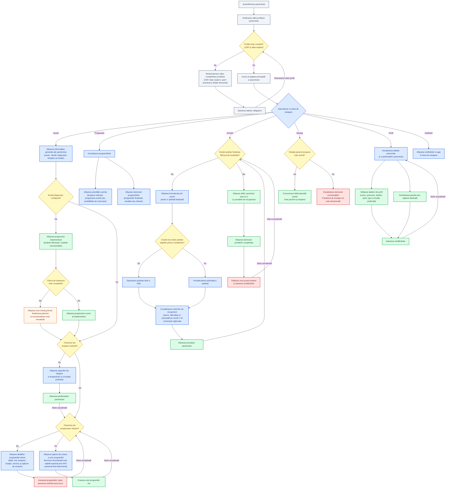
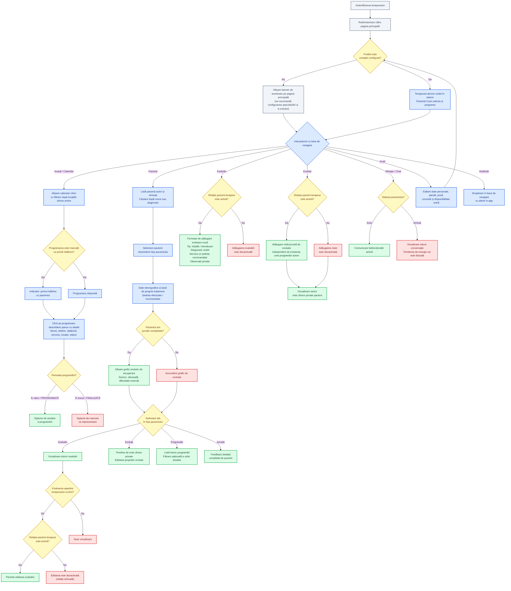
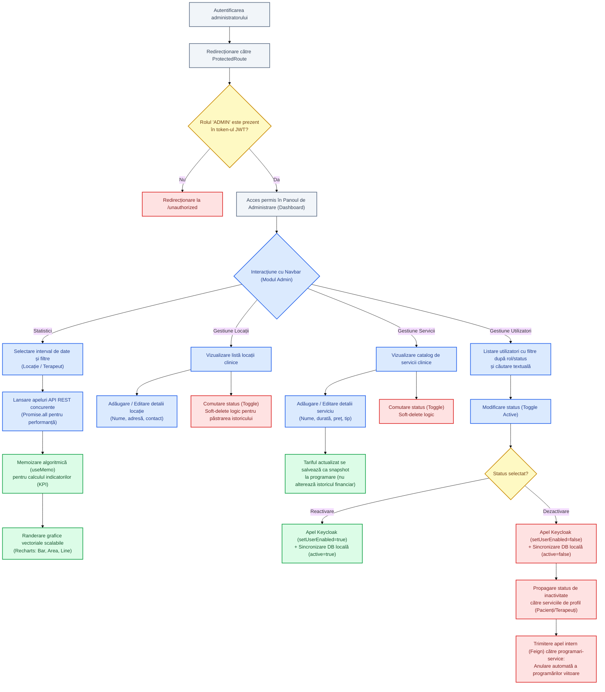
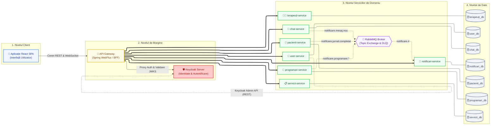
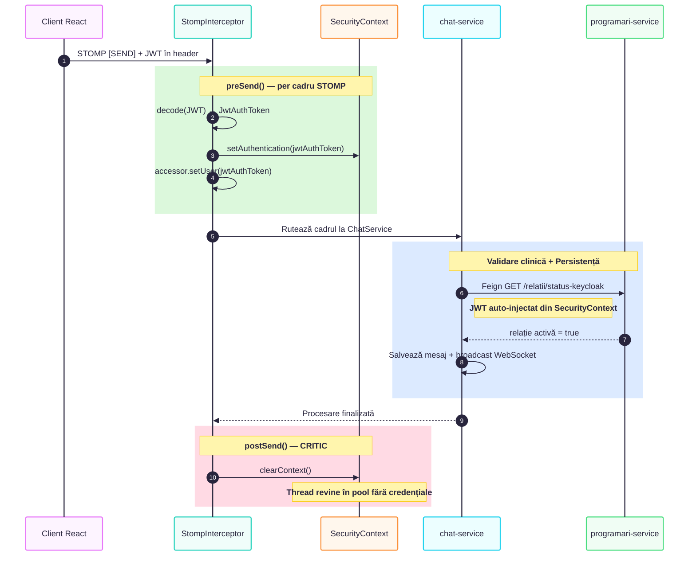
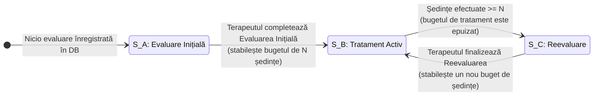
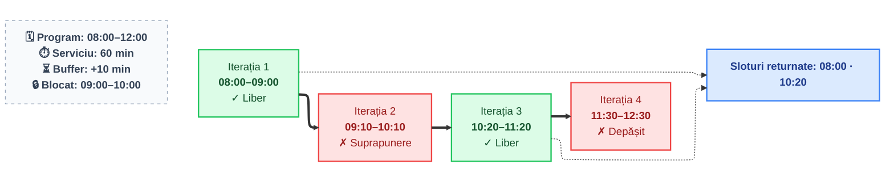
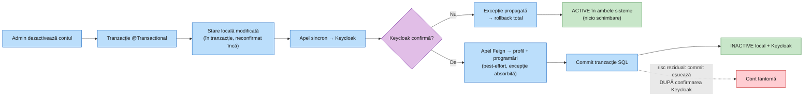

# KinetoCare — Platformă Clinică cu Arhitectură Microservicii

Platformă software distribuită pentru gestionarea activității clinicilor de kinetoterapie, dezvoltată pornind de la analiza unei aplicații reale din domeniu și a nevoilor identificate prin consultarea directă a kinetoterapeuților și a specialiștilor în recuperare medicală.

Conectează pacienții cu terapeuții, acoperind end-to-end fluxul clinic: programări, evaluări, monitorizarea progresului și comunicare în timp real.

---

## 🎯 Funcționalități principale

### 👤 Modul Pacient
- **Programare online** cu selecție automată a serviciului (în funcție de etapa tratamentului) și vizualizarea sloturilor disponibile în timp real.
- **Pagina principală** cu diagnosticul curent, serviciul activ și numărul de ședințe rămase până la reevaluare.
- **Jurnal de recuperare** completat după fiecare ședință (nivel durere, oboseală, dificultate exerciții).
- **Selectarea terapeutului preferat** pe baza locației și specializării.

🔍 <b>Vezi fluxul detaliat de utilizare și navigare (Pacient)</b>

### 👨‍⚕️ Modul Terapeut
- **Calendar interactiv** cu programările zilnice și săptămânale (FullCalendar).
- **Fișa completă a fiecărui pacient**: evaluări inițiale, reevaluări și grafice de evoluție generate automat din jurnalele de recuperare.
- **Setarea programului de lucru** per locație și gestionarea concediilor.
- **Statistici rapide**: programări active, pacienți ce necesită reevaluare.

🔍 <b>Vezi fluxul detaliat de utilizare și navigare (Terapeut)</b>

### ⚙️ Modul Administrativ
- **Gestiunea locațiilor** și a catalogului de servicii (tip, preț, durată).
- **Dezactivarea conturilor** cu anularea automată a programărilor viitoare aferente.
- **Statistici agregate per locație**: programări, venituri, terapeuți activi, rată anulări.

🔍 <b>Vezi fluxul detaliat de utilizare și navigare (Administrator)</b>

### 🔄 Module comune
- **Chat bidirecțional** pacient-terapeut în timp real.
- **Sistem de notificări in-app** pentru programări, mesaje noi și remindere.

---

## 🏛 Arhitectură și Decizii Tehnice

### Arhitectură Microservicii (Database-per-Service)
Sistemul este structurat pe patru niveluri decuplate (*Client, Edge, Domain Services, Data Layer*), respectând strict modelul **Database-per-Service**. Fiecare microserviciu deține propria schemă MySQL izolată, prevenind cuplajul la nivel de date și permițând evoluția și scalarea independentă a modulelor.

Traficul extern este interceptat exclusiv de API Gateway și Keycloak, în timp ce serviciile de domeniu comunică sincron prin clienți declarativi OpenFeign și asincron prin mesagerie bazată pe evenimente.

| Microserviciu | Port intern | Bază de date | Responsabilitate principală |
| :--- | :--- | :--- | :--- |
| `api-gateway` | 8081 | — | Punct unic de intrare, rutare reactivă (WebFlux), Auth Proxy, agregare BFF |
| `user-service` | 8082 | `user_db` | Management conturi, sincronizare Keycloak Admin API, scriere duală cu commit amânat |
| `pacienti-service` | 8083 | `pacienti_db` | Profil clinic pacienți, jurnale zilnice de recuperare, emisie evenimente jurnal |
| `terapeuti-service` | 8084 | `terapeuti_db` | Profile terapeuți, orare de lucru per locație, evidență concedii |
| `programari-service` | 8085 | `programari_db` | Motor de booking, AFD stări clinice, calcul sliding window, scheduler remindere |
| `servicii-service` | 8086 | `servicii_db` | Catalog servicii medicale, durate, tarife și tipuri de terapie |
| `chat-service` | 8087 | `chat_db` | Mesagerie WebSocket/STOMP, validare relații active, canal dedicat erori |
| `notificari-service` | 8088 | `notificari_db` | Consumer asincron RabbitMQ, inserare idempotentă, management Dead Letter Queue |

### API Gateway & Arhitectură BFF (Backend-For-Frontend)
Construit pe **Spring Cloud Gateway** și **Spring WebFlux** (reactor Netty non-blocant), Gateway-ul îndeplinește un rol dublu:
1. **Reverse Proxy Securizat:** Centralizează politicile CORS, expune rutele externe (`/api/**`) și blochează accesul direct la endpoint-urile interne administrative ale microserviciilor.
2. **Backend-For-Frontend (BFF):** Implementează modelul hibrid de securitate token, gestionând jetoanele de reîmprospătare (Refresh Token) prin cookie-uri securizate `httpOnly` și `SameSite=Lax`, eliminând riscul de furt al sesiunii prin atacuri XSS în browser.

### Securitate Zero-Trust (OAuth2/JWT + Keycloak) & Extindere pe WebSocket/STOMP
Niciun microserviciu intern nu acordă încredere implicită traficului de rețea. Fiecare domeniu validează semnătura criptografică asimetrică a jetoanelor JWT prin setul de chei publice expus de Keycloak (JWKS). Autorizarea la nivel de resursă este guvernată prin **RBAC** (`ROLE_PACIENT`, `ROLE_TERAPEUT`, `ROLE_ADMIN`).

Pentru conexiunile de chat în timp real, filtrele HTTP tradiționale nu se aplică pe conexiunile persistente TCP. Securitatea este extinsă la nivel de cadru STOMP printr-un interceptor dedicat de canal (`StompSecurityInterceptor`):

La recepționarea fiecărui cadru `CONNECT` sau `SEND`, interceptorul decodează token-ul JWT, validează identitatea expeditorului împotriva `Principal`-ului și populează `SecurityContextHolder`. Când `chat-service` interoghează `programari-service` prin Feign pentru a verifica dacă relația terapeutică este activă, `FeignRequestInterceptor` extrage JWT-ul din contextul curent și îl propagă în antetul HTTP. În `postSend()`, contextul de securitate este curățat obligatoriu prin `clearContext()`, prevenind contaminarea firelor de execuție refolosite din thread pool.

### Logică de Business — Automatul Finit Determinist (AFD) pentru Stările Clinice
Pentru a ghida pacientul fără eroare și a elimina selecția greșită a serviciilor, tranziția planului de recuperare este modelată ca un **Automat Finit Determinist (AFD)** implementat în metoda `determinaServiciulCorect` din `ProgramareService`.

Starea clinică a pacientului este calculată determinist pe baza istoricului de evaluări și a numărului de ședințe finalizate (`countSedintePacientDupaData`):
- **Starea $S_A$ (Evaluare Inițială):** Dacă pacientul nu are nicio evaluare anterioară în baza de date, sistemul impune automat rezervarea unei ședințe de "Evaluare Inițială".
- **Starea $S_B$ (Tratament Activ):** Odată ce terapeutul a salvat evaluarea inițială recomandând un serviciu specific și un buget de $N$ ședințe, pacientul este restricționat la acel serviciu prescris.
- **Starea $S_C$ (Reevaluare):** La epuizarea pachetului de ședințe ($\text{efectuate} \ge N$), sistemul comută automat în starea de "Reevaluare", blocând continuarea oarbă a tratamentului până la o nouă examinare de specialitate.

### Algoritmul de Disponibilitate — Fereastră Glisantă (Sliding Window)
Calculul intervalelor libere pentru rezervări combină date distribuite din multiple microservicii printr-un algoritm de tip fereastră glisantă implementat în `ProgramareService.getSloturiDisponibile`:

Procesul se desfășoară în trei etape riguroase:
1. **Colectarea constrângerilor:** `programari-service` interoghează `terapeuti-service` pentru a verifica eventualele concedii și a obține orarul de lucru (`oraInceput`, `oraSfarsit`) pentru locația și ziua solicitate, respectiv `servicii-service` pentru durata exactă în minute a serviciului.
2. **Preluarea agendei:** Se extrag din baza locală toate programările deja confirmate (`StatusProgramare.PROGRAMATA`) ale terapeutului din ziua respectivă.
3. **Iterarea ferestrei glisante:** Un cursor temporal pornește de la `oraInceput`. La fiecare pas, metoda `esteLiber` testează coliziunea temporală ($\text{startNou} < \text{p.oraSfarsit} \land \text{endNou} > \text{p.oraInceput}$). Dacă slotul este liber și situat în viitor, este salvat, iar cursorul avansează cu $\text{durataMinute} + 10\text{ minute}$, garantând o pauză operațională terapeutului între pacienți.

### Partiționarea Temporală la Miezul Nopții (ReminderScheduler)
Pentru expedierea notificărilor automate de reminder cu 24 de ore și respectiv 2 ore înainte de programare, `ReminderScheduler` rulează joburi asincrone periodice (`@Scheduled`). Detectarea programărilor vizate într-o fereastră mobilă cu marjă ($\pm 15$ sau $\pm 8$ minute) ridică o provocare matematică atunci când intervalul calculat traversează miezul nopții:

```mermaid
---
config:
  theme: base
  flowchart:
    curve: basis
    nodeSpacing: 45
    rankSpacing: 55
---
flowchart LR
    A["Start: gasesteInFereastra(oreInainte, marjaMinute)"] --> B["Calculează fereastra:<br/>centruFereastra = acum + oreInainte<br/>[centru - marja, centru + marja]"]
    B --> C{"Fereastra este în<br/>aceeași zi calendaristică?"}

    C -- "Da" --> D["Execută interogare SQL unică:<br/>start.time → end.time în data start.date"]
    D --> G["Returnează lista programărilor"]

    C -- "Nu (trece miezul nopții)" --> E["Subinterogare 1 (Ziua 1):<br/>start.time → 23:59:59.999"]
    E --> F["Subinterogare 2 (Ziua 2):<br/>00:00:00 → end.time"]
    F --> H["Fuzionare liste rezultate (merge)"]
    H --> G

    classDef start fill:#eff6ff,stroke:#3b82f6,stroke-width:2px,color:#1e3a8a;
    classDef calc fill:#f0fdf4,stroke:#22c55e,stroke-width:2px,color:#14532d;
    classDef decision fill:#faf5ff,stroke:#a855f7,stroke-width:2px,color:#4a1d96;
    classDef query fill:#fff7ed,stroke:#f97316,stroke-width:2px,color:#7c2d12;
    classDef merge fill:#ecfeff,stroke:#06b6d4,stroke-width:2px,color:#164e63;
    classDef result fill:#fdf4ff,stroke:#ec4899,stroke-width:2px,color:#831843;

    class A start;
    class B calc;
    class C decision;
    class D,E,F query;
    class H merge;
    class G result;
```

Pentru a preveni interogările SQL invalide pe coloane separate de tip `DATE` și `TIME`, algoritmul `gasesteInFereastra` aplică o partiționare binară:
- Dacă `startFereastra` și `endFereastra` se află în aceeași zi calendaristică, se execută o interogare singulară `findProgramariInFereastra(data, start, end)`.
- Dacă intervalul trece peste pragul orei 00:00 (de exemplu `23:50` – `00:10`), metoda descompune căutarea în două sub-interogări complementare: prima pentru ziua curentă în intervalul `[start, 23:59:59.999]`, iar a doua pentru ziua următoare în intervalul `[00:00:00, end]`, fuzionând listele rezultate înainte de publicarea evenimentelor.

### Comunicare Asincronă & Topologia RabbitMQ cu Dead Letter Queue (DLQ)
Evenimentele asincrone generate de activitatea clinică sunt decuplate prin intermediul brokerului **RabbitMQ**, garantând persistența mesajelor și eliberarea rapidă a fluxurilor HTTP de execuție:

```mermaid
---
config:
  theme: base
  flowchart:
    curve: basis
    nodeSpacing: 55
    rankSpacing: 65
---
flowchart LR
    subgraph Producatori["Producători de Evenimente"]
        PS["programari-service"]
        PACS["pacienti-service"]
        CS["chat-service"]
    end

    subgraph Broker["RabbitMQ Message Broker"]
        EX["TopicExchange<br/>notificari.exchange"]
        MQ["Main Queue<br/>notificari.queue.v2"]
        DLX["DLX Fanout<br/>notificari.dlx"]
        DLQ["DLQ Queue<br/>notificari.queue.dead"]

        EX -->|"Rutare wildcard: notificare.#"| MQ
        MQ -. "NACK (requeue=false)" .-> DLX
        DLX --> DLQ
    end

    subgraph Consumatori["Consumatori - notificari-service"]
        NC["NotificareConsumer<br/>(Procesare & Persistență)"]
        DC["DeadLetterConsumer<br/>(Audit & Carantină)"]
    end

    PS -->|"notificare.programare.*<br/>notificare.reminder.*<br/>notificare.evaluare.*<br/>notificare.reevaluare.*"| EX
    PACS -->|"notificare.jurnal.completat"| EX
    CS -->|"notificare.mesaj.nou"| EX
    MQ -->|"ACK - procesare cu succes"| NC
    DLQ --> DC

    classDef prod fill:#f1f5f9,stroke:#64748b,stroke-width:2px,color:#334155;
    classDef exchange fill:#fef9c3,stroke:#ca8a04,stroke-width:2px,color:#713f12;
    classDef queue fill:#dbeafe,stroke:#2563eb,stroke-width:2px,color:#1e3a8a;
    classDef consumer fill:#dcfce7,stroke:#16a34a,stroke-width:2px,color:#14532d;
    classDef dead fill:#fee2e2,stroke:#dc2626,stroke-width:2px,color:#7f1d1d;
    style Producatori fill:#ffffea,stroke:#c4c400,stroke-width:1px
    style Broker fill:#ffffea,stroke:#7b8fff,stroke-width:1px
    style Consumatori fill:#ffffea,stroke:#c4c400,stroke-width:1px

    class PS,PACS,CS prod;
    class EX,DLX exchange;
    class MQ queue;
    class DLQ dead;
    class NC consumer;
    class DC dead;
```

Topologia de mesagerie include elemente avansate de robustețe:
- **Topic Exchange & Wildcard Binding:** Producătorii emit pe `notificari.exchange`, iar coada durabilă `notificari.queue.v2` este legată prin șablonul flexibil `notificare.#`, permițând adăugarea de noi tipuri de notificări fără rescrierea infrastructurii.
- **Consumer Idempotent (Anti-Duplicate):** `NotificareConsumer` utilizează un identificator unic per mesaj (`UUID`), validat atomic în tabela MySQL `mesaje_procesate` prin sintaxa `INSERT INTO mesaje_procesate ... ON DUPLICATE KEY UPDATE message_id=message_id`. Dacă mesajul a mai fost livrat (redelivery la reconectare), acesta este absorbit silențios fără a genera notificări duplicate în interfață.
- **Dead Letter Exchange (DLX) & Carantină (DLQ):** În cazul unei erori fatale la deserializare sau procesare, containerul Spring AMQP emite un `NACK` cu parametrul `requeue=false`. Brokerul rutează automat mesajul otrăvit către `notificari.dlx` și în coada de carantină `notificari.queue.dead`, unde `DeadLetterConsumer` îl loghează pentru auditare fără a re-arunca excepții (eliminând riscul buclelor infinite).

### Gestionarea Scrierii Duale (Dual-Write) prin Verificare Sincronă cu Commit Amânat
Dezactivarea unui cont de către administrator (`UserService.toggleUserActive`) rezolvă problema scrierii duale (*dual-write problem* între baza locală MySQL și furnizorul de identitate Keycloak) printr-un mecanism sincron de **tranzacție locală cu commit amânat** (*deferred commit*) combinat cu propagare *best-effort*:

Fluxul este structurat în două faze:
1. **Faza 1 (Consistență puternică prin commit amânat):** Entitatea utilizatorului este modificată în cadrul tranzacției locale `@Transactional` din MySQL (fără commit pe disc). Înainte de a comite tranzacția SQL, se apelează sincron `KeycloakSyncService.setUserEnabled`. Dacă serverul Keycloak este indisponibil sau returnează o eroare, metoda aruncă `ExternalServiceException`, declanșând **rollback-ul automat** al tranzacției locale din MySQL. Utilizatorul rămâne activ în ambele sisteme, prevenind conturile „fantomă”. Commit-ul SQL se execută doar după primirea confirmării pozitive din Keycloak.
2. **Faza 2 (Propagare în cascadă / Best-Effort):** Odată garantată starea principală, dezactivarea este propagată prin apeluri Feign către serviciul de profil (`pacienti-service` sau `terapeuti-service`), iar programările viitoare sunt anulate automat în `programari-service` (`cancelByPacient` sau `cancelByTerapeut`). Aceste apeluri secundare sunt izolate în blocuri `try-catch`: o eventuală indisponibilitate a serviciului de programări este doar logată, fără a compromite starea de securitate deja garantată în Keycloak și baza de date primară.

> [!NOTE]
> **Diferențiere arhitecturală față de Tiparul Saga (Înregistrare vs. Dezactivare):**
> Spre deosebire de fluxul de dezactivare (care utilizează tranzacția locală cu commit amânat), fluxul de **înregistrare a utilizatorilor** (`KeycloakService.registerUser`) implementează tiparul **Saga cu tranzacție compensatorie**: utilizatorul este creat mai întâi în Keycloak (`createUserInKeycloak`), iar dacă salvarea ulterioară în baza de date locală sau inițializarea profilului eșuează, blocul `catch` declanșează un apel compensatoriu explicit de ștergere (`deleteUserInKeycloak`) pentru a anula efectul acțiunii distribuite și a readuce sistemul la starea inițială consistentă.

### Reziliență și Gestionarea Erorilor (Resilience)
Platforma integrează multiple mecanisme defensive pentru a garanta izolarea defecțiunilor:
- **Standardizare Erori (RFC 9457):** Backend-ul utilizează specificația `ProblemDetail` pentru structurarea predictibilă a erorilor de domeniu și maparea directă pe interfața utilizator.
- **Fail-Fast & Custom Error Decoding:** Apelurile Feign inter-servicii sunt interceptate prin `CustomErrorDecoder`, transformând codurile de stare HTTP (404, 403, 400, 500) în excepții specifice de domeniu (`ResourceNotFoundException`, `ForbiddenOperationException`, `ExternalServiceException`).
- **Frontend Error Boundaries:** Aplicația React folosește granițe de eroare și interceptoare globale Axios pentru a asigura degradarea grațioasă a componentelor UI, prevenind blocarea întregii aplicații (White Screen of Death) dacă un singur microserviciu este temporar indisponibil.

---

## 🏗 Infrastructură & Stack Tehnologic

### Stack Tehnologic
- **Backend:** Java 21, Spring Boot 3.x, Spring Cloud Gateway (WebFlux / Netty), OpenFeign, Spring Security (OAuth2 Resource Server / JWT), Spring AMQP (RabbitMQ), Spring Data JPA / Hibernate, MapStruct, Lombok
- **Frontend:** React 19, Vite, React Router DOM v7, Axios, SockJS & StompJS, Recharts, FullCalendar
- **Infrastructură & Date:** MySQL 8.x (7 scheme izolate), RabbitMQ 3.x (cu plugin de management), Keycloak 24+ (IAM / OIDC), Docker & Docker Compose, Kubernetes

### Infrastructură, Containerizare & DevOps
- **Containerizare Multi-Stage (Docker):** Serviciile backend sunt împachetate pornind de la imagini alpine JRE ultra-ușoare. Frontend-ul React este compilat într-un mediu tranzitoriu Node.js și livrat în producție printr-un container optimizat **Nginx**.
- **Orchestrare Locală:** Configurația `docker-compose.yml` orchestrează întregul ecosistem pe o rețea internă dedicată (`kineto-network`), gestionând secvențierea pornirii dependențelor prin mecanisme de `healthcheck`.
- **Orchestrare Kubernetes (k8s):** Nucleul platformei este pregătit pentru orchestrare în cluster prin manifesturi declarative:
  - Izolarea resurselor în `Namespace`-ul `kinetocare`.
  - Separarea configurațiilor și credențialelor prin `ConfigMap` și `Secrets`.
  - Persistența volumelor de date prin `PersistentVolumeClaim` (PVC).
  - Punct unic de intrare extern configurat prin **Ingress Controller**, rutând traficul către Keycloak (`/realms`), API Gateway (`/api`) și Frontend (`/`).
  - Verificarea stării de funcționare prin `readinessProbe` și `livenessProbe` pe endpoint-urile Spring Boot Actuator.