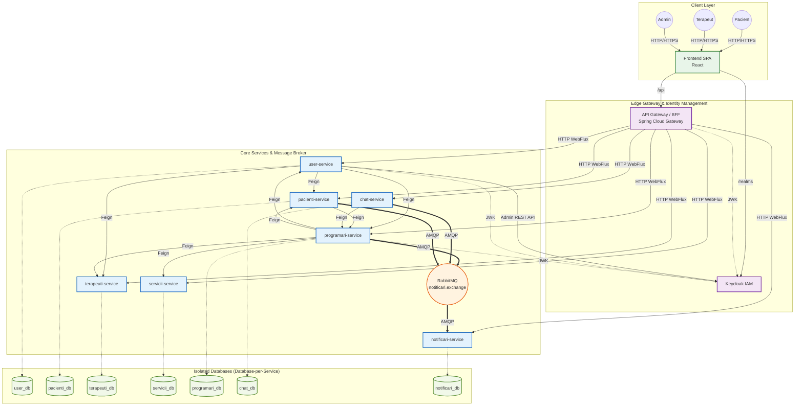

# 🎓 KinetoCare — Documentație Lucrare de Disertație (Master’s Thesis Documentation)
## Secțiunea 1: Prezentare Generală a Arhitecturii Sistemului (System Architecture Overview)
### 1.1 Harta Microserviciilor (Microservices Map)
KinetoCare este un sistem distribuit format din 7 microservicii orientate pe domeniu (domain-driven microservices), fiecare având o schemă MySQL dedicată, orchestrate în spatele unui API Gateway central stateless. Serviciile rulează pe porturile prezentate mai jos (valori implicite pentru dezvoltarea locală preluate din `application.yml`):
| Serviciu | Port | Responsabilitate | Schemă Bază de Date |
| --- | --- | --- | --- |
| `api-gateway` | 8081 | Punct unic de intrare, agregare BFF, proxy pentru token, rutare | Niciuna (stateless) |
| `user-service` | 8082 | Identitate, date de bază profil (nume, email, telefon, gen, rol), operațiuni admin Keycloak | `user_db` |
| `pacienti-service` | 8083 | Profil clinic pacient (CNP, data nașterii, obiceiuri sportive, locație/terapeut preferat), jurnal pacient | `pacienti_db` |
| `terapeuti-service` | 8084 | Profil profesional terapeut, locații clinică, programul de disponibilitate al terapeutului, perioade de concediu | `terapeuti_db` |
| `programari-service` | 8085 | Programări, evaluări, note de evoluție, relații pacient-terapeut, statistici | `programari_db` |
| `servicii-service` | 8086 | Catalog de servicii medicale (tipuri de servicii, prețuri, durate ședințe) | `servicii_db` |
| `chat-service` | 8087 | Mesagerie în timp real prin WebSocket/STOMP, persistență conversații și mesaje | `chat_db` |
| `notificari-service` | 8088 | Persistență notificări asincrone și API REST de citire; consumator pur RabbitMQ | `notificari_db` |
**Observație cheie privind arhitectura:** `programari-service` este cel mai complex serviciu din sistem. Acesta găzduiește nu doar programările, ci și evaluările, notele de evoluție și agregatul `RelatiePacientTerapeut` — toate fiind entități care necesită corelarea datelor despre programări și a datelor clinice în cadrul aceleiași granițe tranzacționale (transactional boundary).

### 1.2 API Gateway / Modelul BFF (BFF Pattern)
API Gateway este construit pe baza **Spring Cloud Gateway WebFlux** — un motor reactiv, non-blocant, alimentat de Project Reactor. Acesta îndeplinește simultan două roluri distincte.
### 1.2.1 Reverse Proxy Transparent (Rutare)
Pentru majoritatea căilor (paths), Gateway-ul acționează ca un reverse proxy pur: primește o cerere, elimină prefixul `/api` prin filtrul `StripPrefix=1` și redirecționează cererea către serviciul downstream corespunzător. Tabela completă de rutare, extrasă din `application.yml`, este:
| Șablon Cale Frontend (Frontend Path Pattern) | Serviciu Țintă (Target Service) | Cale Downstream (după strip) |
| --- | --- | --- |
| `/api/users/**` | `user-service:8082` | `/users/**` |
| `/api/pacient/**` | `pacienti-service:8083` | `/pacient/**` |
| `/api/disponibilitate/**` | `terapeuti-service:8084` | `/disponibilitate/**` |
| `/api/locatii/**` | `terapeuti-service:8084` | `/locatii/**` |
| `/api/concediu/**` | `terapeuti-service:8084` | `/concediu/**` |
| `/api/terapeut/**` | `terapeuti-service:8084` | `/terapeut/**` |
| `/api/programari/**` | `programari-service:8085` | `/programari/**` |
| `/api/evaluari/**` | `programari-service:8085` | `/evaluari/**` |
| `/api/evolutii/**` | `programari-service:8085` | `/evolutii/**` |
| `/api/fisa-pacient/**` | `programari-service:8085` | `/fisa-pacient/**` |
| `/api/jurnal/**` | `pacienti-service:8083` | `/jurnal/**` |
| `/api/servicii/**` | `servicii-service:8086` | `/servicii/**` |
| `/api/chat/**` | `chat-service:8087` | `/chat/**` |
| `/api/notificari/**` | `notificari-service:8088` | `/notificari/**` |
De observat că `terapeuti-service` este mapat sub **patru prefixe de cale distincte** (`/api/disponibilitate`, `/api/locatii`, `/api/concediu`, `/api/terapeut`). Spring Cloud Gateway evaluează rutele în ordinea declarării lor; rutele mai specifice (`terapeuti-disponibilitate`, `terapeuti-locatii`, `terapeuti-concediu`) sunt declarate înaintea rutei generale `terapeuti-service`, prevenind astfel potrivirile ambigue (ambiguous matching).
### 1.2.2 Endpoint-uri de Agregare BFF (Backend-For-Frontend)
Gateway-ul conține **patru controllere WebFlux personalizate** care implementează modelul BFF — agregând mai multe apeluri downstream într-un singur răspuns pentru a elimina apelurile repetate din browser (N+1 round-trips):
**`HomepageController` → `HomepageService`**
Apelat la `GET /api/homepage`. Pentru un **PACIENT**, `HomepageService` efectuează trei apeluri reactive în paralel:
1. `ProfileService.getProfile()` — reprezentând el însuși o agregare (vezi mai jos)
2. `GET /programari/pacient/by-keycloak/{id}/next` → `programari-service` (următoarea programare)
3. `GET /programari/pacient/by-keycloak/{id}/situatie` → `programari-service` (diagnostic + progres)
Pașii 2 și 3 sunt lansați concurent folosind `Mono.zip()`. Rezultatele sunt îmbinate (merged) într-o singură structură JSON (map) cu cheile `urmatoareaProgramare` și `situatie`, alături de datele de profil. Dacă oricare dintre apeluri returnează un rezultat gol (nicio programare viitoare, niciun plan activ), `onErrorResume` returnează elegant `Mono.empty()`, iar `defaultIfEmpty(Map.of())` previne blocarea metodei zip.
Pentru **TERAPEUT**, este returnat doar profilul (fără rezumatul programărilor).
**`ProfileController` → `ProfileService`**
Apelat la `GET /api/profile` și `PATCH /api/profile`. `ProfileService.getProfile()` este o agregare reactivă reprezentativă la nivelul stratului Gateway:
- Pentru **PACIENT**: lansează două apeluri în paralel — `user-service` (identitate de bază) și `pacienti-service` (profil clinic). Dacă pacientul are un terapeut preferat, lansează suplimentar alte două apeluri în paralel către `terapeuti-service` (date profesionale) și din nou `user-service` (numele terapeutului). În cele din urmă, dacă există o locație preferată, apelează `terapeuti-service` pentru detalii despre locație. Toate acestea sunt executate cu `Mono.zip()` și îmbinate într-o singură structură plată (flat map). Cheile duplicate (`keycloakId`, `id`) sunt eliminate explicit înainte de îmbinare.
- Pentru **TERAPEUT**: lansează două apeluri în paralel — `user-service` și `terapeuti-service`. ID-ul intern din baza de date al terapeutului este păstrat ca `terapeutId` în răspuns.
`ProfileService.updateProfile()` face invers: primește un corp de actualizare plat (flat payload), îl împarte în grupuri de câmpuri pentru user/pacient/terapeut folosind metodele `extractUserFields()`, `extractPacientFields()` și `extractTerapeutFields()`, lansează toate apelurile PATCH aplicabile concurent prin `Mono.when(updates)`, apoi apelează `getProfile()` pentru a returna starea actualizată.
> **Notă:** Deși `ProfileService` este o agregare semnificativă la nivel de Gateway (până la 5 apeluri HTTP în paralel), cea mai complexă agregare din întreaga bază de cod este `FisaPacientService.getFisaPacient()` din cadrul `programari-service`, care orchestrează date din **4 microservicii diferite** plus interogări multiple în baza de date locală, inclusiv o buclă imbricată de tip N+1 pentru evaluări. Aceasta este documentată în întregime în Secțiunea 8.4.4.
**`ChatGatewayController` → `ChatGatewayService`**
Apelat la `GET /api/chat/conversatii/agregat`. Aceasta este a doua cea mai complexă agregare BFF din Gateway. Realizează o orchestrare în trei faze: (1) preia conversațiile existente din `chat-service`, (2) preia partenerii terapeutici activi din `programari-service` pentru a crea **conversații virtuale** (Lazy Initialization pattern — partenerii cu o relație activă, dar fără istoric de mesaje încă, apar imediat în lista de chat), (3) rezolvă numele tuturor partenerilor printr-un singur apel de tip batch către `user-service` (`POST /users/batch`) și (4) pentru fiecare conversație, efectuează un apel individual către `programari-service` pentru a determina statusul relației (`activa`/`arhivata`). Crearea conversației virtuale garantează că atunci când unui pacient îi este alocat un terapeut nou, interfața de chat afișează imediat o conversație — chiar înainte de a fi schimbat vreun mesaj — eliminând necesitatea ca utilizatorul să inițieze manual chat-ul.
**`SearchTerapeutController` → `SearchTerapeutService`**
Gestionează căutarea terapeuților pentru fluxul de onboarding al pacientului, combinând datele profesionale ale terapeutului din `terapeuti-service` cu numele din `user-service`. Folosește un endpoint de tip batch (`POST /users/batch`) pentru o rezoluție eficientă a numelor, evitând un model de apel N+1.
### 1.2.3 Proxy pentru Token: `KeycloakProxyController`
Gestionează `POST /api/auth/token` și `POST /api/auth/logout`. Aceste endpoint-uri sunt configurate cu `permitAll()` în `SecurityConfig` din API Gateway. Controller-ul:
- Acceptă date de tip formular `application/x-www-form-urlencoded`
- Adaugă `client_id=react-client` și trimite mai departe către endpoint-ul de token al Keycloak
- Pentru `grant_type=refresh_token`, citește `refresh_token`-ul din cookie-ul primit `HttpOnly` și îl injectează în corpul cererii Keycloak — astfel încât codul JavaScript din browser nu vede niciodată tokenul de refresh (refresh token)
- În caz de succes, extrage `refresh_token`-ul din răspunsul Keycloak, îl împachetează într-un cookie `HttpOnly; SameSite=Lax; Path=/` (cu valabilitate maximă de 30 de zile), golește (setizează pe null) câmpul `refresh_token` din corpul JSON-ului și returnează doar `access_token`-ul către JavaScript
- La deconectare (logout), suprascrie cookie-ul cu `maxAge=0` pentru a forța ștergerea acestuia de către browser
### 1.3 Harta Comunicării Inter-Servicii (Inter-Service Communication Map)
KinetoCare folosește două stiluri de comunicare:
### Sincronă: Spring Cloud OpenFeign (HTTP)
Clienții Feign sunt utilizați atunci când un serviciu are nevoie de un **răspuns sincron, în cadrul cererii curente (in-request)** de la un alt serviciu. Toate apelurile Feign propagă tokenul Bearer JWT printr-o configurare partajată `FeignClientConfig` (modelul bazat pe interceptor de cereri din modulul `common`).
| Apelant (Caller) | Client Feign | Serviciu Țintă (Target Service) | Scop (Purpose) |
| --- | --- | --- | --- |
| `user-service` | `PacientiClient` | `pacienti-service` | Inițializare profil pacient gol la înregistrare; comutare `active` la dezactivarea de către admin |
| `user-service` | `TerapeutiClient` | `terapeuti-service` | Inițializare profil terapeut gol la înregistrare; comutare `active` la dezactivarea de către admin |
| `user-service` | `ProgramariClient` | `programari-service` | Anulare programări viitoare când utilizatorul este dezactivat |
| `programari-service` | `ServiciiClient` | `servicii-service` | Preluare preț și durată serviciu în momentul creării programării |
| `programari-service` | `UserClient` | `user-service` | Preluare nume pacient/terapeut pentru răspunsuri îmbogățite (statistici, fișă pacient) |
| `programari-service` | `TerapeutiClient` | `terapeuti-service` | Preluare nume locații, verificare disponibilitate/concediu terapeut, detalii terapeut |
| `programari-service` | `PacientiClient` | `pacienti-service` | Actualizare `terapeutKeycloakId` la schimbarea terapeutului; semnalare schimbare terapeut pentru managementul relației |
| `chat-service` | `ProgramariClient` | `programari-service` | Verificare `RelatiePacientTerapeut` activă înainte de a permite trimiterea unui mesaj |
| `api-gateway` | WebClient (reactiv) | Toate serviciile | Agregare BFF (nu folosește Feign, ci `WebClient` din WebFlux) |
Notă: Fluxul de înregistrare din `user-service` folosește `RestTemplate` (nu Feign) pentru apelurile inițiale de inițializare a profilului către `pacienti-service` și `terapeuti-service`. Acest lucru se datorează faptului că înregistrarea are loc înainte de existența unui JWT valid pentru noul utilizator, astfel încât se efectuează un apel direct serviciu-la-serviciu, fără context de autentificare a utilizatorului.
### Asincronă: RabbitMQ (AMQP)
RabbitMQ este utilizat pentru evenimente inter-servicii de tip **fire-and-forget** (trimite și uită), unde producătorul nu are nevoie de un rezultat imediat:
| Producător | Exchange | Cheie de Rutare (Routing Key) | Consumator | Scop |
| --- | --- | --- | --- | --- |
| `programari-service` | `notificari.exchange` | `notificare.programare.*` | `notificari-service` | Notificare pacient privind programare nouă, anulare, schimbare terapeut |
| `chat-service` | `notificari.exchange` | `notificare.mesaj.nou` | `notificari-service` | Notificare destinatar privind un mesaj nou în chat |
Topologia completă este definită în `notificari-service/RabbitMQConfig.java`:
- **Topic Exchange:** `notificari.exchange` — rutează mesajele după șablonul `notificare.#` (potrivește orice cheie de rutare care începe cu `notificare.`)
- **Coadă Principală (Main Queue):** `notificari.queue.v2` — durabilă, legată de exchange cu cheia de rutare `notificare.#`, configurată cu `x-dead-letter-exchange=notificari.dlx`
- **Exchange pentru Mesaje Eșuate (Dead Letter Exchange - DLX):** `notificari.dlx` — un exchange de tip Fanout
- **Coadă pentru Mesaje Eșuate (Dead Letter Queue - DLQ):** `notificari.queue.dead` — durabilă, legată de DLX
Coadă a fost redenumită din `notificari.queue` în `notificari.queue.v2` deoarece RabbitMQ nu permite modificarea argumentelor (cum ar fi adăugarea unui DLX) pentru o coadă durabilă deja declarată — o redenumire a fost calea corectă de migrare.
### 1.4 Izolarea Bazei de Date per Serviciu (Database-Per-Service Isolation)
Fiecare microserviciu deține în mod exclusiv propria schemă MySQL. Niciun serviciu nu citește și nu scrie direct în schema altui serviciu. Nevoile de date inter-servicii sunt rezolvate prin apeluri API.
**Ce oferă această izolare:**
1. **Evoluție independentă a schemei:** `programari-service` poate adăuga o coloană în tabela `programare` fără a fi nevoie de coordonarea unei migrări cu o altă echipă sau serviciu.
2. **Scalare independentă:** `chat-service` poate fi scalat la 5 replici fără a afecta pool-urile de conexiuni ale `user-service`.
3. **Limitarea defecțiunilor (Fault containment):** O bază de date `pacienti_db` coruptă nu afectează rezervarea programărilor — serviciul de programări își folosește propria schemă.
4. **Libertate tehnologică:** Teoretic, fiecare serviciu ar putea folosi un motor de baze de date diferit (deși toate folosesc în prezent MySQL 8).
**Compromisul critic — denormalizarea:** Deoarece serviciile nu pot efectua operațiuni de JOIN între scheme diferite, `programari-service` denormalizează `pret` (preț), `durataMinute` și `tipServiciu` (numele serviciului) direct în entitatea `Programare` în momentul creării, apelând `servicii-service` prin Feign. Aceasta înseamnă că, dacă prețul din catalog se modifică în `servicii-service`, înregistrările istorice ale programărilor nu sunt afectate — ceea ce reprezintă un comportament corect de facturare. Același lucru se aplică pentru `locatieId` stocat pe `Programare`: numele locației trebuie preluat din `terapeuti-service` atunci când este necesară o afișare lizibilă pentru utilizatori.
