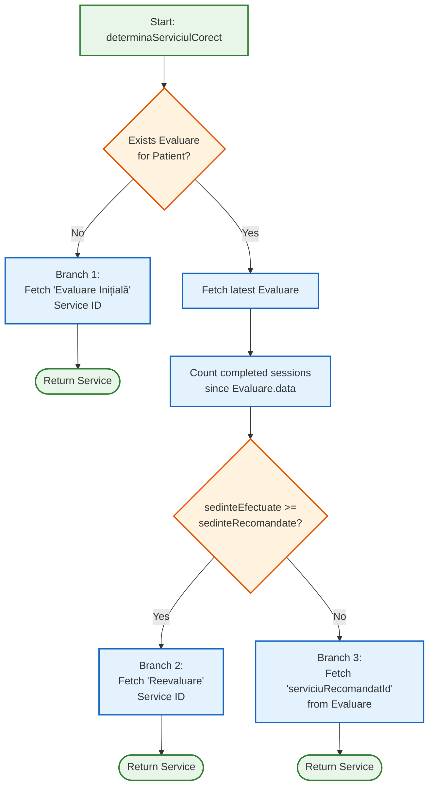

## Secțiunea 3: Logica Principală de Business — Fluxul de Rezervare a Programărilor (Core Business Logic — Appointment Booking Flow)
### 3.1 Prezentare Generală a Fluxului Cap-la-Cap (End-to-End Flow Overview)
Fluxul de rezervare a programărilor se întinde pe frontend-ul React, API Gateway, `programari-service`, `terapeuti-service` și `servicii-service`. Aceasta este cea mai intensă acțiune din punct de vedere al datelor efectuată de utilizator în sistem, necesitând patru apeluri cross-service înainte ca un singur rând să fie scris în baza de date.
### 3.2 Entitatea: `Programare`
Clasa: `com.example.programari_service.entity.Programare`
Tabela: `programari`
| Câmp (Field) | Tip (Type) | Constrângere (Constraint) | Note (Notes) |
| --- | --- | --- | --- |
| `id` | `Long` | PK, auto-increment | — |
| `pacientKeycloakId` | `String` | NOT NULL, lungime=36 | UUID Keycloak al pacientului |
| `terapeutKeycloakId` | `String` | NOT NULL, lungime=36 | UUID Keycloak al terapeutului |
| `locatieId` | `Long` | NOT NULL | FK către `terapeuti_db.locatii` |
| `serviciuId` | `Long` | NOT NULL | FK către `servicii_db.servicii` |
| `tipServiciu` | `String` | NOT NULL, lungime=100 | **Denormalizat** din `servicii-service` la crearea programării |
| `pret` | `BigDecimal` | NOT NULL, precizie=10 scală=2 | **Denormalizat** la crearea programării |
| `durataMinute` | `Integer` | NOT NULL | **Denormalizat** la crearea programării |
| `primaIntalnire` | `Boolean` | nullable | `true` dacă este prima întâlnire cu acest terapeut |
| `data` | `LocalDate` | NOT NULL | Data programării |
| `oraInceput` | `LocalTime` | NOT NULL | Ora de început |
| `oraSfarsit` | `LocalTime` | NOT NULL | Calculată: `oraInceput + durataMinute` |
| `status` | `StatusProgramare` | NOT NULL | `PROGRAMATA` / `FINALIZATA` / `ANULATA` |
| `motivAnulare` | `MotivAnulare` | nullable | `ANULAT_DE_PACIENT` / `ANULAT_DE_TERAPEUT` / `NEPREZENTARE` / `ADMINISTRATIV` |
| `areEvaluare` | `Boolean` | NOT NULL, implicit=false | Setează-se pe `true` când terapeutul asociază o evaluare |
| `areJurnal` | `Boolean` | NOT NULL, implicit=false | Setează-se pe `true` când pacientul trimite jurnalul |
| `createdAt` | `OffsetDateTime` | NOT NULL | Data și ora creării înregistrării |
| `updatedAt` | `OffsetDateTime` | NOT NULL | Data și ora actualizării înregistrării |
Patru indecși compuși sunt declarați pe entitate pentru a deservi cele mai importante interogări fără scanări complete ale tabelelor:
- `idx_prog_terapeut_data_status` pe `(terapeut_keycloak_id, data, status)` — interogări privind calendarul și suprapunerile
- `idx_prog_pacient_status_data` pe `(pacient_keycloak_id, status, data, ora_inceput)` — istoricul pacientului și următoarea programare
- `idx_prog_stats` pe `(locatie_id, data)` — agregări pentru statistici
- `idx_prog_overlap` pe `(terapeut_keycloak_id, data, ora_inceput, ora_sfarsit)` — detectarea suprapunerilor
### 3.3 Fluxul de Programare Pas cu Pas (Step-by-Step Booking Flow)
### Faza 1: Pacientul Selectează un Terapeut și o Dată (Frontend)
1. Pacientul naviguează la componenta `BookingWidget` de pe pagina de pornire (homepage) sau la `ProgramariPacient.jsx`.
2. Pacientul alege un terapeut, o locație a clinicii și o dată. Frontend-ul apelează `GET /api/programari/sloturi-disponibile?terapeutKeycloakId=...&locatieId=...&data=...&serviciuId=...`.
3. API Gateway dezinfectează calea (strips /api) și rutează cererea către `programari-service` la `GET /programari/sloturi-disponibile`.
### Faza 2: `getSloturiDisponibile` — Calculul Sloturilor (Slot Calculation)
Metoda: `ProgramareService.getSloturiDisponibile(terapeutKeycloakId, locatieId, data, serviciuId)`
Adnotare: `@Transactional(readOnly = true)`
Algoritmul procedează în felul următor:
1. **Rezolvarea ID-ului intern al terapeutului:** `terapeutiClient.getTerapeutByKeycloakId(terapeutKeycloakId)` returnează o structură `Map<String, Object>` din care este extras ID-ul terapeutului (`terapeutId` — cheia primară din `terapeuti_db`) prin `((Number) terapeutMap.get("id")).longValue()`. Această translație de ID este necesară deoarece entitățile `DisponibilitateTerapeut` și `ConcediuTerapeut` fac referire la ID-ul intern `terapeutId`, nu la UUID-ul din Keycloak.
2. **Verificarea concediilor (concediu check):** `terapeutiClient.checkConcediu(terapeutId, data.toString())` apelează `terapeuti-service`, care execută `ConcediuRepository.isTerapeutInConcediu()`:
    ```sql
    SELECT COUNT(c) > 0 FROM ConcediuTerapeut c
    WHERE c.terapeutId = :terapeutId
    AND c.dataInceput <= :dataStart AND c.dataSfarsit >= :dataEnd
    ```
    Dacă rezultatul este `true`, metoda returnează imediat `List.of()` — nu există sloturi disponibile într-o zi de concediu.
3. **Verificarea disponibilității (disponibilitate check):** Ziua din săptămână este calculată prin `data.getDayOfWeek().getValue()` (returnează 1 pentru Luni … 7 pentru Duminică, corespunzător convenției folosite în coloana `ziSaptamana`). `terapeutiClient.getOrar(terapeutId, locatieId, ziSaptamana)` apelează `terapeuti-service`, care execută:
    ```java
    // DisponibilitateRepository
    findByTerapeutIdAndLocatieIdAndZiSaptamanaAndActiveTrue(terapeutId, locatieId, ziSaptamana)
    ```
    Dacă nu există nicio înregistrare `DisponibilitateTerapeut` pentru acea combinație, metoda prinde (catches) excepția și returnează `List.of()`.
4. **Preluarea duratei serviciului:** `serviciiClient.getServiciuById(serviciuId)` returnează un `DetaliiServiciuDTO` ce conține valoarea `durataMinute`.
5. **Preluarea programărilor existente pentru acea zi:** `programareRepository.findByTerapeutKeycloakIdAndDataAndStatus(terapeutKeycloakId, data, StatusProgramare.PROGRAMATA)` — doar programările cu statusul `PROGRAMATA` blochează sloturile; cele cu statusul `ANULATA` sunt ignorate.
6. **Bucla de generare a sloturilor:** Începând de la `orar.oraInceput()`, un `cursor` avansează cu câte `(durataMinute + 10)` minute la fiecare iterație (reprezentând un buffer de 10 minute între pacienți pentru terapeut). Pentru fiecare slot candidat `[cursor, cursor + durataMinute]`:
    - Acesta nu trebuie să depășească `orar.oraSfarsit()` — condiția buclei while fiind `!cursor.plusMinutes(durataMinute).isAfter(limitaSfarsit)`.
    - Nu trebuie să se suprapună cu nicio programare existentă, verificare realizată prin `esteLiber(cursor, finalSlot, programariExistente)`, care folosește condiția standard de suprapunere a intervalelor: `startNou.isBefore(p.getOraSfarsit()) && endNou.isAfter(p.getOraInceput())`.
    - Dacă data solicitată este ziua curentă, sunt incluse doar sloturile cu `cursor.isAfter(LocalTime.now())` — sloturile din trecut fiind ignorate.
Buffer-ul de 10 minute este o decizie deliberată de design. Comentariul din cod menționează explicit alternativa: `cursor = cursor.plusMinutes(durataMinute)` — programări consecutive, fără pauză. Implementarea actuală avansează cu `durataMinute + 10` pentru a-i oferi terapeutului timp de tranziție.
### Faza 3: Pacientul Trimite Solicitarea de Programare (Frontend → Backend)
1. Pacientul alege un slot și confirmă. Frontend-ul trimite o cerere POST la `/api/programari` cu corpul (body) `CreeazaProgramareRequest(pacientKeycloakId, terapeutKeycloakId, locatieId, data, oraInceput)`. Notă: `serviciuId` **nu** se află în cerere — serviciul este determinat pe server.
2. API Gateway rutează cererea către `programari-service` la `POST /programari`.
3. `ProgramareController` apelează `ProgramareService.creeazaProgramare(request)`.
### Faza 4: `creeazaProgramare` — Nucleul Tranzacțional (The Transactional Core)
Metoda: `ProgramareService.creeazaProgramare(CreeazaProgramareRequest request)`
Adnotare: `@Transactional`
Aceasta este cea mai critică metodă din sistem. Granița definită de `@Transactional` garantează că toți pașii următori fie se finalizează cu succes împreună, fie sunt anulați complet (rolled back):
**Pasul 1 — Determinarea `primaIntalnire`:**
```java
long istoric = programareRepository.countProgramariActiveSauFinalizate(
    request.pacientKeycloakId(), request.terapeutKeycloakId());
boolean isPrimaIntalnire = (istoric == 0);
```
Interogarea JPQL:
```sql
SELECT COUNT(p) FROM Programare p
WHERE p.pacientKeycloakId = :pId
AND p.terapeutKeycloakId = :tId
AND p.status IN ('PROGRAMATA', 'FINALIZATA')
```
O valoare zero înseamnă că nu există programări anterioare (active sau finalizate) între acest pacient și acest terapeut — prin urmare, este prima întâlnire. Programările cu statusul `ANULATA` sunt excluse din numărătoare, ceea ce înseamnă că dacă un pacient a făcut o programare și apoi a anulat-o, următoarea programare este considerată în continuare „prima întâlnire”.
**Pasul 2 — Determinarea serviciului corect (`determinaServiciulCorect`):**
Acest pas este detaliat pe larg în Secțiunea 3.4.
**Pasul 3 — Calcularea `oraSfarsit`:**
```java
LocalTime oraSfarsit = request.oraInceput().plusMinutes(serviciuDeAplicat.durataMinute());
```
**Pasul 4 — Verificarea suprapunerilor (overlap check):**
```java
boolean eOcupat = programareRepository.existaSuprapunere(
    request.terapeutKeycloakId(), request.data(),
    request.oraInceput(), oraSfarsit);
if (eOcupat) {
    throw new ResourceAlreadyExistsException("Intervalul orar este deja ocupat.");
}
```
Interogarea JPQL:
```sql
SELECT CASE WHEN COUNT(p) > 0 THEN true ELSE false END
FROM Programare p
WHERE p.terapeutKeycloakId = :terapeutKeycloakId
AND p.data = :data
AND p.status = 'PROGRAMATA'
AND p.oraInceput < :oraSfarsitNoua
AND p.oraSfarsit > :oraInceputNoua
```
Aceasta este verificarea canonică a suprapunerii a două intervale: două intervale `[A, B)` și `[C, D)` se suprapun dacă și numai dacă `A < D AND B > C`. Această verificare reprezintă o **a doua barieră de siguranță** — deși interfața de selecție a sloturilor a filtrat deja intervalele disponibile, o situație de tip race condition în care doi pacienți fac click pe același slot în aceeași milisecundă este interceptată aici, la nivelul bazei de date, în interiorul graniței `@Transactional`.
**Pasul 5 — Construirea și persistența entității `Programare`:**
Metoda `ProgramareMapper.toEntity(request, serviciuDeAplicat, oraSfarsit, isPrimaIntalnire)` mapează toate câmpurile. Câmpurile denormalizate `tipServiciu`, `pret` și `durataMinute` sunt copiate din `DetaliiServiciuDTO` returnat de `serviciiClient`. Statusul (`status`) este setat pe `StatusProgramare.PROGRAMATA`. Parametrii `areEvaluare` și `areJurnal` au valoarea implicită `false` prin `@Builder.Default`.
**Pasul 6 — Publicarea evenimentelor în RabbitMQ:**
După executarea `programareRepository.save(programareNoua)`, clasa `NotificarePublisher` lansează:
- Întotdeauna: `notificarePublisher.programareNoua(salvata)` → cheia de rutare `notificare.programare.noua` (notifică terapeutul despre programarea nouă)
- Condiționat: dacă `esteServiciu(serviciuDeAplicat.nume(), numeEvaluareInitiala)` → `notificarePublisher.evaluareInitialaNoua(salvata)` → cheia de rutare `notificare.evaluare.initiala`
- Condiționat: dacă `esteServiciu(serviciuDeAplicat.nume(), numeReevaluare)` → `notificarePublisher.reevaluareNecesara(salvata)` → cheia de rutare `notificare.reevaluare.necesara`
Funcția ajutătoare `esteServiciu` folosește `contains` cu comparare case-insensitive, fiind rezistentă la micile variații de nume din catalogul de servicii. Numele serviciilor `numeEvaluareInitiala` și `numeReevaluare` sunt injectate din `application.yml` prin `@Value("${app.service-names.initial}")` și `@Value("${app.service-names.recurring}")`.
Atât `programari-service`, cât și `chat-service` folosesc o configurație minimă `RabbitMQConfig` care declară doar `TopicExchange("notificari.exchange")` și un `Jackson2JsonMessageConverter`. Acestea au rol de **producători puri** — nu declară cozi sau legături (queues/bindings). Declararea cozilor și a legăturilor aparține exclusiv `notificari-service`, care este unicul consumator.
### 3.4 Algoritmul `determinaServiciulCorect`
Metoda: `ProgramareService.determinaServiciulCorect(String pacientKeycloakId)`
Notă: Această metodă **nu** este adnotată individual cu `@Transactional` — ea rulează în interiorul graniței tranzacționale a metodei `creeazaProgramare`.
Algoritmul implementează un arbore de decizie cu trei ramuri:

### Ramura 1 — Nu Există Nicio Evaluare → Evaluare Inițială
```java
Optional<Evaluare> evaluareOpt =
    evaluareRepository.findFirstByPacientKeycloakIdOrderByDataDesc(pacientKeycloakId);
if (evaluareOpt.isEmpty()) {
    return serviciiClient.gasesteServiciuDupaNume(numeEvaluareInitiala);
}
```
Metoda `EvaluareRepository.findFirstByPacientKeycloakIdOrderByDataDesc` este o metodă de interogare derivată din Spring Data care se mapează pe codul SQL:
```sql
SELECT * FROM evaluari
WHERE pacient_keycloak_id = :id
ORDER BY data DESC
LIMIT 1
```
Dacă nu există nicio înregistrare `Evaluare` pentru acest pacient (la nivelul întregului sistem, indiferent de terapeut — evaluările sunt globale per pacient), serviciul apelează `serviciiClient.gasesteServiciuDupaNume(numeEvaluareInitiala)` pentru a prelua descriptorul serviciului „Evaluare Inițială” din `servicii-service`. Acesta este un apel Feign GET către `servicii-service` care returnează un `DetaliiServiciuDTO` ce conține `id`, `nume`, `pret` și `durataMinute`.
### Ramura 2 — Ședințe Epuizate → Reevaluare
```java
Evaluare evaluare = evaluareOpt.get();
long sedinteEfectuateTotal = programareRepository.countSedintePacientDupaData(
    pacientKeycloakId, evaluare.getData());
if (sedinteEfectuateTotal >= evaluare.getSedinteRecomandate()) {
    return serviciiClient.gasesteServiciuDupaNume(numeReevaluare);
}
```
Codul JPQL pentru `countSedintePacientDupaData`:
```sql
SELECT COUNT(p) FROM Programare p
WHERE p.pacientKeycloakId = :pId
AND p.status = 'FINALIZATA'
AND p.areEvaluare = false
AND p.data >= :dataRef
```
Trei condiții sunt critice aici:
1. `status = 'FINALIZATA'` — se contorizează doar ședințele efectuate cu succes; cele programate sau anulate sunt excluse.
2. `areEvaluare = false` — ședințele care au reprezentat ele însele evaluări (programarea în cadrul căreia terapeutul a completat formularul de evaluare) sunt **excluse** din numărătoare. O ședință de evaluare nu consumă din numărul de ședințe de tratament recomandate pacientului.
3. `data >= evaluare.getData()` — se contorizează doar ședințele efectuate **după** data ultimei evaluări. Dacă pacientul a efectuat 6 ședințe în baza Evaluării A, iar ulterior s-a creat Evaluarea B, cele 6 ședințe anterioare nu sunt luate în calcul pentru cota Evaluării B.
Numărul total de ședințe este comparat cu `evaluare.getSedinteRecomandate()` (un câmp `Integer` din entitatea `Evaluare`). Dacă `sedinteEfectuateTotal >= sedinteRecomandate`, pachetul este epuizat și se returnează serviciul de reevaluare.
### Ramura 3 — Plan Activ → Serviciu Recomandat
```java
} else {
    return serviciiClient.getServiciuById(evaluare.getServiciuRecomandatId());
}
```
`evaluare.getServiciuRecomandatId()` reprezintă ID-ul `Long` al serviciului specific (`servicii_db.servicii.id`) pe care terapeutul l-a prescris în formularul de evaluare. `serviciiClient.getServiciuById()` preia prețul și durata curentă a acestuia din `servicii-service`.
### 3.5 Jobul Cron: `finalizeazaProgramariExpirate`
Metoda: `ProgramareService.finalizeazaProgramariExpirate()`
Adnotări: `@Scheduled(cron = "*/30 * * * * *")` și `@Transactional`
Expresia cron `*/30 * * * * *` se lansează la fiecare 30 de secunde. Aceasta este marcată în cod ca fiind temporară, pentru testare; o valoare de producție ar fi `0 */5 * * * *` (la fiecare 5 minute) sau `0 0 * * * *` (la fiecare oră).
**Fluxul de execuție:**
1. Preluarea momentului curent: `LocalDate azi = LocalDate.now()` și `LocalTime acum = LocalTime.now()`.
2. Preluarea tuturor programărilor expirate prin `programareRepository.findExpiredAppointments(azi, acum)`:
    ```sql
    SELECT p FROM Programare p
    WHERE p.status = 'PROGRAMATA'
    AND (p.data < :currentDate
         OR (p.data = :currentDate AND p.oraSfarsit < :currentTime))
    ```
    O programare este considerată „expirată” dacă ora sa de sfârșit a trecut — fie data este în trecut, fie este ziua curentă, dar `oraSfarsit < now`. Sunt selectate doar înregistrările cu statusul `PROGRAMATA`; `FINALIZATA` și `ANULATA` fiind deja stări terminale.
3. Dacă lista nu este goală, toate înregistrările sunt actualizate într-o singură operațiune batch: `expirate.forEach(p -> p.setStatus(StatusProgramare.FINALIZATA))`, urmată de `programareRepository.saveAll(expirate)`. Deoarece metoda este `@Transactional`, toate actualizările sunt comise (committed) în mod atomic — un eșec parțial determinând rollback-ul întregului lot.
4. Pentru fiecare programare finalizată, se apelează metoda `trimiteNotificariDupaFinalizare(p)`.
**Logica metodei `trimiteNotificariDupaFinalizare`:**
Această metodă privată rulează în același context `@Transactional` ca și jobul cron:
1. **Activarea relației terapeutice:** `relatieService.asiguraRelatieActiva(p.getPacientKeycloakId(), p.getTerapeutKeycloakId(), p.getData())` — descrisă pe larg în Secțiunea 4.
2. **Memento pentru jurnal (journal reminder):** `notificarePublisher.reminderJurnal(p)` → cheia de rutare `notificare.reminder.jurnal`. Notifică pacientul să completeze jurnalul de ședință.
3. **Verificarea epuizării pachetului (package exhaustion check):** Metoda rulează din nou aceeași logică de evaluare și numărare a ședințelor ca în `determinaServiciulCorect` pentru a verifica dacă planul este complet după această ședință. Dacă `sedinteEfectuate >= evaluare.getSedinteRecomandate()`, se lansează `notificarePublisher.reevaluareRecomandata(p)` → cheia de rutare `notificare.reevaluare.recomandata`. Această notificare este trimisă pacientului (nu terapeutului), informându-l că planul său de tratament este finalizat și că este necesară o reevaluare.
**Cazuri limită (edge cases) gestionate de jobul cron:**
- **Mai multe programări în același lot:** Toate sunt finalizate într-un singur apel `saveAll()` și comise într-o singură tranzacție. Fiecare programare lansează propriile notificări post-finalizare.
- **Diferențe de ceas (clock skew):** Deoarece `LocalTime.now()` este evaluat la pornirea cron-ului, iar interogarea JPQL folosește `oraSfarsit < :currentTime`, o programare care se termină exact la 14:00:00 va fi procesată la următoarea rulare dacă jobul cron pornește exact la 14:00:00 (datorită operatorului `<` și nu `<=`).
- **Nicio protecție împotriva dublei finalizări:** Interogarea filtrează după `status = 'PROGRAMATA'`, astfel încât programările deja finalizate nu sunt selectate niciodată, lotul fiind idempotent la nivel de status.
- **Granița tranzacțională:** Adnotarea `@Transactional` de pe metoda cron-ului înseamnă că dacă operațiunea `saveAll` reușește, dar un apel către `notificarePublisher` aruncă o excepție runtime în interiorul `trimiteNotificariDupaFinalizare`, întreaga tranzacție — inclusiv actualizările de status — ar fi anulată (rolled back). Metoda `NotificarePublisher.trimite()` prinde (catches) defensiv toate excepțiile intern și înregistrează erori în loguri fără a le arunca mai departe, prevenind acest scenariu de rollback.
### 3.6 `ReminderScheduler`: Algoritmul Bazat pe Fereastră Temporală cu Gestionarea Cazului Limită de la Miezul Nopții
Metoda: `ReminderScheduler.gasesteInFereastra(int oreInainte, int marjaMinute)`
`ReminderScheduler` este format dintr-o pereche de joburi cron Spring adnotate cu `@Scheduled`, care trimit proactiv notificări de tip push pacienților înaintea programărilor programate: una cu **24 de ore** înainte (rulează la fiecare 30 de minute) și una cu **2 ore** înainte (rulează la fiecare 15 minute). Dificultatea algoritmică principală constă în funcția ajutătoare `gasesteInFereastra`, care implementează o **căutare pe fereastră temporală** cu un handler elegant pentru trecerea peste miezul nopții.
**Algoritmul:**
1. **Calcularea ferestrei țintă:** Pe baza timpului curent `acum`, algoritmul calculează un punct central (`centruFereastra = acum + oreInainte`) și construiește o fereastră simetrică de căutare: `[centruFereastra - marjaMinute, centruFereastra + marjaMinute]`. De exemplu, la ora 14:00 cu `oreInainte=24` și `marjaMinute=15`, fereastra devine `[mâine 13:45, mâine 14:15]`.
2. **Cazul normal — fereastră în aceeași zi:** Dacă începutul și sfârșitul ferestrei calculate se află pe aceeași dată calendaristică, o singură interogare în baza de date preia programările corespunzătoare:
    ```java
    if (startFereastra.toLocalDate().equals(endFereastra.toLocalDate())) {
        return programareRepository.findProgramariInFereastra(
            startFereastra.toLocalDate(),
            startFereastra.toLocalTime(),
            endFereastra.toLocalTime());
    }
    ```
3. **Cazul limită de la miezul nopții — fereastră peste zile diferite:** Atunci când fereastra depășește miezul nopții (e.g., `23:50 -> 00:10`), o singură interogare simplă ar eșua deoarece condiția `23:50 < oraInceput < 00:10` este imposibilă din punct de vedere logic pentru tipul `LocalTime`. Algoritmul împarte elegant fereastra în două sub-interogări:
    ```java
    // [23:50 - 23:59] în ziua 1
    rezultat.addAll(programareRepository.findProgramariInFereastra(
        startFereastra.toLocalDate(),
        startFereastra.toLocalTime(),
        LocalTime.of(23, 59)));
    // [00:00 - 00:10] în ziua 2
    rezultat.addAll(programareRepository.findProgramariInFereastra(
        endFereastra.toLocalDate(),
        LocalTime.of(0, 0),
        endFereastra.toLocalTime()));
    ```
**De ce este important din punct de vedere arhitectural:** Aceasta este o problemă clasică de graniță temporală pe care multe sisteme de producție nu o gestionează corect, ducând la pierderea notificărilor pentru programările stabilite în jurul miezului nopții. Abordarea prin interogări divizate asigură o acoperire de 100% fără a necesita calcule complexe de dată și oră la nivel de SQL. De asemenea, utilizarea unei ferestre bazate pe o marjă oferă toleranță la decalajul de pornire al joburilor cron — chiar dacă jobul pornește cu câteva minute întârziere, suprapunerea ferestrelor garantează că nicio programare nu este ratată.
### 3.7 Harta Completă a Evenimentelor RabbitMQ
Toate evenimentele sunt publicate în exchange-ul `notificari.exchange` (un `TopicExchange`). Șablonul cheii de rutare `notificare.#` din `notificari-service` le captează pe toate.
| Metodă | Cheie de Rutare | Destinatar | Declanșator (Trigger) |
| --- | --- | --- | --- |
| `programareNoua` | `notificare.programare.noua` | Terapeut | Crearea unei noi programări |
| `evaluareInitialaNoua` | `notificare.evaluare.initiala` | Terapeut | Noua programare este o evaluare inițială |
| `reevaluareNecesara` | `notificare.reevaluare.necesara` | Terapeut | Noua programare este o reevaluare |
| `programareAnulataDePacient` | `notificare.programare.anulata.pacient` | Terapeut | Pacientul anulează programarea |
| `programareAnulataDeTerapeut` | `notificare.programare.anulata.terapeut` | Pacient | Terapeutul anulează programarea |
| `reminderJurnal` | `notificare.reminder.jurnal` | Pacient | Finalizarea automată a programării |
| `reevaluareRecomandata` | `notificare.reevaluare.recomandata` | Pacient | Ședințele din pachet au fost epuizate |
| `reminder24h` | `notificare.reminder.24h` | Pacient | Cu 24 de ore înaintea programării (ReminderScheduler, Secțiunea 3.6) |
| `reminder2h` | `notificare.reminder.2h` | Pacient | Cu 2 ore înaintea programării (ReminderScheduler, Secțiunea 3.6) |
| `jurnalCompletat` | `notificare.jurnal.completat` | Terapeut | Pacientul trimite feedback în jurnal |
### 3.8 Garanții Tranzacționale și Gestionarea Concurenței (Race Conditions)
Metoda `creeazaProgramare` este ținta principală a problemelor de concurență (race conditions): doi pacienți (sau același pacient în două tab-uri diferite ale browserului) ar putea încerca să rezerve în paralel același slot.
**Mecanismul de protecție:** Adnotarea `@Transactional` utilizează nivelul de izolare implicit al Spring (`READ_COMMITTED` în cazul MySQL InnoDB). Riscul de suprapunere orară sub `READ_COMMITTED` (în care două tranzacții paralele ar putea citi simultan un slot ca fiind liber înainte de comiterea vreuneia și apoi ar scrie amândouă în DB) este neutralizat pe două fronturi:
1. **Blocare pesimistă la nivel de citire:** Interogarea JPQL `existaSuprapunere` aplică adnotarea `@Lock(LockModeType.PESSIMISTIC_WRITE)`, ceea ce se traduce la nivel SQL prin clauza `SELECT ... FOR UPDATE`. Aceasta blochează rândurile din domeniul scanat (generând gap locks / next-key locks pe indexul de suprapunere) până la comiterea tranzacției, forțând tranzacția concurentă să aștepte eliberarea lacătului.
2. **Constrângere fizică de unicitate:** Baza de date implementează o cheie unică compusă `UNIQUE KEY uk_terapeut_data_ora (terapeut_keycloak_id, data, ora_inceput)` la nivelul tabelei `programari`. Deși această constrângere fizică previne strict coliziunile pe ore de începere identice, restul suprapunerilor parțiale de intervale sunt complet blocate de logica de intersecție a intervalelor din `existaSuprapunere` securizată prin blocarea pesimistă de mai sus.
Adnotarea `@Transactional` a jobului cron este independentă de orice tranzacție inițiată de utilizatori și rulează pe thread pool-ul dedicat planificatorului de sarcini Spring (Spring task scheduler). Acesta nu interacționează direct cu tranzacția fluxului de programare.
