## Secțiunea 7: Sistemul de Notificări (Notification System)
### 7.1 Prezentare Generală
Sistemul de notificări este un microserviciu decuplat, dedicat (`notificari-service`), responsabil pentru primirea evenimentelor asincrone din întreaga platformă KinetoCare și persistarea acestora ca notificări destinate utilizatorilor. Acesta folosește RabbitMQ ca broker central de mesaje, asigurând disponibilitate ridicată, toleranță la erori și consistență eventuală (eventual consistency) fără a bloca thread-urile tranzacțiilor principale din serviciile emitente.
### 7.2 Arhitectura RabbitMQ & Legăturile Cozilor (Queue Bindings)
Clasa: `com.example.notificari_service.config.RabbitMQConfig`
Topologia de mesagerie este implementată folosind Spring AMQP și urmează un model de tip publisher-subscriber bazat pe un `TopicExchange`.
1. **Exchange**: `notificari.exchange` (Topic Exchange). Producătorii (cum ar fi `programari-service` și `chat-service`) trimit mesaje exclusiv către acest exchange. Aceștia nu au detalii despre cozi.
2. **Coadă Principală (Main Queue)**: `notificari.queue.v2`. Sufixul `v2` a fost necesar în urma unei migrări de structură, deoarece cozile din RabbitMQ sunt imutabile după declarare; adăugarea argumentelor pentru DLQ unei cozi existente necesită definirea unei cozi noi pentru a evita erorile de tip `PRECONDITION_FAILED`.
3. **Legătură (Binding)**: Coada este legată de exchange folosind șablonul cheii de rutare `notificare.#`. Caracterul wildcard `#` instruiește brokerul să ruteze *orice* mesaj care începe cu `notificare.` (e.g., `notificare.programare.noua`, `notificare.reminder.jurnal`) către această coadă.

```mermaid
graph LR
    %% Producers
    PROG[programari-service]
    CHAT[chat-service]
    %% Exchange
    Exchange((notificari.exchange<br/>Topic))
    %% Queues
    Queue[(notificari.queue.v2)]
    DLQ[(notificari.queue.dead)]
    %% DLX
    DLX((notificari.dlx<br/>Fanout))
    %% Consumer
    Consumer[NotificareConsumer]
    DeadConsumer[DeadLetterConsumer]
    %% Flow
    PROG --"notificare.*"--> Exchange
    CHAT --"notificare.*"--> Exchange
    Exchange --"Pattern: notificare.#"--> Queue
    Queue --> Consumer
    Consumer -."Throws Exception\n(NACK)".-> DLX
    DLX --> DLQ
    DLQ --> DeadConsumer
    classDef producer fill:#e3f2fd,stroke:#1565c0,stroke-width:2px;
    classDef exchange fill:#fff3e0,stroke:#e65100,stroke-width:2px;
    classDef queue fill:#f1f8e9,stroke:#558b2f,stroke-width:2px;
    classDef dlx fill:#ffebee,stroke:#c62828,stroke-width:2px;
    classDef consumer fill:#f3e5f5,stroke:#6a1b9a,stroke-width:2px;
    class PROG,CHAT producer;
    class Exchange exchange;
    class Queue,DLQ queue;
    class DLX dlx;
    class Consumer,DeadConsumer consumer;
```

### 7.3 Exchange pentru Mesaje Eșuate (DLX) & Gestionarea Erorilor
Pentru a asigura o fiabilitate de nivel enterprise, sistemul implementează o topologie bazată pe Dead Letter Queue (DLQ).
1. **Configurarea DLX**: Coada principală (`notificari.queue.v2`) este configurată cu argumentul `x-dead-letter-exchange` îndreptat către `notificari.dlx` (un `FanoutExchange`).
2. **Rutarea Eșecurilor**: Dacă `NotificareConsumer` aruncă o excepție în timpul procesării (e.g., eșec de conexiune la baza de date sau payload malformat), Spring AMQP emite automat un `NACK` (negative acknowledgment - confirmare negativă) fără a reintroduce mesajul în coada principală. Brokerul interceptează acest `NACK` și trimite mesajul către DLX.
3. **Legătura DLQ**: Exchange-ul `notificari.dlx` rutează mesajul eșuat către coada `notificari.queue.dead`.
### 7.3.1 `DeadLetterConsumer`
Clasa: `com.example.notificari_service.consumer.DeadLetterConsumer`
Clasa `DeadLetterConsumer` ascultă în mod specific pe coada `notificari.queue.dead`. Singura sa responsabilitate este inspecția și alertarea, nu procesarea efectivă.
```java
@RabbitListener(queues = RabbitMQConfig.DLQ_NAME)
public void processeazaMesajEsuat(Message message) {
    try {
        String body = new String(message.getBody(), StandardCharsets.UTF_8);
        log.error("[DLQ] Mesaj eșuat primit... Body: {}", body);
    } catch (Exception e) {
        log.error("[DLQ] Eroare la logarea mesajului din DLQ: {}", e.getMessage());
    }
}
```
**Decizie Critică de Design:** Blocul intern `try-catch` înăbușă (swallows) în mod explicit orice excepție care ar putea apărea în timpul logării. Dacă `DeadLetterConsumer` însuși ar arunca o excepție, brokerul ar încerca să trimită mesajul în DLQ *din nou*, ceea ce ar genera potențial o buclă infinită de rutare DLQ-la-DLQ, epuizând rapid resursele brokerului.
### 7.4 Implementarea Modelului de Design Observer
Arhitectura implementează un model de design Observer distribuit.
1. **Subiectul (Subject / Observable)**: Serviciile de business (`programari-service`, `chat-service`) acționează ca subiecte. Schimbările lor de stare (crearea unei programări, trimiterea unui mesaj) declanșează evenimente.
2. **Magistrala de Evenimente (Event Bus)**: RabbitMQ funcționează ca un canal de notificare decuplat.
3. **Observatorul (Observer)**: Clasa `NotificareConsumer` funcționează ca un observator concret ce ascultă schimbările de stare.
```java
@RabbitListener(queues = RabbitMQConfig.QUEUE_NAME)
public void primesteMesaj(NotificareEvent event) {
    notificareService.proceseazaEveniment(event);
}
```
Deoarece această metodă este adnotată cu `@RabbitListener`, containerul Spring o înregistrează automat ca observator pe coadă. În momentul în care un mesaj ajunge, acesta este deserializat într-un `NotificareEvent` folosind `Jackson2JsonMessageConverter` și predat stratului de servicii pentru persistență.
### 7.5 Structura Payload-ului: `NotificareEvent`
Clasa record `NotificareEvent` reprezintă contractul de date partajat între toate microserviciile prin intermediul serializării comune a DTO-urilor.
| Câmp | Descriere |
| --- | --- |
| `tipNotificare` | Șir de caractere ce se mapează exact pe enum-ul `TipNotificare` (e.g., `PROGRAMARE_NOUA`) |
| `userKeycloakId` | UUID-ul universal Keycloak al destinatarului |
| `tipUser` | `PACIENT` sau `TERAPEUT` |
| `titlu` | Titlul afișat în interfața grafică (UI) |
| `mesaj` | Corpul mesajului afișat în interfața grafică |
| `entitateLegataId` | Cheia primară a entității asociate (e.g., `programare.id`) |
| `tipEntitateLegata` | Enum de context: `PROGRAMARE`, `EVALUARE`, `JURNAL`, `CONVERSATIE` |
| `urlActiune` | **Link profund în Frontend (Frontend Deep Link)** |
**Mecanismul `urlActiune`:**
În loc de a obliga frontend-ul să analizeze tipul entității și ID-ul pentru a construi un link de navigare, backend-ul calculează ruta exactă din frontend (e.g., `/chat/123` sau `/programari`) în momentul creării evenimentului. Atunci când utilizatorul face click pe clopoțelul de notificări din interfața React, UI-ul execută simplu `navigate(notificare.urlActiune)`, decuplând total logica de rutare din frontend de starea notificărilor.
### 7.6 API-ul REST Expus
În timp ce ingestia de evenimente este complet asincronă prin AMQP, interogarea notificărilor persistate necesită endpoint-uri REST sincrone pentru a deservi interfața React din frontend.
Clasa: `com.example.notificari_service.controller.NotificareController`
| Metodă | Endpoint | Scop |
| --- | --- | --- |
| `GET` | `/notificari` | Preluarea unei liste paginate și sortate de notificări pentru valorile `userKeycloakId` și `tipUser` date. |
| `GET` | `/notificari/necitite/count` | Returnează un agregat întreg (e.g., `{ "count": 3 }`) folosit pentru afișarea insignei roșii (badge) pe pictograma clopoțelului de notificări. |
| `PUT` | `/notificari/{id}/citita` | Marchează o anumită notificare ca citită, aplicând în câmpul `cititaLa` data și ora UTC curente. |
| `PUT` | `/notificari/citite-toate` | Un endpoint de optimizare bulk care execută o interogare `UPDATE ... WHERE este_citita = false` pentru a marca instantaneu toate notificările ca citite. |
