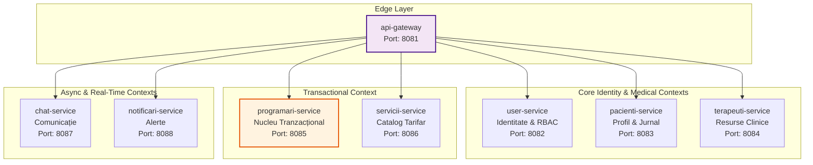

# Capitolul 3. Alegerea Tehnologiilor și a Stivei Software

Acest capitol documentează și justifică deciziile de selecție tehnologică care stau la baza platformei KinetoCare. Pentru fiecare componentă majoră a stivei sunt prezentate atât alternativele evaluate, cât și argumentele de natură arhitecturală care au determinat alegerea finală. Sunt analizate succesiv: stilul arhitectural distribuit bazat pe microservicii, stiva *backend* (Spring Boot, Spring Cloud *Gateway*, OpenFeign și RabbitMQ), infrastructura de identitate și securitate (Keycloak și JWT), ecosistemul *frontend* (React și protocoalele de timp real) și, în final, infrastructura de containerizare și persistență (Docker, Kubernetes, MySQL).

## 3.1 Alegerea arhitecturii bazate pe microservicii

### 3.1.1 Contextul deciziei arhitecturale   
Alegerea stilului arhitectural reprezintă decizia cu cel mai mare impact pe termen lung în ciclul de viață al unui sistem software, guvernând direct atribute fundamentale precum scalabilitatea, mentenabilitatea și viteza de livrare a noilor funcționalități. În proiectarea sistemelor complexe, structura internă reflectă de regulă topologia domeniului de business pe care îl transpune în plan digital — un principiu central în abordarea Domain-Driven Design.   
Domeniul recuperării medicale și al kinetoterapiei se caracterizează printr-un grad ridicat de complexitate operațională și interacțiuni asimetrice între actori. Fluxul de lucru al unei clinici nu se limitează la operațiuni simple de tip *CRUD* (*Create, Read, Update, Delete*), ci implică gestionarea unui ciclu terapeutic iterativ: managementul identității utilizatorilor, planificarea disponibilității terapeuților, logica tranzacțională a rezervărilor, monitorizarea evoluției clinice prin feedback subiectiv, comunicarea bidirecțională în timp real și generarea de notificări reactive.   
Fiecare dintre aceste subdomenii prezintă tipare de acces la date, profiluri de încărcare și cerințe de consistență diferite. Din acest motiv, în faza de analiză a sistemului, au fost evaluate comparativ două paradigme: arhitectura monolitică tradițională și arhitectura distribuită bazată pe microservicii.   

### 3.1.2 Evaluarea critică a alternativei monolitice   
O abordare monolitică ar fi presupus consolidarea întregii logici de business într-o singură unitate de *deployment*, rulând într-un singur proces pe mașina gazdă. Acest model oferă avantaje reale în fazele incipiente ale unui proiect: simplitate operațională deplină, latențe de rețea absente între module și trasabilitate nativă a tranzacțiilor ACID prin baza de date partajată. Cu toate acestea, aplicarea unei structuri monolitice peste modelul de business al platformei KinetoCare ar fi generat trei blocaje structurale majore:   
1. **Asimetria ratelor de schimbare și a profilurilor de trafic:** Subsistemele platformei coexistă, dar nu evoluează în același ritm și nu au același profil de consum al resurselor. Catalogul de servicii medicale este o resursă intens interogată la citire, dar rareori modificată. Subsistemul de mesagerie operează pe un model complet diferit: conexiuni TCP persistente, bidirecționale, cu un volum ridicat de mesaje de dimensiuni mici transmise în timp real. Dacă ambele module ar fi partajat același spațiu de execuție, un val de trafic în chat ar fi concurat direct pentru resursele de procesare ale rezervărilor, generând un risc iminent de indisponibilitate a întregului sistem.   
2. **Divergența granițelor tranzacționale:** Fiecare componentă din KinetoCare are cerințe de consistență distincte. Rezervarea unui slot orar impune o consistență imediată strictă pentru a elimina complet riscul de dublă rezervare. Trimiterea unei notificări sau actualizarea indicatorilor administrativi tolerează un model de consistență eventuală. Într-un monolit, modelul tranzacțional este de regulă uniformizat, forțând operațiunile cu toleranțe ridicate să blocheze inutil resurse critice de infrastructură.   
3. **Heterogenitatea paradigmelor de procesare:** Nivelul de margine al aplicației (punctul unic de intrare) procesează întregul trafic și necesită un model reactiv, non-blocant, capabil să gestioneze concurența ridicată prin multiplexare I/O. Microserviciile din aval execută în principal operațiuni de baze de date, mapate optim pe modelul clasic *thread-per-request*. Descompunerea în microservicii a permis izolarea paradigmei reactive exclusiv la nivelul API *Gateway*-ului, fără a propaga complexitatea sa cognitivă în restul bazei de cod.   
   
### 3.1.3 Structura microserviciilor KinetoCare   
Arhitectura platformei KinetoCare este proiectată prin maparea conceptelor din *Domain-Driven Design* (DDD), unde sistemul distribuit este segmentat în module numite *Bounded Contexts* (Contexte Delimitate). Fiecare context deține o semnificație proprie, un limbaj intern consistent și se materializează sub forma unui microserviciu autonom. Harta completă a microserviciilor și delimitarea acestora sunt prezentate în **Figura 3.1**.   

Platforma este compusă din opt unități independente de *deployment*, detaliate conform responsabilităților lor:   
|    **Microserviciu**     | **Port**     |                                   **Responsabilitate de domeniu**     |   **Schemă dedicată**     |
|:----------------------------|:----------------|:-------------------------------------------------------------------------|:-----------------------------|
|        `api-gateway`     |     8081     |                      Rutare, proxy token și agregare *BFF* reactivă     |           *Stateless*     |
|       `user-service`     |     8082     |  Identitate, control acces bazat pe roluri și management Keycloak     |            `user_db`     |
|   `pacienti-service`     |     8083     |             Profil medical extins și jurnal de feedback subiectiv     |        `pacienti_db`     |
|  `terapeuti-service`     |     8084     |                      Resurse clinice, disponibilitate și concedii     |       `terapeuti_db`     |
| `programari-service`     |     8085     |     Nucleu tranzacțional, evaluări clinice și relații terapeutice     |      `programari_db`     |
|   `servicii-service`     |     8086     |                          Catalog de servicii medicale și tarifare     |        `servicii_db`     |
|       `chat-service`     |     8087     |                           Comunicație bidirecțională în timp real     |            `chat_db`     |
| `notificari-service`     |     8088     |                        Ingestie asincronă de evenimente și alerte     |      `notificari_db`     |

Izolarea completă a datelor este garantată prin implementarea tiparului *Database-per-Service*. Acest model interzice orice formă de interogare directă între scheme diferite. Fiecare microserviciu își încapsulează starea proprie, iar expunerea datelor către exterior se realizează exclusiv prin contracte API formale, eliminând riscul scurgerii logicii de business la nivelul bazei de date.   

### 3.1.4 Topologia dependențelor și rolurile structurale   
Deși topologia statică a dependențelor dintre microservicii este ciclică din cauza integrărilor bidirecționale (de exemplu, `programari-service` interoghează `pacienti-service`, iar `pacienti-service` apelează `programari-service`), la nivelul fluxurilor dinamice de execuție, fluxurile individuale sunt strict aciclice. Niciun flux de cerere individual nu traversează un ciclu de dependențe tranzacționale în interiorul aceluiași context de execuție, prevenind astfel blocajele distribuite (*deadlocks*) sau recursivitatea infinită.   
În cadrul acestei topologii, două servicii ocupă roluri structurale distincte care definesc marginile spectrului arhitectural:   
- **`programari-service` ca nucleu de coeziune clinică.** Acest microserviciu reprezintă cel mai dens și complex punct al arhitecturii. Decizia de a plasa entitățile `Programare`, `Evaluare`, `Evolutie` și `RelatiePacientTerapeut` în același context delimitat și aceeași schemă de date a fost asumată deliberat. Parcursul de recuperare medicală este guvernat de invarianți logici stricți — decizia privind tipul de serviciu aplicat depinde direct de numărul de ședințe efectuate de la ultima evaluare. Colocalizarea acestor entități permite menținerea consistenței prin tranzacții ACID locale, fără a necesita mecanisme costisitoare de coordonare distribuită.   
- **`terapeuti-service` ca nod frunză autonom.** La cealaltă extremă se află serviciul de terapeuți, care nu inițiază niciun apel sincron sau asincron către alte componente din *backend*, funcționând ca un depozit autonom de date de referință (orar, locații, concedii). Deși la nivelul interfeței există o asociere logică puternică între profilul unui terapeut și identitatea sa (nume, prenume din `user-service`), această asociere este decuplată structural la nivelul *backend*-ului. Responsabilitatea îmbinării acestor date este delegată nivelului de agregare din API *Gateway*. Această abordare garantează o degradare grațioasă a sistemului: dacă `user-service` devine indisponibil, motorul intern de verificare a disponibilității orare continuă să funcționeze neafectat.   
   
### 3.1.5 Compromisurile arhitecturale asumate   
Conform Teoremei *CAP* (*Consistency, Availability, Partition Tolerance*), un sistem distribuit nu poate garanta simultan Consistență (Consistency), Disponibilitate (Availability) și Toleranță la Partiții (Partition Tolerance). Deoarece partițiile de rețea sunt inevitabile în medii distribuite, compromisul efectiv se plasează între consistență și disponibilitate. KinetoCare adoptă un model hibrid și calibrat: pentru operațiunile critice de rezervare se prioritizează consistența (sistemul returnează eroare în loc să accepte o posibilă rezervare dublă), iar pentru procesele secundare (precum alertele clinice) se acceptă disponibilitatea bazată pe o consistență eventuală. Această alegere asimetrică reflectă diferența fundamentală de impact clinic dintre cele două categorii de operațiuni.   
Principalele compromisuri arhitecturale asumate prin această decizie sunt:   
1. **Complexitatea operațională:** Rularea a șapte microservicii independente alături de serverul de identitate, brokerul de mesaje și serverul de baze de date anulează simplitatea unui deployment monolitic. Acest cost a fost atenuat tehnic, mitigând complexitatea operațională prin containerizare completă și orchestrare declarativă, și valorificând decuplarea serviciilor ca avantaj de scalare independentă.   
2. **Denormalizarea controlată a datelor (Tiparul *Snapshot*):** Consecința directă a tiparului *Database-per-Service* este imposibilitatea unificării datelor prin interogări SQL directe inter-scheme. Pentru a asigura performanța și integritatea istorică, s-a optat pentru copierea valorilor instantanee ale prețului, duratei și tipului de serviciu direct în înregistrarea programării (mecanism detaliat în secțiunea 4.5.4).   
3. **Consistența distribuită prin tranzacții de compensare (inspirate din Tiparul *Saga*):** Procesele ce traversează mai multe microservicii — cum sunt fluxurile de înregistrare și dezactivare a contului — nu pot utiliza un protocol blocant de tip *2PC* (*Two-Phase Commit*) fără a degrada sever disponibilitatea platformei. KinetoCare implementează o **strategie de tranzacții compensatorii sincrone**, inspirată din principiile tiparului Saga. Spre deosebire de implementările enterprise complete ale acestui tipar, arhitectura evită în mod deliberat cozile de mesaje persistente și Transactional Outbox, menținând complexitatea infrastructurală la un nivel adecvat scopului platformei. Coordonarea logică a compensării este realizată direct în codul serviciului apelant (`user-service`). Pentru înregistrare, dacă scrierea locală în DB sau inițializarea profilului downstream eșuează după validarea identității în IAM, platforma lansează un apel compensatoriu sincron de ștergere a utilizatorului din Keycloak (IAM). Pentru dezactivare, se adoptă un model de consistență asimetrică (se garantează consistența DB locală și IAM, în timp ce propagările secundare sunt de tip *best-effort*). Riscul minor ca apelurile de compensare sau propagare să eșueze reprezintă o limitare documentată și asumată.   
