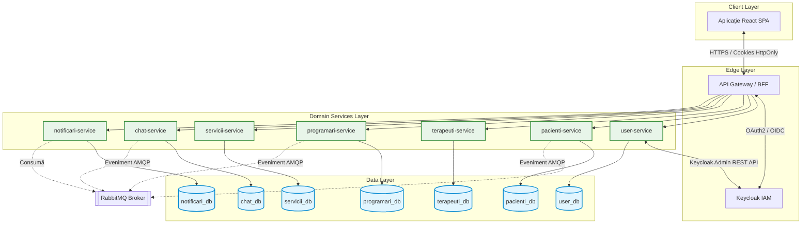

# Capitolul 4. Arhitectura Sistemului

Acest capitol descrie în detaliu arhitectura distribuită a platformei KinetoCare, evidențiind topologia microserviciilor și delimitarea riguroasă a contextelor logice de business. Sunt analizate fluxurile de comunicare sincronă și asincronă, structura și rolul de agregare reactivă al API *Gateway*-ului, precum și modelul de securitate descentralizat de tip Zero-Trust. În final, este evaluată strategia de izolare a persistenței prin tiparul Database-per-Service și utilizarea mecanismelor compensatorii pentru garantarea integrității datelor.

## 4.1 Harta microserviciilor și delimitarea contextelor (*Bounded Contexts*)

Prezenta secțiune expune organizarea structurală a platformei KinetoCare, detaliind delimitarea strictă a contextelor logice de business (*Bounded Contexts*) și maparea acestora sub formă de servicii autonome. Este definit pilonul central al integrării reprezentat de cheia universală de pivotare și este prezentată topologia generală a rețelei interne de microservicii.

### 4.1.1 Structura de ansamblu a sistemului   
Sistemul KinetoCare este organizat în opt unități de execuție (*deployable units*) complet independente, stratificate pe patru niveluri arhitecturale cu responsabilități strict delimitate:   
- **Nivelul Client (Client Layer):** Aplicația interfeței utilizator (*React SPA*) reprezintă canalul exclusiv de interacțiune vizuală pentru toate categoriile de actori (pacienți, terapeuți, administratori).   
- **Nivelul de Margine (Edge Layer):** API *Gateway*-ul și serverul de identitate Keycloak formează perimetrul de securitate al platformei față de exterior. *Gateway*-ul guvernează rutarea și agregarea datelor, în timp ce Keycloak gestionează exclusiv ciclurile de autentificare.   
- **Nivelul Serviciilor de Domeniu (Domain Services Layer):** Șapte microservicii *backend*, fiecare guvernând un singur domeniu delimitat logic (*Bounded Context*).   
- **Nivelul de Date (Data Layer):** Șapte scheme de baze de date relaționale complet izolate, fiecare aflată în posesia exclusivă a unui singur microserviciu, garantând decuplarea la nivel de persistență.   
   
O regulă arhitecturală fundamentală a sistemului stipulează că niciun microserviciu nu accesează direct schema de date a altui serviciu; orice necesitate de date inter-domenii este rezolvată exclusiv prin intermediul contractelor *API* formalizate.   

### 4.1.2 Delimitarea contextelor de domeniu (Bounded Contexts)   
Delimitarea contextelor reflectă granițele naturale ale proceselor de *business* dintr-o clinică de recuperare medicală, aplicând riguros principiile *Domain-Driven Design* (*DDD*). Fiecare context deține un model propriu de date, un limbaj ubicuu (*Ubiquitous Language*) și un mecanism independent de persistență.   
**Contextul de Identitate și Autentificare (`user-service`)**   
Acest context încapsulează modelul canonic al utilizatorului din perspectiva securității. Entitatea principală stochează atributele de bază (email, nume, date de contact, roluri) și funcționează ca un strat de abstractizare peste furnizorul extern de identitate (*Identity Provider*) Keycloak. Operațiunile de creare, suspendare sau recuperare a conturilor sunt delegate către Keycloak, în timp ce baza de date locală acționează ca o „oglindă” optimizată pentru a deservi interogările rapide de la nivelul rețelei interne. O responsabilitate critică a acestui context este orchestrarea cascadei de dezactivare: la suspendarea unui cont, serviciul propagă starea prin apeluri sincrone către profilurile medicale și sistemul de programări pentru a invalida operațiunile viitoare.   
**Contextul Profilului Clinic (`pacienti-service`)**   
Acest domeniu extinde identitatea de bază cu atributele specifice istoricului medical (date demografice sensibile, detalii despre activitatea sportivă și preferințe clinice). O responsabilitate distinctă în cadrul acestui context o reprezintă gestionarea jurnalului subiectiv de progres — un mecanism prin care se captează feedback-ul pacientului după fiecare intervenție terapeutică. Izolarea acestor informații de contextul de identitate garantează un nivel superior de confidențialitate.   
**Contextul Resurselor Umane și Disponibilității (`terapeuti-service`)**   
Acest microserviciu modelează subdomenii puternic coezive: profilul profesional, infrastructura fizică (catalogul de locații ale clinicii) și managementul timpului (ferestre de disponibilitate și perioade de concediu). Din perspectivă topologică, funcționează ca un nod-frunză (*leaf node*) în graful dependențelor: nu inițiază apeluri de rețea către alte servicii, ci este exclusiv interogat pentru validarea conflictelor de orar la inițierea rezervărilor. De remarcat este decizia arhitecturală de a stoca activele media (fotografiile de profil) direct în schema bazei de date (codate *Base64*), simplificând arhitectura prin evitarea introducerii unui serviciu terț de tip *Object Storage* pentru un volum marginal de data.   
**Contextul Tranzacțional Clinic (`programari-service`)**   
Fiind nucleul orchestrator al sistemului, acest context deține granițe largi, reunind patru entități cu cerințe stricte de consistență locală: Programare, Relație Terapeutică, Evaluare și Evoluție. Co-localizarea lor este deliberată. O evaluare medicală este dependentă logic și tranzacțional de programarea care a declanșat-o; separarea lor în microservicii distincte ar fi impus protocoale complexe de coordonare distribuită. Tot aici se aplică tiparul *Snapshot* (a cărui justificare detaliată se regăsește în secțiunea 4.5.4) prin denormalizarea prețului și a duratei serviciilor medicale la momentul creării programării, garantând astfel imuabilitatea istorică și corectitudinea auditului financiar.   
**Contextul Catalogului de Servicii (`servicii-service`)**   
Gestionează taxonomia intervențiilor medicale și politica tarifară. Implementează o logică de căutare tolerantă la variații (căutare ierarhică cu proceduri de rezervă/*fallback* pe categorii), permițând modulului de programări să deducă automat serviciul corect fără a crea un cuplaj rigid la nivelul identificatorilor din baza de date.   
**Contextul Mesageriei în Timp Real (`chat-service`)**   
Gestionează canalul de comunicație sincronă combinând o interfață *REST* pentru persistența arhivelor cu un flux *WebSocket*/*STOMP* pentru comunicarea instantanee. O caracteristică arhitecturală de siguranță este verificarea activă a validității relației clinice; sistemul blochează transmiterea mesajelor dacă nu confirmă, printr-un apel sincron, că pacientul se află încă sub îngrijirea terapeutului destinatar.   
**Contextul Reactiv de Notificări (`notificari-service`)**   
Acționează ca un colector de evenimente asincrone, având un rol pur reactiv. Consumă mesaje de pe magistrala *AMQP*, le consolidează și expune un panou de notificări acționabile, decuplând complet procesul de alertare de logica tranzacțională a celorlalte module.   

### 4.1.3 Cheia universală de pivotare: Identificatorul extern   
Deoarece modelul *Database-per-Service* previne utilizarea interogărilor *SQL* care unesc date din scheme diferite, platforma adoptă o convenție globală de referențiere bazată pe un identificator extern (`keycloakId`). Acest *UUID*, generat și garantat ca fiind imutabil de către furnizorul extern de identitate (*Identity Provider*), este utilizat ca o cheie externă logică (fără constrângeri fizice) în toate bazele de date. Utilizarea unui pivot universal elimină dependența arhitecturală limitativă a identificatorilor auto-incrementali locali (care nu posedă semnificație în afara propriului microserviciu) și asigură o trasabilitate coerentă a datelor la nivelul întregului sistem.   

### 4.1.4 Topologia arhitecturală a sistemului   
Reprezentarea vizuală de mai jos ilustrează distribuția pe niveluri a componentelor, fluxurile de date și separarea strictă a contextelor de persistență. A se observa decuplarea asincronă a modulului de notificări prin intermediul brokerului de mesaje RabbitMQ.   

