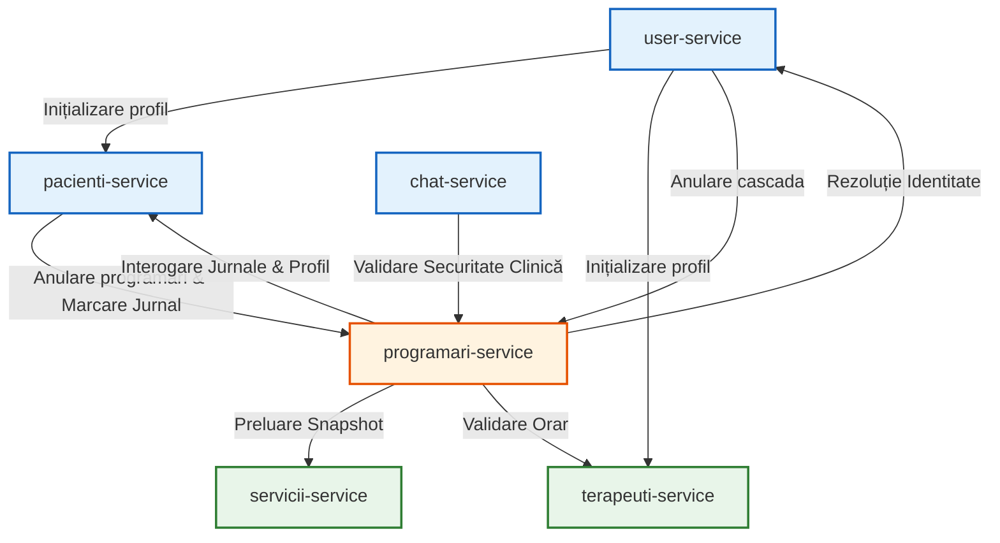
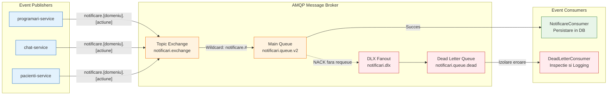

## 4.2 Fluxul de comunicare inter-servicii: sincron vs. asincron

Această secțiune detaliază regulile arhitecturale care guvernează decizia de utilizare a comunicării sincrone (HTTP/REST) în detrimentul celei asincrone (AMQP), analizând matricea dependențelor și topologia grafului de execuție.

### 4.2.1 Principiul de selecție a stilului de comunicare   
Platforma KinetoCare utilizează două stiluri distincte de comunicare inter-servicii, selectate pe baza unui principiu arhitectural strict: **stilul de comunicare este guvernat de semantica operațională și de constrângerile de coeziune temporală**.   
- **Comunicarea sincronă (HTTP/REST):** Este utilizată exclusiv atunci când serviciul producător are o dependență tranzacțională imediată de răspunsul serviciului consumator pentru a-și putea finaliza propriul flux de execuție. Eșecul unui apel sincron invalidează operația curentă și declanșează un mecanism de tratare a erorilor.   
- **Comunicarea asincronă (AMQP):** Este utilizată pentru evenimentele de tip *fire-and-forget* — situații în care un serviciu își finalizează operația de bază și semnalează faptul împlinit către restul sistemului. Această decuplare spațială și temporală garantează că indisponibilitatea temporară a consumatorilor nu afectează disponibilitatea sistemului producător.   
   
### 4.2.2 Comunicarea sincronă și rezoluția dependențelor   
**Mecanismul de propagare a contextului de securitate**   
Într-o arhitectură de tip *Zero-Trust*, lipsa propagării identității între servicii ar duce la respingerea cererilor interne. Pentru a rezolva acest aspect, platforma utilizează clienți HTTP declarativi bazați pe un tipar de tip *Interceptor*. La fiecare cerere de ieșire, sistemul extrage jetonul criptografic (*JWT*) din contextul firului de execuție activ și îl injectează automat în antetele apelului. Aceasta garantează că validarea securității funcționează unitar, independent dacă cererea provine de la un utilizator extern sau de la un alt microserviciu.   
*Excepția arhitecturală asumată:* Singura abatere de la acest flux o reprezintă faza de înregistrare a utilizatorilor noi (`user-service`), care interacționează cu profilele medicale ocolind interceptorul de securitate. Această excepție este fundamentată de realitatea procesului de inițializare: la momentul înregistrării, nu s-a emis încă un *JWT* valid, apelurile de inițializare a profilelor din microserviciile *downstream* fiind realizate direct, server-la-server, utilizând un client simplu de tip `RestTemplate` fără context de autentificare.   

**Matricea interacțiunilor sincrone**   
Tabelul următor documentează relațiile de dependență directă (apeluri sincrone HTTP/Feign) între contextele delimitate:   
|        Context Apelant |  Context Destinație |                                                                                                                      Justificarea Integrării Sincrone |
|:------------------------------|:---------------------------|:-------------------------------------------------------------------------------------------------------------------------------------------------------------|
|       **user-service** |    pacienti-service |                                     Inițializarea profilului medical (la înregistrare) și propagarea stării active (activare/dezactivare cont admin). |
|       **user-service** |   terapeuti-service |                                     Inițializarea fișei profesionale (la înregistrare) și propagarea stării active (activare/dezactivare cont admin). |
|       **user-service** |  programari-service |                                                        Declanșarea anulării automate a tuturor programărilor viitoare în cazul suspendării unui cont. |
|   **pacienti-service** |  programari-service |        Declanșarea cascadei de anulare a rezervărilor active viitoare în urma schimbării terapeutului curent și înregistrarea completării jurnalului. |
| **programari-service** |    servicii-service |                                            Extragerea datelor financiare și temporale (preț, durată, nume) la momentul rezervării (Tiparul *Snapshot*). |
| **programari-service** |   terapeuti-service |                                     Validarea orarului, a intervalelor de disponibilitate, a conflictelor de concediu și a asocierii locației fizice. |
| **programari-service** |        user-service |                      Rezoluția identității pacienților/terapeuților (nume, prenume, detalii contact) pentru asamblarea fișei clinice și calendarului. |
| **programari-service** |    pacienti-service |                   Actualizarea terapeutului preferat la schimbarea relației terapeutice și interogarea jurnalelor/datelor medicale pentru Fișa Pacientului. |
|       **chat-service** |  programari-service |             Validarea securității clinice (existența unei relații terapeutice active în `programari_db`) anterior stabilirii conexiunilor *WebSocket*. |

**Analiza topologiei grafului de execuție**   
Analiza dependențelor reliefează proprietăți structurale esențiale pentru stabilitatea sistemului distribuit:   
- **Servicii de tip nod-frunză (Leaf Nodes):** `terapeuti-service` și `servicii-service` nu inițiază niciun apel sincron către alte servicii. Această decuplare totală le permite să fie scalate extrem de agresiv și să beneficieze de strategii robuste de cache local, reducând semnificativ suprafața totală de blocaj a rețelei.   
- **Nucleul orchestrator:** `programari-service` acționează ca un nod central cu cel mai mare grad de conectivitate (*in-degree* și *out-degree*), centralizând regulile tranzacționale de *business* ale fluxului clinic.   
- **Prevenirea impasurilor distribuite (Distributed *Deadlock*-uri):** Deși există o dependență logică bidirecțională între `programari-service` și `pacienti-service` la nivel global, sistemul respectă principiul **Directed Acyclic Graph (DAG)** la nivelul fiecărui fir de execuție tranzacțional. Orice operațiune declanșată din `pacienti-service` (cum ar fi alegerea unui nou terapeut) apelează `programari-service` fără a genera un apel înapoi (*callback*) în interiorul aceluiași apel stivă. Similar, fluxurile de citire din `programari-service` doar interoghează pasiv date din `pacienti-service`. Acest caracter aciclic garantează eliminarea riscului de *distributed circular wait* (blocaj reciproc al tranzacțiilor din bazele de date separate).   

   
### 4.2.3 Comunicarea asincronă și tiparul *Event-Driven* (*EDA*)   
Pentru operațiunile care tolerează un model de consistență eventuală (*eventual consistency*), platforma implementează modelul arhitectural bazat pe evenimente (*Event-Driven Architecture — EDA*) folosind un broker central de mesaje.   

**Topologia de rutare a evenimentelor**   
Infrastructura asincronă este gestionată printr-un schimbător de tip `TopicExchange`. Serviciile operaționale acționează pur ca publicatori ai unor fapte imutabile, folosind chei de rutare semantice, aplicând astfel respectarea strictă a principiului *Open/Closed*: infrastructura este deschisă pentru a accepta noi tipuri de notificări, dar complet închisă necesității de a modifica codul consumatorilor existenți.   
|                           Serviciu Producător |                            Cheie de Rutare Semantică |                                                                                   Fapt Împlinit (Eveniment) |
|:-----------------------------------------------------|:------------------------------------------------------------|:-------------------------------------------------------------------------------------------------------------------|
|                        **programari-service** |                         `notificare.programare.noua` |                                                                  Confirmarea unei rezervări de slot clinic. |
|                        **programari-service** |                       `notificare.evaluare.initiala` |                              Alocarea unei programări de tip Evaluare Inițială (necesită fișă de evaluare). |
|                        **programari-service** |                     `notificare.reevaluare.necesara` |                                                                 Alocarea unei programări de tip Reevaluare. |
|                        **programari-service** |              `notificare.programare.anulata.pacient` |                                                           Invalidarea unui slot din inițiativa pacientului. |
|                        **programari-service** |             `notificare.programare.anulata.terapeut` |                                                          Invalidarea unui slot din inițiativa terapeutului. |
|                        **programari-service** |                         `notificare.reminder.jurnal` |      Declanșarea automatizată a ferestrei de colectare a feedback-ului de jurnal după finalizarea ședinței. |
|                        **programari-service** | `notificare.reminder.24h` / `notificare.reminder.2h` |                                                    Alerte temporale trimise înaintea începerii programării. |
|                        **programari-service** |                  `notificare.reevaluare.recomandata` |                     Notificarea pacientului că a atins pragul maxim de ședințe și are nevoie de reevaluare. |
| **pacienti-service** / **programari-service** |                        `notificare.jurnal.completat` |                                Notificarea terapeutului că pacientul a completat jurnalul asociat ședinței. |
|                              **chat-service** |                               `notificare.mesaj.nou` |                            Avertizarea unui utilizator offline privind primirea unei noi comunicări active. |

**Toleranța la erori prin *Dead Letter Queue* (DLQ)**   
În sistemele de procesare pe cozi, coruperea unui pachet de date poate duce la o buclă infinită de eșecuri. Arhitectura platformei previne acest scenariu: dacă serviciul consumator raportează o eroare de procesare, cadrul AMQP emite un semnal *NACK* (confirmare negativă), refuzând reintroducerea mesajului în coadă. Mesajul problematic este dirijat automat de broker către coada dedicată mesajelor abandonate (*Dead Letter Queue*). Consumatorul acestei cozi este proiectat explicit să absoarbă propriile excepții interne, prevenind o eventuală buclă infinită la nivelul containerului de mesagerie.   
*Notă de operabilitate:* Adăugarea indicativului de versiune (`v2`) la coada principală reprezintă rezolvarea documentată a unei constrângeri intrinseci ale serverului de mesagerie, a cărui arhitectură refuză alterarea retroactivă a parametrilor structurali de rutare pentru obiectele deja alocate.   

### 4.2.4 Analiza decizională a topologiei de integrare   
Pentru a standardiza dezvoltarea și a elimina ambiguitatea structurală în cazul extensiilor viitoare ale platformei, decizia de implementare a rutelor de comunicare este bazată pe matricea decizională de mai jos.   
|            **Criteriu de Evaluare** |                                                 **Integrare Sincronă (HTTP/REST)** |                                                 **Integrare Asincronă (AMQP)** |
|:-------------------------------------------|:------------------------------------------------------------------------------------------|:--------------------------------------------------------------------------------------|
| **Continuitatea fluxului de lucru** |                   Apelantul depinde de răspuns pentru a finaliza operația curentă. |              Apelantul a finalizat mutația, semnalând doar modificarea stării. |
|     **Profilul de disponibilitate** |        Critic — indisponibilitatea destinației invalidează tranzacția apelantului. |        Flexibil — mesajul persistă în broker până la restabilirea destinației. |
|         **Garanțiile consistenței** |         Transparență tranzacțională imediată, în cadrul aceleiași cereri de rețea. |       Transparență bazată pe modelul de consistență eventuală (*best-effort*). |
|            **Gestionarea erorilor** |                           Excepția de rețea se propagă imediat ca eroare HTTP 5xx. |          Excepția locală determină izolarea mesajului defect în carantina DLQ. |

Această segmentare garantează că orice operațiune corelată logic cu actul clinic este validată atomic, în timp ce logistica secundară — audit, raportare, alertare — se supune rigorilor non-blocante, menținând stabilitatea de ansamblu a platformei.   
