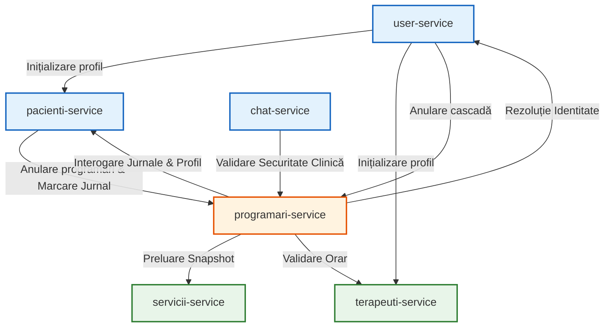
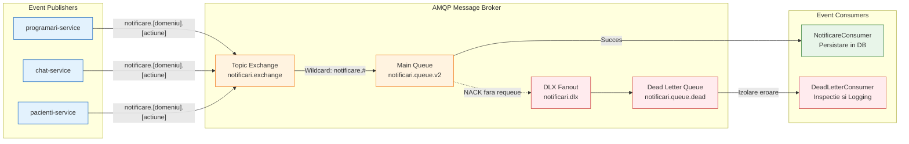

## 4.2 Fluxul de comunicare inter-servicii: sincron vs. asincron

Această secțiune detaliază regulile arhitecturale care guvernează decizia de utilizare a comunicării sincrone (HTTP/REST) față de cea asincronă (AMQP), analizând matricea dependențelor și proprietățile topologice ale grafului de execuție.

### 4.2.1 Principiul de selecție a stilului de comunicare

Platforma KinetoCare utilizează două stiluri distincte de comunicare inter-servicii, selectate pe baza unui principiu arhitectural strict: **stilul de comunicare este guvernat de semantica operațională și de constrângerile de coeziune temporală**.

- **Comunicarea sincronă (HTTP/REST):** Este utilizată exclusiv atunci când componenta producătoare prezintă o dependență tranzacțională imediată de răspunsul componentei consumatoare pentru a-și putea finaliza propriul flux de execuție. Eșecul unui apel sincron invalidează operația curentă și declanșează un mecanism de tratare a erorilor.
- **Comunicarea asincronă (AMQP):** Este utilizată pentru evenimentele de tip *fire-and-forget* — situații în care o componentă își finalizează operația de bază și semnalează faptul împlinit către restul sistemului. Această decuplare spațială și temporală garantează că indisponibilitatea temporară a consumatorilor nu afectează disponibilitatea componentei producătoare.

### 4.2.2 Comunicarea sincronă și rezoluția dependențelor

**Mecanismul de propagare a contextului de securitate**

Într-o arhitectură de tip *Zero-Trust*, absența propagării identității între componente ar conduce la respingerea cererilor interne. Această problemă este rezolvată prin clienți HTTP declarativi bazați pe tiparul *Interceptor*. La fiecare cerere de ieșire, jetonul criptografic (*JWT*) este extras din contextul firului de execuție activ și injectat automat în antetele apelului. Astfel, validarea securității funcționează uniform, indiferent dacă cererea provine de la un utilizator extern sau de la un alt microserviciu.

*Excepția arhitecturală asumată:* Singura abatere de la acest flux o reprezintă faza de înregistrare a utilizatorilor noi (`user-service`), care interacționează cu profilele medicale ocolind interceptorul de securitate. Această excepție este fundamentată de realitatea procesului de inițializare: la momentul înregistrării, un JWT valid nu a fost încă emis; apelurile de inițializare a profilelor din componentele *downstream* sunt realizate direct, server-la-server, printr-un client simplu de tip `RestTemplate`, fără context de autentificare.

**Matricea interacțiunilor sincrone**

Tabelul următor documentează relațiile de dependență directă (apeluri sincrone HTTP/Feign) dintre contextele delimitate:

| Context apelant | Context destinație | Justificarea integrării sincrone |
|:---|:---|:---|
| `user-service` | `pacienti-service` | Inițializarea profilului medical (la înregistrare) și propagarea stării active (activare/dezactivare cont). |
| `user-service` | `terapeuti-service` | Inițializarea fișei profesionale (la înregistrare) și propagarea stării active (activare/dezactivare cont). |
| `user-service` | `programari-service` | Declanșarea anulării automate a tuturor programărilor viitoare la suspendarea unui cont. |
| `pacienti-service` | `programari-service` | Declanșarea cascadei de anulare a rezervărilor active la schimbarea terapeutului curent și înregistrarea completării jurnalului. |
| `programari-service` | `servicii-service` | Extragerea datelor financiare și temporale (preț, durată, nume) la momentul rezervării (Tiparul *Snapshot*). |
| `programari-service` | `terapeuti-service` | Validarea orarului, a intervalelor de disponibilitate, a conflictelor de concediu și a asocierii locației fizice. |
| `programari-service` | `user-service` | Rezoluția identității pacienților/terapeuților (nume, prenume, detalii contact) pentru asamblarea fișei clinice și calendarului. |
| `programari-service` | `pacienti-service` | Actualizarea terapeutului preferat la schimbarea relației terapeutice și interogarea jurnalelor medicale pentru fișa pacientului. |
| `chat-service` | `programari-service` | Validarea securității clinice (existența unei relații terapeutice active) anterior stabilirii conexiunilor *WebSocket*. |

**Analiza topologiei grafului de execuție**

Analiza dependențelor relevă proprietăți structurale esențiale pentru stabilitatea sistemului distribuit:

- **Componente de tip nod-frunță (*leaf nodes*):** `terapeuti-service` și `servicii-service` nu inițiază niciun apel sincron către alte componente. Această decuplare totală permite scalarea lor independentă și aplicarea unor strategii robuste de *cache* local, reducând semnificativ suprafața totală de blocaj a rețelei.
- **Nucleul orchestrator:** `programari-service` acționează ca un nod central cu cel mai mare grad de conectivitate (*in-degree* și *out-degree*), centralizând regulile tranzacționale de *business* ale fluxului clinic.
- **Prevenirea impasurilor distribuite (*distributed deadlocks*):** Deși există o dependență logică bidirecțională între `programari-service` și `pacienti-service` la nivel global, sistemul respectă proprietatea *Directed Acyclic Graph* (DAG) la nivelul fiecărui fir de execuție tranzacțional. Nicio operațiune declanșată din `pacienti-service` (de exemplu, alegerea unui nou terapeut) nu generează un apel de retur (*callback*) în interiorul aceluiași context de stivă. Similar, fluxurile de citire din `programari-service` interoghează pasiv date din `pacienti-service`. Caracterul aciclic al fluxurilor individuale garantează eliminarea riscului de așteptare circulară distribuită (*circular wait*) între tranzacțiile bazelor de date separate.

```mermaid
graph TD
    %% Nivelurile logice de comunicare
    US[user-service]
    PS[pacienti-service]
    TS[terapeuti-service]
    PR[programari-service]
    SS[servicii-service]
    CS[chat-service]

    %% Legaturile de apeluri sincrone
    US -->|Inițializare profil| PS
    US -->|Inițializare profil| TS
    US -->|Anulare cascadă| PR

    PS -->|Anulare programări & Marcare Jurnal| PR

    PR -->|Preluare Snapshot| SS
    PR -->|Validare Orar| TS
    PR -->|Rezoluție Identitate| US
    PR -->|Interogare Jurnale & Profil| PS

    CS -->|Validare Securitate Clinică| PR

    %% Stilizare pentru a evidentia Leaf Nodes vs Central Node
    classDef leafNode fill:#e8f5e9,stroke:#2e7d32,stroke-width:2px;
    classDef centralNode fill:#fff3e0,stroke:#e65100,stroke-width:2px;
    classDef normalNode fill:#e3f2fd,stroke:#1565c0,stroke-width:2px;

    class TS,SS leafNode;
    class PR centralNode;
    class US,PS,CS normalNode;
```

### 4.2.3 Comunicarea asincronă și tiparul *Event-Driven* (*EDA*)

Pentru operațiunile care tolerează un model de consistență eventuală (*eventual consistency*), platforma implementează modelul arhitectural bazat pe evenimente (*Event-Driven Architecture — EDA*) utilizând un broker central de mesaje.

**Topologia de rutare a evenimentelor**

Infrastructura asincronă este gestionată printr-un schimbător de tip *TopicExchange*. Componentele operaționale publică fapte imutabile utilizând chei de rutare semantice, respectând principiul *Open/Closed*: infrastructura este deschisă pentru a accepta noi tipuri de notificări, fără a necesita modificarea codului consumatorilor existenți.

| Serviciu producător | Cheie de rutare semantică | Fapt împlinit (eveniment) |
|:---|:---|:---|
| `programari-service` | `notificare.programare.noua` | Confirmarea unei rezervări de slot clinic. |
| `programari-service` | `notificare.evaluare.initiala` | Alocarea unei programări de tip Evaluare Inițială. |
| `programari-service` | `notificare.reevaluare.necesara` | Alocarea unei programări de tip Reevaluare. |
| `programari-service` | `notificare.programare.anulata.pacient` | Invalidarea unui slot din inițiativa pacientului. |
| `programari-service` | `notificare.programare.anulata.terapeut` | Invalidarea unui slot din inițiativa terapeutului. |
| `programari-service` | `notificare.reminder.jurnal` | Declanșarea ferestrei de colectare a feedback-ului după finalizarea ședinței. |
| `programari-service` | `notificare.reminder.24h` / `notificare.reminder.2h` | Alerte temporale transmise înaintea începerii programării. |
| `programari-service` | `notificare.reevaluare.recomandata` | Notificarea pacientului că a atins pragul maxim de ședințe și necesită reevaluare. |
| `pacienti-service` / `programari-service` | `notificare.jurnal.completat` | Notificarea terapeutului că pacientul a completat jurnalul asociat ședinței. |
| `chat-service` | `notificare.mesaj.nou` | Avertizarea unui utilizator inactiv privind primirea unei noi comunicări. |

**Toleranța la erori prin *Dead Letter Queue* (DLQ)**

Într-un sistem de procesare pe cozi, coruperea unui pachet de date poate genera o buclă infinită de eșecuri. Arhitectura platformei previne acest scenariu: dacă componenta consumatoare raportează o eroare de procesare, cadrul AMQP emite un semnal *NACK* (confirmare negativă), refuzând reintroducerea mesajului în coadă. Mesajul problematic este dirijat automat de broker către coada dedicată mesajelor abandonate (*Dead Letter Queue*). Consumatorul acestei cozi este proiectat explicit să absoarbă propriile excepții interne, prevenind o buclă infinită la nivelul containerului de mesagerie.

*Notă de operabilitate:* Adăugarea indicativului de versiune (`v2`) la coada principală reprezintă soluționarea documentată a unei constrângeri intrinseci ale serverului de mesagerie, a cărui arhitectură refuză alterarea retroactivă a parametrilor structurali de rutare pentru obiectele deja alocate.

```mermaid
graph LR
    subgraph Event Publishers
        P1[programari-service]
        P2[chat-service]
        P3[pacienti-service]
    end

    subgraph AMQP Message Broker
        EX["Topic Exchange\nnotificari.exchange"]
        MQ["Main Queue\nnotificari.queue.v2"]
        DLX["DLX Fanout\nnotificari.dlx"]
        DLQ["Dead Letter Queue\nnotificari.queue.dead"]

        P1 -->|"notificare.[domeniu].[actiune]"| EX
        P2 -->|"notificare.[domeniu].[actiune]"| EX
        P3 -->|"notificare.[domeniu].[actiune]"| EX

        EX -->|"Wildcard: notificare.#"| MQ
        MQ -.->|"NACK fara requeue"| DLX
        DLX --> DLQ
    end

    subgraph Event Consumers
        C["NotificareConsumer\nPersistare in DB"]
        DC["DeadLetterConsumer\nInspectie si Logging"]

        MQ -->|Succes| C
        DLQ -->|Izolare eroare| DC
    end

    classDef pub fill:#e3f2fd,stroke:#1565c0
    classDef broker fill:#fff3e0,stroke:#ef6c00
    classDef cons fill:#e8f5e9,stroke:#2e7d32
    classDef dead fill:#ffebee,stroke:#c62828

    class P1,P2,P3 pub
    class EX,MQ broker
    class C cons
    class DLX,DLQ,DC dead
```

### 4.2.4 Analiza decizională a topologiei de integrare

Pentru a standardiza implementarea și a elimina ambiguitatea structurală în cazul extensiilor viitoare ale platformei, decizia de implementare a rutelor de comunicare se bazează pe matricea decizională de mai jos.

| **Criteriu de evaluare** | **Integrare sincronă (HTTP/REST)** | **Integrare asincronă (AMQP)** |
|:---|:---|:---|
| **Continuitatea fluxului de lucru** | Componenta apelantă depinde de răspuns pentru a finaliza operația curentă. | Componenta apelantă a finalizat mutația, semnalând doar modificarea stării. |
| **Profilul de disponibilitate** | Critic — indisponibilitatea destinației invalidează tranzacția apelantului. | Flexibil — mesajul persistă în broker până la restabilirea destinației. |
| **Garanțiile consistenței** | Transparență tranzacțională imediată, în cadrul aceleiași cereri de rețea. | Transparență bazată pe modelul de consistență eventuală (*best-effort*). |
| **Gestionarea erorilor** | Excepția de rețea se propagă imediat ca eroare HTTP 5xx. | Excepția locală determină izolarea mesajului defect în coada de carantină DLQ. |

Această segmentare garantează că orice operațiune corelată logic cu actul clinic este validată atomic, în timp ce logistica secundară — audit, raportare, alertare — se supune principiilor non-blocante, menținând stabilitatea de ansamblu a platformei.
