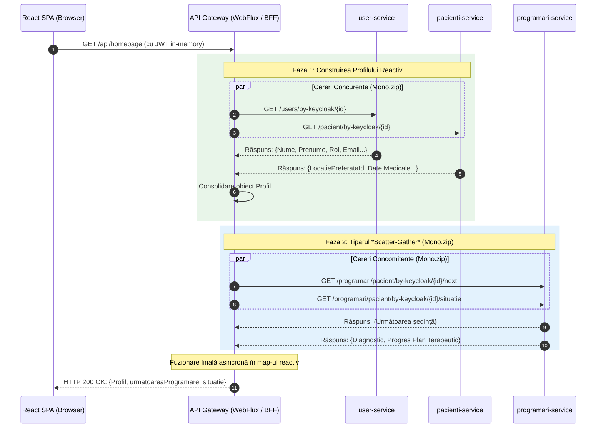

## 4.3 API *Gateway* și tiparul *Backend-For-Frontend* (*BFF*)

Această secțiune analizează în detaliu rolurile îndeplinite de componenta API *Gateway* la marginea sistemului distribuit. Sunt prezentate mecanismele de rutare a traficului, politicile de izolare a jetoanelor de securitate și modul în care stiva reactivă WebFlux facilitează agregarea performantă de date prin tiparul *Backend-For-Frontend* (*BFF*).

### 4.3.1 Rolurile duale ale API *Gateway*-ului   
În arhitectura platformei KinetoCare, componenta API *Gateway* nu funcționează ca un simplu rutor de rețea, ci implementează simultan două roluri arhitecturale distincte, fundamentate pe stiva reactivă Spring WebFlux:   
- **Proxy invers transparent (*Edge Router*):** Pentru marea majoritate a cererilor, *Gateway*-ul acționează ca o barieră de trecere. Normalizează căile de acces prin eliminarea prefixelor externe și direcționează cererile către microserviciile responsabile pentru respectivul domeniu.   
- **Orchestrator *Backend-For-Frontend* (*BFF*):** Pentru interfețele complexe care necesită asamblarea datelor din multiple domenii, *Gateway*-ul funcționează ca un agregator activ. Orchestrează apeluri paralele către microservicii și consolidează răspunsurile într-o structură unică de date, livrată clientului.   
   
Această separare a responsabilităților garantează un nivel ridicat de mentenabilitate: logica pură de rutare este definită declarativ prin configurații externe, în timp ce logica de agregare *BFF* este izolată programmatic în controlere și servicii dedicate.   

### 4.3.2 Strategia de rutare și normalizarea traficului   
Mecanismul de rutare aplică un model de evaluare ordonată și secvențială, prevenind anomaliile de tip potrivire ambiguă. O consecință directă a proiectării bazate pe *Domain-Driven Design* se reflectă în expunerea microserviciului `terapeuti-service`. Deși entitățile de specialitate (profil profesional, locații fizice, matrice de disponibilitate și concedii) aparțin aceluiași context delimitat, ele sunt expuse ca resurse *REST* distincte. Rutarea forțează evaluarea prioritizată a căilor specifice înaintea identificatorului general al serviciului, prevenind coliziunile de potrivire.   
La nivel global, *Gateway*-ul centralizează normalizarea politicilor *Cross-Origin Resource Sharing* (*CORS*). Prin filtrele de deduplicare aplicate la marginea rețelei, arhitectura previne coruperea răspunsurilor HTTP — o problemă recurentă în sistemele distribuite unde serviciile din aval adaugă redundant propriile directive *CORS*.   

### 4.3.3 Medierea securității: Izolarea jetoanelor criptografice   
O responsabilitate critică a *Gateway*-ului, anterioară oricărei agregări de date, este medierea procesului de autentificare. Endpoint-urile de obținere și revocare a sesiunii sunt exceptate de la filtrele standard de validare JWT, constituind tocmai punctele de generare a acestora.   
Pentru a neutraliza vulnerabilitățile de tip *Cross-Site Scripting* (*XSS*) inerente aplicațiilor *SPA*, *Gateway*-ul implementează separarea și izolarea jetoanelor:   
1. Proxy-ul primește credențialele brute, asamblează o cerere securizată cu datele clientului intern și o expediază către serverul Keycloak.   
2. La primirea răspunsului de la furnizorul de identitate, *Gateway*-ul interceptează structura JSON ce conține atât jetonul de acces cu viață scurtă, cât și jetonul de reîmprospătare cu viață lungă.   
3. Jetonul de reîmprospătare (*refresh token*) este extras din corpul răspunsului și injectat într-un antet `Set-Cookie` marcat cu directivele `HttpOnly` și `SameSite=Lax`.   
   
Această decizie garantează că mediul JavaScript din browser primește și manipulează exclusiv jetonul volatil de acces, în timp ce jetonul responsabil pentru menținerea sesiunii rămâne invizibil codului client, gestionat exclusiv de mecanismele interne ale browserului la instrucțiunile *Gateway*-ului.   

### 4.3.4 Arhitectura BFF și execuția asincronă prin tiparul *Scatter-Gather*   
Tiparul *Backend-For-Frontend* răspunde direct problemei penalizărilor de latență din rețelele publice (*N+1 round-trips*). Dacă un panou de bord clinic solicită date de identitate, programări și profil medical, browserul ar trebui să execute trei cereri HTTP distincte, suportând de trei ori costul negocierii TCP/TLS.   
*Gateway*-ul neutralizează această latență mutând faza de colectare a datelor în interiorul rețelei virtuale a clusterului, unde latența inter-servicii este de ordinul microsecundelor. Prin intermediul bibliotecii *Project Reactor*, *Gateway*-ul implementează tiparul *Scatter-Gather*: lansează în paralel cereri către microserviciile țintă, așteaptă non-blocant finalizarea tuturor și consolidează răspunsurile.   
O proprietate esențială a acestei implementări este **degradarea grațioasă**. În cazul în care un microserviciu secundar raportează o eroare, fluxul reactiv interceptează eroarea, o absoarbe și asamblează un răspuns parțial valid, prevenind colapsul întregii interfețe.   

### 4.3.5 Componentele strategice de agregare   
Logica de consolidare a datelor este distribuită pe patru controllere specializate:   
1. **Agregatorul Tabloului de Bord (Homepage):** Furnizează datele contextualizate pentru pagina de start. Pentru pacienți, execută o orchestrare asincronă în două faze: preia profilul clinic consolidat, concomitent cu determinarea celei mai apropiate programări și a stadiului din planul curent de recuperare medicală.   
2. **Consolidatorul de Profil (Profile):** Cea mai complexă asamblare statică, necesitând până la 5 apeluri interne paralele. Reunește asincron datele de identitate cu istoricul clinic, detaliile terapeutului alocat și locația fizică a clinicii, rezolvând coliziunile de identificatori înainte de a livra structura plată către interfață. Metoda funcționează bidirecțional, gestionând decompunerea și distribuția paralelă a actualizărilor profilului către sistemele aferente.   
3. **Orchestratorul Interfeței de Mesagerie (Chat):** Generează conversații virtuale la nivel de *Gateway* folosind tiparul **Virtual Proxy** (un obiect surogat în memorie pentru canalul de comunicare). Ambele tipare de design coexistă la niveluri diferite ale fluxului: în timp ce **Virtual Proxy** servește drept reprezentare intermediară în memorie pentru client, persistența fizică a conversației în baza de date se face prin **Inițializare Leneșă** (*Lazy Initialization*), fiind amânată în `chat-service` până la expedierea primului mesaj efectiv. Include o rezoluție în masă (*batch resolution*) a identităților pentru a minimiza interogările.   
4. **Motorul de Căutare (Search):** Optimizează procesul de alocare a terapeutului combinând rezultatele de filtrare geografică și profesională cu rezoluția identităților prin procesare în lot, esențială pentru eficiența la scară largă.   

### 4.3.6 Asimetria paradigmelor tehnologice: WebFlux vs. MVC   
O decizie notabilă de design este adoptarea stivei reactive Spring WebFlux exclusiv la nivelul API *Gateway*-ului, în timp ce microserviciile din aval rulează pe un model imperativ, blocant Spring MVC.   
Această asimetrie reflectă profilele de operare structural diferite ale componentelor. *Gateway*-ul execută operațiuni cu intensitate ridicată pe rețea: inițiază cereri HTTP multiple și așteaptă răspunsuri concurente. Modelul reactiv bazat pe bucla de evenimente gestionează acest tipar cu un consum minim de fire de execuție. În contrast, microserviciile de domeniu execută operațiuni tranzacționale asupra bazelor de date prin drivere relaționale blocante (JDBC). Introducerea programării reactive în aval nu ar aduce beneficii reale de performanță, ci ar crește artificial complexitatea codului și dificultatea depanării. Restrângerea stivei reactive doar la nivelul de agregare demonstrează o aplicare controlată a principiului de minimizare a complexității accidentale.   

### 4.3.7 Analiza arhitecturală a amplasării agregării de date   
Arhitectura platformei prezintă două instanțe de agregare complexă, plasate deliberat în niveluri arhitecturale diferite:   
|                     **Criteriu de Evaluare** |                               **Tipar BFF în API *Gateway*** |                             Agregarea Locală în `programari-service` |
|:----------------------------------------------------|:------------------------------------------------------------------|:----------------------------------------------------------------------------|
|                       **Profil de execuție** |                           Asincron, non-blocant, concurent |                        Secvențial, blocant, intensiv pe baza de date |
|                      **Sfera interogărilor** |                 Determinată, număr fix de apeluri (max. 5) |                  Variabilă, proporțională cu volumul datelor clinice |
|        **Aria de acoperire a componentelor** |                        3 microservicii distincte decuplate |               4 contexte tranzacționale aparținând aceluiași domeniu |
|                  **Problema N+1 Interogări** |                     Rezolvată prin interogări de tip *batch* |                 Prezentă, gestionată prin *fallback* defensiv per apel |
|   **Justificare arhitecturală fundamentală** |  Consolidarea datelor disparate pentru prezentarea vizuală |  Necesitatea de garantare a consistenței locale a istoricului clinic |

Construirea dosarului clinic complet a fost păstrată în cadrul `programari-service` (în loc să fie mutată în *Gateway*) din rațiuni de coeziune a datelor. Accesul direct la baza de date locală este esențial pentru eficiența extragerii evaluărilor și notelor de evoluție. Preluarea individuală a acestora prin conexiuni HTTP în interiorul *Gateway*-ului ar fi transformat o problemă de interogare internă (*N+1* local) într-un fenomen distructiv de tip *N+1* distribuit la nivel de rețea, paralizând performanța platformei.   

### 4.3.8 Reprezentarea vizuală a Agregării BFF   
Diagrama de secvență de mai jos ilustrează procesul de orchestrare reactivă (tiparul *Scatter-Gather*) executat de API *Gateway* pentru generarea Tabloului de Bord, evidențiind capacitatea sa de a abstractiza complexitatea microserviciilor față de aplicația client.   

