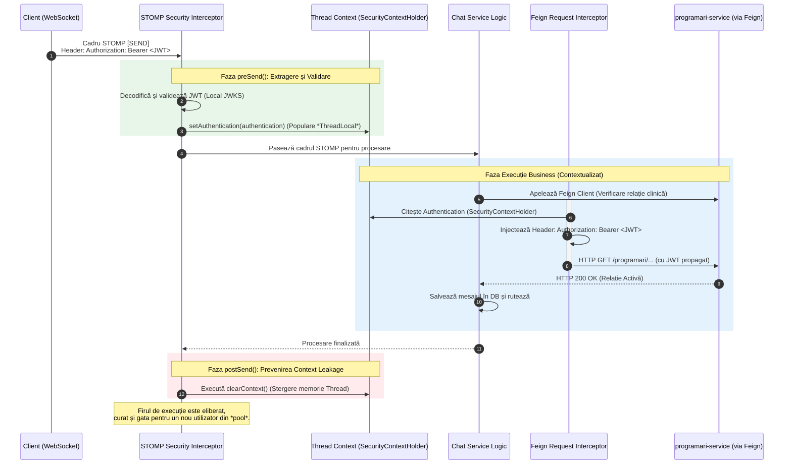

## 4.4 Modelul de securitate Zero-Trust distribuit   

Secțiunea curentă detaliază principiile de securitate aplicate în cadrul platformei KinetoCare, focalizându-se pe modelul *Zero-Trust* și validarea locală descentralizată a jetoanelor de acces. De asemenea, este documentată rezolvarea tehnică a securizării canalelor persistente de tip WebSocket/STOMP.

### 4.4.1 Principiul lipsei de încredere implicită (*de-perimeterization*)   
Arhitectura de securitate a platformei KinetoCare respinge modelul tradițional de securitate perimetrală — modelul „castel și șanț de apărare" — în favoarea paradigmei *Zero-Trust*. În sistemele distribuite clasice se asuma frecvent că o cerere care a traversat punctul unic de intrare și circulă în interiorul rețelei virtuale este implicit autentificată și sigură.   
Sistemul curent invalidează această premisă. Deși API *Gateway*-ul intermediază traficul și validează autentificarea la granița rețelei, microserviciile din aval nu deleagă responsabilitatea securității. Fiecare microserviciu acționează ca un server de resurse (*Resource Server*) distinct, validând independent și complet orice jeton *JWT* recepționat, fără a acorda încredere implicită rețelei interne.   

### 4.4.2 Descentralizarea validării criptografice (JWKS)   
Pentru a evita transformarea serverului de identitate (Keycloak) într-un blocaj de performanță (*bottleneck*) prin interogări sincrone la fiecare cerere, validarea identității se realizează descentralizat.   
Integrarea transparentă este facilitată de un mecanism de chei publice (*Public Key Infrastructure*). Fiecare serviciu de domeniu interoghează la pornire *endpoint*-ul expus de *Identity Provider* pentru a obține setul de chei publice (*JSON Web Key Set - JWKS*). Aceste chei sunt păstrate în memoria *cache* locală a microserviciului și sunt utilizate pentru a valida semnătura asimetrică (ex. algoritmul RS256) a jetoanelor extrase din antetul HTTP `Authorization: Bearer`.   
În urma verificării semnăturii criptografice, sistemul normalizează permisiunile: rolurile extrase din structura jetonului sunt traduse programatic într-un format standardizat, compatibil cu primitivele de evaluare ale sistemului de securitate local.   

### 4.4.3 Autorizare stratificată și Apărare în Profunzime (Defense in Depth)   
Controlul accesului pe bază de roluri (*RBAC*) este distribuit pe două straturi arhitecturale, cu obiectivul respingerii timpurii a cererilor neautorizate (*fail-fast*):   
- **Stratul de Margine (API *Gateway*):** Aplică o politică grosieră de filtrare. Are rolul de a bloca instantaneu traficul neautorizat și limitează expunerea rutelor cu potențial distructiv — operațiunile de modificare asupra cataloagelor clinice sunt rezervate exclusiv rolului de administrator, direct la poarta rețelei.   
- **Stratul de Domeniu (Microserviciul Local):** Odată ce o cerere validă a fost propagată în interior, serviciul destinație aplică evaluări de securitate direct la nivelul logicii de *business*, garantând că acțiunea specifică solicitată este permisă în contextul clinic actual al utilizatorului.   
   
### 4.4.4 Complexitatea securizării canalelor persistente (STOMP/WebSocket)   
Implementarea modelului *Zero-Trust* a generat o provocare arhitecturală critică în cadrul microserviciului de mesagerie în timp real (`chat-service`).   
**Problematica decalajului de protocol**   
Filtrele de securitate standard guvernează ciclul cerere-răspuns specific HTTP. În cazul comunicației *WebSocket*, interacțiunea debutează ca o cerere HTTP standard, suferă o tranziție de protocol (*HTTP 101 Switching Protocols*) și se transformă într-un canal TCP persistent și bidirecțional. Odată stabilit acest canal, comunicarea prin cadre *STOMP* ocolește complet lanțul tradițional de filtre HTTP de securitate.   
Această evaziune de protocol intră în conflict cu o regulă strictă de *business*: expedierea oricărui mesaj impune validarea activă a relației terapeutice printr-un apel sincron (prin OpenFeign) către `programari-service`. Mecanismul de comunicare inter-servicii se bazează pe extragerea jetonului de securitate din contextul firului de execuție (`*ThreadLocal*`). Deoarece cadrele *STOMP* ocolesc inițializarea de securitate HTTP, contextul firului rămâne vid, cauzând eșecul inevitabil al apelurilor de rețea subiacente cu eroarea `401 Unauthorized`.   
**Soluția tehnică: Interceptarea la nivel de protocol și curățarea contextului**   
Pentru a restabili lanțul de încredere, a fost proiectat un interceptor dedicat la nivelul canalului de mesaje *STOMP*:   
1. Faza de inspecție (`preSend`): La detectarea unor cadre critice de inițiere sau transmisie de date, interceptorul extrage jetonul *JWT* transmis explicit în antetele native ale protocolului *STOMP*.   
2. Re-inițializarea programatică a contextului: Jetonul este verificat criptografic local. Profilul de securitate rezultat este injectat în contextul firului de execuție curent (`SecurityContextHolder`), permițând tuturor funcționalităților din aval — inclusiv clienților Feign — să trateze cererea asincronă ca perfect autentificată.   
3. Faza de curățare critică (`postSend`): Deoarece motoarele de mesagerie reutilizează intensiv firele din *pool*-uri, un context de identitate lăsat atașat unui fir prezintă un risc de scurgere a identității (*context leakage*): un mesaj ulterior al altui utilizator ar putea fi procesat pe același fir, moștenind privilegiile primului. Pentru a elimina acest vector de atac, interceptorul execută o comandă de curățare completă a contextului (`clearContext`) imediat după procesarea fiecărui cadru, distrugând orice referință reziduală.   
   
### 4.4.5 Reprezentarea vizuală a securității asincrone (STOMP)   
Diagrama de mai jos ilustrează ciclul de viață al propagării și distrugerii contextului de securitate pe un canal TCP persistent, detaliind soluția implementată pentru prevenirea suprapunerii de identitate în arhitecturile reactive.   

