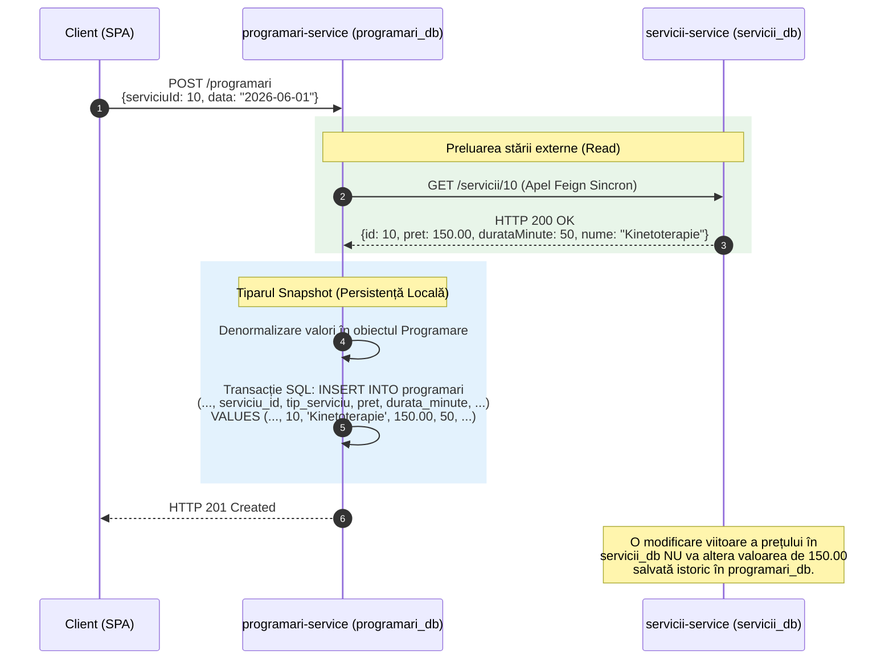

## 4.5 Izolarea datelor și modelul persistenței (Database-per-Service)

Această secțiune descrie decuplarea la nivel de persistență prin intermediul tiparului *Database-per-Service*, analizând beneficiile deciziei de izolare a bazelor de date. Totodată, sunt prezentate strategiile utilizate pentru menținerea integrității logice a datelor clinice și denormalizarea prin tiparul *Snapshot*.

### 4.5.1 Arhitectura descentralizată a stratului de date   
Platforma KinetoCare implementează riguros tiparul arhitectural *Database-per-Service*, distanțându-se de arhitecturile tradiționale monolitice în care o schemă relațională singulară deservește întregul ansamblu de module. Această decizie este fundamentală pentru garantarea autonomiei și independenței celor șapte microservicii de domeniu.   
La nivel de infrastructură, din considerente de optimizare a resurselor hardware alocate mediului curent, sistemul utilizează o instanță unică de server MySQL care găzduiește simultan șapte scheme logice izolate. Totuși, din punct de vedere arhitectural, granițele sunt impenetrabile: fiecare microserviciu deține propria configurație de conectare, tratând schema alocată ca pe o resursă fizică independentă. Este interzisă structural și procedural instanțierea unei conexiuni directe de la un serviciu către baza de date a altui sistem, precum și scrierea unor interogări SQL ce folosesc instrucțiuni de tip `JOIN` trans-schemă. Orice agregare de date inter-domenii se realizează exclusiv prin apeluri de rețea către contractele *API* oficiale.   

### 4.5.2 Beneficiile decuplării la nivel de domeniu   
Fragmentarea stratului de persistență generează avantaje arhitecturale esențiale pentru scalabilitatea și reziliența unei platforme clinice:   
- **Limitarea razei de impact (Fault Containment):** În situația compromiterii sau defectării unei resurse de stocare, sistemul intră într-o stare de degradare grațioasă, prevenind coruperea generalizată. De exemplu, dacă schema `chat_db` devine blocată sub trafic intens, procesul tranzacțional critic de planificare a ședințelor continuă neîntrerupt, fiind protejat de contextul bazei sale proprii, `programari_db`.   
- **Evoluția autonomă a schemelor:** Microserviciile pot itera asupra propriilor modele de date independent. Serviciul `servicii-service` poate adopta o structură nouă sau adăuga indecși fără ca migrarea să necesite coordonare cu celelalte echipe sau să afecteze disponibilitatea platformei.   
- **Partiționarea resurselor operaționale:** Cerințele concurente ale sistemului prezintă tipare asimetrice. Prin izolarea serviciilor, gestionarea grupurilor de conexiuni la baza de date prin HikariCP este partiționată. În consecință, un modul aflat sub stres intens (ex. un val de interogări de mesaje) nu epuizează fondul universal de conexiuni, permițând altor module operaționale (ex. raportările administrative) să funcționeze nealterat.   
   
### 4.5.3 Integritatea relațională prin chei externe logice   
O consecință directă a izolării schemelor este imposibilitatea aplicării constrângerilor de integritate referențială la nivelul motorului de baze de date — nu pot exista chei externe fizice (`FOREIGN KEY`) între scheme diferite. Pentru a menține asocierile semantice, arhitectura KinetoCare adoptă convenția cheilor externe logice.   
Pilonul central al acestei integrări este identificatorul universal furnizat de Identity Provider (`keycloakId`). Această cheie acționează ca un pivot distribuit stabil. Serviciul de programări stochează referințele `pacientKeycloakId` și `terapeutKeycloakId` ca șiruri de caractere de sine stătătoare. La momentul compunerii unei interfețe descriptive, componenta agregatoare lansează cereri către sursa absolută de adevăr a identității (`user-service`) pentru a rezolva datele vizuale (nume, gen). O abordare similară este utilizată pentru locațiile fizice (`locatieId`), stocate ca identificator abstract în fișa pacientului, cu validarea integrității delegată către `terapeuti-service`.   
Această convenție demonstrează eliminarea unei dependențe toxice specifice sistemelor monolitice: utilizarea identificatorilor primari incrementali locali (*auto-increment*), care nu posedă unicitate globală la nivelul sistemului distribuit și nu pot servi ca referință stabilă dincolo de granița propriei tabele.   
  
### 4.5.4 Denormalizarea controlată și tiparul Snapshot   
În absența operațiunilor SQL de tip `JOIN` inter-scheme, menținerea performanței și a trasabilității auditului impune adoptarea unei strategii intenționate de **denormalizare a datelor**.   
Implementarea curentă exemplifică această abordare prin aplicarea tiparului **Snapshot** (Fotografie la minut) în cadrul modulului `programari-service`. La momentul confirmării unei rezervări, sistemul interoghează sincron microserviciul catalogului (`servicii-service`), extrage valorile instantanee pentru atributele `pret`, `durataMinute` și `tipServiciu`, și le salvează ca atribute locale ale entității `Programare`.   
Această duplicare intenționată a datelor previne două categorii majore de deficiențe:   
- **Evitarea latenței redundante:** Elimină necesitatea unor cereri repetate pe rețea pentru randarea detaililor de bază ale unui slot rezervat în calendar.   
- **Garantarea imuabilității istorice și contabile:** Din perspectiva auditului clinic și financiar, o înregistrare tranzacționată trebuie să rămână inalterabilă. Dacă unitatea medicală modifică retroactiv tariful unui serviciu în nomenclator (ex. de la 150 RON la 180 RON), un `JOIN` dinamic ar corupe fișele financiare, afișând tarifele noi pentru ședințe efectuate în trecut. Tiparul *Snapshot* îngheață starea financiară exact la momentul tranzacției, reflectând exigențele contabile fundamentale.   
   
### 4.5.5 Reprezentarea vizuală a tiparului *Snapshot* în arhitectura distribuită   
Diagrama de mai jos ilustrează logic procesul de denormalizare controlată, demonstrând modul în care un identificator extern este translatat într-o înregistrare locală imutabilă pentru a garanta izolarea datelor și auditabilitatea istorică.   



### 4.5.6 Trasabilitatea modificărilor clinice și mecanismul de Audit Trail (GDPR)

Cerința non-funcțională §2.4.5 impune jurnalizarea automată a oricărei modificări aduse dosarului medical, cu marcaj temporal de precizie și identitatea operatorului. Această cerință este adresată printr-un mecanism de auditare JPA integrat la nivelul tuturor entităților clinice critice din platformă.

**Arhitectura prin moștenire: `BaseAuditableEntity`**

Mecanismul de auditare respectă principiul DRY prin centralizarea metadatelor de trasabilitate într-o super-clasă abstractă partajată, adnotată cu `@MappedSuperclass` și `@EntityListeners(AuditingEntityListener.class)`:

```java
@MappedSuperclass
@EntityListeners(AuditingEntityListener.class)
@SuperBuilder
@NoArgsConstructor
public abstract class BaseAuditableEntity {

    @CreatedBy
    @Column(name = "created_by", updatable = false, length = 36)
    private String createdBy;

    @LastModifiedBy
    @Column(name = "last_modified_by", length = 36)
    private String lastModifiedBy;

    @CreationTimestamp
    @Column(name = "created_at", nullable = false, updatable = false)
    private OffsetDateTime createdAt;

    @UpdateTimestamp
    @Column(name = "updated_at", nullable = false)
    private OffsetDateTime updatedAt;
}
```

Câmpurile `createdBy` și `lastModifiedBy` stochează UUID-ul Keycloak al operatorului autentificat (lungime fixă de 36 de caractere, corespunzătoare formatului UUID standard). Imutabilitatea câmpului `created_by` este garantată la nivel de schemă prin directiva `updatable = false`, prevenind retroactiv alterarea identității creatorului original al înregistrării.

**Integrarea cu contextul de securitate distribuit (`JpaAuditingConfig`)**

Fiecare microserviciu auditat expune un bean `AuditorAware<String>` care interoghează `SecurityContextHolder` la momentul fiecărei tranzacții JPA. Implementarea extrage identificatorul unic al operatorului din claim-ul `sub` al jetonului JWT Keycloak:

```java
@Bean
public AuditorAware<String> auditorProvider() {
    return () -> {
        Authentication auth = SecurityContextHolder.getContext().getAuthentication();
        if (auth == null || !auth.isAuthenticated()) return Optional.of("SYSTEM");
        Object principal = auth.getPrincipal();
        if (principal instanceof Jwt jwt) {
            String sub = jwt.getSubject();
            if (sub != null && !sub.isEmpty()) return Optional.of(sub);
        }
        return Optional.of("SYSTEM");
    };
}
```

Mecanismul de *fallback* automat la valoarea `"SYSTEM"` acoperă fluxurile asincrone de fundal (procesele `@Scheduled`, consumatorii RabbitMQ) în care nu există un context de autentificare HTTP activ, garantând că nicio înregistrare nu rămâne cu câmpul de audit gol.

**Acoperirea entităților auditate**

Mecanismul acoperă toate cele 11 entități tranzacționale și administrative din platformă, distribuite pe cinci microservicii:

| Microserviciu | Entități auditate |
|:---|:---|
| `programari-service` | `Programare`, `Evaluare`, `Evolutie`, `RelatiePacientTerapeut` |
| `pacienti-service` | `Pacient`, `JurnalPacient` |
| `servicii-service` | `Serviciu`, `TipServiciu` |
| `user-service` | `User` |
| `terapeuti-service` | `Terapeut`, `Locatie` |

Această acoperire garantează că orice modificare adusă unui diagnostic, unei note de evoluție, unui tarif de serviciu sau stării unui cont de utilizator este înregistrată cu marcaj temporal `OffsetDateTime` (cu fus orar) și identitatea UUID a operatorului, asigurând trasabilitatea completă a datelor clinice impusă de Regulamentul General privind Protecția Datelor (GDPR).
