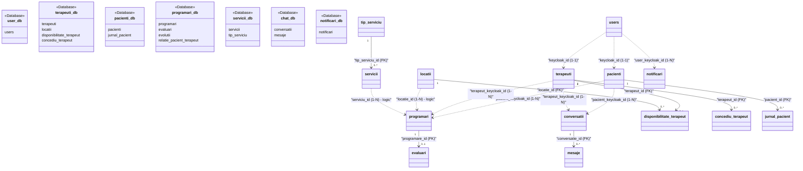

## 5.2 Modelul conceptual al datelor — harta schemelor

În conformitate cu principiile arhitecturii bazate pe microservicii și ale tiparului *Database-per-Service* (a cărui justificare arhitecturală este detaliată în secțiunea 4.5.1), datele platformei KinetoCare sunt distribuite în șapte scheme logice izolate, prezentate în această secțiune din perspectiva mapării lor logice.

### 5.2.1 Harta globală a schemelor

Harta conceptuală prezentată mai jos ilustrează cele șapte scheme de baze de date, tabelele principale găzduite de acestea și modul în care datele se corelează la nivel logic prin intermediul identificatorilor unici, depășind granițele fizice ale sistemelor de stocare:

### 5.2.2 Diferența dintre cheile externe fizice și referințele aplicative

Modelarea datelor într-un sistem distribuit impune o separare clară între mecanismele de integritate referențială utilizate, în funcție de granițele tranzacționale și logice ale componentelor:

1. **Cheile externe fizice (`FOREIGN KEY`):** Sunt utilizate exclusiv **în interiorul aceleiași scheme de bază de date** pentru a guverna relații puternic coezive. Sunt impuse la nivelul motorului de stocare MySQL InnoDB și garantează integritatea referențială rigidă (de exemplu, împiedică ștergerea unei conversații dacă există mesaje asociate acesteia, sau blochează salvarea unei disponibilități pentru un identificator de terapeut inexistent în tabela locală). Aceste relații beneficiază de suport tranzacțional ACID nativ și de cascade automate la nivel SQL (`ON DELETE CASCADE` / `RESTRICT`).

2. **Referințele aplicative** (*soft references* în literatura de specialitate): Sunt atribute simple (de regulă stocate sub formă de `VARCHAR(36)` sau `BIGINT`) utilizate pentru a asocia entități **aflate în scheme separate logic**, fără ca motorul SQL să poată valida sau impune aceste asocieri. Exemple reprezentative includ:
   - Referirea profilului de pacient (`pacienti_db.pacienti`) sau terapeut (`terapeuti_db.terapeuti`) la contul central de utilizator (`user_db.users`) prin identificatorul universal `keycloak_id`.
   - Corelarea programărilor (`programari_db.programari`) cu clinica fizică (`terapeuti_db.locatii`) prin modificatorul numeric `locatie_id`.
   - Corelarea ședințelor cu prețul standard din catalog prin `serviciu_id` (`servicii_db.servicii.id`).

Integritatea datelor la nivelul referințelor aplicative este o responsabilitate delegată în totalitate **straturilor de logică aplicativă** (prin cod Java în microservicii, care validează datele prin apeluri HTTP sincrone) și arhitecturilor orientate pe evenimente (unde evenimentele asincrone propagă modificările și aliniază stările componentelor *downstream*).

*Notă:* Justificarea arhitecturală a separării datelor este detaliată în §4.5; prezenta secțiune vizează exclusiv modelul de asamblare a datelor.
