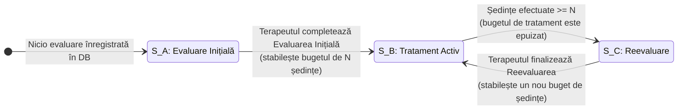

# Capitolul 6. Implementări Tehnice și Algoritmi de Decizie

Acest capitol descrie implementările detaliate ale algoritmilor și soluțiilor tehnice care stau la baza platformei KinetoCare. Sunt prezentate mecanismele decizionale din spatele traiectoriei clinice automatizate prin intermediul unui automat finit determinist, algoritmul lacom (*Greedy*) utilizat în generarea ferestrelor de disponibilitate și tehnicile de gestionare a partiționării temporale. De asemenea, sunt documentate propagarea contextului de securitate, agregarea asincronă a datelor clinice, implementarea tranzacțiilor compensatorii și topologia de mesagerie pe bază de cozi de carantină.

## 6.1 Automatul finit determinist pentru determinarea traiectoriei clinice

Această secțiune descrie implementarea automatului finit determinist responsabil cu modelarea și controlul traiectoriei clinice a pacientului pe parcursul etapelor terapeutice. Sunt detaliate stările clinice, tranzițiile automatizate ghidate de starea datelor din persistența locală și proprietățile de auto-ciclare ale sistemului.

### 6.1.1 Motivarea și problema clinică adresată   
Una dintre principalele provocări în managementul unui cabinet de fizioterapie și kinetoterapie constă în menținerea unei coerențe absolute între starea clinică reală a pacientului și serviciile medicale pentru care acesta este programat și facturat. În practica clinică tradițională, pacienții parcurg un ciclu terapeutic bine definit din punct de vedere metodologic: **evaluarea inițială** (în cadrul căreia se stabilesc diagnosticul funcțional, obiectivele și numărul recomandat de ședințe), **tratamentul activ** (ședințele propriu-zise de recuperare) și **reevaluarea clinică** (necesară la finalul pachetului de ședințe pentru a măsura progresul și a decide prelungirea, modificarea sau sistarea terapiei).   

Lăsarea selecției acestor servicii la latitudinea personalului administrativ sau a pacienților, în momentul rezervării unei programări, reprezintă o sursă majoră de erori operaționale și clinice:   
- **Ocolirea protocolului de siguranță:** Un pacient aflat la prima vizită poate fi programat direct la o ședință de tratament intens, fără a trece prin evaluarea inițială obligatorie. Acest lucru expune clinica la riscuri operaționale, deoarece terapeutul nu deține un diagnostic funcțional sau un istoric medical validat.   
- **Erori de facturare și decontare:** Un pacient care a finalizat numărul de ședințe recomandate poate continua să fie programat la ședințe de tratament standard, ocolind etapa de reevaluare. Acest comportament duce la stagnare terapeutică și la discrepanțe în fișa de decontare a asigurărilor sau a abonamentelor clinice.   
- **Încărcarea administrativă:** Corectarea manuală a tipurilor de servicii în urma depistării erorilor consumă timp din partea personalului clinicii, generând totodată confuzie în rândul pacienților.   
     
Sistemul propus elimină aceste riscuri în mod structural prin implementarea unui **automat finit determinist** (*Finite State Machine* — *FSM*) integrat direct în logica de *business* din `ProgramareService.determinaServiciulCorect()`. În loc ca tipul de serviciu să fie un parametru selectat manual în interfața grafică și transmis ca argument de către client, sistemul derivă automat serviciul corect pe server, în mod complet transparent, la fiecare inițiere a unei noi programări.   

### 6.1.2 Modelul conceptual al automatului finit clinic   
În ingineria software, un automat finit reprezintă un model de comportament compus dintr-un număr finit de stări, tranziții între aceste stări și acțiuni. În acest context, automatul determinist guvernează traiectoria pacientului prin trei stări clinice distincte, mutual exclusive:   
1. **Starea A — Evaluare Inițială:** Aceasta reprezintă starea de intrare în sistem pentru orice pacient nou. Pacientul nu are nicio evaluare înregistrată în baza de date. Singurul serviciu clinic permis și generat automat în această stare este cel de *Evaluare Inițială*.   
2. **Starea B — Tratament Activ:** Pacientul deține o fișă de evaluare clinică activă, iar numărul de ședințe de recuperare finalizate de la data acelei evaluări este strict inferior numărului de ședințe recomandate de terapeut. Serviciul clinic determinat automat corespunde exact procedurii specifice prescrise de terapeut în formularul de evaluare (de exemplu, *Kinetoterapie Adulți* sau *Kinetoterapie Pediatrică*).   
3. **Starea C — Reevaluare:** Pacientul are o evaluare înregistrată, însă a epuizat în întregime bugetul de ședințe alocat (numărul de ședințe finalizate este mai mare sau egal cu cota prescrisă de terapeut). În acest moment, sistemul blochează programarea la tratament standard și obligă efectuarea unei *Reevaluări*, serviciul clinic fiind comutat automat pe această procedură.   
     
Factorul declanșator al tranzițiilor este definit în mod dinamic prin evaluarea a doi indicatori persistenți din baza de date:   
- Existența sau absența unei înregistrări de tip `Evaluare` asociată identificatorului unic al pacientului.   
- Raportul matematic dintre ședințele efectiv realizate (cu statusul finalizat) și cele recomandate în cadrul ultimei evaluări active.   
     
### 6.1.3 Analiza detaliată a stărilor și implementarea tranzițiilor   
Logica de evaluare a automatului finit este executată sincron în interiorul graniței tranzacționale a metodei `creeazaProgramare`. Procesul decizional decurge în trei etape secvențiale:   

**Verificarea stării inițiale (Starea A).** La primirea unei cereri de programare, serviciul interoghează baza de date locală `programari_db` prin intermediul `evaluareRepository.findFirstByPacientKeycloakIdOrderByDataDesc(pacientKeycloakId)`. Dacă această interogare returnează un rezultat gol (`Optional.empty()`), se deduce că pacientul nu a beneficiat de nicio consultație în cadrul clinicii, încadrându-se în starea inițială **Starea A (Evaluare Inițială)**. Pentru a obține detaliile comerciale și operaționale ale acestui serviciu (preț, durată), `programari-service` efectuează un apel sincron prin *OpenFeign* către `servicii-service`, solicitând serviciul definit sub denumirea configurată în fișierele de proprietăți ale aplicației (`application.yml`):   
```java
serviciiClient.gasesteServiciuDupaNume(numeEvaluareInitiala)
```
Acest mecanism decuplează serviciul de programări de nomenclatorul de prețuri, asigurând respectarea principiului responsabilității unice.   

**Evaluarea progresului și starea de Reevaluare (Starea C).** Dacă istoricul returnează o evaluare existentă, sistemul trebuie să determine dacă pacientul a finalizat planul de tratament activ prescris anterior. Acest calcul este realizat prin interogarea bazei de date folosind o metodă optimizată, `countSedintePacientDupaData`. Interogarea *JPQL* (*Java Persistence Query Language*) este concepută defensiv pentru a asigura o contorizare extrem de strictă:   
```sql
SELECT COUNT(p) FROM Programare p
WHERE p.pacientKeycloakId = :pId
  AND p.status = 'FINALIZATA'
  AND p.areEvaluare = false
  AND p.data >= :dataRef
```
Fiecare clauză din această interogare joacă un rol critic în menținerea corectitudinii clinice:   
- `p.status = 'FINALIZATA'`: Sunt numărate exclusiv ședințele care s-au desfășurat cu succes și au fost confirmate de terapeut, excluzând programările viitoare și pe cele anulate.   
- `p.areEvaluare = false`: Această constrângere exclude din calcul chiar ședința în cadrul căreia a fost completat formularul de evaluare, prevenind consumarea eronată a planului terapeutic.   
- `p.data >= :dataRef`: Parametrul `:dataRef` reprezintă data la care a fost înregistrată ultima evaluare activă de către terapeut (`evaluare.getData()`), asigurând contorizarea exclusivă a ședințelor efectuate în baza planului curent.   
     
Dacă valoarea returnată de această interogare este mai mare sau egală cu `evaluare.getSedinteRecomandate()`, automatul determinist tranzitează în **Starea C (Reevaluare)**. Similar stării A, sistemul apelează prin *OpenFeign* serviciul de reevaluare, obligând pacientul să rezerve acest tip de serviciu.   

**Starea de Tratament Activ (Starea B).** În cazul în care evaluarea există, iar numărul de ședințe finalizate este strict mai mic decât cota recomandată, pacientul se află în plin proces de recuperare, corespunzător **Stării B (Tratament Activ)**. În această stare, sistemul preia identificatorul serviciului recomandat direct din corpul ultimei evaluări active (`evaluare.getServiciuRecomandatId()`) și îl utilizează pentru a efectua apelul de îmbogățire a datelor:   
```java
serviciiClient.getServiciuById(evaluare.getServiciuRecomandatId())
```
Acest comportament garantează că pacientul este programat exact la tipul de tratament prescris în mod personalizat de către kinetoterapeutul evaluator, eliminând erorile umane de configurare.   

### 6.1.4 Diagrama de tranziție a automatului clinic   
Tranziția între stările automatului este modelată vizual în diagrama de mai jos:   



### 6.1.5 Proprietatea de auto-ciclare și reziliența datelor   
O caracteristică arhitecturală importantă a acestui *FSM* este proprietatea de **auto-ciclare** (*self-cycling*). Sistemul nu converge spre o stare finală stabilă și definitivă. La atingerea stării de *Reevaluare* (Starea C), în momentul în care terapeutul finalizează ședința respectivă și completează un nou formular clinic de evaluare, o nouă entitate `Evaluare` este salvată în baza de date cu o dată de referință proaspătă (`dataRef` actualizat).   

Această acțiune resetează contextul computațional al interogării `countSedintePacientDupaData`. La următoarea rulare a algoritmului, numărul de ședințe efectuate după noua dată de referință va fi `0`, ceea ce determină automatul să reintre în starea de **Tratament Activ (Starea B)**, ghidat de noul plan terapeutic.   

Comportamentul este condus în totalitate de starea datelor persistate, nu de variabile volatile stocate în memoria de lucru a serverului de aplicații (cum ar fi sesiunile HTTP). Acest detaliu oferă sistemului avantaje majore în producție:   
- **Idempotență structurală:** Oricâte reporniri, căderi sau scalări orizontale ar suferi microserviciul `programari-service`, starea traiectoriei unui pacient nu va fi coruptă, ea fiind calculată dinamic pe baza înregistrărilor imutabile din baza de date la fiecare interogare.   
- **Consistență bazată pe date:** Traiectoria clinică reflectă starea reală a dosarului clinic în timp real, eliminând riscul desincronizării stării pacientului față de baza de date.   
    
Această decizie de design garantează că tranziția de stare este guvernată exclusiv de tranzacțiile de *business* persistate în baza de date.   
