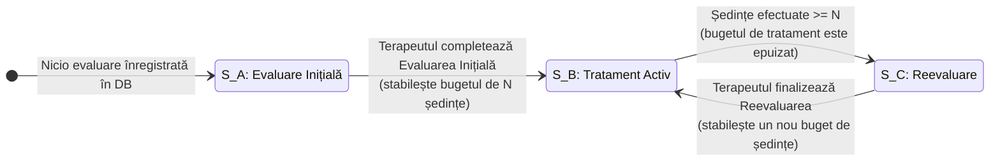

# Capitolul 6. Implementări Tehnice și Algoritmi de Decizie

Acest capitol descrie implementările detaliate ale algoritmilor și soluțiilor tehnice care stau la baza platformei KinetoCare. Sunt prezentate mecanismele decizionale din spatele traiectoriei clinice automatizate prin intermediul unui automat finit determinist, algoritmul de tip *Greedy* utilizat în generarea ferestrelor de disponibilitate și tehnicile de gestionare a partiționării temporale. De asemenea, sunt documentate propagarea contextului de securitate, agregarea asincronă a datelor clinice, implementarea tranzacțiilor compensatorii și topologia de mesagerie pe bază de cozi de carantină.

## 6.1 Automatul finit determinist pentru determinarea traiectoriei clinice

Această secțiune descrie implementarea automatului finit determinist responsabil cu modelarea și controlul traiectoriei clinice a pacientului pe parcursul etapelor terapeutice. Sunt detaliate stările clinice, tranzițiile automatizate ghidate de starea datelor din persistența locală și proprietățile de auto-ciclare ale sistemului.

### 6.1.1 Motivarea și problema clinică adresată

Una dintre provocările centrale în managementul unui cabinet de fizioterapie și kinetoterapie constă în menținerea coerenței absolute între starea clinică reală a pacientului și serviciile medicale pentru care acesta este programat și facturat. În practica clinică tradițională, pacienții parcurg un ciclu terapeutic bine definit din punct de vedere metodologic: **evaluarea inițială** (în cadrul căreia se stabilesc diagnosticul funcțional, obiectivele și numărul recomandat de ședințe), **tratamentul activ** (ședințele propriu-zise de recuperare) și **reevaluarea clinică** (necesară la finalul pachetului de ședințe pentru a măsura progresul și a decide prelungirea, modificarea sau sistarea terapiei).

Lăsarea selecției acestor servicii la latitudinea personalului administrativ sau a pacienților, în momentul rezervării unei programări, constituie o sursă majoră de erori operaționale și clinice:

- **Ocolirea protocolului de siguranță:** Un pacient aflat la prima vizită poate fi programat direct la o ședință de tratament intens, fără a trece prin evaluarea inițială obligatorie, expunând clinica la riscuri operaționale deoarece terapeutul nu deține un diagnostic funcțional sau un istoric medical validat.
- **Erori de facturare și decontare:** Un pacient care a finalizat numărul de ședințe recomandate poate continua să fie programat la ședințe de tratament standard, ocolind etapa de reevaluare, ceea ce duce la stagnare terapeutică și la discrepanțe în fișa de decontare.
- **Încărcarea administrativă:** Corectarea manuală a tipurilor de servicii, în urma depistării erorilor, consumă resurse de personal și generează confuzie în rândul pacienților.

Aceste riscuri sunt eliminate structural prin implementarea unui **automat finit determinist** (*Finite State Machine* — *FSM*) integrat direct în logica de *business* din metoda `ProgramareService.determinaServiciulCorect()`. Tipul de serviciu nu mai reprezintă un parametru selectat manual în interfața grafică, ci este derivat automat pe server, în mod transparent față de client, la fiecare inițiere a unei noi programări.

### 6.1.2 Modelul conceptual al automatului finit clinic

În ingineria software, un automat finit reprezintă un model de comportament compus dintr-un număr finit de stări, tranziții între acestea și acțiuni asociate. Automatul determinist guvernează traiectoria pacientului prin trei stări clinice distincte și mutual exclusive:

1. **Starea A — Evaluare Inițială:** Reprezintă starea de intrare în sistem pentru orice pacient nou. Pacientul nu are nicio evaluare înregistrată în baza de date. Singurul serviciu clinic permis și generat automat în această stare este cel de *Evaluare Inițială*.
2. **Starea B — Tratament Activ:** Pacientul deține o fișă de evaluare clinică activă, iar numărul de ședințe de recuperare finalizate de la data acelei evaluări este strict inferior numărului de ședințe recomandate de terapeut. Serviciul clinic determinat automat corespunde exact procedurii specifice prescrise de terapeut în formularul de evaluare (de exemplu, *Kinetoterapie Adulți* sau *Kinetoterapie Pediatrică*).
3. **Starea C — Reevaluare:** Pacientul are o evaluare înregistrată, însă a epuizat în întregime bugetul de ședințe alocat (numărul de ședințe finalizate este mai mare sau egal cu cota prescrisă). În acest moment, programarea la tratament standard este blocată, iar serviciul clinic este comutat automat pe procedura de *Reevaluare*.

Factorul declanșator al tranzițiilor este definit dinamic prin evaluarea a doi indicatori persistenți din baza de date:

- Existența sau absența unei înregistrări de tip `Evaluare` asociată identificatorului unic al pacientului.
- Raportul matematic dintre ședințele efectiv realizate (cu statusul finalizat) și cele recomandate în cadrul ultimei evaluări active.

### 6.1.3 Analiza detaliată a stărilor și implementarea tranzițiilor

Logica de evaluare a automatului finit este executată sincron în interiorul graniței tranzacționale a metodei `creeazaProgramare`. Procesul decizional se desfășoară în trei etape secvențiale:

**Verificarea stării inițiale (Starea A).** La primirea unei cereri de programare, baza de date locală `programari_db` este interogată prin `evaluareRepository.findFirstByPacientKeycloakIdOrderByDataDesc(pacientKeycloakId)`. Dacă această interogare returnează un rezultat gol (`Optional.empty()`), se deduce că pacientul nu a beneficiat de nicio consultație în cadrul clinicii, încadrându-se în **Starea A (Evaluare Inițială)**. Pentru a obține detaliile comerciale și operaționale ale acestui serviciu (preț, durată), `programari-service` efectuează un apel sincron prin *OpenFeign* către `servicii-service`, solicitând serviciul definit sub denumirea configurată în fișierele de proprietăți ale aplicației:

```java
serviciiClient.gasesteServiciuDupaNume(numeEvaluareInitiala)
```

Acest mecanism decuplează componenta de programări de nomenclatorul de prețuri, asigurând respectarea principiului responsabilității unice.

**Evaluarea progresului și tranziția în Starea C.** Dacă istoricul returnează o evaluare existentă, este determinat dacă pacientul a finalizat planul de tratament activ prescris anterior. Calculul se realizează prin interogarea bazei de date cu metoda optimizată `countSedintePacientDupaData`. Interogarea *JPQL* (*Java Persistence Query Language*) este formulată defensiv pentru a asigura o contorizare clinică strictă:

```sql
SELECT COUNT(p) FROM Programare p
WHERE p.pacientKeycloakId = :pId
  AND p.status = 'FINALIZATA'
  AND p.areEvaluare = false
  AND p.data >= :dataRef
```

Fiecare clauză joacă un rol critic în menținerea corectitudinii clinice:

- `p.status = 'FINALIZATA'`: Sunt numărate exclusiv ședințele care s-au desfășurat cu succes și au fost confirmate de terapeut, excluzând programările viitoare și pe cele anulate.
- `p.areEvaluare = false`: Această constrângere exclude din calcul chiar ședința în cadrul căreia a fost completat formularul de evaluare, prevenind consumarea eronată a planului terapeutic.
- `p.data >= :dataRef`: Parametrul `:dataRef` reprezintă data la care a fost înregistrată ultima evaluare activă (`evaluare.getData()`), asigurând contorizarea exclusivă a ședințelor efectuate în baza planului curent.

Dacă valoarea returnată este mai mare sau egală cu `evaluare.getSedinteRecomandate()`, automatul tranzitează în **Starea C (Reevaluare)**. Similar Stării A, serviciul de reevaluare este apelat prin *OpenFeign*, obligând pacientul să rezerve acest tip de procedură.

**Starea de Tratament Activ (Starea B).** În cazul în care evaluarea există, iar numărul de ședințe finalizate este strict mai mic decât cota recomandată, pacientul se află în plin proces de recuperare, corespunzând **Stării B (Tratament Activ)**. Identificatorul serviciului recomandat este preluat direct din corpul ultimei evaluări active (`evaluare.getServiciuRecomandatId()`) și utilizat pentru îmbogățirea datelor:

```java
serviciiClient.getServiciuById(evaluare.getServiciuRecomandatId())
```

Prin acest mecanism, pacientul este programat exact la tipul de tratament prescris personalizat de kinetoterapeutul evaluator, eliminând erorile umane de configurare.

### 6.1.4 Diagrama de tranziție a automatului clinic

Tranziția între stările automatului este modelată vizual în diagrama de mai jos:


```mermaid
stateDiagram-v2
    direction LR

    [*] --> EvaluareInitiala : Nicio evaluare înregistrată în DB

    EvaluareInitiala --> TratamentActiv : Terapeutul completează Evaluarea Inițială<br/>(stabilește bugetul de N ședințe)

    TratamentActiv --> Reevaluare : Ședințe efectuate >= N<br/>(bugetul de tratament este epuizat)

    Reevaluare --> TratamentActiv : Terapeutul finalizează Reevaluarea<br/>(stabilește un nou buget de ședințe)

    state "S_A: Evaluare Inițială" as EvaluareInitiala
    state "S_B: Tratament Activ" as TratamentActiv
    state "S_C: Reevaluare" as Reevaluare
```

### 6.1.5 Proprietatea de auto-ciclare și reziliența datelor

O caracteristică arhitecturală importantă a acestui *FSM* este proprietatea de **auto-ciclare** (*self-cycling*). Sistemul nu converge spre o stare finală stabilă și definitivă. La atingerea Stării C, în momentul în care terapeutul finalizează ședința respectivă și completează un nou formular clinic de evaluare, o nouă entitate `Evaluare` este salvată în baza de date cu o dată de referință proaspătă (`dataRef` actualizat).

Această acțiune resetează contextul computațional al interogării `countSedintePacientDupaData`. La următoarea rulare a algoritmului, numărul de ședințe efectuate după noua dată de referință va fi `0`, determinând automatul să reintre în **Starea B (Tratament Activ)**, ghidat de noul plan terapeutic.

Comportamentul este guvernat în totalitate de starea datelor persistate, nu de variabile volatile stocate în memoria de lucru a serverului de aplicații. Această decizie de proiectare conferă sistemului avantaje esențiale în producție:

- **Idempotență structurală:** Oricâte reporniri, căderi sau scalări orizontale ar afecta microserviciul `programari-service`, starea traiectoriei unui pacient nu va fi coruptă, ea fiind calculată dinamic pe baza înregistrărilor imutabile din baza de date la fiecare interogare.
- **Consistență bazată pe date:** Traiectoria clinică reflectă starea reală a dosarului în timp real, eliminând riscul desincronizării față de baza de date.
