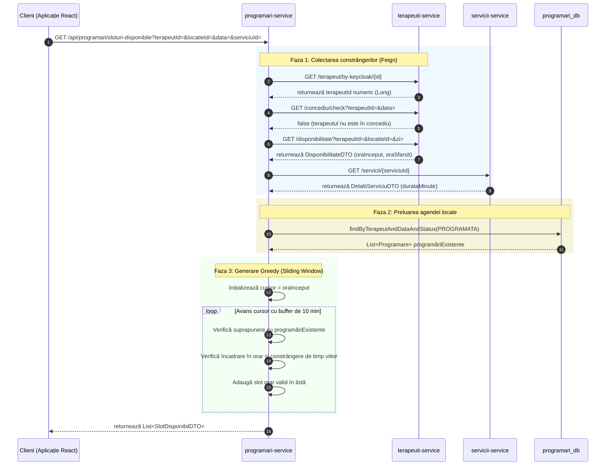

## 6.2 Algoritmul Greedy de generare a ferestrelor de disponibilitate terapeutică

În această secțiune este prezentat algoritmul de tip *greedy* utilizat pentru determinarea și generarea sloturilor orare disponibile în agenda terapeuților. Sunt analizate fazele premergătoare de colectare a constrângerilor, implementarea logicii bazate pe ferestre glisante cronologice și evaluarea complexității asimptotice.

### 6.2.1 Enunțul problemei de planificare clinică   
Generarea automată a intervalelor de timp disponibile (sloturi orare) reprezintă una dintre cele mai solicitante funcționalități din punct de vedere computațional dintr-un sistem de management clinic. Problema constă în determinarea tuturor intervalelor orare în care un pacient poate efectua o rezervare validă, fiind dat un terapeut specific, o locație fizică a clinicii, o dată calendaristică și un serviciu clinic solicitat (care are o durată specifică exprimată în minute).   
Pentru ca un slot orar să fie considerat valid, acesta trebuie să satisfacă simultan un set de constrângeri operaționale:   
- să se încadreze în programul de lucru activ al terapeutului pentru acea zi și locație;   
- să nu se suprapună cu perioadele de concediu înregistrate ale terapeutului;   
- să nu se suprapună cu nicio programare activă existentă în agenda terapeutului;   
- dacă ziua solicitată este ziua curentă, sloturile propuse trebuie să se afle în viitor.   
    
Soluția implementată, localizată în metoda `ProgramareService.getSloturiDisponibile()`, abordează această problemă prin paradigma **algoritmilor *greedy***. Algoritmul generează sloturile candidate în ordine strict cronologică, evaluează conformitatea fiecăruia cu setul de constrângeri și emite sau respinge slotul pe loc, fără a fi necesar un mecanism de *backtracking*, asigurând un timp de răspuns extrem de rapid în interfața utilizatorului.   

### 6.2.2 Fazele premergătoare: Colectarea defensivă a constrângerilor   
O decizie de design arhitectural constă în centralizarea și executarea tuturor apelurilor către alte microservicii *înainte* de intrarea în bucla principală de generare a sloturilor. Această strategie de tip *fail-fast* (respingere timpurie a cererilor) previne lansarea unor calcule inutile pe server și elimină riscul generării unui comportament de tip *N+1 network requests* (apelarea unui serviciu extern în interiorul unei bucle). Colectarea constrângerilor se desfășoară în cinci pași secvențiali:   
**Translația de identitate a terapeutului.** Metoda expusă primește `terapeutKeycloakId` (UUID). Deoarece serviciul de personal utilizează o cheie primară numerică (`Long`), se efectuează un apel sincron prin *OpenFeign*: `terapeutiClient.getTerapeutByKeycloakId(terapeutKeycloakId)` pentru a extrage `terapeutId`-ul numeric intern.   
**Verificarea stării de concediu (*short-circuit*).** Sistemul interoghează `terapeuti-service` pentru a verifica dacă data solicitată se suprapune cu un concediu aprobat al terapeutului:   
```sql
SELECT COUNT(c) > 0 FROM ConcediuTerapeut c
WHERE c.terapeutId = :terapeutId
  AND c.dataInceput <= :dataStart
  AND c.dataSfarsit >= :dataEnd
```
Dacă rezultatul este afirmativ, metoda se oprește instantaneu și returnează o listă goală (`List.of()`), evitând alte interogări sau apeluri de rețea.   
**Preluarea programului de lucru.** Sistemul solicită orarul specific terapeutului pentru locația selectată și ziua din săptămână corespunzătoare datei cerute: `terapeutiClient.getOrar(terapeutId, locatieId, ziSaptamana)`. Dacă terapeutul nu are definit un program activ, se returnează o listă vidă.   
**Determinarea duratei procedurii.** Prin intermediul `serviciiClient.getServiciuById(serviciuId)`, se obține durata în minute a serviciului solicitat (`durataMinute`), necesară calculării ferestrelor de timp.   
**Extragerea blocajelor din agenda existentă.** În final, sistemul interoghează baza de date locală `programari_db` pentru a obține toate rezervările deja confirmate ale terapeutului din acea zi: `programareRepository.findByTerapeutKeycloakIdAndDataAndStatus(terapeutKeycloakId, data, StatusProgramare.PROGRAMATA)`. Programările anulate sunt ignorate complet, eliberând automat intervalele pe care le ocupau.   

### 6.2.3 Nucleul algoritmului: Fereastra glisantă cronologică   
După ce toate datele de intrare și constrângerile au fost colectate, algoritmul *greedy* inițializează un cursor temporal setat la ora de început a programului terapeutului (`orar.oraInceput()`). Logica de funcționare a ferestrei glisante (*sliding window cursor*) este descrisă în următorul algoritm conceptual:   
```text
cursor = orar.oraInceput()
oraSfarsitZi = orar.oraSfarsit()

CÂT TIMP (cursor + durataServiciu) <= oraSfarsitZi EXECUTĂ:
    slotInceput = cursor
    slotSfarsit = cursor + durataServiciu
    
    DACĂ esteLiber(slotInceput, slotSfarsit, programariExistente)
          ȘI (data solicitată NU este AZI SAU slotInceput > oraCurentă) ATUNCI:
          
          EMITE SlotDisponibilDTO(slotInceput, slotSfarsit)
    SFÂRȘIT DACĂ
    
    cursor = slotInceput + durataServiciu + 10 minute (buffer)
SFÂRȘIT CÂT TIMP
```
Adăugarea constantă a unui *buffer* de **10 minute** după finalul fiecărui slot generat (`durataServiciu + 10`) răspunde unor necesități clinice reale: asigură timpul necesar igienizării echipamentelor și saltelelor între pacienți, previne aglomerarea sălii de așteptare și oferă terapeutului o fereastră scurtă pentru redactarea notelor medicale zilnice direct în sistem.   
Pentru a stabili dacă slotul candidat se suprapune cu o programare existentă, algoritmul utilizează testul clasic de intersecție a două intervale $[A, B)$ și $[C, D)$. Două intervale se intersectează dacă startul primului este înainte de sfârșitul celui de-al doilea, iar sfârșitul primului este după startul celui de-al doilea:   
```java
slotInceput.isBefore(p.getOraSfarsit()) && slotSfarsit.isAfter(p.getOraInceput())
```
Dacă această condiție este evaluată ca adevărată pentru oricare dintre programările existente din agendă, slotul candidat este respins instantaneu, iar cursorul avansează.   

### 6.2.4 Diagrama de secvență a generării de sloturi   
Fluxul de comunicare inter-servicii și calculul local sunt reprezentate în următoarea diagramă de secvență:   



### 6.2.5 Analiza complexității asimptotice și decizia de design   
Sinteza complexității algoritmice este structurată în tabelul de mai jos:   
|                Dimensiune |          Simbol |                                                                                             Valoare clinică tipică |
|:---------------------------------|:-----------------------|:--------------------------------------------------------------------------------------------------------------------------|
|     **Sloturi candidate** |             $S$ |      $\approx 8$ sloturi candidate (determinat de programul zilnic de 8 ore împărțit la durata ședinței + *buffer*). |
|  **Programări existente** |             $N$ |                                            $< 10$ programări pe zi (numărul maxim de pacienți pe zi per terapeut). |
|     **Complexitate Timp** | $O(S \times N)$ |                                                                                Câteva zeci de operații elementare. |
|         **Apeluri Rețea** |             Fix |                                            4 apeluri Feign (sau 2–4 în caz de scurtcircuitare la concediu). |

Complexitatea $O(S \times N)$ se traduce în câteva zeci de operații elementare pentru parametrii clinici tipici, algoritmul fiind practic nesemnificativ ca *overhead* față de latența apelurilor *OpenFeign* din faza anterioară.   

**Justificarea alegerii algoritmului**   
Căutarea *greedy* cronologică acoperă optim cerința de afișare a sloturilor disponibile din punct de vedere informativ. Nu este necesar un algoritm de programare dinamică, deoarece nu se urmărește maximizarea unei valori globale (precum profitul sau rata de ocupare), ci prezentarea obiectivă a tuturor opțiunilor valide. De asemenea, *backtracking*-ul nu se justifică, deoarece fiecare slot candidat este independent; validitatea unui interval orar nu este influențată de deciziile luate pentru restul sloturilor.   

### 6.2.6 Toleranța defensivă la absența datelor   
O atenție deosebită a fost acordată comportamentului sistemului în cazul lipsei configurațiilor administrative sau a concediilor. În loc ca interfața să returneze o eroare de sistem (*500 Internal Server Error*) atunci când un terapeut nu are programul definit în `terapeuti-service`, apelurile externe sunt protejate prin interceptări silențioase de excepții.   
Sistemul prinde erorile de rețea sau de date lipsă și face un *graceful short-circuit* (scurtcircuitare controlată), returnând un răspuns de tip *array* gol `[]`. Comportamentul de *short-circuit* reflectă același principiu de degradare grațioasă, unde indisponibilitatea unui serviciu secundar nu blochează funcționalitatea principală.
