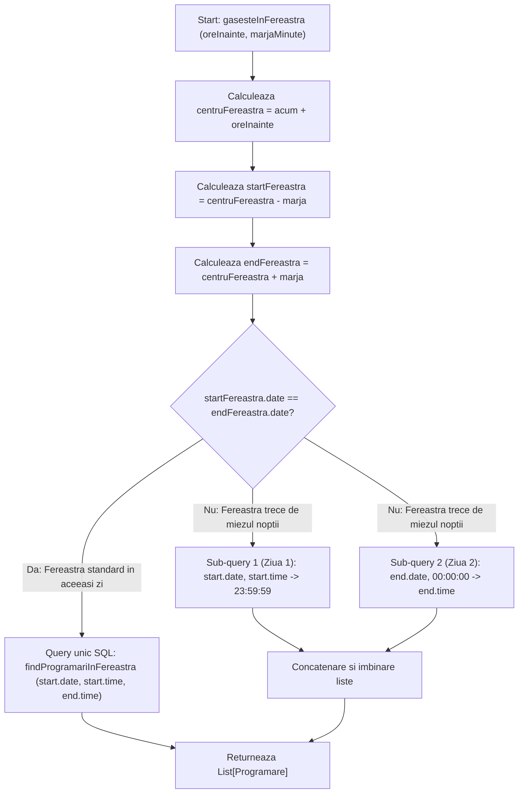

## 6.3 Gestionarea Partiționării Temporale la Granița Zilei în Planificatorul de Remindere

Această secțiune analizează provocările logice asociate traversării graniței de la miezul nopții în cadrul sistemelor de planificare temporară. Este prezentată strategia de partiționare binară implementată la nivelul componentelor de remindere pentru a asigura o alertare proactivă robustă și continuă, prevenind omiterea programărilor situate la limita dintre două zile calendaristice consecutive.

### 6.3.1 Contextul și motivarea problemei: Proiectarea defensivă și granița temporală

În asistența medicală modernă, alertarea proactivă a pacienților cu privire la programările viitoare are ca scop reducerea ratei de absenteism, eficientizarea agendei terapeuților și sporirea aderenței la planul de tratament kinetoterapeutic. Sistemul utilizează un planificator automatizat bazat pe servicii *cron* în cadrul componentei `ReminderScheduler` (parte din `programari-service`), responsabil cu transmiterea alertelor în două momente cheie: cu 24 de ore înaintea programării și, respectiv, cu 2 ore înainte.

Proiectarea unui planificator de remindere medical robust implică gestionarea unui caz-limită structural: traversarea graniței calendaristice la miezul nopții. Această problemă, denumită în literatura de inginerie software *midnight boundary problem*, generează interogări SQL incorect din punct de vedere logic, cu efecte observabile exclusiv în mediul de producție, la ore nocturne — ceea ce o face dificil de detectat prin suite standard de testare funcțională.

În ingineria software, sistemele de nivel *enterprise* sunt proiectate conform principiului **proiectării defensive** (*defensive design*), fiind capabile să funcționeze corect indiferent de scenariile operaționale — incluzând teoretic clinici cu program prelungit, ture de noapte, gărzi de 24/7 sau decalaje orare la nivel de server.

De exemplu, dacă jobul rulează pe data de 29 mai la ora 23:55, fereastra sa de căutare pentru reminderul de 24 de ore vizează programările din jurul orei 23:55 a zilei de 30 mai. Cu o marjă de ±15 minute, fereastra devine [30 mai 23:40 — 31 mai 00:10]. Limita superioară a depășit granița zilei de 30 mai, extinzându-se în primele minute ale zilei de 31 mai — aceasta este granița pe care interogarea standard SQL nu o poate gestiona într-un mod corect.

### 6.3.2 Eșecul logic al interogării SQL standard (Naive Query)

O abordare de implementare naivă ar formula o singură interogare în baza de date cu clauza standard SQL `BETWEEN`:

```sql
SELECT * FROM programari
WHERE data = :ziTarget
  AND ora_inceput BETWEEN :startFereastra AND :endFereastra
  AND status = 'PROGRAMATA'
```

În scenariul de mai sus, parametrii ar fi înlocuiți astfel:
`ora_inceput BETWEEN '23:40:00' AND '00:10:00'`

Din punct de vedere logic, această condiție aplicată asupra unei coloane de tip `LocalTime` (sau `TIME` în baza de date) reprezintă o imposibilitate matematică. Deoarece `LocalTime` reprezintă o valoare orară dintr-o singură zi calendaristică, cu domeniu cuprins în intervalul [00:00:00, 23:59:59.999], valoarea `00:10:00` este strict mai mică decât `23:40:00`.

Motorul SQL va evalua expresia `23:40 <= ora_inceput AND ora_inceput <= 00:10` ca fiind falsă pentru fiecare rând din tabelă. Interogarea va returna constant un set gol, determinând omiterea transmiterii reminderului pentru pacientul programat la ora 00:15 în ziua următoare, deși rezervarea este validă.

### 6.3.3 Soluția de partiționare binară a ferestrei

Pentru a elimina această limitare temporală, clasa `ReminderScheduler` implementează o strategie de **partiționare binară a ferestrei de interogare**. Înainte de a interoga baza de date, sistemul calculează datele calendaristice asociate celor două extreme ale ferestrei (`startFereastra` și `endFereastra`), care sunt obiecte de tip `LocalDateTime`.

Algoritmul de decizie funcționează după cum urmează:

**Evaluarea graniței.** Verifică dacă data calendaristică a startului ferestrei este identică cu data sfârșitului ferestrei:

```java
startFereastra.toLocalDate().equals(endFereastra.toLocalDate())
```

**Cazul Standard (Fereastră Monolit).** Dacă datele sunt egale, întreaga fereastră de căutare se află în interiorul aceleiași zile calendaristice. Sistemul lansează o singură interogare SQL standard utilizând orele extrase direct.

**Cazul de Graniță (Partiționare Binară).** Dacă datele diferă (sfârșitul ferestrei a trecut în ziua următoare), sistemul divide intervalul în două sub-interogări logice complementare:

- **Sub-fereastra 1 (Ziua 1):** Caută în prima zi (ziua de start), în intervalul cuprins între ora de start și sfârșitul absolut al zilei, folosind constanta standard `LocalTime.MAX`: `[startFereastra.toLocalTime(), LocalTime.MAX]`.
- **Sub-fereastra 2 (Ziua 2):** Caută în a doua zi (ziua de sfârșit), în intervalul cuprins între începutul absolut al zilei (miezul nopții), folosind constanta `LocalTime.MIN`, până la ora de sfârșit a ferestrei: `[LocalTime.MIN, endFereastra.toLocalTime()]`.

**Îmbinare.** Cele două liste de programări rezultate sunt concatenate într-o singură colecție Java și returnate către motorul de alertare.

Codul Java implementat în `ReminderScheduler` reflectă această logică:

```java
if (startFereastra.toLocalDate().equals(endFereastra.toLocalDate())) {
    return programareRepository.findProgramariInFereastra(
        startFereastra.toLocalDate(),
        startFereastra.toLocalTime(),
        endFereastra.toLocalTime()
    );
}

List<Programare> rezultat = new ArrayList<>();
// Sub-interogarea 1: De la ora de start pana la miezul noptii (sfarsitul absolut al Zilei 1)
rezultat.addAll(programareRepository.findProgramariInFereastra(
    startFereastra.toLocalDate(),
    startFereastra.toLocalTime(),
    LocalTime.MAX
));

// Sub-interogarea 2: De la miezul noptii (inceputul absolut al Zilei 2) pana la ora de sfarsit
rezultat.addAll(programareRepository.findProgramariInFereastra(
    endFereastra.toLocalDate(),
    LocalTime.MIN,
    endFereastra.toLocalTime()
));

return rezultat;
```

### 6.3.4 Diagrama de decizie a partiționării temporale

Modul în care sistemul evaluează și divide fereastra temporală la rularea planificatorului (*scheduler*) este ilustrat în diagrama de mai jos:



### 6.3.5 Frecvența scheduler-ului și marja de siguranță

Configurarea perioadelor de execuție a joburilor *cron* și a marjelor de căutare respectă o regulă de acoperire matematică pentru a preveni omiterea oricărei programări. Parametrii de configurare sunt structurați în tabelul următor:

| Tip Reminder | Frecvență Rulare *cron* | Fereastră Țintă | Marjă de Căutare | Acoperire Totală Fereastră |
| :--- | :--- | :--- | :--- | :--- |
| **Reminder 24h** | Din 30 în 30 de minute | `acum + 24 ore` | ±15 minute | 30 de minute (de la -15 la +15) |
| **Reminder 2h** | Din 15 în 15 de minute | `acum + 2 ore` | ±8 minute | 16 minute (de la -8 la +8) |

**Principiul de acoperire a ferestrei**

Pentru a garanta din punct de vedere matematic că nicio programare nu este omisă între două execuții ale planificatorului, marja de căutare trebuie să acopere cel puțin jumătate din perioada de execuție a jobului. Acest raționament poate fi formalizat prin următoarea inegalitate:

$$\text{Marjă de căutare} \geq \frac{\text{Frecvența de rulare a jobului}}{2}$$

În cazul reminderului de 24 de ore, unde jobul rulează la fiecare 30 de minute (de exemplu la 14:00, 14:30, 15:00), o marjă de ±15 minute satisface această condiție. Execuția de la ora 14:30 va scana intervalul de programări cuprins între 14:15 și 14:45 a zilei următoare, în timp ce execuția de la 15:00 va scana intervalul 14:45–15:15. Astfel, indiferent de momentul în care un pacient deține o programare, aceasta va fi scanată și detectată de o singură rulare a planificatorului, eliminând zonele oarbe temporal.

### 6.3.6 Concluzii privind arhitectura temporal-defensivă

Problema miezului nopții în planificatoarele temporale reprezintă un caz limită structural care poate evita cu ușurință suitele standard de testare funcțională. Fără o tratare defensivă explicită, anomalia se manifestă exclusiv la ore nocturne în mediul de producție, fiind dificil de diagnosticat deoarece baza de date procesează interogarea ca fiind validă din punct de vedere sintactic, dar nu returnează înregistrări.

Această soluție reflectă principiul de proiectare defensivă aplicat în platforma KinetoCare, separând responsabilitatea detectării programărilor de cea a deduplicării notificărilor, delegată sistemului de mesagerie descris în secțiunea 6.7.
