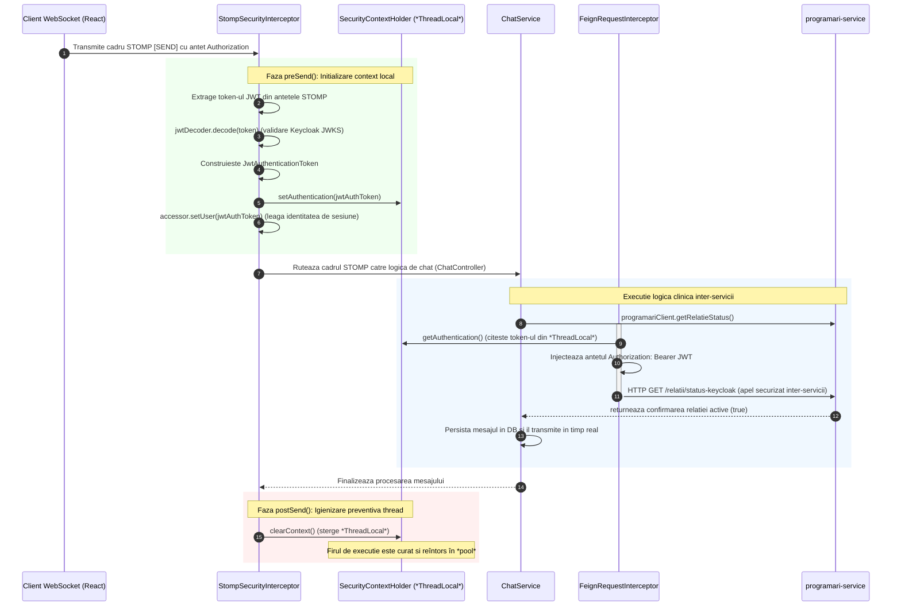

## 6.4 Propagarea Contextului de Securitate în Sesiunile WebSocket STOMP

Această secțiune analizează soluția implementată la nivelul platformei KinetoCare pentru rezolvarea decalajului arhitectural dintre protocoalele bazate pe sesiuni persistente și cele fără stare (*stateless*). Este detaliat mecanismul de interceptare a canalelor de mesagerie asincrone pentru propagarea continuă și securizată a identității utilizatorului prin punți de protocol dedicate.

### 6.4.1 Decalajul arhitectural de protocol HTTP → TCP și natura problemei

În arhitectura aplicațiilor web moderne, securitatea este construită în mod tradițional pe baza paradigmei statice *request-response* din protocolul HTTP. La fiecare solicitare individuală de intrare, un lanț de filtre de securitate (cum ar fi `SecurityFilterChain` în Spring Security) interceptează cererea, extrage și validează token-ul de identitate (*JWT*), populează contextul de securitate local al firului de execuție activ (`SecurityContextHolder`) și permite sau respinge propagarea cererii către controllere. Acest model funcționează eficient deoarece comunicarea HTTP este fără stare (stateless), fiecare cerere reprezentând o unitate de comunicare independentă, deservită în modelul clasic servlet de un fir de execuție dedicat.

Protocolul *WebSocket*, utilizat în cadrul KinetoCare pentru mesageria în timp real din modulul de chat clinic, introduce însă o asimetrie arhitecturală fundamentală. Comunicarea debutează printr-o cerere HTTP standard, numită fază de negociere (*handshake*). În această etapă de inițiere, cererea traversează în mod normal filtrele de securitate HTTP, realizându-se autentificarea inițială.

Odată ce conexiunea este acceptată, protocolul este comutat instantaneu (prin răspunsul HTTP `101 Switching Protocols`) la o conexiune TCP persistentă și bidirecțională. De la acest moment:

- Datele nu mai sunt transmise sub formă de cereri HTTP izolate, ci ca o succesiune continuă de cadre *STOMP* (*Simple Text Oriented Messaging Protocol*) peste acea conexiune TCP unică.
- Lanțul de filtre HTTP (`OncePerRequestFilter`) **nu mai este rulat niciodată** pentru cadrele ulterioare conectării, deoarece fluxul de date ocolește complet stiva de servlet-uri HTTP standard.
- Prin urmare, obiectul `SecurityContextHolder` din Spring — care este o primitivă bazată pe memorie de tip `*ThreadLocal*` — rămâne **complet gol** în momentul în care serverul primește cadrele *STOMP* individuale (cum ar fi trimiterea de mesaje sau abonarea la canale de chat).

Această absență a contextului de securitate devine critică în microserviciul `chat-service`. Atunci când un utilizator trimite un mesaj, metoda `ChatService.salveazaSiNotifica()` apelează sincron, prin clientul *OpenFeign*, serviciul `programari-service` pentru a verifica dacă relația terapeutică este activă:

```java
@GetMapping("/relatii/status-keycloak")
Boolean getRelatieStatusByKeycloak(
        @RequestParam("pacientKeycloakId") String pacientKeycloakId,
        @RequestParam("terapeutKeycloakId") String terapeutKeycloakId
);
```

Clientul *OpenFeign* este configurat cu un interceptor global care încearcă să citească token-ul *JWT* din `SecurityContextHolder` pentru a-l injecta în antetul `Authorization: Bearer` al cererii de ieșire. Deoarece contextul local este gol în firul de execuție care procesează *WebSocket*-ul, apelul *OpenFeign* eșuează instantaneu cu eroarea `401 Unauthorized`, blocând transmiterea mesajelor deși utilizatorul este autentificat în mod valid la nivel de browser.

### 6.4.2 Puntea de protocol prin interceptarea canalului STOMP

Pentru a depăși această barieră tehnologică, platforma KinetoCare implementează o punte de protocol (*Protocol Bridge*) personalizată sub forma clasei `StompSecurityInterceptor`. Aceasta implementează interfața `ChannelInterceptor` pusă la dispoziție de ecosistemul Spring Messaging și este înregistrată pe canalul de mesaje de intrare (`clientInboundChannel`) în clasa de configurare `WebSocketConfig`:

```java
@Override
public void configureClientInboundChannel(ChannelRegistration registration) {
    registration.interceptors(stompSecurityInterceptor);
}
```

Spre deosebire de filtrele HTTP tradiționale, `ChannelInterceptor` acționează la nivelul stratului de mesagerie *STOMP*, interceptând în mod direct cadrele de date brute transmise de clienți pe conexiunea TCP persistentă, chiar înainte ca acestea să fie direcționate către controllerele de chat adnotate cu `@MessageMapping`. Această abordare extinde modelul de securitate *Zero-Trust* descris în secțiunea 4.4 la nivelul comunicării *WebSocket*, garantând că fiecare cadru *STOMP* este tratat ca o unitate de comunicare independentă ce necesită validarea explicită a identității.

### 6.4.3 Mecanismele de interceptare: preSend și postSend

Interceptorul își împarte responsabilitatea în două faze fundamentale al ciclului de viață al unui mesaj, asigurate prin metodele `preSend` și `postSend`.

**Faza de populare: `preSend()`.** În momentul în care un cadru *STOMP* intră în server, interceptorul analizează tipul comenzii protocolului și acționează în consecință:

- **La comanda CONNECT:** Clientul React (*WebSocket*) este programat să trimită explicit token-ul *JWT* într-un antet nativ al cadrului de conectare (antetul `Authorization`). Interceptorul extrage acest token, ocolește contextul HTTP și efectuează decodificarea și validarea criptografică prin apelul:
    ```java
    jwtDecoder.decode(token)
    ```
    Acest decodificator folosește aceleași chei publice partajate (*JWKS*) din serverul Keycloak, asigurând o validare identică cu cea din stratul HTTP.
    După validarea semnăturii și a expirării, sistemul generează un obiect `JwtAuthenticationToken` și execută o operațiune dublă:
    - Asociază identitatea cu sesiunea *WebSocket* persistentă prin `accessor.setUser(authentication)`. Această asociere garantează că, pe tot parcursul vieții conexiunii TCP active, utilizatorul rămâne legat de acea sesiune la nivel conceptual în server.
    - Populează contextul local al firului de execuție activ: `SecurityContextHolder.getContext().setAuthentication(authentication)`, făcând identitatea disponibilă apelurilor sincrone *OpenFeign* subsecvente.
- **La comanda SEND (Trimitere Mesaj):** Pentru cadrele ulterioare de trimitere, clientul nu mai este obligat să trimită token-ul la fiecare mesaj (reducând volumul de date transferat prin rețea). Interceptorul verifică dacă există deja un utilizator autentificat asociat sesiunii active prin `accessor.getUser()`. Dacă identitatea este prezentă, aceasta este extrasă din sesiune și injectată din nou în `SecurityContextHolder` al firului de execuție curent care procesează mesajul. Acest mecanism restabilește legătura dintre sesiunea persistentă (*stateful*) și contextul local volatil (`*ThreadLocal*`).

**Faza de igienizare: `postSend()`.** După ce procesarea cadrului s-a finalizat (mesajul a fost salvat în baza de date și retransmis către destinatar), indiferent dacă operațiunea a avut succes sau s-a soldat cu o eroare, interceptorul apelează în mod obligatoriu metoda:

```java
SecurityContextHolder.clearContext();
```

Această operațiune de curățare este critică într-o arhitectură *Enterprise*. Serverele *WebSocket* folosesc un *pool* intern de fire de execuție (*Thread Pool*) pentru a procesa cadrele *STOMP* în mod asincron și concurent. Un fir de execuție din *pool* nu este dedicat unui singur utilizator; el procesează un mesaj pentru un pacient, se întoarce în *pool* și poate fi alocat imediat pentru a procesa un mesaj trimis de un alt pacient, aflat pe o cu totul altă conexiune fizică.

Fără apelarea explicită a metodei `clearContext()`:
- Credențialele primului pacient ar rămâne atașate firului de execuție în memoria locală (`*ThreadLocal*`).
- Atunci când firul de execuție este reutilizat pentru a procesa un cadru anonim sau trimis de un pacient neautentificat în mod valid, sistemul ar rula logica sub identitatea veche a primului pacient.
- Această breșă de securitate, numită **fuga de credențiale** (*credential leakage*), este eliminată complet prin igienizarea strictă realizată în faza de `postSend()`.

### 6.4.4 Diagrama secvențială a propagării contextului de securitate

Ciclul complet de viață al propagării identității criptografice de la clientul React, prin canalul *STOMP*, către contextul local și apelurile inter-servicii, este reprezentat în diagrama de mai jos:



### 6.4.5 Robustețea și tratarea excepțiilor de autentificare

În cazul în care token-ul *JWT* extras din antetul *STOMP* este expirat, corupt sau semnat cu o cheie invalidă, interceptorul prinde excepția generată de decodificator, înregistrează un avertisment securizat în loguri (`log.warn`) și apelează preventiv `SecurityContextHolder.clearContext()`.

Sistemul nu blochează sau închide fizic conexiunea TCP la acest nivel (acțiune care ar prăbuși instantaneu sesiunea *WebSocket* a clientului și ar forța reconectări repetate și consum de resurse de rețea la nivel de handshake), ci permite cadrului să meargă mai departe cu un context de securitate gol. Această decizie de design reflectă principiile de reziliență ale fluxurilor reactive: eșecul de autentificare a unui singur mesaj nu trebuie să degenereze în închiderea canalului de transport fizic. La etapa următoare, când controllerul de chat va încerca să execute logica sau să inițieze apelul *OpenFeign* către `programari-service`, lipsa identității din context va declanșa o excepție controlată de tip `401 Unauthorized` la nivelul containerului Spring.

Această eroare este interceptată elegant de metoda `@MessageExceptionHandler` din controller și transmisă exclusiv utilizatorului afectat printr-un canal dedicat (`/queue/errors`), izolând defecțiunea la nivel de sesiune, oferind clientului posibilitatea de a încerca o reîmprospătare silențioasă a jetonului fără a distruge conexiunea activă și fără a perturba sesiunile celorlalți utilizatori conectați.
