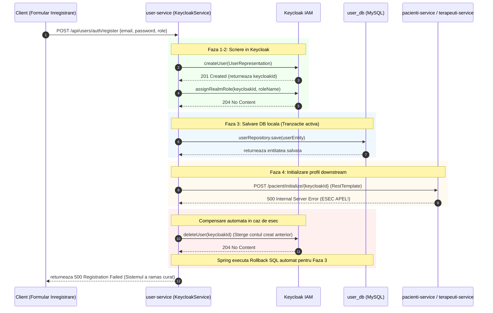

## 6.6 Implementarea Tranzacțiilor de Compensare (Dual-write Keycloak + DB)

Această secțiune analizează provocările consistenței distribuite în scenariile de scriere duală (*dual-write*), combinând serverul de identitate Keycloak cu bazele de date relaționale locale. Este detaliat mecanismul tranzacțional compensatoriu implementat pentru a asigura atomicitatea înregistrării utilizatorilor și tranzacțiile de compensare sincrone utilizate în dezactivarea securizată a conturilor.

### 6.6.1 Problema consistenței distribuite în scenariile de identitate

În arhitecturile bazate pe microservicii, managementul identității utilizatorilor implică frecvent o structură hibridă. Pe de o parte, este necesar un sistem robust de tip **IAM** (*Identity and Access Management*), precum serverul Keycloak, dedicat securizării fluxurilor de autentificare, stocării securizate a credențialelor și managementului token-urilor *JWT*. Pe de altă parte, datele operaționale (detaliile de contact, istoricul medical și referințele specifice) trebuie să fie stocate în baza de date locală a aplicației, sub coordonarea unui microserviciu dedicat, precum `user-service` în platforma **KinetoCare**.

Această asimetrie introduce problema critică a **scrierii duale** (*dual-write*). Deoarece Keycloak și baza de date relațională locală a aplicației (`user_db`) reprezintă sisteme de stocare distincte, nicio tranzacție clasică *ACID* (de tip bază de date) nu poate acoperi ambele sisteme în mod nativ.

Dacă o operație complexă care implică ambele sisteme eșuează parțial, starea datelor devine inconsistentă:

- **Scenariul contului fantomă:** Utilizatorul este creat cu succes în Keycloak, dar salvarea în `user_db` eșuează din cauza unei constrângeri de bază de date (de exemplu, un e-mail duplicat detectat târziu). Pacientul va deține un cont valid în Keycloak și se va putea autentifica, obținând un token *JWT*, dar la accesarea platformei sistemul va returna erori HTTP de tip 404 (Not Found) sau 500 (Internal Server Error) la accesarea profilelor, blocând utilizarea platformei de către utilizator deoarece profilul său local în baza de date nu există.
- **Scenariul contului orfan:** Salvarea locală în baza de date se efectuează, dar actualizarea în Keycloak eșuează. Contul va figura ca activ în tabelele clinicii, însă utilizatorul nu se va putea autentifica niciodată.
- **Riscuri GDPR și de securitate:** Conturile fantomă abandonate în Keycloak reprezintă breșe de conformitate (GDPR) și pot fi exploatate pentru a genera acces neautorizat, ocolind auditul clinic intern.

Pentru a rezolva această limitare în lipsa tranzacțiilor distribuite rigide (care implică blocarea resurselor și degradarea performanței), platforma KinetoCare folosește un model de **tranzacții compensatorii sincrone** (*compensating transactions*), o versiune simplificată și adaptată a principiului de rollback din tiparul *Saga*.

### 6.6.2 Înregistrarea utilizatorului: Strategia de rollback compensatoriu sincron

Metoda de înregistrare a unui utilizator nou, localizată în `KeycloakService.registerUser()`, folosește o strategie de compensare sincronă. Deși metoda este adnotată cu `@Transactional`, Spring poate gestiona în mod nativ exclusiv rollback-ul bazei de date relaționale locale (MySQL). De aceea, pașii exteriori sunt înveliți într-o logică defensivă de tip `try/catch`, capabilă să orchestreze compensarea în mod explicit.

Secvența operațională se desfășoară în patru faze distincte, fiecare având o graniță de eșec bine definită:

**Faza 1: Crearea contului în Keycloak.** Aplicația apelează API-ul Keycloak pentru a crea utilizatorul:
```java
createUserInKeycloak()
```
Dacă acest pas eșuează (de exemplu, din cauza complexității insuficiente a parolei sau a problemelor de rețea), procesul se oprește instantaneu, aruncând o excepție. Nu există nicio modificare persistentă în restul sistemului, nefiind necesară nicio compensare. Dacă reușește, Keycloak returnează un cod HTTP `201 Created` și calea contului, de unde aplicația extrage identificatorul unic `keycloakId` (UUID).

**Faza 2: Alocarea rolului de securitate.** Sistemul asociază rolul specific (Pacient sau Terapeut) contului nou creat în Keycloak. În caz de eșec la acest nivel, contul ar rămâne fără drepturi de acces. De aceea, blocul de excepție interceptează eroarea și rulează imediat tranzacția de compensare:
```java
deleteUserInKeycloak(keycloakId)
```
Această acțiune șterge în mod sincron contul creat la Faza 1, restabilind starea curată a sistemului.

**Faza 3: Persistența locală a utilizatorului.** Utilizatorul este salvat local în tabela bazei de date `user_db` prin:
```java
userRepository.save(userEntity)
```
Dacă salvarea eșuează (de exemplu, din cauza unei erori interne de persistență), blocul `catch` rulează din nou compensarea: ștergerea sincronă a utilizatorului din Keycloak, eliminând contul fantomă.

**Faza 4: Inițializarea profilului clinic downstream.** În final, sistemul inițializează un profil clinic gol în microserviciul corespunzător rolului (`pacienti-service` sau `terapeuti-service`). Deoarece la acest moment utilizatorul nu este încă autentificat (deci nu deține un token *JWT* valid în contextul de securitate care să poată fi propagat de OpenFeign), acest apel inter-servicii se realizează direct prin `RestTemplate`:
```java
restTemplate.postForEntity(url, null, Void.class)
```
Dacă acest apel *downstream* eșuează (de exemplu, din cauza indisponibilității temporare a serviciului de pacienți), se declanșează o cascadă dublă de compensare:
- Blocul de excepție interceptează eroarea și apelează ștergerea de siguranță a utilizatorului din Keycloak (`deleteUserInKeycloak`).
- Excepția propagată declanșează rollback-ul automat al tranzacției SQL din Spring, anulând salvarea locală a utilizatorului din tabela `user_db` efectuată la Faza 3.
- Sistemul revine în totalitate la starea inițială, garantând consistența tranzacțională.

### 6.6.3 Diagrama secvențială a înregistrării cu compensare

Fluxul de înregistrare și compensare în caz de eroare este ilustrat în diagrama de mai jos:



### 6.6.4 Dezactivarea contului: Mecanism de compensare sincronă cu consistență asimetrică

Metoda `UserService.toggleUserActive(keycloakId, active)` abordează o problemă tranzacțională diferită: dezactivarea unui cont existent. Această acțiune trebuie propagată în patru subsisteme distincte, într-o succesiune strictă:

1. DB Local (`user_db`): Proprietatea `active` a utilizatorului este setată pe `false`.
2. **Keycloak IAM:** Contul este dezactivat, blocând imediat emiterea de noi tokene de acces și orice operațiune de reîmprospătare a sesiunii, limitând accesul rezidual la intervalul de valabilitate al token-ului activ existent.
3. Serviciul de Profil (`pacienti-service` / `terapeuti-service`): Profilul este marcat ca inactiv pentru a fi exclus din căutări.
4. Serviciul de Programări (`programari-service`): Toate programările viitoare asociate utilizatorului sunt anulate automat, iar mesajele de notificare sunt trimise partenerilor afectați.

**Decizia arhitecturală: Asimetria de consistență.** În loc să impună o consistență puternică (atomică) pe toate cele patru sisteme, KinetoCare utilizează un **mecanism de compensare sincronă directă (try-compensate), cu consistență asimetrică** (termenul complet este definit în §3.1.5). Această decizie este motivată de prioritățile de securitate și funcționalitate ale clinicii, structurate în tabelul de mai jos:

| Sistem afectat | Model consistență | Justificare clinică și de securitate | Comportament la eșec |
| :--- | :--- | :--- | :--- |
| **DB Local + Keycloak** (Pașii 1 și 2) | **Consistență Puternică (Atomic)** | Este inacceptabil ca un cont să fie dezactivat în baza de date, dar utilizatorul să poată continua să acceseze API-urile folosind token-uri *JWT* active. | Dacă dezactivarea în Keycloak eșuează, tranzacția locală MySQL se anulează (*rollback*), menținând securitatea. |
| **Serviciul de Profil** (Pasul 3) | **Consistență Eventuală (Best-Effort)** | Este acceptabil ca un utilizator dezactivat să mai apară timp de câteva minute în listele de terapeuți sau pacienți. | Eșecul este logat, dar nu anulează dezactivarea generală. Un proces de reîncercare automată poate sincroniza datele ulterior. |
| **Serviciul de Programări** (Pasul 4) | **Consistență Eventuală (Best-Effort)** | Anularea programărilor viitoare și trimiterea de notificări pot tolera întârzieri temporare fără a pune în pericol securitatea clinicii. | Eșecul este înregistrat. Un administrator poate declanșa manual curățarea agendei dacă serviciul de programări a fost temporar offline. |

Această asimetrie separă granița critică de securitate (care necesită atomicitate deplină) de granița de date operaționale (care poate tolera consistența eventuală), asigurând o disponibilitate sporită a sistemului.

### 6.6.5 Evaluarea alternativelor arhitecturale

În faza de proiectare a platformei, s-au analizat trei arhitecturi alternative pentru rezolvarea acestei probleme:

- **Protocolul Two-Phase Commit (2PC) Distribuit:**
    - *De ce a fost respins:* *2PC* necesită ca toate sistemele implicate (inclusiv Keycloak, care este un sistem extern) să blocheze resursele locale în faza de pregătire. Acest lucru degradează performanța, introduce un singur punct de eșec critic (coordonatorul de tranzacții) și este dificil de implementat peste API-uri REST terțe.
- **Modelul Transactional Outbox:**
    - *De ce a fost respins:* În acest model, modificările în Keycloak nu s-ar face direct. Serviciul `user-service` ar scrie modificarea într-o tabelă locală `outbox` în cadrul aceleiași tranzacții MySQL. Un *worker* separat ar citi tabela și ar sincroniza asincron Keycloak. Deși elimină cuplarea strânsă, introduce o complexitate operațională mare (managementul *worker*-ului, tratarea duplicatelor), nejustificată pentru volumul redus de înregistrări zilnice din cadrul unei clinici.
- **Saga Coreografică (Bazată pe evenimente):**
    - *De ce a fost respins:* Serviciile *downstream* ar fi ascultat evenimentele de dezactivare publicate de `user-service` în *RabbitMQ* și ar fi reacționat autonom. S-a preferat un **mecanism de compensare sincronă directă** (coordonat direct din `UserService` ca un orchestrator simplificat) deoarece oferă o trasabilitate superioară în cod: logica de business este centralizată într-un singur loc, permițând identificarea rapidă a erorilor de sincronizare.

### 6.6.6 Idempotența și reziliența tranzacțiilor compensatorii

Un aspect ingineresc deosebit de important este asigurarea **idempotenței** tuturor metodelor implicate în compensare. De exemplu, metoda `KeycloakSyncService.setUserEnabled(keycloakId, false)` poate fi apelată de mai multe ori cu același parametru fără a produce efecte secundare adverse sau erori în Keycloak.

Dacă o tentativă de dezactivare eșuează la etapa de actualizare a profilului și administratorul reîncearcă operațiunea, sistemul reexecută pașii anteriori fără a altera starea globală a sistemului, asigurând convergența către starea finală definită. Acest design consolidează reziliența arhitecturală în fața fluctuațiilor de rețea specifice sistemelor distribuite.
