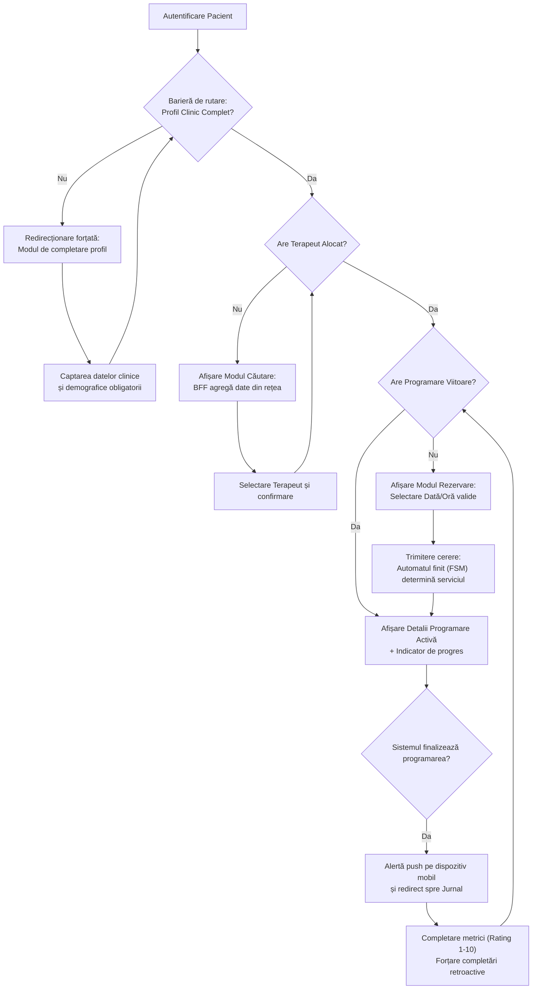

# Capitolul 7. Interfața cu Utilizatorul și Fluxurile Operaționale

Acest capitol descrie modul în care deciziile arhitecturale și implementările tehnice din aval sunt reflectate direct în interfața grafică a platformei KinetoCare. Sunt analizate în mod detaliat cele trei fluxuri de utilizare fundamentale: experiența pacientului, acțiunile clinice ale terapeutului și panoul administrativ centralizat. Fiecare flux este investigat din perspectiva interacțiunii dintre componentele de prezentare din *frontend* și serviciile din *backend*, evidențiind managementul stării reactive, barierele de securitate active și fluxul informațional prin intermediul porții de acces (API *Gateway*).

## 7.1 Fluxul Pacientului: De la Profilare Clinică la Monitorizare

Această secțiune analizează experiența pacientului în cadrul platformei KinetoCare, de la procesul de înregistrare și profilare clinică obligatorie, până la monitorizarea continuă prin intermediul jurnalului digital și al canalului securizat de mesagerie în timp real. Sunt detaliate interacțiunile dintre starea reactivă a aplicației client și barierele de securitate impuse la granița sistemului distribuit.

### 7.1.1 Configurarea inițială și securizarea prin bariere de rutare

Experiența pacientului în cadrul platformei KinetoCare începe cu un proces de înregistrare în două etape, proiectat pentru a echilibra simplitatea accesului inițial cu cerințele medicale obligatorii. Într-o aplicație clinică, funcționarea cu profiluri incomplete (de exemplu, pacienți fără CNP sau fără data nașterii) reprezintă un risc critic pentru securitate, validarea datelor și conformitatea legală. 

**Etapa 1: Înregistrarea de bază (Autentificare și Identitate).** Formularul inițial expus în interfața grafică colectează exclusiv date de identitate minimale: `email`, `parolă`, `nume`, `prenume`, `telefon` și `gen`. La trimiterea formularului, componenta client apelează serviciul de identitate pentru înregistrarea utilizatorului, acțiune securizată prin tranzacția sincronă de scriere duală (*dual-write*) detaliată în Secțiunea 6.6.

**Etapa 2: Mecanismul de blocare și completare obligatorie.** Protejarea rutelor operaționale se realizează printr-o componentă de securitate de tip barieră (*route guard*). Pentru a nu degrada performanța interfeței printr-o avalanșă de cereri HTTP la fiecare schimbare de rută, starea de completitudine a profilului este interogată o singură dată (în faza de *bootstrap* a aplicației) și injectată în memoria globală a browserului (Context API). Bariera de rutare evaluează instantaneu această stare din memorie. Dacă detectează un profil medical neinițializat, navigarea spre modulele operaționale este anulată la nivelul arborelui DOM, iar utilizatorul este forțat către modulul de profilare. Accesul este deblocat doar după ce salvarea datelor clinice returnează un cod HTTP `200 OK`, declanșând actualizarea stării globale.

### 7.1.2 Selectarea terapeutului și rezoluția datelor prin BFF

Odată încheiat procesul de configurare, pacientul este ghidat să își aleagă un kinetoterapeut. Interfața de căutare necesită date agregate complexe: specializările terapeutului, locațiile fizice asociate, disponibilitatea și detaliile de identitate (nume, fotografie). 

În loc ca aplicația client să lanseze apeluri HTTP disparate, interogarea este preluată de API *Gateway*, care implementează tiparul *Backend-For-Frontend* (*BFF*). Acesta lansează apeluri concurente către `terapeuti-service` și `user-service`, utilizând procesarea în lot (*batch processing*) pentru rezolvarea numelor, returnând aplicației React un răspuns compact și formatat.

Schimbarea terapeutului reprezintă un eveniment de domeniu critic. *Backend*-ul detectează această modificare, arhivează relația terapeutică anterioară și anulează programările viitoare cu vechiul terapeut. Din punct de vedere clinic, sistemul conservă planul terapeutic activ — aceasta este o **decizie de domeniu asumată explicit**, în acord cu practica clinică a cabinetelor de kinetoterapie, în care continuitatea planului terapeutic nu este legată de identitatea terapeutului, ci de evaluarea clinică a pacientului. Prin urmare, contorizarea ședințelor de către automatul finit se bazează pe ultimul formular de evaluare existent (`evaluareRepository.findFirstByPacientKeycloakIdOrderByDataDesc()`), indiferent de terapeutul care a semnat evaluarea respectivă. Noul terapeut preia recuperarea exact din punctul în care a fost întreruptă, cu acces deplin la diagnosticul funcțional și la bugetul de ședințe rămas, fără a impune o evaluare inițială redundantă care ar deruta pacientul și ar distorsiona datele longitudinale de evoluție. Dacă noul terapeut consideră că planul anterior este clinic inadecvat, acesta dispune de privilegiul de a adăuga o evaluare nouă în fișa pacientului, resetând astfel în mod explicit automatul finit la o nouă traiectorie.

### 7.1.3 Fluxul de programare și rezoluția autonomă a serviciului

Procesul de rezervare este conceput pentru a preveni erorile de selecție ale utilizatorilor. Aplicația client interoghează algoritmul *greedy* de disponibilitate (Secțiunea 6.2) pentru a prezenta pe ecran exclusiv intervalele orare valide. 

La confirmarea rezervării, corpul cererii HTTP (`POST /api/programari`) conține exclusiv datele de identificare și coordonatele temporale (`terapeutKeycloakId`, `locatieId`, `data`, `oraInceput`), omițând intenționat identificatorul serviciului medical. Tipul de serviciu este determinat pe server de automatul finit (detaliat în Secțiunea 6.1) și este aplicat tiparul *Snapshot* pentru datele financiare (vezi Secțiunea 4.5.4). Pentru a asigura o experiență fluidă, interfața grafică actualizează starea aplicației fără reîncărcarea paginii, prezentând instantaneu un indicator vizual de progres clinic (numărul de ședințe efectuate raportat la totalul recomandat).

### 7.1.4 Jurnalul post-ședință: Colectarea datelor longitudinale

Deoarece completarea jurnalului se realizează frecvent de pe dispozitive mobile, interfața grafică evită introducerea manuală de text, utilizând cursoare de selecție tactilă (*sliders*) pe o scară numerică de rating discretă de la 1 la 10 (unde valoarea 1 reprezintă un nivel de durere sau disconfort minim/insignificant, iar 10 intensitatea maximă a simptomului) pentru măsurarea intensității durerii, a dificultății exercițiilor și a gradului de oboseală. Pentru a garanta acuratețea setului de date longitudinale, aplicația React blochează adăugarea de noi intrări dacă detectează ședințe anterioare neevaluate, forțând utilizatorul să completeze datele retroactiv, în ordine strict cronologică.

### 7.1.5 Modulul de mesagerie: Generarea la cerere a conversațiilor și securitatea clinică

Canalul de comunicare în timp real este deservit prin protocolul *WebSocket* peste stiva *STOMP*. Atunci când un pacient accesează secțiunea de chat, sistemul evită preîncărcarea bazei de date cu documente vide de conversație. 

Prin conceptul de generare la cerere a resurselor (tiparul *Virtual Proxy*), agregatorul din API *Gateway* orchestrează o fuziune a datelor (*data-merge*): suprapune lista conversațiilor fizice existente în `chat_db` peste lista relațiilor clinice active extrase din `programari_db`. Dacă o relație este activă, dar nu deține încă un istoric de mesaje, sistemul construiește dinamic o conversație virtuală în memorie (alocându-i un identificator temporar) și o expediază clientului. Persistența fizică reală a înregistrării în baza de date (generarea unui identificator primar) este realizată prin *Inițializare Leneșă* (*Lazy Initialization*) în `chat-service`, fiind amânată strict până în momentul transmiterii primului mesaj efectiv.

Comunicarea este securizată prin injectarea jetonului *JWT* în antetele protocolului *STOMP*. Înainte de a accepta și a ruta un mesaj intern în `chat-service`, acesta interoghează sincron validitatea relației terapeutice active din `programari-service`. Dacă pacientul nu se mai află sub îngrijirea terapeutului destinatar (relația fiind arhivată), transmisia este blocată cu un cod de eroare, prevenind astfel accesul neautorizat la datele clinice după încheierea planului terapeutic.

### 7.1.6 Harta fluxului de navigare și decizie al pacientului

Diagrama de mai jos sintetizează logica de navigare, interceptare și acțiune clinică parcursă de un pacient în interfața aplicației:

