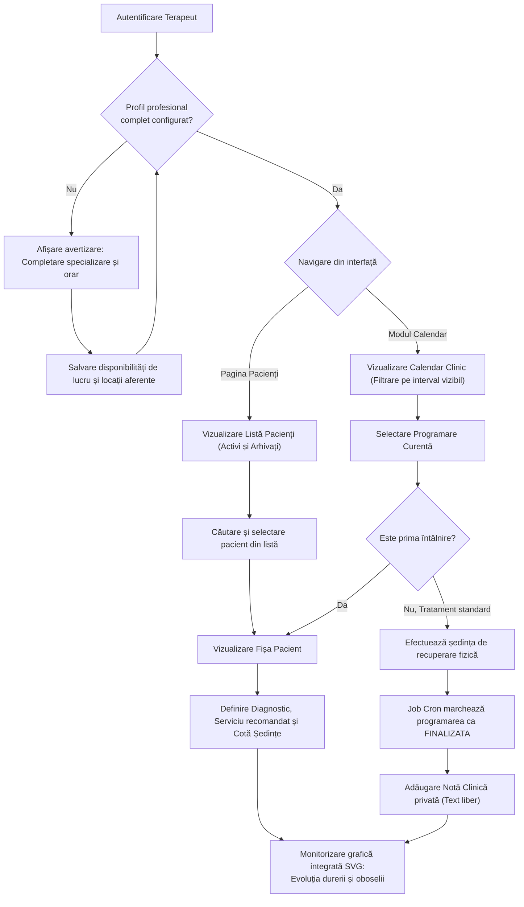

## 7.2 Fluxul Operațional al Terapeutului: Calendar și Documentare

Această secțiune detaliază instrumentele de lucru software oferite terapeuților în cadrul interfeței platformei. Sunt analizate managementul disponibilităților de lucru, optimizarea randării agendei clinice pe baza ferestrelor vizibile și fluxurile de documentare medicală bazate pe note clinice, integrând grafice de evoluție construite din datele transmise de pacienți.

### 7.2.1 Configurarea profilului și managementul disponibilităților

Un modul dedicat pentru definirea parametrilor profesionali este pus la dispoziția terapeutului, fiind monitorizat activ de sistem pentru a preveni anomaliile de operare. La detectarea unui profil profesional incomplet (de exemplu, absența specializării sau a adresei cabinetului), panoul principal de bord randează o alertă proactivă persistentă, solicitând completarea datelor înainte de deblocarea modulelor active.

Configurarea programului de lucru se realizează prin declararea intervalelor orare de disponibilitate asociate unei zile calendaristice și unei locații fizice. La transmiterea formularului, serviciul `terapeuti-service` validează regulile de integritate la nivelul bazei de date. Acesta aplică constrângeri stricte de unicitate temporală pentru a preveni suprapunerea intervalelor (*overlapping slots*) în cadrul aceleiași zile pentru același terapeut. În mod complementar, agenda poate fi blocată prin declararea perioadelor de concediu, acțiune care determină componenta `programari-service` să excludă automat acele zile din algoritmii de disponibilitate prezentați pacienților, garantând sincronizarea operațională.

### 7.2.2 Calendarul clinic activ: Încărcare dinamică bazată pe vizor

Modulul de calendar reprezintă instrumentul principal de lucru al terapeutului. Deoarece descărcarea integrală a istoricului clinic ar genera timpi de transfer ineficienți și un consum excesiv de memorie la nivelul browserului (din cauza volumului masiv de date brute), componenta interfeței implementează un tipar de preluare a datelor strict limitat la vizorul curent (*viewport-based data fetching*).

La fiecare acțiune de navigare (schimbarea lunii sau vizualizarea săptămânală), coordonatele temporale de pe ecran sunt extrase, iar către *backend* sunt expediate două atribute stricte: `startDate` și `endDate` (în format standardizat ISO-8601). Microserviciul traduce acești parametri într-o interogare SQL restrictivă, extrăgând exclusiv sub-setul de programări necesar randării pe ecran, minimizând astfel amprenta de bandă a rețelei.

Logica de prezentare include reguli semantice specifice domeniului medical:
* Programările anulate standard sunt eliminate complet din grila calendarului pentru eliberarea spațiului vizual.
* Programările anulate din cauza neprezentării pacientului sunt reținute și marcate cu o textură vizuală distinctă, reprezentând un indicator clinic esențial pentru evaluarea aderenței la tratament.
* O culoare de accent este utilizată pentru a semnaliza prima întâlnire cu un pacient, indicând necesitatea executării protocolului de evaluare inițială în detrimentul unui tratament de rutină.

### 7.2.3 Documentarea clinică: Fișa integrată și diagnosticarea vizuală

La selectarea unui pacient, aplicația deschide fișa digitală completă a acestuia. Pentru a oferi o vedere clinică integrată (o perspectivă clinică holistică), interfața client lansează cereri HTTP concurente pentru a obține simultan dosarul clinic, istoricul evaluărilor și tendințele de evoluție (rezolvând eficient problema agregării datelor disparate). Informațiile sunt distribuite în secțiuni de specialitate:

**Secțiunea de Evaluări.** Prezintă istoricul diagnosticelor funcționale. Terapeutul poate introduce o nouă evaluare, stabilind serviciul medical recomandat și cota de ședințe aferentă planului terapeutic. Salvarea unei noi evaluări actualizează dinamic pragurile automatului finit (*FSM*) gestionat de server, resetând data de referință și permițând extinderea automată a tratamentului activ.

**Secțiunea de Note Clinice.** Este destinată documentării recurente. Notele de evoluție sunt organizate cronologic sub formă de text liber, permițând documentarea progresului clinic conform convențiilor instituționale. Acestea sunt vizibile exclusiv autorului, prin filtrarea la nivel de interogare după identificatorul criptografic `terapeut_keycloak_id` — spre deosebire de evaluările clinice, care sunt accesibile tuturor terapeuților implicați în îngrijirea pacientului pentru a asigura continuitatea actului medical.

**Secțiunea de Jurnale (Grafice evolutive).** Pentru a preveni analiza cognitivă dificilă a tabelelor masive de date brute, interfața integrează nativ jurnalele subiective ale pacienților sub forma unor grafice interactive (SVG). Graficele suprapun pe o axă temporală comună evoluția nivelului de durere, oboseală și dificultate raportate prin intermediul scării de rating. Acest panou vizual permite identificarea rapidă a deviațiilor de la traiectoria clinică optimă și ajustarea schemei de tratament.

### 7.2.4 Schema fluxului de lucru al terapeutului

Diagrama de mai jos sintetizează pașii operaționali și punctele de decizie tehnică parcurse de terapeut în interfața aplicației:

