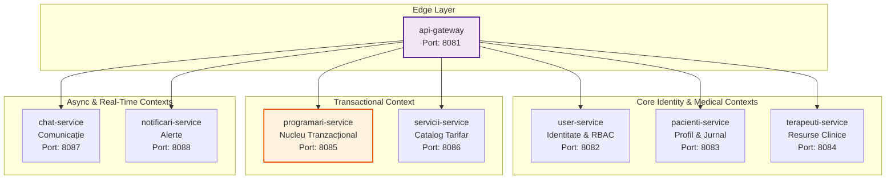

# Capitolul 3. Alegerea Tehnologiilor și a Stivei *Software*

Acest capitol documentează și justifică deciziile de selecție tehnologică care stau la baza platformei KinetoCare. Pentru fiecare componentă majoră a stivei sunt prezentate atât alternativele evaluate, cât și argumentele de natură arhitecturală care au determinat alegerea finală. Sunt analizate succesiv: stilul arhitectural distribuit bazat pe microservicii, stiva *backend* (Spring Boot, Spring Cloud *Gateway*, OpenFeign și RabbitMQ), infrastructura de identitate și securitate (Keycloak și JWT), ecosistemul *frontend* (React și protocoalele de timp real) și, în final, infrastructura de containerizare și persistență (Docker, Kubernetes, MySQL).

## 3.1 Alegerea arhitecturii bazate pe microservicii

### 3.1.1 Contextul deciziei arhitecturale

Alegerea stilului arhitectural reprezintă decizia cu cel mai mare impact pe termen lung în ciclul de viață al unui sistem *software*, guvernând direct atribute fundamentale precum scalabilitatea, mentenabilitatea și viteza de livrare a noilor funcționalități. În proiectarea sistemelor complexe, structura internă reflectă de regulă topologia domeniului de *business* transpus în plan digital — un principiu central al abordării *Domain-Driven Design*.

Domeniul recuperării medicale și al kinetoterapiei se caracterizează printr-un grad ridicat de complexitate operațională și interacțiuni asimetrice între actori. Fluxul de lucru al unei clinici nu se limitează la operațiuni simple de tip *CRUD* (*Create, Read, Update, Delete*), ci implică gestionarea unui ciclu terapeutic iterativ: managementul identității utilizatorilor, planificarea disponibilității terapeuților, logica tranzacțională a rezervărilor, monitorizarea evoluției clinice prin feedback subiectiv, comunicarea bidirecțională în timp real și generarea de notificări reactive.

Fiecare dintre aceste subdomenii prezintă tipare de acces la date, profiluri de încărcare și cerințe de consistență distincte. Din acest motiv, în faza de analiză a sistemului, au fost evaluate comparativ două paradigme: arhitectura monolitică tradițională și arhitectura distribuită bazată pe microservicii.

### 3.1.2 Evaluarea critică a alternativei monolitice

O abordare monolitică ar fi presupus consolidarea întregii logici de *business* într-o singură unitate de *deployment*, rulând într-un singur proces pe mașina gazdă. Acest model oferă avantaje reale în fazele incipiente ale unui proiect: simplitate operațională deplină, latențe de rețea absente între module și trasabilitate nativă a tranzacțiilor ACID prin baza de date partajată. Cu toate acestea, aplicarea unei structuri monolitice peste modelul de *business* al platformei KinetoCare ar fi generat trei blocaje structurale majore:

1. **Asimetria ratelor de schimbare și a profilurilor de trafic:** Subsistemele platformei coexistă, dar nu evoluează în același ritm și nu prezintă același profil de consum al resurselor. Catalogul de servicii medicale este o resursă intens interogată la citire, dar rareori modificată. Subsistemul de mesagerie operează pe un model complet diferit: conexiuni TCP persistente, bidirecționale, cu un volum ridicat de mesaje de dimensiuni mici transmise în timp real. Partajarea aceluiași spațiu de execuție de către ambele module ar fi generat concurență directă pentru resursele de procesare ale rezervărilor, cu risc iminent de indisponibilitate generalizată a sistemului.

2. **Divergența granițelor tranzacționale:** Fiecare componentă din KinetoCare prezintă cerințe de consistență distincte. Rezervarea unui slot orar impune o consistență imediată strictă pentru a elimina complet riscul dublei rezervări. Trimiterea unei notificări sau actualizarea indicatorilor administrativi tolerează un model de consistență eventuală. Într-un monolit, modelul tranzacțional este de regulă uniformizat, forțând operațiunile cu toleranțe ridicate să blocheze inutil resurse critice de infrastructură.

3. **Heterogenitatea paradigmelor de procesare:** Nivelul de margine al aplicației (punctul unic de intrare) procesează întregul trafic și necesită un model reactiv, non-blocant, capabil să gestioneze concurența ridicată prin multiplexare I/O. Microserviciile din aval execută în principal operațiuni de baze de date, mapate optim pe modelul clasic *thread-per-request*. Descompunerea în microservicii a permis izolarea paradigmei reactive exclusiv la nivelul API *Gateway*-ului, fără a propaga complexitatea sa cognitivă în restul bazei de cod.

### 3.1.3 Structura microserviciilor KinetoCare

Arhitectura platformei KinetoCare este proiectată prin maparea conceptelor din *Domain-Driven Design* (DDD), unde sistemul distribuit este segmentat în module denumite *Bounded Contexts* (Contexte Delimitate). Fiecare context deține o semnificație proprie, un limbaj intern consistent și se materializează sub forma unui microserviciu autonom. Harta completă a microserviciilor și delimitarea acestora sunt prezentate în **Figura 3.1**.



Platforma este compusă din opt unități independente de *deployment*, detaliate conform responsabilităților lor:

| **Microserviciu** | **Port** | **Responsabilitate de domeniu** | **Schemă dedicată** |
|:---|:---|:---|:---|
| `api-gateway` | 8081 | Rutare, *proxy* token și agregare *BFF* reactivă | *Stateless* |
| `user-service` | 8082 | Identitate, control acces bazat pe roluri și management Keycloak | `user_db` |
| `pacienti-service` | 8083 | Profil medical extins și jurnal de feedback subiectiv | `pacienti_db` |
| `terapeuti-service` | 8084 | Resurse clinice, disponibilitate și concedii | `terapeuti_db` |
| `programari-service` | 8085 | Nucleu tranzacțional, evaluări clinice și relații terapeutice | `programari_db` |
| `servicii-service` | 8086 | Catalog de servicii medicale și tarifare | `servicii_db` |
| `chat-service` | 8087 | Comunicație bidirecțională în timp real | `chat_db` |
| `notificari-service` | 8088 | Ingestie asincronă de evenimente și alerte | `notificari_db` |

Izolarea completă a datelor este garantată prin implementarea tiparului *Database-per-Service*. Acest model interzice orice formă de interogare directă între scheme diferite. Fiecare microserviciu își încapsulează starea proprie, iar expunerea datelor către exterior se realizează exclusiv prin contracte API formale, eliminând riscul scurgerii logicii de *business* la nivelul bazei de date.

### 3.1.4 Topologia dependențelor și rolurile structurale

Deși topologia statică a dependențelor dintre microservicii este ciclică din cauza integrărilor bidirecționale (de exemplu, `programari-service` interoghează `pacienti-service`, iar `pacienti-service` apelează `programari-service`), la nivelul fluxurilor dinamice de execuție, fiecare flux individual este strict aciclic. Niciun flux de cerere individual nu traversează un ciclu de dependențe tranzacționale în interiorul aceluiași context de execuție, prevenind blocajele distribuite (*deadlocks*) sau recursivitatea infinită.

În cadrul acestei topologii, două microservicii ocupă roluri structurale distincte, definind marginile spectrului arhitectural:

- **`programari-service` ca nucleu de coeziune clinică.** Acest microserviciu reprezintă cel mai dens și complex punct al arhitecturii. Plasarea entităților `Programare`, `Evaluare`, `Evolutie` și `RelatiePacientTerapeut` în același context delimitat și aceeași schemă de date a fost asumată deliberat. Parcursul de recuperare medicală este guvernat de invarianți logici stricți: decizia privind tipul de serviciu aplicat depinde direct de numărul de ședințe efectuate de la ultima evaluare. Colocalizarea acestor entități permite menținerea consistenței prin tranzacții ACID locale, fără a necesita mecanisme costisitoare de coordonare distribuită.

- **`terapeuti-service` ca nod frunză autonom.** La cealaltă extremă se află serviciul de terapeuți, care nu inițiază niciun apel sincron sau asincron către alte componente din *backend*, funcționând ca un depozit autonom de date de referință (orar, locații, concedii). La nivelul interfeței există o asociere logică puternică între profilul unui terapeut și identitatea sa (nume, prenume din `user-service`), însă această asociere este decuplată structural la nivelul *backend*-ului. Responsabilitatea îmbinării acestor date este delegată nivelului de agregare din API *Gateway*. Această abordare garantează degradare grațioasă a sistemului: dacă `user-service` devine indisponibil, motorul intern de verificare a disponibilității orare continuă să funcționeze neafectat.

### 3.1.5 Compromisurile arhitecturale asumate

Conform Teoremei *CAP* (*Consistency, Availability, Partition Tolerance*), un sistem distribuit nu poate garanta simultan Consistență, Disponibilitate și Toleranță la Partiții. Deoarece partițiile de rețea sunt inevitabile în medii distribuite, compromisul efectiv se plasează între consistență și disponibilitate. KinetoCare adoptă un model hibrid și calibrat: pentru operațiunile critice de rezervare se prioritizează consistența — sistemul returnează eroare în loc să accepte o posibilă rezervare dublă — iar pentru procesele secundare (cum ar fi alertele clinice) se acceptă disponibilitatea bazată pe consistență eventuală. Această alegere asimetrică reflectă diferența fundamentală de impact clinic dintre cele două categorii de operațiuni.

Principalele compromisuri arhitecturale asumate sunt:

1. **Complexitatea operațională:** Rularea a șapte microservicii independente, alături de serverul de identitate, brokerul de mesaje și serverul de baze de date, anulează simplitatea unui *deployment* monolitic. Acest cost este atenuat prin containerizare completă și orchestrare declarativă, decuplarea serviciilor reprezentând totodată un avantaj de scalare independentă.

2. **Denormalizarea controlată a datelor (Tiparul *Snapshot*):** Consecința directă a tiparului *Database-per-Service* este imposibilitatea unificării datelor prin interogări SQL directe inter-scheme. Pentru a asigura performanța și integritatea istorică, valorile instantanee ale prețului, duratei și tipului de serviciu sunt copiate direct în înregistrarea programării (mecanism detaliat în secțiunea 4.5.4).

3. **Consistența distribuită prin tranzacții de compensare (inspirate din Tiparul *Saga*):** Procesele ce traversează mai multe microservicii — cum sunt fluxurile de înregistrare și dezactivare a contului — nu pot utiliza un protocol blocant de tip *2PC* (*Two-Phase Commit*) fără a degrada sever disponibilitatea platformei. Arhitectura implementează o strategie de tranzacții compensatorii sincrone, inspirată din principiile tiparului *Saga*. Spre deosebire de implementările *enterprise* complete ale acestui tipar, arhitectura evită în mod deliberat cozile de mesaje persistente și *Transactional Outbox*, menținând complexitatea infrastructurală la un nivel adecvat scopului platformei. Coordonarea logică a compensării este realizată direct în codul serviciului apelant (`user-service`). Pentru înregistrare, dacă salvarea ulterioară a profilului clinic în baza de date locală eșuează, platforma lansează un apel compensatoriu sincron de ștergere a utilizatorului din furnizorul de identitate. Pentru dezactivare, se adoptă un model de consistență asimetrică: se garantează consistența bazei de date locale și a furnizorului de identitate, în timp ce propagările secundare sunt de tip *best-effort*. Riscul minor al eșecului apelurilor de compensare reprezintă o limitare documentată și asumată în proiectarea platformei.

## 3.2 Stiva *backend*: Spring Boot, Spring Cloud *Gateway*, OpenFeign și RabbitMQ

### 3.2.1 Spring Boot — Infrastructură standardizată și principiul DRY

Ecosistemul Spring Boot a fost selectat ca fundament tehnologic pentru toate microserviciile *backend* ale platformei KinetoCare. Această decizie este motivată nu doar de productivitatea în implementarea logicii de *business*, ci de necesitatea standardizării arhitecturale într-un mediu cu șapte unități de *deployment* independente.

**Managementul versiunilor prin Spring *BOM*.** Într-o arhitectură cu multiple microservicii, gestionarea necoordonată a dependențelor poate genera rapid conflicte de versiuni. Spring *BOM* (*Bill of Materials*) este un mecanism *Maven* care definește un set de versiuni compatibile pentru toate modulele din ecosistem, funcționând ca un contract de compatibilitate centralizat. Toate microserviciile KinetoCare moștenesc din acest *BOM* comun, garantând coerența versiunilor pentru modulele critice (Spring Security, Spring Data JPA, Spring AMQP) la nivelul întregii platforme.

**Primitive declarative pentru infrastructură.** Spring Boot abstractizează complexitatea tehnică prin adnotări, permițând concentrarea codului pe logica clinică:

- `@Transactional` asigură respectarea proprietăților ACID pentru operațiunile complexe, cum ar fi rezervările cu validări de ferestre temporale sau finalizarea în lot a programărilor expirate.
- `@Scheduled` automatizează procesele de fundal: finalizarea programărilor expirate și motorul de remindere proactive pe bază de fereastră glisantă.
- `@PreAuthorize` oferă un control fin la nivel de metodă al politicilor de acces, complementar regulilor macroscopice definite la nivelul rutelor din *Gateway*.

**Modularitatea prin modulul *common* și principiul DRY.** Configurațiile partajate au fost extrase într-un modul *Maven* izolat, care centralizează configurația interceptorilor Feign pentru propagarea JWT și logica globală de tratare a erorilor. Toate microserviciile moștenesc un `@RestControllerAdvice` care formatează excepțiile conform standardului RFC 9457 (*Problem Details for HTTP APIs*), garantând un contract de eroare uniform la nivelul întregii platforme.

**Justificare față de alternative.** *Framework*-uri reactive moderne precum Quarkus sau Micronaut oferă timpi de pornire mai rapizi prin compilare nativă de tip *Ahead-of-Time* (AOT) și o amprentă de memorie mai mică — avantaje relevante în mediile *serverless* (mai pronunțate față de versiunile Spring Boot anterioare versiunii 3.x). Spring Boot a fost preferat pentru maturitatea ecosistemului Spring Security, care permite integrarea nativă cu Keycloak prin modulul `spring-boot-starter-oauth2-resource-server`, eliminând necesitatea implementării unui cod de securitate personalizat, predispus la vulnerabilități.

### 3.2.2 Spring Cloud *Gateway* — Punct unic de intrare și tiparul *BFF*

Componenta `api-gateway` funcționează ca strat de margine al platformei. Spre deosebire de restul sistemului, aceasta este construită pe stiva reactivă Spring WebFlux. Această asimetrie tehnologică deliberată rezolvă simultan două provocări arhitecturale.

**Rolul de *reverse proxy* transparent.** Pentru marea majoritate a cererilor, *Gateway*-ul acționează ca *proxy* pasiv. Rutarea este configurată declarativ în fișierul `application.yml`, decuplând logica de rețea de codul Java:

```yaml
- id: programari-service
  uri: ${application.urls.programari-service}
  predicates:
    - Path=/api/programari/**
  filters:
    - StripPrefix=1
```

O particularitate arhitecturală o reprezintă expunerea componentei `terapeuti-service` sub multiple prefixe de cale distincte (`/api/disponibilitate`, `/api/locatii`, `/api/concediu`, `/api/terapeut`). Aceasta necesită o ordonare strictă a rutelor: cele cu granularitate ridicată sunt evaluate prioritar față de cele cu *wildcard* generic, eliminând coliziunile de rutare. *Gateway*-ul gestionează centralizat și politicile *Cross-Origin* prin filtrul `DedupeResponseHeader`, prevenind duplicarea antetelor CORS într-o rețea distribuită.

**Tiparul *Backend-For-Frontend* (*BFF*) și orchestrarea reactivă.** Interfețele de tip *Single Page Application* (*SPA*) necesită adesea date agregate din surse multiple. Dacă browserul ar realiza invocări separate pentru a construi un *dashboard* clinic, latența inerentă a rețelei publice (negocieri TCP/TLS repetate) ar degrada semnificativ performanța percepută. *Gateway*-ul neutralizează această problemă prin patru controllere de agregare care lansează apelurile *downstream* în paralel, așteptând finalizarea tuturor înainte de a compune răspunsul final:

| Endpoint *BFF* | Mecanism de concurență | Valoare arhitecturală |
|:---|:---|:---|
| `GET /api/homepage` | 3 apeluri paralele (`Mono.zip`) | Elimină apelurile repetate pentru datele principale ale pacientului. |
| `GET /api/profile` | Până la 5 apeluri paralele | Construiește profilul complet agregând date clinice și de identitate din până la 5 surse. |
| `GET /api/chat/conversatii/agregat` | Orchestrare în patru faze | Instanțiază conversații virtuale și rezolvă identitățile partenerilor printr-un singur apel în lot. |
| `GET /api/terapeut/search` | 2 apeluri paralele cu rezoluție *batch* | Combină datele profesionale cu identitatea terapeutului fără a genera apeluri redundante. |

**Justificarea asimetriei WebFlux vs. MVC.** *Gateway*-ul execută un tipar de tip *fan-out*: lansează simultan mai multe cereri și agregă pasiv răspunsurile. Modelul non-blocant din WebFlux este excepțional de eficient pentru acest scenariu, deoarece un singur fir de execuție poate coordona zeci de apeluri externe concurente fără a rămâne blocat în așteptare. Microserviciile din aval interacționează cu MySQL prin JDBC, care este inerent blocant; impunerea paradigmei reactive la acel nivel ar fi adăugat complexitate cognitivă semnificativă fără un beneficiu de performanță proporțional.

### 3.2.3 Spring Cloud OpenFeign — Contracte API declarative

Pentru fluxurile care necesită un răspuns sincron în cadrul aceluiași proces de execuție, sistemul utilizează Spring Cloud OpenFeign.

**Contracte declarative față de alternative imperative.** Spre deosebire de instrumente precum `RestTemplate` sau `WebClient`, Feign generează implementarea HTTP direct din interfețe Java puternic tipizate, reducând codul repetitiv și facilitând testarea unitară a clienților de rețea.

**Propagarea contextului de securitate.** Un interceptor Feign, configurat la nivelul fiecărei componente client (prin intermediul clasei `FeignClientConfig`), extrage jetonul JWT din contextul de securitate al firului de execuție activ și îl injectează ca antet `Authorization: Bearer` în fiecare cerere de ieșire. Acest mecanism asigură că componenta destinatară poate aplica propriile politici de autorizare independent, respectând modelul *Zero-Trust*.

**Excepția asumată: `RestTemplate` la înregistrare.** Singurul punct din platformă unde comunicarea nu utilizează Feign este înregistrarea inițială a utilizatorului în `user-service`. Feign este configurat să preia automat jetonul JWT din contextul curent de securitate, însă la momentul înregistrării, noul utilizator nu s-a autentificat încă și niciun JWT nu este disponibil în context. Apelurile de inițializare a profilelor clinice se realizează prin urmare prin `RestTemplate`, de la componentă la componentă, fără context de autentificare. Această soluție reprezintă o consecință structurală a modelului de scriere duală, nu o inconsistență de proiectare.

**Matricea completă a interacțiunilor sincrone:**

| Serviciu apelant | Serviciu destinație | Justificarea apelului sincron |
|:---|:---|:---|
| `user-service` | `pacienti-service` | Inițializare profil la înregistrare; propagare stare la dezactivarea contului. |
| `user-service` | `terapeuti-service` | Inițializare profil la înregistrare; propagare stare la dezactivarea contului. |
| `user-service` | `programari-service` | Anularea programărilor viitoare la dezactivarea unui cont. |
| `programari-service` | `servicii-service` | Denormalizarea prețului și duratei la momentul rezervării (Tiparul *Snapshot*). |
| `programari-service` | `terapeuti-service` | Validarea orarului și a conflictelor cu perioadele de concediu. |
| `programari-service` | `user-service` | Rezolvarea numelor pacienților și terapeuților pentru fișa clinică. |
| `programari-service` | `pacienti-service` | Actualizarea terapeutului preferat la schimbarea relației terapeutice și interogarea jurnalelor medicale pentru fișa pacientului. |
| `pacienti-service` | `programari-service` | Declanșarea cascadei de anulare și arhivare a relației la schimbarea terapeutului. |
| `chat-service` | `programari-service` | Validarea relației terapeutice active anterior expedierii unui mesaj. |

### 3.2.4 Arhitectura orientată pe evenimente și RabbitMQ

Operațiunile care nu necesită un răspuns tranzacțional imediat au fost decuplate prin paradigma arhitecturii orientate pe evenimente (*EDA — Event-Driven Architecture*), utilizând brokerul de mesaje RabbitMQ.

**Justificarea alegerii RabbitMQ față de alternative.** Apache Kafka, o alternativă frecvent citată în arhitecturi EDA, este optimizat pentru volume enorme de evenimente (milioane pe secundă) și scenarii de tip *event sourcing* cu retenție pe termen lung. Volumul de evenimente al unei clinici de kinetoterapie (notificări de programare, remindere, mesaje de *chat*) nu justifică *overhead*-ul operațional al unui *cluster* Kafka. RabbitMQ oferă în schimb un *routing* semantic flexibil prin *Topic Exchange*, potrivit modelului de notificări cu tipuri variate, și o complexitate operațională semnificativ mai redusă.

**Topologia brokerului de mesaje.** Mesageria implementează modelul *Observer* distribuit:

- **Emiterea evenimentelor.** Componentele operaționale (`programari-service`, `chat-service`) publică evenimente imutabile (de exemplu, `notificare.programare.noua`) pe o magistrală centrală de tip *Topic Exchange* (`notificari.exchange`), fără a cunoaște identitatea consumatorilor — conform principiului *publish-and-forget*.
- **Rutarea semantică.** Coada consumatoare (`notificari.queue.v2`) utilizează cheia de rutare cu *wildcard* `notificare.#`. Această abordare aplică principiul *Open/Closed*: sistemul poate fi extins cu noi tipuri de notificări fără modificarea configurației brokerului. Sufixul `v2` reflectă o constrângere de imuabilitate a RabbitMQ — argumentele unei cozi deja declarate (inclusiv referința la *DLX*) nu pot fi modificate retrospectiv; crearea unei cozi noi reprezintă calea corectă de migrare a topologiei.

**Mecanismul *Dead Letter Queue* (DLQ).** Pierderea silențioasă a mesajelor este inacceptabilă într-un sistem clinic. Coada principală este configurată cu un *Dead Letter Exchange* (`notificari.dlx`) de tip *Fanout*. Dacă procesarea unui mesaj eșuează (de exemplu, din cauza datelor corupte), Spring AMQP emite un `NACK` (confirmare negativă), determinând brokerul să ruteze mesajul în coada de carantină `notificari.queue.dead`, în loc să îl reintroducă abuziv în coada principală.

**Izolarea erorilor în consumatorul de mesaje carantinate.** Consumatorul de mesaje din coada de carantină (`DeadLetterConsumer`) este proiectat explicit să absoarbă propriile excepții interne. Dacă o excepție neprinsă ar propaga în afara consumatorului, brokerul ar reintroduce mesajul în aceeași coadă de carantină, generând o buclă de procesare infinită cu risc de epuizare a resurselor. Prin izolarea erorilor la nivel de *logging*, se garantează că orice mesaj compromis este inspectat și înregistrat o singură dată, fără efecte colaterale asupra restului sistemului.

## 3.3 Securitate și managementul identității: Keycloak și JWT

### 3.3.1 Argumentarea delegării autentificării către un *Identity Provider* dedicat

Implementarea unui sistem propriu de autentificare — stocarea credențialelor cu algoritmi de *hashing*, gestionarea sesiunilor persistente, fluxurile de recuperare a parolei și emiterea jetoanelor criptografice — reprezintă o suprafață de atac semnificativă. Orice implementare dezvoltată intern introduce riscul unor vulnerabilități critice, precum stocarea nesigură a parolelor, generarea de jetoane predictibile sau expunerea la atacuri de tip *timing attack* în faza de comparare a *hash*-urilor.

Pentru a mitiga aceste riscuri, a fost adoptată integrarea Keycloak în rolul de furnizor de identitate (*IdP — Identity Provider*) dedicat. Keycloak este o soluție *open-source* matură de tip IAM (*Identity and Access Management*), conformă cu standardele industriale OAuth 2.0 și OpenID Connect. Principalul avantaj arhitectural obținut este externalizarea completă a managementului credențialelor. Microserviciile platformei KinetoCare nu stochează niciodată parole; procesul de înregistrare preia parola exclusiv în memorie volatilă pentru a o transmite instantaneu către API-ul securizat al serverului Keycloak, unde este procesată și stocată utilizând algoritmi standardizați (bcrypt).

### 3.3.2 Integrarea Keycloak: rolul de orchestrator al microserviciului de identitate

Spre deosebire de o arhitectură clasică în care Keycloak este tratat ca o soluție externă accesată exclusiv prin ecranele sale standard de autentificare cu redirecționare, platforma KinetoCare implementează o integrare invizibilă pentru utilizator (*headless*). Componenta de identitate din *backend* funcționează ca un orchestrator cu privilegii extinse, susținut de o arhitectură cu doi clienți Keycloak distincți:

1. **Clientul public (*Frontend SPA*):** Configurat fără un secret criptografic, acesta este utilizat exclusiv pentru a solicita emiterea jetoanelor de acces în urma validării credențialelor utilizatorului.
2. **Clientul confidențial administrativ (*Backend*):** Utilizat exclusiv de componenta de identitate pentru a interacționa programatic cu API-ul REST administrativ al Keycloak.

Prin intermediul clientului administrativ, *backend*-ul controlează dinamic ciclul de viață al utilizatorilor: creează conturi, atribuie roluri la nivel de sistem (pacient, terapeut, administrator) și gestionează stările de activare. Fluxurile sensibile, cum ar fi recuperarea parolei uitate, sunt delegate complet furnizorului de identitate: *backend*-ul instruiește Keycloak să genereze link-uri securizate, cu valabilitate limitată, și să le expedieze prin e-mail, asigurând că procesul de definire a noii parole se desfășoară exclusiv în perimetrul securizat al *IdP*-ului.

**Izolarea mediilor prin SMTP *sandbox*.** Expedierea efectivă a e-mailurilor de recuperare a parolei și de notificare a conturilor noi este complet decuplată de logica aplicației. În faza de dezvoltare și validare a arhitecturii, a fost utilizat serviciul *Mailtrap* ca server SMTP de tip *sandbox*. Această decizie arhitecturală a permis interceptarea și monitorizarea e-mailurilor generate de Keycloak într-un mediu complet izolat, eliminând riscul expedierii accidentale de mesaje către adrese reale și protejând reputația domeniului clinicii împotriva penalizărilor de tip *spam*. Configurația SMTP a fost externalizată integral în platforma Keycloak, demonstrând că tranziția sistemului într-un mediu de producție necesită exclusiv actualizarea credențialelor către un furnizor SMTP comercial, fără nicio modificare în codul sursă al microserviciilor.

### 3.3.3 Ciclul de viață al jetoanelor: mitigarea riscurilor XSS prin tiparul *BFF*

Gestionarea sesiunilor pentru o aplicație de tip *Single Page Application* (*SPA*) prezintă provocări majore de securitate. Stocarea jetoanelor JWT în mecanismele de persistență ale browserului (`localStorage` sau `sessionStorage`) expune sistemul la atacuri de tip *Cross-Site Scripting* (*XSS*), prin care scripturile malițioase pot exfiltra credențialele utilizatorului.

Pentru a neutraliza acest vector de atac, a fost implementată o arhitectură asimetrică bazată pe tiparul *Backend-For-Frontend* (*BFF*), gestionat direct la nivelul API *Gateway*-ului:

- **Jetonul de acces (*Access Token*):** Având o durată de viață foarte scurtă, acesta este livrat interfeței client și reținut exclusiv în memoria volatilă a aplicației JavaScript, inaccesibilă altor scripturi sau extensii de browser. Durata scurtă de viață limitează sever fereastra de expunere în cazul unui compromis.
- **Jetonul de reîmprospătare (*Refresh Token*):** Având o valabilitate extinsă, acesta este interceptat de *Gateway* la momentul autentificării, eliminat din răspunsul JSON returnat browserului și injectat într-un cookie de tip *HttpOnly*. Marcarea *HttpOnly* face cookie-ul complet opac pentru codul JavaScript, anulând posibilitatea furtului prin *XSS*.

Pentru a garanta o experiență de utilizare fluidă, interfața client implementează un mecanism de reîmprospătare silențioasă (*Silent Refresh*). La expirarea jetonului de acces — semnalizată prin erori HTTP 401 dinspre *backend* — sistemul suspendă transparent cererile în așteptare, inițiază un apel către *Gateway* (care atașează automat cookie-ul securizat), obține un nou jeton de acces și reia execuția cererilor originale, fără ca utilizatorul să observe vreo întrerupere.

### 3.3.4 Modelul *Zero-Trust* și validarea descentralizată

Platforma adoptă principiul *Zero-Trust* la nivelul rețelei interne de microservicii. Acest model respinge premisa conform căreia o cerere este sigură exclusiv pentru că provine din interiorul rețelei virtuale sau a traversat deja API *Gateway*-ul.

Fiecare microserviciu de domeniu acționează ca un server de resurse (*Resource Server*) complet autonom. Validarea autenticității jetoanelor JWT nu se realizează centralizat și nu necesită interogarea sincronă a serverului Keycloak pentru fiecare cerere primită. În schimb, validarea se realizează criptografic la nivel local: microserviciile preiau asincron și păstrează în *cache* cheile publice (*JWK — JSON Web Keys*) expuse de furnizorul de identitate. Această descentralizare elimină latența suplimentară a rețelei și previne transformarea serverului *IdP* într-un blocaj de performanță (*bottleneck*), garantând simultan că validitatea unui jeton este verificată pe baza semnăturii sale criptografice, independent de starea oricărui alt serviciu din sistem.

### 3.3.5 Autorizarea pe două niveluri (*Defense in Depth*)

Controlul accesului este stratificat pe două niveluri distincte, asigurând redundanță și granularitate:

1. **Filtrarea grosieră la nivel de margine (API *Gateway*):** *Gateway*-ul aplică reguli de autorizare bazate pe căile URL și metodele HTTP. Aceasta reprezintă prima linie de apărare, blocând traficul neautorizat către module întregi (de exemplu, rutele de administrare) înainte ca acesta să consume resurse de rețea internă.

2. **Autorizarea fină la nivel de domeniu (Microservicii):** Dincolo de perimetru, fiecare microserviciu aplică reguli stricte la nivelul metodelor de *business*, interogând rolurile și permisiunile extrase din structura JWT în contextul acțiunii solicitate. Acest mecanism decuplează securitatea rețelei de regulile clinice, asigurând că o eventuală vulnerabilitate de configurare la nivelul rutării nu compromite integritatea datelor medicale din profunzimea sistemului.

### 3.3.6 Extinderea securității peste protocolul WebSocket (STOMP)

O constrângere a cadrelor de securitate standard este focalizarea pe ciclul HTTP cerere-răspuns. În sistemul de comunicații în timp real, negocierea inițială se realizează prin HTTP, dincolo de care comunicarea face tranziția către o conexiune TCP persistentă, utilizând protocolul de mesagerie STOMP (*Simple Text Oriented Messaging Protocol*). Această tranziție ocolește filtrele clasice de autorizare, care nu mai rulează pentru cadrele individuale schimbate după stabilirea conexiunii.

Pentru a acoperi acest decalaj, arhitectura implementează interceptoare la nivelul protocolului de mesagerie. Jetonul de acces este transmis în antetele cadrelor STOMP, decodat și validat criptografic înainte de acceptarea fiecărei comenzi. O provocare tehnologică inerentă acestui model o reprezintă utilizarea intensivă a *pool*-urilor de fire de execuție specifice WebSocket: deoarece același fir poate procesa succesiv cereri de la utilizatori diferiți, sistemul impune un ciclu strict de distrugere și curățare a contextului identității după procesarea fiecărui cadru individual, prevenind scurgerea credențialelor (*context leakage*) între sesiuni.

### 3.3.7 Problema scrierii duale și tranzacțiile compensatorii

Înregistrarea unui utilizator nou generează provocarea sincronizării a două baze de date fundamental izolate: baza de date relațională a sistemului Keycloak și baza de date operațională a componentei de identitate. Deoarece standardele moderne de arhitectură distribuită descurajează protocoalele de blocare de tip *2PC* (*Two-Phase Commit*), arhitectura trebuie să gestioneze posibilitatea ca un pas să reușească, iar altul să eșueze.

Această problemă a scrierii duale (*Dual-Write Problem*) este soluționată prin implementarea tranzacțiilor compensatorii bazate pe principiul *best-effort*. Procesul de înregistrare creează întâi identitatea în Keycloak. Dacă salvarea ulterioară a profilului clinic în baza de date locală eșuează (din motive de validare sau indisponibilitate a rețelei), sistemul detectează eroarea și lansează o comandă asincronă de ștergere a contului din Keycloak.

Mecanismul de compensare restabilește consistența sistemului în marea majoritate a scenariilor de eșec, acceptând riscul teoretic minor al apariției unei inconsistențe distribuite reziduale (situația în care apelul compensatoriu eșuează la rândul său, lăsând o înregistrare orfană în Keycloak). Această decizie este asumată explicit în arhitecturile orientate pe consistență eventuală (*eventual consistency*), unde costul operațional și complexitatea unui protocol distribuit complet (de tipul tiparului *Saga* orchestrat cu *Transactional Outbox*) depășesc riscul practic al scenariului respectiv, raportat la volumul platformei.

## 3.4 Tehnologii *frontend*: ecosistemul React și arhitectura interfeței

### 3.4.1 Paradigma *Single Page Application* (SPA) și separarea responsabilităților

Aplicația client KinetoCare a fost proiectată conform paradigmei *Single Page Application* (*SPA*), utilizând biblioteca React în conjuncție cu sistemul de rutare React Router v7. Această decizie arhitecturală modifică fundamental interacțiunea tradițională client-server: serverul nu mai generează și nu mai returnează documente HTML complete la fiecare navigare. În schimb, aplicația este descărcată integral la prima vizită, iar interacțiunile ulterioare presupun exclusiv schimburi asincrone de date (format JSON) cu API *Gateway*-ul, structura vizuală a paginii (DOM-ul) fiind actualizată selectiv în browser, fără reîncărcări complete.

Pentru a stăpâni complexitatea interfeței medicale, codul a fost structurat pe baza Principiului Responsabilității Unice (SRP) și al Separării Preocupărilor (*Separation of Concerns*), rezultând o arhitectură stratificată pe patru niveluri:

- **Stratul de rutare și persistență vizuală (*Layouts & Pages*):** Gestionează structurile statice persistente (bare de navigare, meniuri) și orchestrează componentele copii prin mecanismul `<Outlet />`, prevenind re-randările costisitoare ale întregului arbore vizual la fiecare navigare.
- **Stratul prezentării (*Components*):** Încapsulează fragmente de interfață reutilizabile și independente, organizate strict pe domenii de *business* (pacient, terapeut, *chat*).
- **Stratul de integrare (*Services*):** Abstractizează complet comunicarea de rețea. Componentele vizuale nu dețin detalii despre adresele URL sau contractele de date (DTO) ale *backend*-ului, interacționând exclusiv prin apeluri de funcții asincrone puternic tipizate.
- **Stratul stării globale (*Context*):** Acționează ca furnizor central de adevăr pentru aspectele transversale ale platformei, cum ar fi identitatea și permisiunile utilizatorului conectat.

### 3.4.2 Managementul sesiunii și decodificarea criptografică locală

Securitatea pe partea de client este gestionată printr-un context global care expune starea curentă de autentificare întregului arbore de componente. O decizie de optimizare relevantă este decodificarea pur locală a jetonului JWT.

În loc de a efectua un apel HTTP suplimentar către componenta de identitate pentru a obține detaliile utilizatorului la momentul conectării, *frontend*-ul extrage și decodifică direct *payload*-ul jetonului de acces primit (*Base64Url*). Acest mecanism extrage instantaneu identificatorul unic, adresa de e-mail și rolurile asociate, decuplând logic faza de *bootstrap* a *frontend*-ului de disponibilitatea *endpoint*-urilor de profil din *backend*.

Pentru menținerea continuității operaționale, a fost implementat tiparul de Reîmprospătare Silențioasă (*Silent Refresh*). La inițializarea aplicației, sistemul blochează temporar randarea interfeței (starea de inițializare) și inițiază o cerere de reîmprospătare către API *Gateway*, browserul atașând automat cookie-ul *HttpOnly* persistent în cerere, fără ca codul JavaScript să aibă acces direct la acesta. Această abordare garantează o protecție robustă împotriva atacurilor de tip *XSS*, deoarece jetonul de reîmprospătare nu este expus în codul client, asigurând în același timp o experiență fluidă în care utilizatorii cu o sesiune validă pot închide și redeschide aplicația fără a fi forțați să își reintroducă explicit credențialele.

### 3.4.3 Interceptarea traficului și normalizarea erorilor

Întreaga comunicare de rețea este orchestrată printr-un client HTTP centralizat, extins prin aplicarea tiparului *Decorator* prin intermediul interceptorilor. Această infrastructură rezolvă două probleme majore ale aplicațiilor distribuite:

1. **Bucla de recuperare la expirarea autorizării:** Interceptorul de răspuns detectează proactiv erorile de tip `401 Unauthorized`. La apariția acestei erori, interceptorul suspendă temporar cererea originală eșuată, declanșează fluxul asincron de reîmprospătare a jetonului, iar la obținerea succesului injectează noul jeton și reia cererea suspendată. Totul se desfășoară transparent, fără ca utilizatorul să piardă datele introduse în formulare.

2. **Normalizarea erorilor conform standardului RFC 9457:** Deoarece microserviciile KinetoCare returnează erori structurate sub forma formatului *Problem Details*, interceptorul de client mapează automat răspunsurile la un model de eroare standardizat local. Pentru validările eșuate, harta câmpurilor invalide este extrasă și propagată direct către componentele vizuale, permițând asocierea erorilor direct cu elementele de intrare (*input*), fără logică duplicată de parsare în fiecare componentă în parte.

### 3.4.4 Autorizarea la nivelul prezentării și barierele clinice (*Guards*)

Controlul accesului la nivelul interfeței utilizator este asigurat prin implementarea tiparului *Higher-Order Component* (*HOC*) integrat direct în graful de rutare. Componentele acționează ca *proxy*-uri invizibile: interceptează tentativa de navigare, validează concordanța dintre rolul extras din JWT și rolurile permise ale rutei și redirecționează utilizatorii neautorizați, izolând complet modulele critice.

O aplicație distinctă a acestui tipar este componenta de barieră clinică (*Clinical Guard*). Constrângerile de *business* dictează că un pacient proaspăt înregistrat nu poate beneficia de servicii medicale fără a furniza datele legale și clinice minime (cod numeric personal, data nașterii). Bariera clinică interoghează starea de completitudine a dosarului și blochează tranzitul către zonele operaționale ale platformei, forțând captarea datelor necesare într-un spațiu izolat — modulul de profilare — inaccesibil ocolirii prin manipularea manuală a adresei URL.

### 3.4.5 Arhitectura de comunicare în timp real: STOMP și negocierea protocolului

Subsistemul de comunicații instantanee este implementat utilizând o ierarhie de protocoale de rețea. La nivelul de bază, protocolul *WebSocket* este preferat soluțiilor tradiționale de tip *HTTP Polling* deoarece asigură un canal TCP bidirecțional, persistent și cu latență minimă, eliminând redundanța antetelor HTTP de mari dimensiuni la fiecare schimb de mesaje.

Deoarece *WebSocket* este un protocol brut (care nu definește reguli stricte de rutare sau formatare a mesajelor), deasupra sa a fost aplicat protocolul *STOMP* (*Simple Text Oriented Messaging Protocol*). Acesta oferă o semantică avansată de mesagerie (canale, destinații, subscripții de tip publicare-abonare), permițând clientului React să se aboneze la cozi specifice (de exemplu, conversația activă) și să primească exclusiv pachetele destinate lui de către brokerul central.

Pentru a garanta robustețea în medii restrictive (rețele corporative cu reguli de *firewall* care blochează *WebSocket* nativ) și pentru a permite injectarea controlată a antetului de autorizare în timpul stabilirii conexiunii, procesul de negociere a rețelei este administrat prin *SockJS*. Acesta inițiază negocierea ca o simplă conexiune HTTP, ridicând-o la nivel de *WebSocket* exclusiv după validarea capabilității rețelei.

Din perspectiva arhitecturii interfeței, fluxul de *chat* beneficiază de conceptul de generare la cerere a resurselor (Tiparul *Virtual Proxy*) pentru conversațiile virtuale. La crearea unei relații clinice, sistemul nu populează anticipat baza de date cu înregistrări vide de *chat*. Agregarea realizată de *Gateway* identifică asocierile active fără un istoric de mesaje și generează conversații sintetice la momentul redării, conversația apărând imediat în lista de *chat*. Instanțierea fizică a conversației în baza de date se realizează prin Inițializare Leneșă (*Lazy Initialization*), abia la primul mesaj expediat.

### 3.4.6 Ecosistemul tehnologic și optimizarea livrării (*build pipeline*)

Integrarea bibliotecilor specializate a fost justificată de necesitatea reducerii timpului de dezvoltare fără a sacrifica performanța clientului:

- Componenta de calendar medical interoghează resursele *backend*-ului dinamic, strict pe baza coordonatelor vizuale active (*viewport-based data fetching*), transmițând datele în format ISO-8601. La vizualizarea lunii curente nu sunt încărcate programările istorice, reducând astfel volumul de date transferat.
- Sistemele de grafice pentru evoluția clinică utilizează randare nativă bazată pe standardul *SVG*, integrată direct în arborele React, facilitând o personalizare vizuală completă prin CSS și evitând izolarea tehnică specifică elementelor *Canvas*.

Livrarea finală a aplicației în mediul de producție utilizează o strategie *Docker Multi-Stage Build*:

1. **Faza de asamblare:** Un container cu ecosistem complet (Node.js) compilează și minimizează întregul cod JavaScript într-un pachet static optimizat.
2. **Faza de livrare:** Fișierele rezultate sunt extrase și găzduite exclusiv de un server Nginx ultraperformant.

Această topologie garantează că imaginea finală livrată nu include mediul de execuție Node.js, codul sursă necompilat sau instrumentele de analiză, minimizând drastic dimensiunea containerului și suprafața de atac.

### 3.4.7 Reziliența interfeței: toleranța la erori și *smart polling*

Reziliența arhitecturală a microserviciilor *backend* este reflectată simetric în arhitectura *frontend*-ului. Pentru a preveni colapsul general al aplicației la eșecul procesării datelor dintr-un singur serviciu, a fost aplicat tiparul *Bulkhead* prin intermediul Granițelor de Erori (*Error Boundaries*) din React. Inspirat din principiul pereților etanși dintr-un vas naval — unde inundarea unui compartiment nu afectează celelalte — acest tipar capturează excepțiile aruncate pe parcursul fazei de randare și izolează avaria la nivelul strict al componentei afectate. Restul aplicației rămâne complet funcțional, iar zona afectată oferă un mecanism de reluare cu interfață de rezervă (*fallback UI*).

Aplicația optimizează interogările asincrone periodice (cum ar fi verificarea numărului de notificări necitite) prin tehnica de *Smart Polling*, asistată de *Page Visibility API*-ul nativ al browserului. Când utilizatorul navighează către o altă filă, aplicația detectează starea latentă a documentului și suspendă ciclurile de interogare. La revenirea vizibilității paginii, sistemul reia automat interogările, declanșând imediat o sincronizare a stării. Această optimizare reduce consumul de baterie pe dispozitivele mobile și traficul inutil spre API *Gateway*.

## 3.5 Infrastructură și containerizare: Docker, Kubernetes și persistența datelor

### 3.5.1 Containerizarea și paritatea mediilor de execuție (Docker)

Pentru a garanta o tranziție predictibilă între mediul de dezvoltare și cel de producție, platforma KinetoCare utilizează Docker ca standard de containerizare. Această decizie arhitecturală elimină discrepanțele cauzate de sistemul de operare gazdă și rezolvă problema clasică a asimetriei dependențelor — un aspect critic într-un ecosistem cu șapte microservicii distincte, fiecare necesitând versiuni specifice ale mașinii virtuale Java și variabile de mediu proprii.

**Optimizarea livrărilor prin construcție în etape multiple (*Multi-Stage Build*).** Pentru aplicația client, a fost implementată o strategie de asamblare în etape multiple. Aceasta separă net faza de compilare — care necesită un ecosistem complet Node.js pentru rezolvarea dependențelor și procesarea codului React — de faza de execuție. Imaginea finală de producție conține exclusiv fișierele statice rezultate (HTML, CSS, JavaScript minimizat) și este servită de un server web Nginx. Această abordare reduce drastic dimensiunea imaginii și minimizează suprafața de atac, eliminând din mediul de producție instrumentele de compilare și codul sursă brut.

**Minimalismul imaginilor de *backend*.** Microserviciile Spring Boot sunt împachetate utilizând imagini de bază Alpine Linux cu un mediu de execuție Java (JRE) minimal. Alegerea unei distribuții Alpine în detrimentul unor imagini de sistem de operare complete reduce amprenta de memorie și vulnerabilitățile inerente sistemelor de operare generaliste.

**Orchestrarea locală prin Docker Compose.** Pentru facilitarea ciclului de dezvoltare, ansamblul componentelor — microserviciile, furnizorul de identitate Keycloak, brokerul RabbitMQ și serverul MySQL — este orchestrat local prin Docker Compose. Acesta instanțiază o rețea virtuală dedicată (`kineto-network`) care asigură rezoluția DNS implicită, permițând componentelor să comunice prin nume simbolice (de exemplu, `mysql` sau `keycloak`), fără codificarea statică a adreselor IP. Pentru a gestiona asincronismul pornirii componentelor (de exemplu, componenta de identitate depinde de un Keycloak complet inițializat), au fost implementate bucle de reîncercare programatice (*retry mechanisms*), o soluție rezilientă care evită eșecurile în cascadă la pornirea mediului de dezvoltare.

### 3.5.2 Kubernetes: orchestrarea și scalabilitatea în mediul de producție

Trecerea la mediul de producție implică cerințe superioare de auto-recuperare (*self-healing*), scalare orizontală și management distribuit al resurselor, aspecte delegate platformei Kubernetes.

**Principiile arhitecturale Kubernetes aplicate:**

- **Izolarea logică și limitarea resurselor:** Toate componentele platformei sunt grupate într-un spațiu de nume (*Namespace*) dedicat (`kinetocare`), prevenind coliziunile de resurse cu alte aplicații din *cluster*. Complementar izolării logice, fiecare microserviciu operează sub constrângeri explicite de resurse (`requests` și `limits` pentru memorie), prevenind monopolizarea resurselor fizice ale nodurilor de către o singură componentă defectă (prevenirea efectului de *noisy neighbor*).
- **Conformitatea cu metodologia *12-Factor App*:** Configurațiile variabile (URL-uri interne, porturi) sunt extrase complet din codul sursă și administrate prin obiecte `ConfigMap`, în timp ce datele sensibile (parolele bazelor de date, secretele clienților OAuth) sunt stocate criptat în resurse de tip `Secret` cu acces restricționat (*Role-Based Access Control*). Această decuplare onorează principiul separării configurației de codul executabil.
- **Persistența datelor (*Stateful Workloads*):** Deși containerele sunt efemere prin *design*, datele medicale și operaționale stocate în MySQL necesită persistență absolută. Aceasta este asigurată prin obiecte `PersistentVolumeClaim` (PVC), care decuplează ciclul de viață al stocării fizice de cel al containerelor (*pod*-urilor) — distrugerea unui container nu implică pierderea datelor.
- **Mecanisme de auto-vindecare:** Microserviciile expun indicatori de sănătate prin Spring Boot Actuator, interogați constant de Kubernetes prin două tipuri de sonde:
    - *Readiness Probes* validează capacitatea componentei de a prelua trafic de rețea, asigurând că rutarea nu se face către un serviciu care încă își inițializează conexiunile la baza de date.
    - *Liveness Probes* detectează stările de blocaj (*deadlocks*) și declanșează repornirea automată a containerelor nefuncționale.
- **Punctul unic de intrare (*Ingress Controller*):** Un controler Ingress controlează și expune platforma spre exterior, acționând ca un punct unic de terminare TLS. Traficul extern este segmentat prin rutare bazată pe cale, permițând ca cererile de interfață, cele de autentificare și apelurile către API Gateway să fie distribuite corect.

*Notă privind arhitectura de deployment și degradarea grațioasă:* În timp ce în mediul local (prin Docker Compose) sunt orchestrate toate serviciile din ecosistem, manifestele Kubernetes sunt configurate strategic pentru a implementa și valida exclusiv nucleul funcțional de securitate și identitate (Keycloak, API Gateway, Frontend, MySQL și serviciile de profil/utilizatori - *user-service*, *pacienti-service*, *terapeuti-service*). Această delimitare a scopului deployment-ului în producție servește nu doar ca optimizare de resurse, ci și ca o validare practică a capacității de degradare grațioasă (*graceful degradation*) a sistemului: chiar și în absența serviciilor auxiliare (cum ar fi cel de programări sau de chat), nucleul aplicației (înregistrarea, autentificarea și gestionarea profilurilor) rămâne complet operațional, erorile de rețea fiind interceptate izolat în client.

### 3.5.3 Arhitectura datelor: MySQL, izolare și denormalizare controlată

Motorul relațional MySQL 8, cuplat cu motorul de stocare InnoDB, asigură fundamentul tranzacțional al platformei KinetoCare. Alegerea a fost motivată de maturitatea ecosistemului, integrarea stabilă cu specificația JPA prin Hibernate și suportul robust pentru tranzacții ACID și blocare la nivel de rând (*row-level locking*), vitale pentru algoritmul de rezervare a programărilor.

**Nivelul de izolare a tranzacțiilor.** La nivelul motorului de stocare, platforma utilizează nivelul de izolare `READ_COMMITTED` pentru a optimiza concurența și performanța, mecanismele de prevenire a suprapunerilor fiind gestionate prin blocare pesimistă la nivel de aplicație (detaliat în Secțiunea 5.1.3). De asemenea, absența suportului nativ pentru *Row-Level Security* (RLS) în MySQL a fost asumată deliberat. Această limitare este compensată prin adoptarea unei arhitecturi viitoare de tip *Schema-per-Tenant* ca model de scalare multi-tenant (Oportunitatea O4), asigurând o izolare fizică și logică superioară a datelor clinice conform cerințelor GDPR.

**Implementarea *Database-per-Service* și cheile externe logice.** În concordanță cu arhitectura de microservicii, platforma definește șapte scheme logice complet izolate. Deoarece principiile arhitecturii distribuite interzic accesul direct al unei componente la schema alteia, nu pot fi utilizate interogări SQL de tip `JOIN` între baze de date diferite. Arhitectura utilizează în schimb identificatorul unic furnizat de Keycloak (`keycloakId`) ca pivot universal — o cheie externă logică, nu fizică — pentru a relaționa entitățile între componente. Reîntregirea datelor se realizează prin apeluri API.

**Denormalizarea controlată (Tiparul *Snapshot*).** Fragmentarea datelor necesită tipare de proiectare compensatorii. La crearea unei programări, valorile financiare și temporale sunt denormalizate direct în entitatea programării, conform tiparului *Snapshot*, a cărui justificare arhitecturală este detaliată în secțiunea 4.5.4.

### 3.5.4 Sinergia componentelor: apărare stratificată în profunzime

Analiza arhitecturii infrastructurii relevă aplicarea principiului *Defense in Depth* (apărare stratificată în profunzime) la trei niveluri fundamentale și complementare:

1. **Izolarea la nivel de rețea:** Microserviciile nu sunt expuse direct internetului public. Traficul este canalizat și filtrat exclusiv prin axa *Ingress Controller* → API *Gateway*, reducând suprafața de atac la un singur punct de intrare strict controlat.

2. **Izolarea la nivel de identitate:** Pe baza modelului *Zero-Trust*, perimetrul rețelei interne nu este considerat implicit sigur. Fiecare microserviciu aplică o revalidare criptografică independentă a jetoanelor JWT primite, fără a se baza pe garanțiile teoretice ale nivelului de rețea.

3. **Izolarea la nivel de date:** Tiparul *Database-per-Service* limitează raza de acțiune a unei eventuale breșe de securitate. Compromiterea ipotetică a componentei de *chat* expune strict arhiva de conversații, lăsând intangibile dosarele medicale ale pacienților, stocate într-o schemă separată fizic și logic.

Cele trei niveluri nu sunt independente, ci se consolidează reciproc: izolarea rețelei reduce probabilitatea unui atac, validarea descentralizată a identității elimină încrederea oarbă din interiorul perimetrului, iar izolarea datelor garantează că un defect local nu se transformă într-un compromis generalizat. Împreună, acestea formează o arhitectură de securitate coerentă și rezistentă la eșecuri sistemice.
