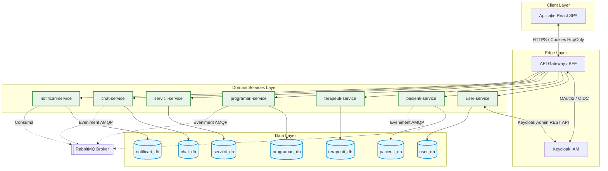
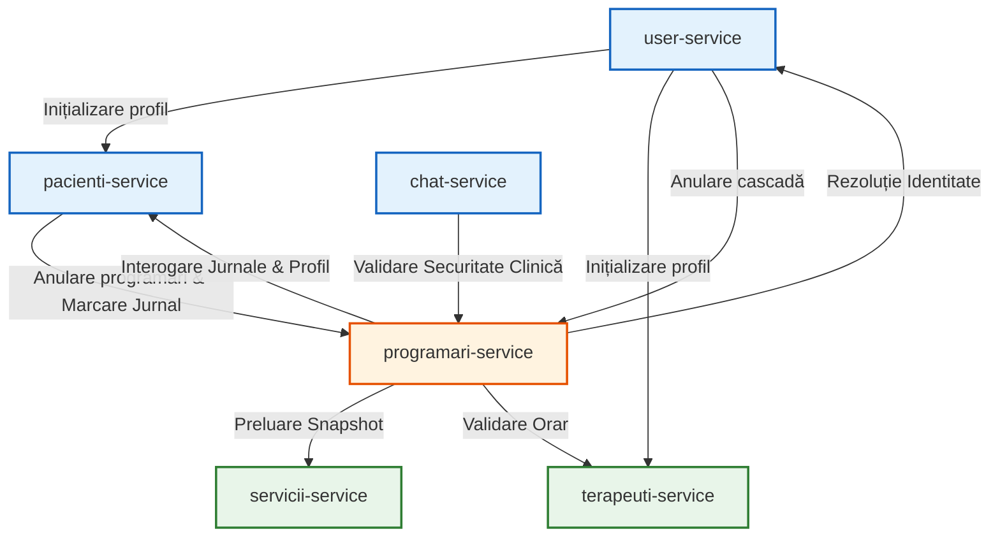
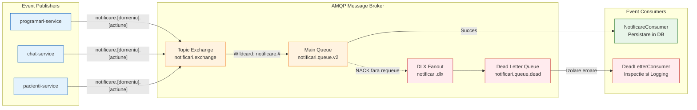
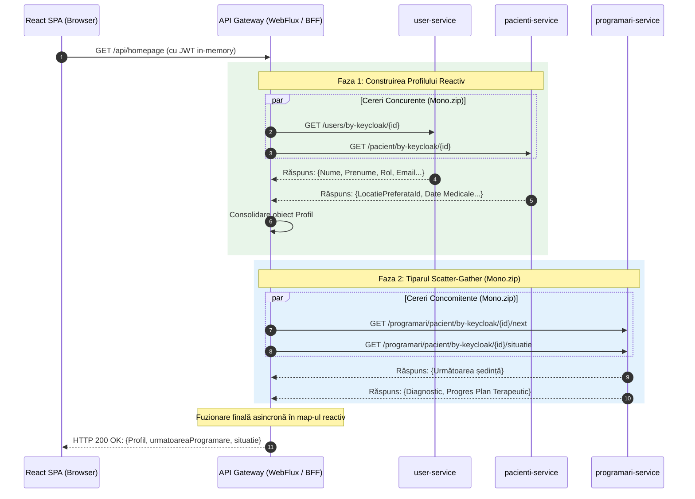
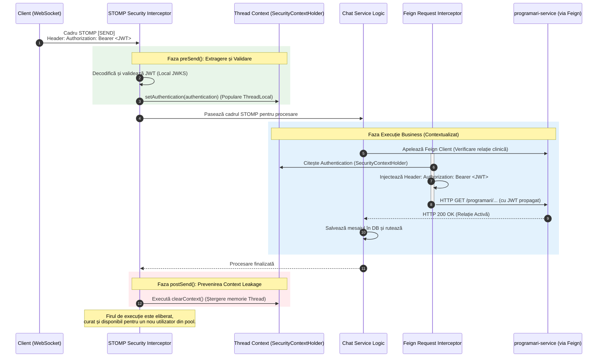
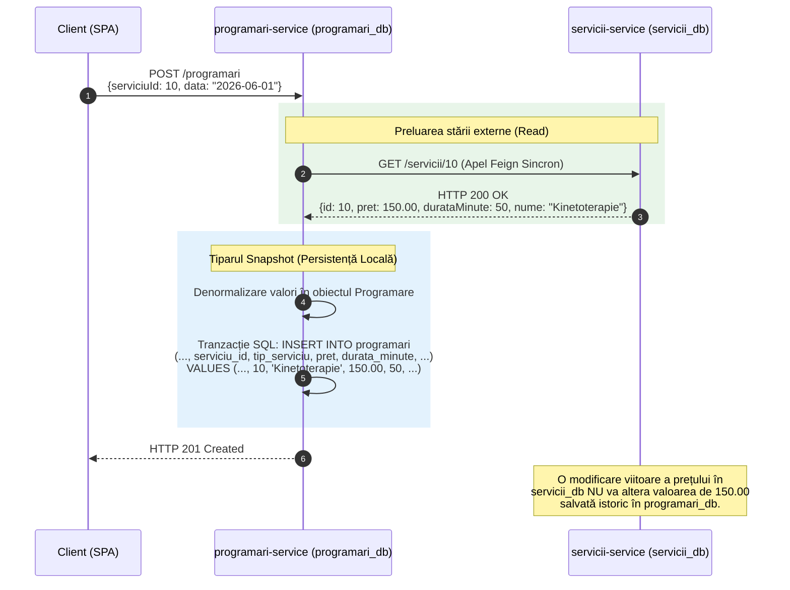

# Capitolul 4. Arhitectura Sistemului

Acest capitol descrie în detaliu arhitectura distribuită a platformei KinetoCare, evidențiind topologia microserviciilor și delimitarea riguroasă a contextelor logice de *business*. Sunt analizate fluxurile de comunicare sincronă și asincronă, structura și rolul de agregare reactivă al API *Gateway*-ului, modelul de securitate descentralizat de tip *Zero-Trust* și, în final, strategia de izolare a persistenței prin tiparul *Database-per-Service* și mecanismele compensatorii pentru garantarea integrității datelor.

## 4.1 Harta microserviciilor și delimitarea contextelor (*Bounded Contexts*)

Această secțiune expune organizarea structurală a platformei KinetoCare, detaliind delimitarea strictă a contextelor logice de *business* (*Bounded Contexts*) și maparea acestora sub forma unor componente autonome de execuție. Este definit pilonul central al integrării distribuite — cheia universală de pivotare — și este prezentată topologia generală a rețelei interne de microservicii.

### 4.1.1 Structura de ansamblu a sistemului

Sistemul KinetoCare este organizat în opt unități de execuție complet independente (*deployable units*), stratificate pe patru niveluri arhitecturale cu responsabilități strict delimitate:

- **Nivelul client (*Client Layer*):** Aplicația de interfață utilizator (*React SPA*) reprezintă canalul exclusiv de interacțiune vizuală pentru toate categoriile de actori (pacienți, terapeuți, administratori).
- **Nivelul de margine (*Edge Layer*):** API *Gateway*-ul și serverul de identitate Keycloak formează perimetrul de securitate al platformei față de exterior. *Gateway*-ul guvernează rutarea și agregarea datelor, în timp ce Keycloak gestionează exclusiv ciclurile de autentificare.
- **Nivelul serviciilor de domeniu (*Domain Services Layer*):** Șapte microservicii *backend*, fiecare guvernând un singur domeniu delimitat logic (*Bounded Context*).
- **Nivelul de date (*Data Layer*):** Șapte scheme de baze de date relaționale complet izolate, fiecare aflată în posesia exclusivă a unui singur microserviciu, garantând decuplarea la nivel de persistență.

O regulă arhitecturală fundamentală a sistemului stipulează că niciun microserviciu nu accesează direct schema de date a altui serviciu; orice necesitate de date inter-domenii este rezolvată exclusiv prin intermediul contractelor API formalizate.

### 4.1.2 Delimitarea contextelor de domeniu (*Bounded Contexts*)

Delimitarea contextelor reflectă granițele naturale ale proceselor de *business* dintr-o clinică de recuperare medicală, aplicând principiile *Domain-Driven Design* (*DDD*). Fiecare context deține un model propriu de date, un limbaj ubicuu (*Ubiquitous Language*) și un mecanism independent de persistență.

**Contextul de identitate și autentificare (`user-service`)**

Acest context încapsulează modelul canonic al utilizatorului din perspectiva securității. Entitatea principală stochează atributele de bază (e-mail, nume, date de contact, roluri) și funcționează ca un strat de abstractizare peste furnizorul extern de identitate (*Identity Provider*) Keycloak. Operațiunile de creare, suspendare sau recuperare a conturilor sunt delegate către Keycloak, în timp ce baza de date locală acționează ca o oglindă optimizată pentru a deservi interogările rapide de la nivelul rețelei interne. O responsabilitate critică a acestui context este orchestrarea cascadei de dezactivare: la suspendarea unui cont, starea este propagată prin apeluri sincrone către profilurile medicale și sistemul de programări, pentru a invalida operațiunile viitoare.

**Contextul profilului clinic (`pacienti-service`)**

Acest domeniu extinde identitatea de bază cu atributele specifice istoricului medical (date demografice sensibile, detalii despre activitatea sportivă și preferințe clinice). O responsabilitate distinctă în cadrul acestui context o reprezintă gestionarea jurnalului subiectiv de progres — un mecanism prin care feedback-ul pacientului este capturat după fiecare intervenție terapeutică. Izolarea acestor informații de contextul de identitate garantează un nivel superior de confidențialitate a datelor clinice.

**Contextul resurselor umane și disponibilității (`terapeuti-service`)**

Acest microserviciu modelează subdomenii puternic coezive: profilul profesional, infrastructura fizică (catalogul de locații ale clinicii) și managementul timpului (ferestre de disponibilitate și perioade de concediu). Din perspectivă topologică, funcționează ca un nod-frunză (*leaf node*) în graful dependențelor: nu inițiază apeluri de rețea către alte componente, ci este exclusiv interogat pentru validarea conflictelor de orar la inițierea rezervărilor. Activele media (fotografiile de profil) sunt stocate direct în schema bazei de date (codificate *Base64*), simplificând arhitectura prin evitarea introducerii unui serviciu terț de tip *Object Storage* pentru un volum marginal de date.

**Contextul tranzacțional clinic (`programari-service`)**

Nucleul orchestrator al sistemului reunește patru entități cu cerințe stricte de consistență locală: Programare, Relație Terapeutică, Evaluare și Evoluție. Co-localizarea lor este deliberată: o evaluare medicală este dependentă logic și tranzacțional de programarea care a declanșat-o; separarea în microservicii distincte ar fi impus protocoale complexe de coordonare distribuită. Tot în cadrul acestui context se aplică tiparul *Snapshot* (justificat detaliat în secțiunea 4.5.4) prin denormalizarea prețului și a duratei serviciilor medicale la momentul creării programării, garantând imuabilitatea istorică și corectitudinea auditului financiar.

**Contextul catalogului de servicii (`servicii-service`)**

Gestionează taxonomia intervențiilor medicale și politica tarifară. Este implementată o logică de căutare tolerantă la variații (căutare ierarhică cu proceduri de rezervă/*fallback* pe categorii), permițând componentei de programări să deducă automat serviciul corect fără a crea un cuplaj rigid la nivelul identificatorilor din baza de date.

**Contextul mesageriei în timp real (`chat-service`)**

Gestionează canalul de comunicație sincronă combinând o interfață *REST* pentru persistența arhivelor cu un flux *WebSocket*/*STOMP* pentru comunicarea instantanee. O caracteristică arhitecturală de siguranță este verificarea activă a validității relației clinice: transmiterea mesajelor este blocată dacă nu este confirmat, printr-un apel sincron, că pacientul se află încă sub îngrijirea terapeutului destinatar.

**Contextul reactiv de notificări (`notificari-service`)**

Acționează ca un colector de evenimente asincrone, cu un rol pur reactiv. Consumă mesaje de pe magistrala *AMQP*, le consolidează și expune un panou de notificări acționabile, decuplând complet procesul de alertare de logica tranzacțională a celorlalte module.

### 4.1.3 Cheia universală de pivotare: identificatorul extern

Deoarece modelul *Database-per-Service* previne utilizarea interogărilor SQL care unesc date din scheme diferite, platforma adoptă o convenție globală de referențiere bazată pe un identificator extern (`keycloakId`). Acest UUID, generat și garantat ca imutabil de către furnizorul extern de identitate, este utilizat ca o cheie externă logică (fără constrângeri fizice) în toate bazele de date. Utilizarea unui pivot universal elimină dependența arhitecturală limitativă a identificatorilor auto-incrementali locali (*auto-increment*) — care nu posedă semnificație în afara propriului microserviciu — și asigură o trasabilitate coerentă a datelor la nivelul întregului sistem.

### 4.1.4 Topologia arhitecturală a sistemului

Reprezentarea vizuală de mai jos ilustrează distribuția pe niveluri a componentelor, fluxurile de date și separarea strictă a contextelor de persistență. Se remarcă decuplarea asincronă a modulului de notificări prin intermediul brokerului de mesaje RabbitMQ.



## 4.2 Fluxul de comunicare inter-servicii: sincron vs. asincron

Această secțiune detaliază regulile arhitecturale care guvernează decizia de utilizare a comunicării sincrone (HTTP/REST) față de cea asincronă (AMQP), analizând matricea dependențelor și proprietățile topologice ale grafului de execuție.

### 4.2.1 Principiul de selecție a stilului de comunicare

Platforma KinetoCare utilizează două stiluri distincte de comunicare inter-servicii, selectate pe baza unui principiu arhitectural strict: **stilul de comunicare este guvernat de semantica operațională și de constrângerile de coeziune temporală**.

- **Comunicarea sincronă (HTTP/REST):** Este utilizată exclusiv atunci când componenta producătoare prezintă o dependență tranzacțională imediată de răspunsul componentei consumatoare pentru a-și putea finaliza propriul flux de execuție. Eșecul unui apel sincron invalidează operația curentă și declanșează un mecanism de tratare a erorilor.
- **Comunicarea asincronă (AMQP):** Este utilizată pentru evenimentele de tip *fire-and-forget* — situații în care o componentă își finalizează operația de bază și semnalează faptul împlinit către restul sistemului. Această decuplare spațială și temporală garantează că indisponibilitatea temporară a consumatorilor nu afectează disponibilitatea componentei producătoare.

### 4.2.2 Comunicarea sincronă și rezoluția dependențelor

**Mecanismul de propagare a contextului de securitate**

Într-o arhitectură de tip *Zero-Trust*, absența propagării identității între componente ar conduce la respingerea cererilor interne. Această problemă este rezolvată prin clienți HTTP declarativi bazați pe tiparul *Interceptor*. La fiecare cerere de ieșire, jetonul criptografic (*JWT*) este extras din contextul firului de execuție activ și injectat automat în antetele apelului. Astfel, validarea securității funcționează uniform, indiferent dacă cererea provine de la un utilizator extern sau de la un alt microserviciu.

*Excepția arhitecturală asumată:* Singura abatere de la acest flux o reprezintă faza de înregistrare a utilizatorilor noi (`user-service`), care interacționează cu profilele medicale ocolind interceptorul de securitate. Această excepție este fundamentată de realitatea procesului de inițializare: la momentul înregistrării, un JWT valid nu a fost încă emis; apelurile de inițializare a profilelor din componentele *downstream* sunt realizate direct, server-la-server, printr-un client simplu de tip `RestTemplate`, fără context de autentificare.

**Matricea interacțiunilor sincrone**

Tabelul următor documentează relațiile de dependență directă (apeluri sincrone HTTP/Feign) dintre contextele delimitate:

| Context apelant | Context destinație | Justificarea integrării sincrone |
|:---|:---|:---|
| `user-service` | `pacienti-service` | Inițializarea profilului medical (la înregistrare) și propagarea stării active (activare/dezactivare cont). |
| `user-service` | `terapeuti-service` | Inițializarea fișei profesionale (la înregistrare) și propagarea stării active (activare/dezactivare cont). |
| `user-service` | `programari-service` | Declanșarea anulării automate a tuturor programărilor viitoare la suspendarea unui cont. |
| `pacienti-service` | `programari-service` | Declanșarea cascadei de anulare a rezervărilor active la schimbarea terapeutului curent și înregistrarea completării jurnalului. |
| `programari-service` | `servicii-service` | Extragerea datelor financiare și temporale (preț, durată, nume) la momentul rezervării (Tiparul *Snapshot*). |
| `programari-service` | `terapeuti-service` | Validarea orarului, a intervalelor de disponibilitate, a conflictelor de concediu și a asocierii locației fizice. |
| `programari-service` | `user-service` | Rezoluția identității pacienților/terapeuților (nume, prenume, detalii contact) pentru asamblarea fișei clinice și calendarului. |
| `programari-service` | `pacienti-service` | Actualizarea terapeutului preferat la schimbarea relației terapeutice și interogarea jurnalelor medicale pentru fișa pacientului. |
| `chat-service` | `programari-service` | Validarea securității clinice (existența unei relații terapeutice active) anterior stabilirii conexiunilor *WebSocket*. |

**Analiza topologiei grafului de execuție**

Analiza dependențelor relevă proprietăți structurale esențiale pentru stabilitatea sistemului distribuit:

- **Componente de tip nod-frunță (*leaf nodes*):** `terapeuti-service` și `servicii-service` nu inițiază niciun apel sincron către alte componente. Această decuplare totală permite scalarea lor independentă și aplicarea unor strategii robuste de *cache* local, reducând semnificativ suprafața totală de blocaj a rețelei.
- **Nucleul orchestrator:** `programari-service` acționează ca un nod central cu cel mai mare grad de conectivitate (*in-degree* și *out-degree*), centralizând regulile tranzacționale de *business* ale fluxului clinic.
- **Prevenirea impasurilor distribuite (*distributed deadlocks*):** Deși există o dependență logică bidirecțională între `programari-service` și `pacienti-service` la nivel global, sistemul respectă proprietatea *Directed Acyclic Graph* (DAG) la nivelul fiecărui fir de execuție tranzacțional. Nicio operațiune declanșată din `pacienti-service` (de exemplu, alegerea unui nou terapeut) nu generează un apel de retur (*callback*) în interiorul aceluiași context de stivă. Similar, fluxurile de citire din `programari-service` interoghează pasiv date din `pacienti-service`. Caracterul aciclic al fluxurilor individuale garantează eliminarea riscului de așteptare circulară distribuită (*circular wait*) între tranzacțiile bazelor de date separate.



### 4.2.3 Comunicarea asincronă și tiparul *Event-Driven* (*EDA*)

Pentru operațiunile care tolerează un model de consistență eventuală (*eventual consistency*), platforma implementează modelul arhitectural bazat pe evenimente (*Event-Driven Architecture — EDA*) utilizând un broker central de mesaje.

**Topologia de rutare a evenimentelor**

Infrastructura asincronă este gestionată printr-un schimbător de tip *TopicExchange*. Componentele operaționale publică fapte imutabile utilizând chei de rutare semantice, respectând principiul *Open/Closed*: infrastructura este deschisă pentru a accepta noi tipuri de notificări, fără a necesita modificarea codului consumatorilor existenți.

| Serviciu producător | Cheie de rutare semantică | Fapt împlinit (eveniment) |
|:---|:---|:---|
| `programari-service` | `notificare.programare.noua` | Confirmarea unei rezervări de slot clinic. |
| `programari-service` | `notificare.evaluare.initiala` | Alocarea unei programări de tip Evaluare Inițială. |
| `programari-service` | `notificare.reevaluare.necesara` | Alocarea unei programări de tip Reevaluare. |
| `programari-service` | `notificare.programare.anulata.pacient` | Invalidarea unui slot din inițiativa pacientului. |
| `programari-service` | `notificare.programare.anulata.terapeut` | Invalidarea unui slot din inițiativa terapeutului. |
| `programari-service` | `notificare.reminder.jurnal` | Declanșarea ferestrei de colectare a feedback-ului după finalizarea ședinței. |
| `programari-service` | `notificare.reminder.24h` / `notificare.reminder.2h` | Alerte temporale transmise înaintea începerii programării. |
| `programari-service` | `notificare.reevaluare.recomandata` | Notificarea pacientului că a atins pragul maxim de ședințe și necesită reevaluare. |
| `pacienti-service` / `programari-service` | `notificare.jurnal.completat` | Notificarea terapeutului că pacientul a completat jurnalul asociat ședinței. |
| `chat-service` | `notificare.mesaj.nou` | Avertizarea unui utilizator inactiv privind primirea unei noi comunicări. |

**Toleranța la erori prin *Dead Letter Queue* (DLQ)**

Într-un sistem de procesare pe cozi, coruperea unui pachet de date poate genera o buclă infinită de eșecuri. Arhitectura platformei previne acest scenariu: dacă componenta consumatoare raportează o eroare de procesare, cadrul AMQP emite un semnal *NACK* (confirmare negativă), refuzând reintroducerea mesajului în coadă. Mesajul problematic este dirijat automat de broker către coada dedicată mesajelor abandonate (*Dead Letter Queue*). Consumatorul acestei cozi este proiectat explicit să absoarbă propriile excepții interne, prevenind o buclă infinită la nivelul containerului de mesagerie.

*Notă de operabilitate:* Adăugarea indicativului de versiune (`v2`) la coada principală reprezintă soluționarea documentată a unei constrângeri intrinseci ale serverului de mesagerie, a cărui arhitectură refuză alterarea retroactivă a parametrilor structurali de rutare pentru obiectele deja alocate.



### 4.2.4 Analiza decizională a topologiei de integrare

Pentru a standardiza implementarea și a elimina ambiguitatea structurală în cazul extensiilor viitoare ale platformei, decizia de implementare a rutelor de comunicare se bazează pe matricea decizională de mai jos.

| **Criteriu de evaluare** | **Integrare sincronă (HTTP/REST)** | **Integrare asincronă (AMQP)** |
|:---|:---|:---|
| **Continuitatea fluxului de lucru** | Componenta apelantă depinde de răspuns pentru a finaliza operația curentă. | Componenta apelantă a finalizat mutația, semnalând doar modificarea stării. |
| **Profilul de disponibilitate** | Critic — indisponibilitatea destinației invalidează tranzacția apelantului. | Flexibil — mesajul persistă în broker până la restabilirea destinației. |
| **Garanțiile consistenței** | Transparență tranzacțională imediată, în cadrul aceleiași cereri de rețea. | Transparență bazată pe modelul de consistență eventuală (*best-effort*). |
| **Gestionarea erorilor** | Excepția de rețea se propagă imediat ca eroare HTTP 5xx. | Excepția locală determină izolarea mesajului defect în coada de carantină DLQ. |

Această segmentare garantează că orice operațiune corelată logic cu actul clinic este validată atomic, în timp ce logistica secundară — audit, raportare, alertare — se supune principiilor non-blocante, menținând stabilitatea de ansamblu a platformei.

## 4.3 API *Gateway* și tiparul *Backend-For-Frontend* (*BFF*)

Această secțiune analizează în detaliu rolurile îndeplinite de componenta API *Gateway* la marginea sistemului distribuit. Sunt prezentate mecanismele de rutare a traficului, politicile de izolare a jetoanelor de securitate și modul în care stiva reactivă WebFlux facilitează agregarea performantă de date prin tiparul *Backend-For-Frontend* (*BFF*).

### 4.3.1 Rolurile duale ale API *Gateway*-ului

În arhitectura platformei KinetoCare, componenta API *Gateway* nu funcționează ca un simplu rutor de rețea, ci implementează simultan două roluri arhitecturale distincte, fundamentate pe stiva reactivă Spring WebFlux:

- ***Proxy* invers transparent (*Edge Router*):** Pentru marea majoritate a cererilor, *Gateway*-ul acționează ca o barieră de trecere. Căile de acces sunt normalizate prin eliminarea prefixelor externe, iar cererile sunt direcționate către componentele responsabile pentru domeniul respectiv.
- **Orchestrator *Backend-For-Frontend* (*BFF*):** Pentru interfețele complexe care necesită asamblarea datelor din multiple domenii, *Gateway*-ul funcționează ca un agregator activ. Sunt orchestrate apeluri paralele către microservicii, iar răspunsurile sunt consolidate într-o structură unică de date, livrată clientului.

Această separare a responsabilităților garantează un nivel ridicat de mentenabilitate: logica pură de rutare este definită declarativ prin configurații externe, în timp ce logica de agregare *BFF* este izolată programmatic în controlere și componente dedicate.

### 4.3.2 Strategia de rutare și normalizarea traficului

Mecanismul de rutare aplică un model de evaluare ordonată și secvențială, prevenind anomaliile de tip potrivire ambiguă. O consecință directă a proiectării bazate pe *Domain-Driven Design* se reflectă în expunerea componentei `terapeuti-service`. Deși entitățile de specialitate (profil profesional, locații fizice, matrice de disponibilitate și concedii) aparțin aceluiași context delimitat, ele sunt expuse ca resurse *REST* distincte. Rutarea impune evaluarea prioritizată a căilor specifice înaintea identificatorului general al componentei, prevenind coliziunile de potrivire.

La nivel global, *Gateway*-ul centralizează normalizarea politicilor *Cross-Origin Resource Sharing* (*CORS*). Prin filtrele de deduplicare aplicate la marginea rețelei, arhitectura previne coruperea răspunsurilor HTTP — o problemă recurentă în sistemele distribuite în care componentele din aval adaugă redundant propriile directive *CORS*.

### 4.3.3 Medierea securității: izolarea jetoanelor criptografice

O responsabilitate critică a *Gateway*-ului, anterioară oricărei agregări de date, este medierea procesului de autentificare. *Endpoint*-urile de obținere și revocare a sesiunii sunt exceptate de la filtrele standard de validare JWT, constituind tocmai punctele de generare a acestora.

Pentru a neutraliza vulnerabilitățile de tip *Cross-Site Scripting* (*XSS*) inerente aplicațiilor *SPA*, *Gateway*-ul implementează separarea și izolarea jetoanelor:

1. *Proxy*-ul primește credențialele brute, asamblează o cerere securizată cu datele clientului intern și o expediază către serverul Keycloak.
2. La primirea răspunsului de la furnizorul de identitate, *Gateway*-ul interceptează structura JSON ce conține atât jetonul de acces cu viață scurtă, cât și jetonul de reîmprospătare cu viață lungă.
3. Jetonul de reîmprospătare (*refresh token*) este extras din corpul răspunsului și injectat într-un antet `Set-Cookie` marcat cu directivele `HttpOnly` și `SameSite=Lax`.

Prin această arhitectură, mediul JavaScript din browser primește și manipulează exclusiv jetonul volatil de acces, în timp ce jetonul responsabil pentru menținerea sesiunii rămâne invizibil codului client, gestionat exclusiv de mecanismele interne ale browserului la instrucțiunile *Gateway*-ului.

### 4.3.4 Arhitectura BFF și execuția asincronă prin tiparul *Scatter-Gather*

Tiparul *Backend-For-Frontend* răspunde direct problemei penalizărilor de latență din rețelele publice (*N+1 round-trips*). Dacă un panou de bord clinic ar solicita date de identitate, programări și profil medical prin cereri individuale ale browserului, costul negocierii TCP/TLS s-ar multiplica corespunzător numărului de apeluri.

*Gateway*-ul neutralizează această latență mutând faza de colectare a datelor în interiorul rețelei virtuale a *cluster*-ului, unde latența inter-servicii se situează la ordinul microsecundelor. Prin intermediul bibliotecii *Project Reactor*, *Gateway*-ul implementează tiparul *Scatter-Gather*: cereri paralele sunt lansate către componentele țintă, finalizarea tuturor este așteptată non-blocant, iar răspunsurile sunt consolidate. O proprietate arhitecturală esențială a acestei implementări este **degradarea grațioasă**: în cazul în care un microserviciu secundar raportează o eroare, fluxul reactiv interceptează eroarea, o absoarbe și asamblează un răspuns parțial valid, prevenind colapsul întregii interfețe.

### 4.3.5 Componentele strategice de agregare

Logica de consolidare a datelor este distribuită pe patru controllere specializate:

1. **Agregatorul tabloului de bord (*Homepage*):** Furnizează datele contextualizate pentru pagina de start. Pentru pacienți, este executată o orchestrare asincronă în două faze: profilul clinic consolidat este preluat concomitent cu determinarea celei mai apropiate programări și a stadiului din planul curent de recuperare medicală.

2. **Consolidatorul de profil (*Profile*):** Cea mai complexă asamblare statică, necesitând până la 5 apeluri interne paralele. Datele de identitate sunt reunite asincron cu istoricul clinic, detaliile terapeutului alocat și locația fizică a clinicii, coliziunile de identificatori fiind rezolvate înainte de livrarea structurii plate către interfață. Metoda funcționează bidirecțional, gestionând decompunerea și distribuția paralelă a actualizărilor profilului.

3. **Orchestratorul interfeței de mesagerie (*Chat*):** Generează conversații virtuale la nivel de *Gateway* utilizând tiparul *Virtual Proxy* — un obiect surogat în memorie pentru canalul de comunicare. Persistența fizică a conversației în baza de date este amânată prin Inițializare Leneșă (*Lazy Initialization*) în `chat-service`, până la expedierea primului mesaj efectiv. Rezoluția în masă (*batch resolution*) a identităților este inclusă pentru a minimiza interogările suplimentare.

4. **Motorul de căutare (*Search*):** Optimizează procesul de alocare a terapeutului combinând rezultatele de filtrare geografică și profesională cu rezoluția identităților prin procesare în lot, esențială pentru eficiența la scară largă.

### 4.3.6 Asimetria paradigmelor tehnologice: WebFlux vs. MVC

Stiva reactivă Spring WebFlux este adoptată exclusiv la nivelul API *Gateway*-ului, în timp ce microserviciile din aval rulează pe un model imperativ, blocant — Spring MVC.

Această asimetrie reflectă profilurile de operare structural diferite ale componentelor. *Gateway*-ul execută operațiuni cu intensitate ridicată pe rețea: lansează cereri HTTP multiple și așteaptă răspunsuri concurente. Modelul reactiv bazat pe bucla de evenimente gestionează eficient acest tipar cu un consum minim de fire de execuție. Microserviciile de domeniu execută operațiuni tranzacționale asupra bazelor de date prin drivere relaționale blocante (JDBC); introducerea programării reactive la acel nivel nu ar aduce beneficii reale de performanță, ci ar crește artificial complexitatea codului și dificultatea depanării. Restrângerea stivei reactive strict la nivelul de agregare demonstrează o aplicare controlată a principiului de minimizare a complexității accidentale.

### 4.3.7 Analiza arhitecturală a amplasării agregării de date

Arhitectura platformei prezintă două instanțe de agregare complexă, plasate deliberat în niveluri arhitecturale diferite:

| **Criteriu de evaluare** | **Tipar BFF în API *Gateway*** | **Agregarea locală în `programari-service`** |
|:---|:---|:---|
| **Profil de execuție** | Asincron, non-blocant, concurent | Secvențial, blocant, intensiv pe baza de date |
| **Sfera interogărilor** | Determinată, număr fix de apeluri (max. 5) | Variabilă, proporțională cu volumul datelor clinice |
| **Aria de acoperire** | 3 microservicii distincte decuplate | 4 contexte tranzacționale aparținând aceluiași domeniu |
| **Problema N+1 interogări** | Rezolvată prin interogări de tip *batch* | Prezentă, gestionată prin *fallback* defensiv per apel |
| **Justificare arhitecturală** | Consolidarea datelor disparate pentru prezentarea vizuală | Necesitatea garantării consistenței locale a istoricului clinic |

Construirea dosarului clinic complet a fost menținută în cadrul `programari-service` (în loc să fie mutată în *Gateway*) din rațiuni de coeziune a datelor. Accesul direct la baza de date locală este esențial pentru eficiența extragerii evaluărilor și a notelor de evoluție. Preluarea individuală a acestora prin conexiuni HTTP în interiorul *Gateway*-ului ar fi transformat o problemă de interogare internă (*N+1* local) într-un fenomen distructiv de tip *N+1* distribuit la nivel de rețea, cu impact sever asupra performanței platformei.

### 4.3.8 Reprezentarea vizuală a agregării BFF

Diagrama de secvență de mai jos ilustrează procesul de orchestrare reactivă (tiparul *Scatter-Gather*) executat de API *Gateway* pentru generarea tabloului de bord, evidențiind capacitatea sa de a abstractiza complexitatea microserviciilor față de aplicația client.



## 4.4 Modelul de securitate *Zero-Trust* distribuit

Secțiunea curentă detaliază principiile de securitate aplicate în cadrul platformei KinetoCare, cu focalizare pe modelul *Zero-Trust* și validarea locală descentralizată a jetoanelor de acces. Este documentată, de asemenea, soluția tehnică pentru securizarea canalelor persistente de tip WebSocket/STOMP.

### 4.4.1 Principiul lipsei de încredere implicită (*de-perimeterization*)

Arhitectura de securitate a platformei KinetoCare respinge modelul tradițional de securitate perimetrală — modelul „castel și șanț de apărare" — în favoarea paradigmei *Zero-Trust*. În sistemele distribuite clasice se presupunea frecvent că o cerere care a traversat punctul unic de intrare și circulă în interiorul rețelei virtuale este implicit autentificată și sigură.

Sistemul curent invalidează această premisă. Deși API *Gateway*-ul intermediază traficul și validează autentificarea la granița rețelei, microserviciile din aval nu deleagă responsabilitatea securității. Fiecare microserviciu acționează ca un server de resurse (*Resource Server*) distinct, validând independent și complet orice jeton *JWT* recepționat, fără a acorda încredere implicită rețelei interne.

### 4.4.2 Descentralizarea validării criptografice (JWKS)

Pentru a evita transformarea serverului de identitate (Keycloak) într-un blocaj de performanță (*bottleneck*) prin interogări sincrone la fiecare cerere, validarea identității este realizată descentralizat.

Integrarea transparentă este facilitată de un mecanism de chei publice (*Public Key Infrastructure*). Fiecare componentă de domeniu interoghează la pornire *endpoint*-ul expus de *Identity Provider* pentru a obține setul de chei publice (*JSON Web Key Set — JWKS*). Aceste chei sunt păstrate în *cache*-ul local al microserviciului și utilizate pentru a valida semnătura asimetrică (de exemplu, algoritmul RS256) a jetoanelor extrase din antetul HTTP `Authorization: Bearer`.

În urma verificării semnăturii criptografice, rolurile extrase din structura jetonului sunt traduse programatic într-un format standardizat, compatibil cu primitivele de evaluare ale sistemului de securitate local.

### 4.4.3 Autorizare stratificată și apărare în profunzime (*Defense in Depth*)

Controlul accesului pe bază de roluri (*RBAC*) este distribuit pe două straturi arhitecturale, cu obiectivul respingerii timpurii a cererilor neautorizate (*fail-fast*):

- **Stratul de margine (API *Gateway*):** Aplică o politică grosieră de filtrare, blocând instantaneu traficul neautorizat și limitând expunerea rutelor cu potențial distructiv — operațiunile de modificare asupra cataloagelor clinice sunt rezervate exclusiv rolului de administrator, direct la poarta rețelei.
- **Stratul de domeniu (microserviciul local):** Odată ce o cerere validă a fost propagată în interior, componenta destinație aplică evaluări de securitate direct la nivelul logicii de *business*, garantând că acțiunea specifică solicitată este permisă în contextul clinic curent al utilizatorului.

### 4.4.4 Complexitatea securizării canalelor persistente (STOMP/WebSocket)

Implementarea modelului *Zero-Trust* a generat o provocare arhitecturală critică la nivelul componentei de mesagerie în timp real (`chat-service`).

**Problematica decalajului de protocol**

Filtrele de securitate standard guvernează ciclul cerere-răspuns specific HTTP. În cazul comunicației *WebSocket*, interacțiunea debutează ca o cerere HTTP standard, suferă o tranziție de protocol (*HTTP 101 Switching Protocols*) și se transformă într-un canal TCP persistent și bidirecțional. Odată stabilit acest canal, comunicarea prin cadre *STOMP* ocolește complet lanțul tradițional de filtre HTTP de securitate.

Această evaziune de protocol intră în conflict cu o regulă strictă de *business*: expedierea oricărui mesaj impune validarea activă a relației terapeutice printr-un apel sincron (prin OpenFeign) către `programari-service`. Mecanismul de comunicare inter-servicii se bazează pe extragerea jetonului de securitate din contextul firului de execuție (`ThreadLocal`). Deoarece cadrele *STOMP* ocolesc inițializarea de securitate HTTP, contextul firului rămâne vid, cauzând eșecul apelurilor de rețea subiacente cu eroarea `401 Unauthorized`.

**Soluția tehnică: interceptarea la nivel de protocol și curățarea contextului**

Pentru a restabili lanțul de încredere, a fost proiectat un interceptor dedicat la nivelul canalului de mesaje *STOMP*:

1. **Faza de inspecție (`preSend`):** La detectarea cadrelor critice de inițiere sau transmisie de date, interceptorul extrage jetonul *JWT* transmis explicit în antetele native ale protocolului *STOMP*.
2. **Re-inițializarea programatică a contextului:** Jetonul este verificat criptografic local, iar profilul de securitate rezultat este injectat în contextul firului de execuție curent (`SecurityContextHolder`), permițând tuturor componentelor din aval — inclusiv clienților Feign — să trateze cererea asincronă ca autentificată complet.
3. **Faza de curățare critică (`postSend`):** Deoarece motoarele de mesagerie reutilizează intensiv firele din *pool*-uri, un context de identitate lăsat atașat unui fir prezintă un risc de scurgere a identității (*context leakage*): un mesaj ulterior al altui utilizator ar putea fi procesat pe același fir, moștenind privilegiile precedentei sesiuni. Pentru a elimina acest vector de atac, o comandă de curățare completă a contextului (`clearContext`) este executată imediat după procesarea fiecărui cadru, distrugând orice referință reziduală.

### 4.4.5 Reprezentarea vizuală a securității asincrone (STOMP)

Diagrama de mai jos ilustrează ciclul de viață al propagării și distrugerii contextului de securitate pe un canal TCP persistent, detaliind soluția implementată pentru prevenirea suprapunerii de identitate în arhitecturile reactive.



## 4.5 Izolarea datelor și modelul persistenței (*Database-per-Service*)

Această secțiune descrie decuplarea la nivel de persistență prin intermediul tiparului *Database-per-Service*, analizând beneficiile deciziei de izolare a bazelor de date. Sunt prezentate, de asemenea, strategiile utilizate pentru menținerea integrității logice a datelor clinice, denormalizarea prin tiparul *Snapshot* și mecanismul de auditabilitate conform cerințelor GDPR.

### 4.5.1 Arhitectura descentralizată a stratului de date

Platforma KinetoCare implementează tiparul arhitectural *Database-per-Service*, distanțându-se de arhitecturile tradiționale monolitice în care o schemă relațională singulară deservește întregul ansamblu de module. Această decizie este fundamentală pentru garantarea autonomiei și independenței celor șapte microservicii de domeniu.

La nivel de infrastructură, din considerente de optimizare a resurselor hardware alocate mediului curent, sistemul utilizează o instanță unică de server MySQL care găzduiește simultan șapte scheme logice izolate. Din punct de vedere arhitectural, granițele sunt totuși impenetrabile: fiecare microserviciu deține propria configurație de conectare, tratând schema alocată ca pe o resursă fizică independentă. Instanțierea unei conexiuni directe de la o componentă către baza de date a altei componente este interzisă structural și procedural, la fel ca scrierea interogărilor SQL cu instrucțiuni de tip `JOIN` trans-schemă. Orice agregare de date inter-domenii se realizează exclusiv prin apeluri de rețea către contractele API oficiale.

### 4.5.2 Beneficiile decuplării la nivel de domeniu

Fragmentarea stratului de persistență generează avantaje arhitecturale esențiale pentru scalabilitatea și reziliența unei platforme clinice:

- **Limitarea razei de impact (*Fault Containment*):** La compromiterea sau defectarea unei resurse de stocare, sistemul intră într-o stare de degradare grațioasă, prevenind coruperea generalizată. De exemplu, dacă schema `chat_db` devine blocată sub trafic intens, procesul tranzacțional critic de planificare a ședințelor continuă neîntrerupt, protejat de contextul propriei baze de date, `programari_db`.
- **Evoluția autonomă a schemelor:** Microserviciile pot itera asupra propriilor modele de date independent. Componenta `servicii-service` poate adopta o structură nouă sau adăuga indecși fără ca migrarea să necesite coordonare cu celelalte echipe sau să afecteze disponibilitatea platformei.
- **Partiționarea resurselor operaționale:** Cerințele concurente ale sistemului prezintă tipare asimetrice. Prin izolarea componentelor, gestionarea grupurilor de conexiuni la baza de date prin HikariCP este partiționată. Un modul aflat sub stres intens (de exemplu, un val de interogări de mesaje) nu epuizează fondul universal de conexiuni, permițând altor module operaționale (de exemplu, raportările administrative) să funcționeze nealterat.

### 4.5.3 Integritatea relațională prin chei externe logice

O consecință directă a izolării schemelor este imposibilitatea aplicării constrângerilor de integritate referențială la nivelul motorului de baze de date — nu pot exista chei externe fizice (`FOREIGN KEY`) între scheme diferite. Pentru a menține asocierile semantice, arhitectura KinetoCare adoptă convenția cheilor externe logice.

Pilonul central al acestei integrări este identificatorul universal furnizat de *Identity Provider* (`keycloakId`). Această cheie acționează ca un pivot distribuit stabil. Componenta de programări stochează referințele `pacientKeycloakId` și `terapeutKeycloakId` ca șiruri de caractere de sine stătătoare. La momentul compunerii unei interfețe descriptive, componenta agregatoare lansează cereri către sursa absolută de adevăr a identității (`user-service`) pentru a rezolva datele vizuale (nume, gen). O abordare similară este utilizată pentru locațiile fizice (`locatieId`), stocate ca identificator abstract în fișa pacientului, cu validarea integrității delegată către `terapeuti-service`.

Această convenție demonstrează eliminarea unei dependențe toxice specifice sistemelor monolitice: utilizarea identificatorilor primari incrementali locali (*auto-increment*), care nu posedă unicitate globală la nivelul sistemului distribuit și nu pot servi ca referință stabilă dincolo de granița propriei tabele.

### 4.5.4 Denormalizarea controlată și tiparul *Snapshot*

În absența operațiunilor SQL de tip `JOIN` inter-scheme, menținerea performanței și a trasabilității auditului impune adoptarea unei strategii intenționate de denormalizare a datelor.

Implementarea curentă exemplifică această abordare prin aplicarea tiparului *Snapshot* în cadrul componentei `programari-service`. La momentul confirmării unei rezervări, `servicii-service` este interogat sincron, valorile instantanee ale atributelor `pret`, `durataMinute` și `tipServiciu` sunt extrase și salvate ca atribute locale ale entității `Programare`.

Această duplicare intenționată a datelor previne două categorii majore de deficiențe:

- **Evitarea latenței redundante:** Sunt eliminate cererile repetate pe rețea pentru randarea detaliilor de bază ale unui slot rezervat în calendar.
- **Garantarea imuabilității istorice și contabile:** Din perspectiva auditului clinic și financiar, o înregistrare tranzacționată trebuie să rămână inalterabilă. Dacă unitatea medicală modifică retroactiv tariful unui serviciu în nomenclator (de exemplu, de la 150 RON la 180 RON), un `JOIN` dinamic ar corupe fișele financiare, afișând tarifele noi pentru ședințe efectuate în trecut. Tiparul *Snapshot* îngheață starea financiară exact la momentul tranzacției, reflectând exigențele contabile fundamentale.

### 4.5.5 Reprezentarea vizuală a tiparului *Snapshot* în arhitectura distribuită

Diagrama de mai jos ilustrează logic procesul de denormalizare controlată, demonstrând modul în care un identificator extern este translatat într-o înregistrare locală imutabilă pentru a garanta izolarea datelor și auditabilitatea istorică.



### 4.5.6 Trasabilitatea modificărilor clinice și mecanismul de audit (*GDPR*)

Cerința non-funcțională §2.4.5 impune jurnalizarea automată a oricărei modificări aduse dosarului medical, cu marcaj temporal de precizie și identitatea operatorului. Această cerință este adresată printr-un mecanism de auditare JPA integrat la nivelul tuturor entităților clinice critice din platformă.

**Arhitectura prin moștenire: `BaseAuditableEntity`**

Mecanismul de auditare respectă principiul DRY prin centralizarea metadatelor de trasabilitate într-o super-clasă abstractă partajată, adnotată cu `@MappedSuperclass` și `@EntityListeners(AuditingEntityListener.class)`:

```java
@MappedSuperclass
@EntityListeners(AuditingEntityListener.class)
@SuperBuilder
@NoArgsConstructor
public abstract class BaseAuditableEntity {

    @CreatedBy
    @Column(name = "created_by", updatable = false, length = 36)
    private String createdBy;

    @LastModifiedBy
    @Column(name = "last_modified_by", length = 36)
    private String lastModifiedBy;

    @CreationTimestamp
    @Column(name = "created_at", nullable = false, updatable = false)
    private OffsetDateTime createdAt;

    @UpdateTimestamp
    @Column(name = "updated_at", nullable = false)
    private OffsetDateTime updatedAt;
}
```

Câmpurile `createdBy` și `lastModifiedBy` stochează UUID-ul Keycloak al operatorului autentificat (lungime fixă de 36 de caractere, corespunzătoare formatului UUID standard). Imutabilitatea câmpului `created_by` este garantată la nivel de schemă prin directiva `updatable = false`, prevenind alterarea retroactivă a identității creatorului original al înregistrării.

**Integrarea cu contextul de securitate distribuit (`JpaAuditingConfig`)**

Fiecare microserviciu auditat expune un bean `AuditorAware<String>` care interoghează `SecurityContextHolder` la momentul fiecărei tranzacții JPA. Implementarea extrage identificatorul unic al operatorului din câmpul `sub` al jetonului JWT Keycloak:

```java
@Bean
public AuditorAware<String> auditorProvider() {
    return () -> {
        Authentication auth = SecurityContextHolder.getContext().getAuthentication();
        if (auth == null || !auth.isAuthenticated()) return Optional.of("SYSTEM");
        Object principal = auth.getPrincipal();
        if (principal instanceof Jwt jwt) {
            String sub = jwt.getSubject();
            if (sub != null && !sub.isEmpty()) return Optional.of(sub);
        }
        return Optional.of("SYSTEM");
    };
}
```

Mecanismul de *fallback* automat la valoarea `"SYSTEM"` acoperă fluxurile asincrone de fundal (procesele `@Scheduled`, consumatorii RabbitMQ) în care nu există un context de autentificare HTTP activ, garantând că nicio înregistrare nu rămâne cu câmpul de audit necompletat.

**Acoperirea entităților auditate**

Mecanismul acoperă toate cele 11 entități tranzacționale și administrative din platformă, distribuite pe cinci microservicii:

| Microserviciu | Entități auditate |
|:---|:---|
| `programari-service` | `Programare`, `Evaluare`, `Evolutie`, `RelatiePacientTerapeut` |
| `pacienti-service` | `Pacient`, `JurnalPacient` |
| `servicii-service` | `Serviciu`, `TipServiciu` |
| `user-service` | `User` |
| `terapeuti-service` | `Terapeut`, `Locatie` |

Această acoperire garantează că orice modificare adusă unui diagnostic, unei note de evoluție, unui tarif de serviciu sau stării unui cont de utilizator este înregistrată cu marcaj temporal `OffsetDateTime` (cu fus orar) și identitatea UUID a operatorului, asigurând trasabilitatea completă a datelor clinice impusă de Regulamentul General privind Protecția Datelor (GDPR).
