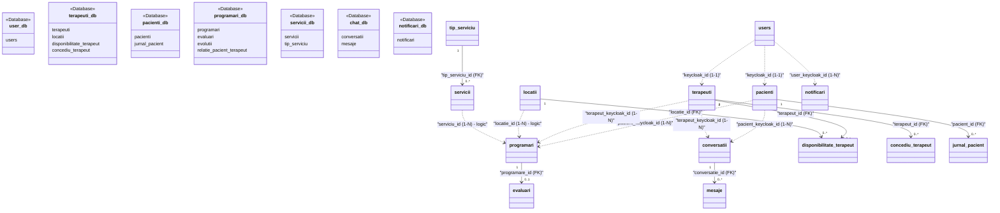

# Capitolul 5. Proiectarea și Modelarea Bazelor de Date Relaționale

## 5.1 Justificarea modelului relațional față de alternativele NoSQL

Arhitectura datelor din platforma KinetoCare a fost proiectată pornind de la o analiză a specificului domeniului clinic de recuperare. Spre deosebire de sistemele pur comerciale sau sociale, un sistem clinic manipulează date medicale cu regim special de protecție (dosarul pacientului, diagnostice, jurnale subiective de durere) și date tranzacționale cu impact operațional direct (programările pacienților, disponibilitatea terapeuților). Această dualitate a impus selectarea unui model de persistență care să garanteze simultan integritatea referențială și garanțiile tranzacționale ACID.

### 5.1.1 Caracteristicile domeniului care impun proprietăți ACID

Alegerea unui model relațional este justificată, în primul rând, de necesitatea respectării stricte a proprietăților **ACID** (*Atomicity, Consistency, Isolation, Durability*). În domeniul managementului clinic în kinetoterapie, absența garanțiilor tranzacționale puternice poate genera anomalii cu impact clinic și operațional direct:

1. **Atomicitate:** Înregistrarea unui pacient sau confirmarea unei programări presupune scrieri corelate în mai multe tabele (de exemplu, setarea simultană a indicatorului `are_evaluare = true` pe programare și crearea fișei de evaluare aferente). Dacă salvarea programării eșuează, nicio modificare clinică *downstream* nu trebuie să persiste, ambele operațiuni fiind încapsulate în aceeași graniță tranzacțională (`@Transactional`).
2. **Consistență:** Modelul de *business* impune reguli de integritate stricte (de exemplu, o programare trebuie să fie asociată unui serviciu activ existent în catalog, iar o evaluare trebuie asociată unei programări existente). Modelul relațional permite validarea acestor reguli direct la nivelul schemei fizice, prin constrângeri de tip `FOREIGN KEY` în cadrul aceleiași scheme (de exemplu, `evaluari.programare_id → programari.id`).
3. **Izolare:** Rezervările concurente ale pacienților reprezintă surse clasice de condiții de cursă (*race conditions*). Utilizarea unui model cu izolare robustă asigură că două operațiuni concurente nu pot citi simultan un slot ca disponibil și confirma ambele scrierea în baza de date. Un model NoSQL axat pe consistență eventuală (*eventual consistency*) ar tolera anomalii temporare, permițând rezervarea dublă a aceluiași terapeut în același interval orar — o stare inacceptabilă din perspectivă operațională.
4. **Durabilitate:** Datele medicale introduse de specialiști (note de evoluție, evaluări clinice) fac parte din dosarul legal al pacientului și trebuie persistate garantat pe medii de stocare nevolatile, rezistente la defecțiunile *runtime* ale componentelor de aplicație.

### 5.1.2 Evaluarea alternativelor (MongoDB, Redis, PostgreSQL vs. MySQL)

În faza de analiză, au fost evaluate mai multe tehnologii de stocare, comparând sistemele de tip NoSQL (MongoDB, Redis) cu cele relaționale (PostgreSQL, MySQL):

- **MongoDB (document-oriented NoSQL):** A fost evaluat datorită flexibilității schemelor logice (conceptul de dosar medical variabil ar fi putut fi reprezentat ca un document JSON flexibil). Cu toate acestea, MongoDB a fost respins ca sursă principală de adevăr din cauza absenței validării schematice fizice stricte în mod nativ și a *overhead*-ului computațional ridicat de coordonare a tranzacțiilor ACID distribuite. Într-un sistem clinic, flexibilitatea structurii nu trebuie să compromită integritatea referențială a datelor financiare și medicale.
- **Redis (*in-memory key-value*):** Redis oferă performanțe extreme la citire/scriere, însă persistența sa asincronă pe disc nu oferă garanțiile tranzacționale de durabilitate impuse de datele medicale. Prin urmare, utilizarea sa este delimitată la nivelul de infrastructură (stocarea stărilor volatile, *caching* temporar și sesiuni HTTP), fără a fi candidat pentru baza de date primară a platformei.
- **PostgreSQL vs. MySQL InnoDB:** Ambele sunt sisteme de gestiune a bazelor de date relaționale (*RDBMS — Relational Database Management Systems*) de înaltă performanță. Deși PostgreSQL compensează absența unui index grupat (*clustered index*) implicit prin optimizări precum *HOT* (*Heap-Only Tuples*), a fost selectat MySQL 8.0 cu motorul de stocare InnoDB din următoarele considerente tehnice:
    1. **Eficiența indexului grupat (*Clustered Index*) la nivelul accesului inter-servicii:** InnoDB organizează fizic rândurile din tabele sub forma unui arbore de tip B+Tree direct pe cheia primară a tabelei. Într-o arhitectură de microservicii, interacțiunile dintre componente se realizează predominant prin căutări unice după identificatorul extern sau cheia primară a entității. Indexul grupat din InnoDB permite extragerea directă a datelor din nodurile-frunză ale indexului, fără a necesita o căutare secundară într-o structură *Heap* separată, reducând latența generală de I/O a interogărilor la nivel de rețea internă.
    2. **Integrarea cu ecosistemul Spring Data JPA și Hibernate:** Maturitatea și stabilitatea integrării Spring Data JPA (prin Hibernate) cu dialectul și particularitățile InnoDB — gestionarea automată a blocărilor pesimiste, strategia de *auto-incrementare* și compatibilitatea completă cu *pool*-ul de conexiuni HikariCP — reduc riscul anomaliilor de *runtime* în maparea obiect-relațională (ORM).
    3. **Optimizarea pentru fluxuri cu raport mare de citire (*Read-Heavy*):** Majoritatea fluxurilor din KinetoCare implică interogări repetitive ale calendarelor de disponibilitate, profilelor pacienților și istoricului medical. MySQL InnoDB oferă un mecanism eficient de *cache* pentru paginile de index (*Buffer Pool*) și optimizări pentru volume mari de citiri concurente, adaptat specificului platformei.

### 5.1.3 Configurarea motorului InnoDB și nivelul de izolare ales

Pentru a echilibra cerințele de consistență tranzacțională strictă cu necesitatea de concurență ridicată și performanță, sistemul este configurat să utilizeze nivelul de izolare a tranzacțiilor **`READ_COMMITTED`**, în detrimentul nivelului implicit din MySQL, `REPEATABLE READ`.

În nivelul implicit `REPEATABLE READ`, pentru a garanta că interogările dintr-o tranzacție returnează exact aceleași rânduri la fiecare citire, MySQL InnoDB utilizează mecanisme de blocare extinse: *Gap Locks* (blocarea spațiilor goale dintre indexuri) și *Next-Key Locks*. Într-o aplicație de programări clinice, unde pacienți diferiți încearcă să rezerve sloturi diferite dar apropiate temporal pentru același terapeut, aceste mecanisme ar bloca intervale de timp adiacente, generând frecvent erori de tip **deadlock** (blocaj reciproc al tranzacțiilor concurente) la nivel de motor SQL.

Prin configurarea tranzacțiilor la nivelul `READ_COMMITTED`, InnoDB elimină complet utilizarea *Gap Locks* pentru interogările standard, permițând scrieri concurente imediate pe rânduri adiacente. Fenomenele specifice acestui nivel de izolare — *Non-Repeatable Read* (citirea inconsistentă a aceluiași rând în cadrul aceleiași tranzacții, ca urmare a unei modificări confirmate între timp de o tranzacție concurentă) și *Phantom Read* (apariția de rânduri noi în rezultatul unei interogări repetate în aceeași tranzacție) — nu periclitează consistența clinică a sistemului. Această garanție este valabilă deoarece platforma nu conține fluxuri aplicative în care o singură tranzacție execută citiri multiple succesive și ia decizii bazate pe consistența *snapshot*-ului între ele. Singura operație sensibilă la condiții de concurență — verificarea suprapunerilor de orar — este protejată prin mecanisme complementare:

1. ***Pessimistic Locking* selectiv:** Operațiunile critice de rezervare utilizează explicit clauza `SELECT ... FOR UPDATE` (adnotată prin `@Lock(LockModeType.PESSIMISTIC_WRITE)` în JPA) la momentul verificării suprapunerilor de orar. Aceasta forțează blocarea la nivel de rând exclusiv pentru înregistrările vizate de conflictul direct, garantând izolarea totală a tranzacției active până la *commit*.
2. **Constrângeri de unicitate la nivel de tabelă:** O constrângere de unicitate compusă (`UNIQUE KEY`) pe coloanele `(terapeut_keycloak_id, data, ora_inceput)` este declarată în tabela `programari`. Deși aceasta previne exclusiv orele de începere identice (fără a bloca suprapuneri parțiale ale intervalelor, cum ar fi 10:00–11:00 suprapus cu 10:30–11:30), acționează ca o barieră finală în baza de date împotriva coliziunilor concurente cu timpi de start identici. Scenariile de suprapunere parțială sunt gestionate eficient la nivel de logică aplicativă prin mecanismul de *Pessimistic Locking*.

## 5.2 Modelul conceptual al datelor — harta schemelor

În conformitate cu principiile arhitecturii bazate pe microservicii și ale tiparului *Database-per-Service* (a cărui justificare arhitecturală este detaliată în secțiunea 4.5.1), datele platformei KinetoCare sunt distribuite în șapte scheme logice izolate, prezentate în această secțiune din perspectiva mapării lor logice.

### 5.2.1 Harta globală a schemelor

Harta conceptuală prezentată mai jos ilustrează cele șapte scheme de baze de date, tabelele principale găzduite de acestea și modul în care datele se corelează la nivel logic prin intermediul identificatorilor unici, depășind granițele fizice ale sistemelor de stocare:



### 5.2.2 Diferența dintre cheile externe fizice și referințele aplicative

Modelarea datelor într-un sistem distribuit impune o separare clară între mecanismele de integritate referențială utilizate, în funcție de granițele tranzacționale și logice ale componentelor:

1. **Cheile externe fizice (`FOREIGN KEY`):** Sunt utilizate exclusiv **în interiorul aceleiași scheme de bază de date** pentru a guverna relații puternic coezive. Sunt impuse la nivelul motorului de stocare MySQL InnoDB și garantează integritatea referențială rigidă (de exemplu, împiedică ștergerea unei conversații dacă există mesaje asociate acesteia, sau blochează salvarea unei disponibilități pentru un identificator de terapeut inexistent în tabela locală). Aceste relații beneficiază de suport tranzacțional ACID nativ și de cascade automate la nivel SQL (`ON DELETE CASCADE` / `RESTRICT`).

2. **Referințele aplicative** (*soft references* în literatura de specialitate): Sunt atribute simple (de regulă stocate sub formă de `VARCHAR(36)` sau `BIGINT`) utilizate pentru a asocia entități **aflate în scheme separate logic**, fără ca motorul SQL să poată valida sau impune aceste asocieri. Exemple reprezentative includ:
   - Referirea profilului de pacient (`pacienti_db.pacienti`) sau terapeut (`terapeuti_db.terapeuti`) la contul central de utilizator (`user_db.users`) prin identificatorul universal `keycloak_id`.
   - Corelarea programărilor (`programari_db.programari`) cu clinica fizică (`terapeuti_db.locatii`) prin modificatorul numeric `locatie_id`.
   - Corelarea ședințelor cu prețul standard din catalog prin `serviciu_id` (`servicii_db.servicii.id`).

Integritatea datelor la nivelul referințelor aplicative este o responsabilitate delegată în totalitate **straturilor de logică aplicativă** (prin cod Java în microservicii, care validează datele prin apeluri HTTP sincrone) și arhitecturilor orientate pe evenimente (unde evenimentele asincrone propagă modificările și aliniază stările componentelor *downstream*).

*Notă:* Justificarea arhitecturală a separării datelor este detaliată în §4.5; prezenta secțiune vizează exclusiv modelul de asamblare a datelor.

## 5.3 Schemele relaționale detaliate

Această secțiune detaliază structura fizică a tabelelor, tipurile de date alese și constrângerile de integritate definite pentru fiecare dintre cele șapte micro-baze de date ale platformei KinetoCare.

> *Notă de convenție:* În textul lucrării, din motive de claritate academică, bazele de date sunt denumite cu sufixul `_db` (de exemplu, `user_db`, `terapeuti_db`). În configurațiile fizice ale platformei (`application.properties`), aceste baze de date MySQL sunt denumite în formatul `nume_service` (de exemplu, `user_service`, `terapeuti_service`).

### 5.3.1 `user_db` — gestiunea identității și rolurilor

Baza de date `user_db` stochează atributele generale ale conturilor de utilizatori și coordonează maparea acestora pe rolurile de acces. Identificatorul unic `keycloak_id` reprezintă pivotul prin care profilurile specifice (terapeut, pacient) extrag detaliile de contact.

#### Tabela `users`
- `id` (`bigint`): Cheie primară, *auto-increment*.
- `keycloak_id` (`varchar(36)`): UUID unic furnizat de Keycloak. Indexat unic.
- `email` (`varchar(100)`): Adresă unică de e-mail a utilizatorului. Indexat unic.
- `nume` (`varchar(100)`): Numele de familie.
- `prenume` (`varchar(100)`): Prenumele utilizatorului.
- `telefon` (`varchar(20)`): Număr de telefon.
- `gen` (`enum('FEMININ','MASCULIN')`): Set de valori determinat de cadrul legal-administrativ românesc, în care documentele oficiale de identitate (inclusiv CNP-ul) codifică sexul biologic binar. Limitarea la aceste două valori reflectă constrângerile sistemului de sănătate și ale registraturilor medicale din România.
- `role` (`enum('ADMIN','PACIENT','TERAPEUT')`): Rolul de acces, utilizat în verificările de securitate.
- `active` (`bit(1)`): Indicator de ștergere logică (*soft-delete*).
- **[Metadate audit]** `created_at`, `updated_at`, `created_by`, `last_modified_by` — colectează istoricul operațiunilor de provizionare (detaliat în §4.5.6).

---

### 5.3.2 `terapeuti_db` — resurse clinice și disponibilitate

Găzduiește profilul profesional al terapeuților, orarul de lucru săptămânal alocat fiecărei clinici și cererile de concediu validate.

#### Tabela `terapeuti`
- `id` (`bigint`): Cheie primară, *auto-increment*.
- `keycloak_id` (`varchar(36)`): Cheia logică de legătură cu `user_db.users`. Indexat unic.
- `specializare` (`enum('ADULTI','PEDIATRIE')`): Segmentul de pacienți deservit.
- `poza_profil` (`mediumtext`): Imaginea de profil codificată în format *Base64*. Stocarea în baza de date reprezintă un compromis față de un serviciu de stocare obiect dedicat (S3/MinIO), justificat de simplificarea *deployment*-ului prin eliminarea dependenței de infrastructura externă de stocare. Traiectoria naturală de evoluție a acestei coloane este înlocuirea conținutului *Base64* cu un URL al imaginii găzduite pe un serviciu dedicat.
- `active` (`bit(1)`): Disponibilitatea profilului în căutări.

#### Tabela `locatii`
- `id` (`bigint`): Cheie primară, *auto-increment*.
- `nume` (`varchar(200)`), `adresa` (`varchar(300)`), `oras` (`varchar(100)`), `judet` (`varchar(100)`), `cod_postal` (`varchar(10)`), `telefon` (`varchar(20)`).
- `active` (`bit(1)`): Starea locației (1 = activă, 0 = închisă logic).

#### Tabela `disponibilitate_terapeut`
- `id` (`bigint`): Cheie primară, *auto-increment*.
- `terapeut_id` (`bigint`): Cheie externă fizică către `terapeuti(id)`.
- `locatie_id` (`bigint`): Cheie externă fizică către `locatii(id)`.
- `zi_saptamana` (`int`): Ziua de lucru (1 — Luni, ..., 7 — Duminică).
- `ora_inceput` (`time(6)`), `ora_sfarsit` (`time(6)`): Programul de lucru alocat.
- `active` (`bit(1)`): Permite ștergerea logică a ferestrei orare.

#### Tabela `concediu_terapeut`
- `id` (`bigint`): Cheie primară, *auto-increment*.
- `terapeut_id` (`bigint`): Cheie externă fizică către `terapeuti(id)`.
- `data_inceput` (`date`), `data_sfarsit` (`date`): Intervalul calendaristic de concediu.

---

### 5.3.3 `pacienti_db` — dosarul medical și jurnalul subiectiv

Administrează dosarul pacientului și stările clinice raportate de acesta în jurnalele post-ședință.

#### Tabela `pacienti`
- `id` (`bigint`): Cheie primară, *auto-increment*.
- `keycloak_id` (`varchar(36)`): Cheia logică de legătură cu `user_db.users`. Indexat unic.
- `cnp` (`varchar(13)`): Codul Numeric Personal. Indexat unic.
- `data_nasterii` (`date`): Data nașterii.
- `face_sport` (`enum('DA','NU')`), `detalii_sport` (`varchar(500)`): Date demografice utile terapiei.
- `oras_preferat` (`varchar(100)`), `locatie_preferata_id` (`bigint`): Preferințe de programare.
- `terapeut_keycloak_id` (`varchar(36)`): UUID-ul terapeutului curent. Indexat.
- `active` (`bit(1)`): Indicator de stare dosar.

#### Tabela `jurnal_pacient`
- `id` (`bigint`): Cheie primară, *auto-increment*.
- `pacient_id` (`bigint`): Cheie externă fizică către `pacienti(id)`.
- `programare_id` (`bigint`): Referință logică spre ședința pentru care se completează jurnalul.
- `data` (`date`): Data de referință. Stocarea explicită (denormalizată) asigură autonomia serviciului în context distribuit (detaliat în Secțiunea 4.5.4). Aceasta introduce un risc minor de inconsistență logică exclusiv în cazul rar în care un administrator ar modifica retroactiv data unei programări deja finalizate (`FINALIZATA`), situație tratabilă prin aliniere asincronă via RabbitMQ.
- `nivel_durere` (`int`): Ratingul durerii resimțite conform scalei NRS (*Numeric Rating Scale*: 1 — durere minimă, 10 — durere maximă).
- `dificultate_exercitii` (`int`), `nivel_oboseala` (`int`): Indici de toleranță la efort (1–10, conform aceleiași convenții NRS).
- `comentarii` (`text`): Observații clinice adăugate de pacient.

---

### 5.3.4 `programari_db` — nucleul tranzacțional clinic

Această schemă constituie nucleul tranzacțional al sistemului. Sunt grupate patru tabele puternic coezive din punct de vedere clinic: `programari`, `evaluari`, `evolutii` și `relatie_pacient_terapeut`.

**Justificarea coeziunii tranzacționale interne:** Deși o arhitectură distribuită pură ar putea izola notele de progres și evaluările în componente separate, aceste entități sunt co-localizate în aceeași schemă fizică pentru a permite tranzacții ACID locale gestionate direct de Spring JPA. Procesul de creare a unei evaluări modifică simultan indicatorul `areEvaluare` din tabela `programari`, înregistrează fișa de evaluare și activează relația pacient-terapeut în tabela `relatie_pacient_terapeut`. Rularea acestui flux sub o singură graniță `@Transactional` locală MySQL elimină necesitatea unor protocoale de coordonare distribuită costisitoare (de tipul *2PC*), asigurând consistența atomică a stării clinice la un cost computațional minim.

#### Tabela `programari`
- `id` (`bigint`): Cheie primară, *auto-increment*.
- `pacient_keycloak_id` (`varchar(36)`), `terapeut_keycloak_id` (`varchar(36)`): Chei externe logice de corelare.
- `locatie_id` (`bigint`), `serviciu_id` (`bigint`): Corelări logice inter-schemă.
- `tip_serviciu` (`varchar(100)`), `pret` (`decimal(10,2)`), `durata_minute` (`int`): Atribute denormalizate conform tiparului *Snapshot*, a cărui justificare arhitecturală este detaliată în secțiunea 4.5.4.
- `data` (`date`), `ora_inceput` (`time(6)`), `ora_sfarsit` (`time(6)`): Coordonatele slotului rezervat.
- `status` (`enum('PROGRAMATA','FINALIZATA','ANULATA')`): Starea rezervării.
- `motiv_anulare` (`enum('ADMINISTRATIV','ANULAT_DE_PACIENT','ANULAT_DE_TERAPEUT','NEPREZENTARE')`).
- `prima_intalnire` (`bit(1)`): Indicație clinică calculată la rezervare, determinând dacă este prima întâlnire dintre pacient și terapeutul curent (calculată strict per pereche unică Pacient-Terapeut, nu general la nivel de clinică). Aceasta semnalează în interfață necesitatea aplicării protocolului de Evaluare Inițială.
- `are_evaluare` (`bit(1)`), `are_jurnal` (`bit(1)`): Indicatori de urmărire a fluxului de date clinice.

> **Notă:** Implementarea tiparului *Snapshot* pentru atributele preț/durată este detaliată în Secțiunea 4.5.4, iar mecanismul de audit al entității în Secțiunea 4.5.6.

#### Tabela `evaluari`
- `id` (`bigint`): Cheie primară, *auto-increment*.
- `pacient_keycloak_id` (`varchar(36)`), `terapeut_keycloak_id` (`varchar(36)`): Legături clinice logice.
- `programare_id` (`bigint`): Cheie externă fizică către `programari(id)`.
- `tip` (`enum('INITIALA','REEVALUARE')`): Tipul fișei.
- `data` (`date`): Data emiterii diagnosticului.
- `diagnostic` (`text`), `observatii` (`text`): Date clinice textuale introduse de specialist.
- `sedinte_recomandate` (`int`): Volumul de ședințe de tratament prescrise.
- `serviciu_recomandat_id` (`bigint`): Identificatorul serviciului din catalog recomandat pentru tratament.

#### Tabela `evolutii`
- `id` (`bigint`): Cheie primară, *auto-increment*.
- `pacient_keycloak_id` (`varchar(36)`), `terapeut_keycloak_id` (`varchar(36)`): Legături logice inter-schemă.
- `observatii` (`text`): Observații clinice în format text liber, structurabile conform convențiilor SOAP.

#### Tabela `relatie_pacient_terapeut`
- `id` (`bigint`): Cheie primară, *auto-increment*.
- `pacient_keycloak_id` (`varchar(36)`), `terapeut_keycloak_id` (`varchar(36)`): Corelarea relației clinice.
- `data_inceput` (`date`), `data_sfarsit` (`date`): Durata temporală a asocierii.
- `activa` (`bit(1)`): Indică dacă relația reprezintă calea terapeutică curentă a pacientului.

---

### 5.3.5 `servicii_db` — catalogul tarifar

Stochează nomenclatorul de servicii medicale oferite de clinică, prețurile și duratele acestora.

#### Tabela `servicii`
- `id` (`bigint`): Cheie primară, *auto-increment*.
- `nume` (`varchar(255)`): Denumirea comercială (de exemplu: Evaluare Inițială, Kinetoterapie Individuală).
- `tip_serviciu_id` (`bigint`): Cheie externă fizică către `tip_serviciu(id)`.
- `pret` (`decimal(10,2)`): Prețul de bază în unitate monetară locală.
- `durata_minute` (`int`): Durata standard a procedurii.
- `active` (`bit(1)`): Permite retragerea serviciului fără ștergere fizică.

#### Tabela `tip_serviciu`
- `id` (`bigint`): Cheie primară, *auto-increment*.
- `nume` (`varchar(100)`): Categoria serviciului (de exemplu: Kinetoterapie, Fizioterapie). Indexat unic.
- `descriere` (`text`).
- `active` (`bit(1)`).

---

### 5.3.6 `chat_db` — mesageria clinică

Găzduiește istoricul conversațiilor în timp real dintre pacienți și terapeuți.

#### Tabela `conversatii`
- `id` (`bigint`): Cheie primară, *auto-increment*.
- `pacient_keycloak_id` (`varchar(36)`), `terapeut_keycloak_id` (`varchar(36)`): Identificatorii participanților. Index compus unic.
- `ultimul_mesaj_la` (`datetime(6)`): *Timestamp*-ul ultimului mesaj expediat.
- `created_at` (`datetime(6)`), `updated_at` (`datetime(6)`).

#### Tabela `mesaje`
- `id` (`bigint`): Cheie primară, *auto-increment*.
- `conversatie_id` (`bigint`): Cheie externă fizică către `conversatii(id)`.
- `expeditor_keycloak_id` (`varchar(36)`): UUID-ul expeditorului.
- `tip_expeditor` (`enum('PACIENT','TERAPEUT')`).
- `continut` (`text`): Textul transmis.
- `este_citit` (`bit(1)`), `citit_la` (`datetime(6)`), `trimis_la` (`datetime(6)`).

---

### 5.3.7 `notificari_db` — centrul de alerte

Gestionează istoricul alertelor interne primite de utilizatori.

#### Tabela `notificari`
- `id` (`bigint`): Cheie primară, *auto-increment*.
- `user_keycloak_id` (`varchar(36)`): Utilizatorul țintă. Indexat.
- `tip_user` (`enum('PACIENT','TERAPEUT')`).
- `tip` (`enum('EVALUARE_INITIALA_NOUA', 'JURNAL_COMPLETAT', 'MESAJ_DE_LA_PACIENT', 'MESAJ_DE_LA_TERAPEUT', 'PROGRAMARE_ANULATA_DE_PACIENT', 'PROGRAMARE_ANULATA_DE_TERAPEUT', 'PROGRAMARE_NOUA', 'REEVALUARE_NECESARA', 'REEVALUARE_RECOMANDATA', 'REMINDER_24H', 'REMINDER_2H', 'REMINDER_JURNAL')`): Tipul notificării, utilizat pentru a diferenția acțiunile asociate fiecărei alerte.
- `titlu` (`varchar(500)`): Textul de titlu pentru notificarea de tip *push*.
- `mesaj` (`text`): Conținutul detaliat al notificării.
- `entitate_legata_id` (`bigint`), `tip_entitate_legata` (`varchar(50)`): Cheie logică polimorfică — permite atașarea notificării de o programare specifică sau de o evaluare, furnizând contextul de acțiune.
- `url_actiune` (`varchar(500)`): Ruta de navigare internă declanșată la interacțiunea cu notificarea în interfață.
- `este_citita` (`bit(1)`), `citita_la` (`datetime(6)`), `created_at` (`datetime(6)`).

## 5.4 Strategia de indexare și optimizarea interogărilor critice

Performanța sistemelor distribuite este direct limitată de latența operațiunilor de persistență. În platforma KinetoCare, unde fiecare microserviciu operează pe o bază de date proprie, utilizarea corectă a **indecșilor secundari** reprezintă principala metodă de optimizare, prevenind congestionarea conexiunilor la nivel de rețea.

### 5.4.1 Indexuri pentru prevenirea rezervărilor duble

În cadrul `programari_db`, tabela `programari` este supusă unor interogări intense de verificare a disponibilității terapeutice. Pentru a asigura corectitudinea algoritmului de generare a sloturilor (Secțiunea 6.2) și a preveni dublarea rezervărilor concurente, este executată interogarea critică `existaSuprapunere`:

```sql
SELECT COUNT(*) FROM programari p
WHERE p.terapeut_keycloak_id = :terapeutKeycloakId
  AND p.data = :data
  AND p.status = 'PROGRAMATA'
  AND p.ora_inceput < :oraSfarsitNoua
  AND p.ora_sfarsit > :oraInceputNoua;
```

Pentru a menține latența interogării de verificare în limite acceptabile în producție și a preveni degradarea sa liniară sub sarcină concurentă, pe tabelă este definit indexul compus:

`KEY idx_prog_overlap (terapeut_keycloak_id, data, ora_inceput, ora_sfarsit)`

Planul de execuție estimat (`EXPLAIN`):

| id | select_type | table | type | possible_keys | key | rows | Extra |
| :--- | :--- | :--- | :--- | :--- | :--- | :--- | :--- |
| 1 | SIMPLE | p | range | idx_prog_overlap | idx_prog_overlap | 3 | Using where; Using index condition |

**Funcționarea sub structura B+Tree și regula prefixului stâng**

MySQL InnoDB implementează indecșii sub forma unor arbori echilibrați de tip **B+Tree**. Într-un index compus (multi-coloană), ordinea coloanelor în definiție este esențială din cauza **regulii prefixului stâng** (*leftmost prefix rule*). Motorul de interogare poate utiliza indexul doar dacă criteriile din clauza `WHERE` acoperă coloanele indexului în ordinea strictă de la stânga la dreapta, fără goluri.

În cazul `idx_prog_overlap`:
1. Prima coloană, `terapeut_keycloak_id`, permite motorului SQL să izoleze instantaneu sub-arborele ce aparține exclusiv terapeutului vizat, reducând spațiul de căutare de la zeci de mii de rânduri la maximum câteva sute.
2. A doua coloană, `data`, restrânge căutarea în nodurile imediat următoare la ziua calendaristică solicitată.
3. Coloanele `ora_inceput` și `ora_sfarsit` permit executarea unei scanări pe interval restrâns de index (*index range scan*) pentru evaluarea condițiilor de suprapunere orară (`<` și `>`).

Fără acest index compus configurat pe regula prefixului stâng, motorul SQL ar fi obligat să execute o **scanare completă de tabelă** (*full table scan*), încărcând în memoria RAM toate programările clinicii pentru a identifica suprapunerile — un comportament inacceptabil în producție.

---

### 5.4.2 Indexuri compuse pentru raportare statistică

Panoul de administrare agregă date financiare și operaționale la nivel de locație clinică. Interogarea de raportare rulează pe tabela `programari`:

```sql
SELECT SUM(pret) FROM programari 
WHERE locatie_id = :locatieId AND data BETWEEN :start AND :end;
```

Pentru a accelera aceste agregări fără a citi rândurile din tabela fizică, este declarat indexul:

`KEY idx_prog_stats (locatie_id, data, pret)`

Planul de execuție estimat (`EXPLAIN`):

| id | select_type | table | type | possible_keys | key | rows | Extra |
| :--- | :--- | :--- | :--- | :--- | :--- | :--- | :--- |
| 1 | SIMPLE | programari | range | idx_prog_stats | idx_prog_stats | 12 | Using where; Using index |

Prin includerea coloanei `pret` în definiția indexului, acesta devine un **index de acoperire** (*covering index*) pentru interogarea de raportare. Un *covering index* conține toate coloanele accesate de o interogare — atât filtrele din clauza `WHERE`, cât și valorile solicitate în `SELECT`. Prin urmare, motorul de optimizare MySQL poate calcula suma veniturilor citind exclusiv paginile de index din *buffer pool* (RAM), ocolind complet accesarea tabelei fizice de pe disc. Deși adăugarea de noi programări implică operațiuni suplimentare de reechilibrare a arborelui indexului, volumul zilnic redus de scrieri dintr-o clinică justifică acest compromis în favoarea performanței raportărilor administrative.

---

### 5.4.3 Indexuri pentru latența paginilor de inbox

În componenta `chat-service`, extragerea listei de mesaje dintr-o conversație reprezintă cea mai frecventă interogare. Aceasta necesită paginare și sortare descrescătoare după momentul trimiterii:

```sql
SELECT * FROM mesaje 
WHERE conversatie_id = :conversatieId 
ORDER BY trimis_la DESC 
LIMIT :size;
```

Pentru a optimiza latența paginii de inbox, este creat indexul compus:

`KEY idx_mesaj_conv_list (conversatie_id, trimis_la)`

Planul de execuție estimat (`EXPLAIN`):

| id | select_type | table | type | possible_keys | key | rows | Extra |
| :--- | :--- | :--- | :--- | :--- | :--- | :--- | :--- |
| 1 | SIMPLE | mesaje | ref | idx_mesaj_conv_list | idx_mesaj_conv_list | 20 | Using where; Backward index scan |

Acest index permite motorului InnoDB să rezolve două operații costisitoare într-o singură trecere:
1. **Filtrarea** după `conversatie_id` prin localizarea directă a punctului de start în index.
2. **Sortarea implicită.** Deoarece arborele B+Tree păstrează valorile ordonate, elementele sunt extrase direct în ordinea cronologică stocată, eliminând operația de sortare post-extragere (*filesort*), care devine dominantă ca timp de execuție pe seturi de rezultate de dimensiuni semnificative.

## 5.5 Decizii de tipizare și constrângeri la nivel de schemă

Alegerea riguroasă a tipurilor de date la nivelul schemelor fizice MySQL reprezintă o etapă esențială în prevenirea anomaliilor de stocare, conservarea spațiului pe disc și menținerea unor timpi stabili de căutare în indecși.

### 5.5.1 Managementul UUID-urilor și corelarea cu sistemele IAM

În cadrul platformei KinetoCare, corelarea utilizatorilor între baze de date diferite se bazează pe identificatorul unic generat de Keycloak. Coloanele ce stochează acest identificator (de exemplu, `keycloak_id`, `pacient_keycloak_id`, `terapeut_keycloak_id`) sunt configurate cu tipul de date **`VARCHAR(36)`**.

**Justificarea alegerii și analiza compromisurilor:**

1. **`VARCHAR(36)` vs. `TEXT`:** Tipul `TEXT` în MySQL este stocat în afara paginilor normale de date (*off-page storage*) dacă depășește o anumită dimensiune, iar indecșii pe coloane `TEXT` necesită specificarea unei lungimi de prefix fixe, împiedicând validarea unicității stricte la nivel de motor de baze de date. `VARCHAR(36)` alocă spațiul direct în cadrul paginii B+Tree, permițând căutări binare instantanee și aplicarea constrângerilor native `UNIQUE`.

2. **`VARCHAR(36)` vs. `BINARY(16)`:** Din punct de vedere matematic, un UUID este un număr de 128 de biți și ar putea fi stocat mai eficient într-o coloană de tipul `BINARY(16)`. Stocarea sub formă binară reduce dimensiunea indexului la jumătate și sporește viteza de sortare. Cu toate acestea, a fost selectat `VARCHAR(36)` (reprezentarea textuală standard de 36 de caractere, de tipul `8-4-4-4-12`) ca un **compromis conștient în favoarea mentenabilității**, prin asumarea explicită a acestei datorii tehnice (*technical debt*):
   - Este eliminat *overhead*-ul de conversie din codul Java, unde UUID-ul Keycloak este manipulat nativ ca `String`.
   - Este facilitată depanarea (*debugging*) directă și interogarea tabelelor prin CLI sau clienți SQL, fără a necesita conversii hexazecimale manuale (`HEX()` / `UNHEX()`), simplificând mentenanța pe termen lung.

*Notă tehnică privind datoria asumată:* Fragmentarea arborelui B+Tree cauzată de UUIDv4 (generate aleatoriu, fără monotonie cronologică) afectează în mod egal ambele forme de stocare: atât `VARCHAR(36)`, cât și `BINARY(16)`. MySQL 8.0 pune la dispoziție funcția `UUID_TO_BIN(uuid, 1)` cu parametrul `swap_flag=1`, care reordonează octeții componentei de timp, producând identificatori cu prefix monoton și reducând fragmentarea pentru `BINARY(16)`. Alegerea `VARCHAR(36)` în această platformă este justificată exclusiv prin **mentenabilitate și simplitate operațională**, nu printr-o superioritate de performanță față de stocarea binară. Într-un scenariu de scalare masivă a volumului de date, migrarea către stocarea de tip `BINARY(16)` ar deveni necesară pentru a reduce amprenta de memorie ocupată de indecși și a limita impactul de I/O.

---

### 5.5.2 Precizia financiară și controlul erorilor de rotunjire

Pentru stocarea tarifelor ședințelor și prețurilor serviciilor clinice (coloana `pret` în `servicii_db.servicii` și `programari_db.programari`), este impus tipul de date **`DECIMAL(10,2)`** (reprezentare exactă cu 10 cifre, din care 2 zecimale).

**Evitarea reprezentării în virgulă mobilă (IEEE 754):**

Tipurile de date `FLOAT` sau `DOUBLE` introduc reprezentări binare aproximative ale numerelor reale conform standardului internațional **IEEE 754**. Deoarece fracțiile zecimale comune (cum ar fi `0.1` sau `0.15`) nu pot fi reprezentate exact ca sume de puteri negative ale lui 2, calculele financiare repetitive (de exemplu, însumarea veniturilor unei locații din mii de programări) ar acumula erori de precizie zecimală, rezultând valori de tipul `150.000000000004` în loc de `150.00`.

`DECIMAL` este stocat de MySQL sub forma unor șiruri binare compactate ce simulează aritmetica în baza 10, garantând precizia matematică absolută la nivel zecimal, indispensabilă pentru integritatea contabilă a clinicii.

---

### 5.5.3 Controlul stărilor prin tipul ENUM la nivel de motor SQL

Stările programărilor, rolurile de acces ale utilizatorilor și categoriile de evaluări sunt delimitate la un set fix și stabil de valori logice. Pentru persistența acestora este utilizat tipul de date **`ENUM`** (de exemplu, `role enum('ADMIN','PACIENT','TERAPEUT')` sau `status enum('PROGRAMATA','FINALIZATA','ANULATA')`).

**Avantaje față de tabelele de *lookup* și limitări asumate:**

1. **Validarea la nivel de schemă:** MySQL InnoDB respinge la scriere orice valoare din afara setului declarat, prevenind coruperea stărilor ca urmare a unor erori logice din codul de *backend*.
2. **Optimizarea spațiului și a memoriei:** Intern, MySQL stochează valorile `ENUM` ca numere întregi mici pe 1 sau 2 octeți, reducând dimensiunea înregistrărilor comparativ cu stocarea repetată a textelor sub formă de `VARCHAR`.
3. **Eliminarea operațiunilor `JOIN` de rezoluție:** Alternativa clasică ar fi presupus crearea unor tabele de *lookup* legate prin chei externe. Într-un sistem de microservicii predominant interogat la citire, această abordare ar fi adăugat operațiuni `JOIN` în interogările locale din `programari-service` pentru a rezolva denumirea stării. Utilizarea `ENUM` permite stocarea compactă și afișarea directă a textului asociat stării, optimizând viteza de execuție.

**Limitare asumată:** Tipul `ENUM` presupune că setul de valori este **stabil și închis prin proiectare** (*closed-domain*). Adăugarea unui nou statut aplicativ (de exemplu, `'REPROGRAMATA'`) necesită un `ALTER TABLE` — o operație DDL care, chiar beneficiind de suportul *Online DDL* al motorului InnoDB din MySQL 8.0, poate genera blocaje tranzitorii pe tabele cu milioane de rânduri în producție. Alegerea `ENUM` este justificată tocmai de natura *closed-domain* a stărilor reprezentate: tranzițiile de stare ale unui flux de programare clinică sunt finite și definite structural prin logica de *business*, nu prin configurare dinamică.

---

### 5.5.4 Auditul normalizării și justificarea abaterilor

Structura schemelor fizice din platforma KinetoCare respectă în mod sistematic cerințele Formei Normale 3 (3NF). De exemplu, în tabela `users`, toate atributele non-cheie (`email`, `nume`, `prenume`, `telefon`) depind direct de cheia primară (`id`), care este un determinant unic, neexistând dependențe tranzitive. De asemenea, tabelele respectă Boyce-Codd Normal Form (BCNF), întrucât pentru fiecare dependență funcțională netrivială $X \to Y$, determinantul $X$ este o cheie candidată.

Singura excepție asumată reprezintă tabela `programari` (`programari_db`), unde atributele `tip_serviciu`, `pret` și `durata_minute` sunt denormalizate (stocate redundant). Această abatere de la 3NF, realizată prin tiparul *Snapshot*, este necesară deoarece dependența funcțională teoretică $id\_serviciu \to nume, pret, durata$ ar vulnerabiliza istoricul financiar. În cazul în care tarifele sau denumirile din catalog (`servicii_db`) sunt modificate ulterior, programările finalizate în trecut trebuie să își conserve valorile originale pentru auditarea contabilă.
