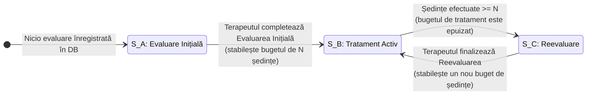
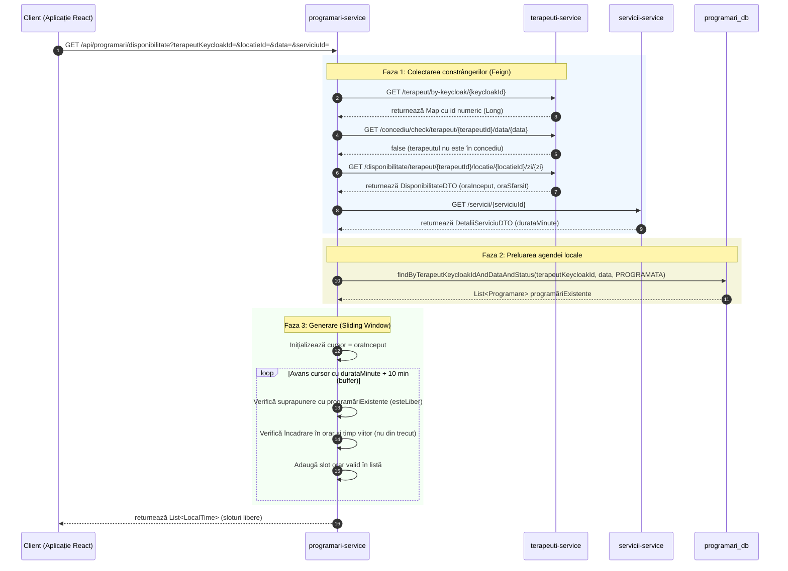
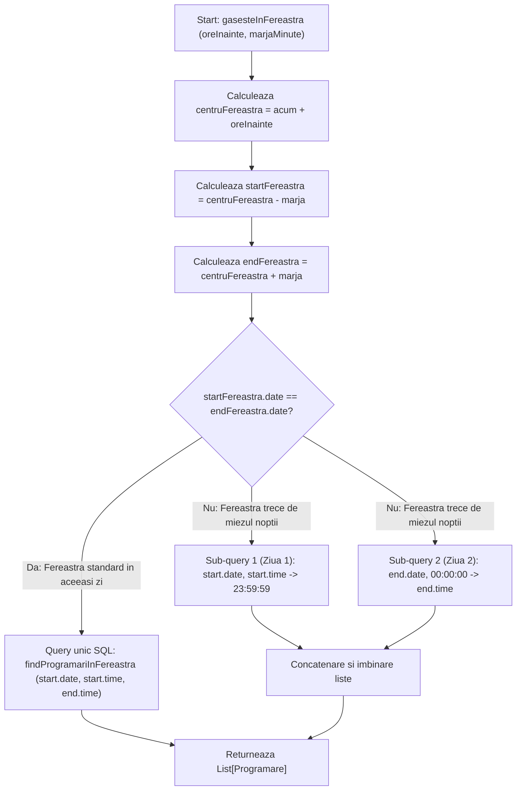
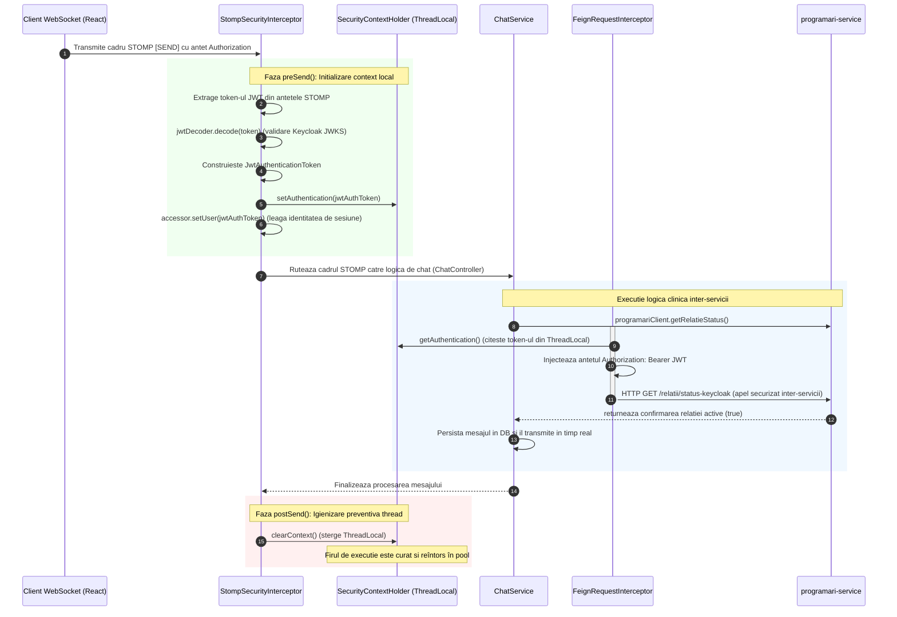
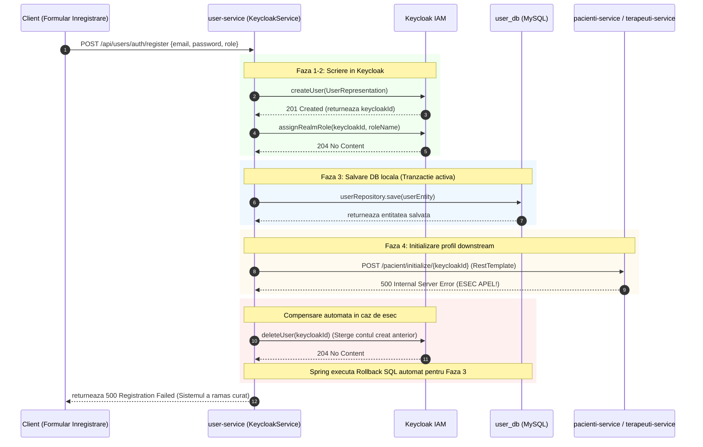
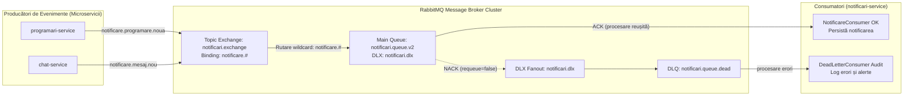
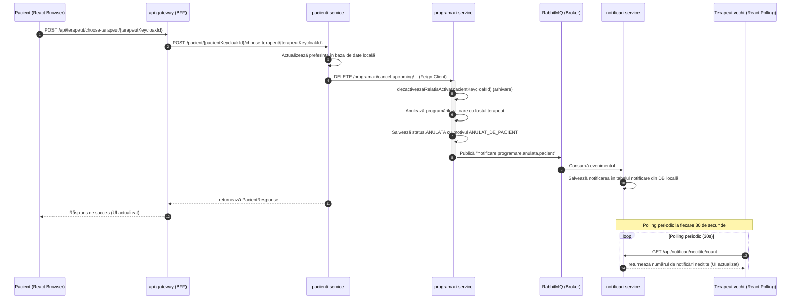

# Capitolul 6. Implementări Tehnice și Algoritmi de Decizie

Acest capitol descrie implementările detaliate ale algoritmilor și soluțiilor tehnice care stau la baza platformei KinetoCare. Sunt prezentate mecanismele decizionale din spatele traiectoriei clinice automatizate prin intermediul unui automat finit determinist, abordarea iterativă cu fereastră glisantă utilizată în generarea ferestrelor de disponibilitate și tehnicile de gestionare a partiționării temporale. De asemenea, sunt documentate propagarea contextului de securitate, agregarea asincronă a datelor clinice, implementarea tranzacțiilor compensatorii și topologia de mesagerie pe bază de cozi de carantină.

## 6.1 Automatul finit determinist pentru determinarea traiectoriei clinice

Această secțiune descrie implementarea automatului finit determinist responsabil cu modelarea și controlul traiectoriei clinice a pacientului pe parcursul etapelor terapeutice. Sunt detaliate stările clinice, tranzițiile automatizate ghidate de starea datelor din persistența locală și proprietățile de comportament ciclic ale sistemului.

### 6.1.1 Motivarea și problema clinică adresată

Una dintre provocările centrale în managementul unui cabinet de fizioterapie și kinetoterapie constă în menținerea coerenței absolute între starea clinică reală a pacientului și serviciile medicale pentru care acesta este programat și facturat. În practica clinică tradițională, pacienții parcurg un ciclu terapeutic bine definit din punct de vedere metodologic: **evaluarea inițială** (în cadrul căreia se stabilesc diagnosticul funcțional, obiectivele și numărul recomandat de ședințe), **tratamentul activ** (ședințele propriu-zise de recuperare) și **reevaluarea clinică** (necesară la finalul pachetului de ședințe pentru a măsura progresul și a decide prelungirea, modificarea sau sistarea terapiei).

Lăsarea selecției acestor servicii la latitudinea personalului administrativ sau a pacienților, în momentul rezervării unei programări, constituie o sursă majoră de erori operaționale și clinice:

- **Ocolirea protocolului de siguranță:** Un pacient aflat la prima vizită poate fi programat direct la o ședință de tratament intens, fără a trece prin evaluarea inițială obligatorie, expunând clinica la riscuri operaționale deoarece terapeutul nu deține un diagnostic funcțional sau un istoric medical validat.
- **Erori de facturare și decontare:** Un pacient care a finalizat numărul de ședințe recomandate poate continua să fie programat la ședințe de tratament standard, ocolind etapa de reevaluare, ceea ce duce la stagnare terapeutică și la discrepanțe în fișa de decontare.
- **Încărcarea administrativă:** Corectarea manuală a tipurilor de servicii, în urma depistării erorilor, consumă resurse de personal și generează confuzie în rândul pacienților.

Aceste riscuri sunt eliminate structural prin implementarea unui **automat finit determinist** (*Finite State Machine* — *FSM*) integrat direct în logica de *business* din metoda `ProgramareService.determinaServiciulCorect()`. Tipul de serviciu nu mai reprezintă un parametru selectat manual în interfața grafică, ci este derivat automat pe server, în mod transparent față de client, la fiecare inițiere a unei noi programări.

### 6.1.2 Modelul conceptual al automatului finit clinic

Formal, automatul finit determinist este definit ca o 5-tuplă $M = (Q, \Sigma, \delta, q_0, F)$. Aici stările $Q$ reprezintă fazele evolutive ale pacientului, iar alfabetul $\Sigma$ constituie evenimentele operaționale din baza de date. $\delta: Q \times \Sigma \to Q$ este funcția de tranziție, $q_0 = \text{EvaluareInitiala}$ reprezintă starea inițială, iar $F$ este mulțimea stărilor terminale. În ingineria software, acest model guvernează traiectoria pacientului prin trei stări distincte și mutual exclusive:

1. **Starea A — Evaluare Inițială:** Reprezintă starea de intrare în sistem pentru orice pacient nou. Pacientul nu are nicio evaluare înregistrată în baza de date. Singurul serviciu clinic permis și generat automat în această stare este cel de *Evaluare Inițială*.
2. **Starea B — Tratament Activ:** Pacientul deține o fișă de evaluare clinică activă, iar numărul de ședințe de recuperare finalizate de la data acelei evaluări este strict inferior numărului de ședințe recomandate de terapeut. Serviciul clinic determinat automat corespunde exact procedurii specifice prescrise de terapeut în formularul de evaluare (de exemplu, *Kinetoterapie Adulți* sau *Kinetoterapie Pediatrică*).
3. **Starea C — Reevaluare:** Pacientul are o evaluare înregistrată, însă a epuizat în întregime bugetul de ședințe alocat (numărul de ședințe finalizate este mai mare sau egal cu cota prescrisă). În acest moment, programarea la tratament standard este blocată, iar serviciul clinic este comutat automat pe procedura de *Reevaluare*.

Factorul declanșator al tranzițiilor este definit dinamic prin evaluarea a doi indicatori persistenți din baza de date:

- Existența sau absența unei înregistrări de tip `Evaluare` asociată identificatorului unic al pacientului.
- Raportul matematic dintre ședințele efectiv realizate (cu statusul finalizat) și cele recomandate în cadrul ultimei evaluări active.

### 6.1.3 Analiza detaliată a stărilor și implementarea tranzițiilor

Logica de evaluare a automatului finit este executată sincron în interiorul graniței tranzacționale a metodei `creeazaProgramare`. Procesul decizional se desfășoară în trei etape secvențiale:

**Verificarea stării inițiale (Starea A).** La primirea unei cereri de programare, baza de date locală `programari_db` este interogată prin `evaluareRepository.findFirstByPacientKeycloakIdOrderByDataDesc(pacientKeycloakId)`. Dacă această interogare returnează un rezultat gol (`Optional.empty()`), se deduce că pacientul nu a beneficiat de nicio consultație în cadrul clinicii, încadrându-se în **Starea A (Evaluare Inițială)**. Pentru a obține detaliile comerciale și operaționale ale acestui serviciu (preț, durată), `programari-service` efectuează un apel sincron prin *OpenFeign* către `servicii-service`, solicitând serviciul definit sub denumirea configurată în fișierele de proprietăți ale aplicației:

```java
serviciiClient.gasesteServiciuDupaNume(numeEvaluareInitiala)
```

Acest mecanism decuplează componenta de programări de nomenclatorul de prețuri, asigurând respectarea principiului responsabilității unice.

**Evaluarea progresului și tranziția în Starea C.** Dacă istoricul returnează o evaluare existentă, este determinat dacă pacientul a finalizat planul de tratament activ prescris anterior. Calculul se realizează prin interogarea bazei de date cu metoda optimizată `countSedintePacientDupaData`. Interogarea *JPQL* (*Java Persistence Query Language*) este formulată defensiv pentru a asigura o contorizare clinică strictă:

```sql
SELECT COUNT(p) FROM Programare p
WHERE p.pacientKeycloakId = :pId
  AND p.status = 'FINALIZATA'
  AND p.areEvaluare = false
  AND p.data >= :dataRef
```

Fiecare clauză joacă un rol critic în menținerea corectitudinii clinice:

- `p.status = 'FINALIZATA'`: Sunt numărate exclusiv ședințele care s-au desfășurat cu succes și au fost confirmate de terapeut, excluzând programările viitoare și pe cele anulate.
- `p.areEvaluare = false`: Această constrângere exclude din calcul chiar ședința în cadrul căreia a fost completat formularul de evaluare, prevenind consumarea eronată a planului terapeutic.
- `p.data >= :dataRef`: Parametrul `:dataRef` reprezintă data la care a fost înregistrată ultima evaluare activă (`evaluare.getData()`), asigurând contorizarea exclusivă a ședințelor efectuate în baza planului curent.

Dacă valoarea returnată este mai mare sau egală cu `evaluare.getSedinteRecomandate()`, automatul tranzitează în **Starea C (Reevaluare)**. Similar Stării A, serviciul de reevaluare este apelat prin *OpenFeign*, obligând pacientul să rezerve acest tip de procedură.

**Starea de Tratament Activ (Starea B).** În cazul în care evaluarea există, iar numărul de ședințe finalizate este strict mai mic decât cota recomandată, pacientul se află în plin proces de recuperare, corespunzând **Stării B (Tratament Activ)**. Identificatorul serviciului recomandat este preluat direct din corpul ultimei evaluări active (`evaluare.getServiciuRecomandatId()`) și utilizat pentru îmbogățirea datelor:

```java
serviciiClient.getServiciuById(evaluare.getServiciuRecomandatId())
```

Prin acest mecanism, pacientul este programat exact la tipul de tratament prescris personalizat de kinetoterapeutul evaluator, eliminând erorile umane de configurare.

### 6.1.4 Diagrama de tranziție a automatului clinic

Tranziția între stările automatului este modelată vizual în diagrama de mai jos:



### 6.1.5 Comportamentul ciclic și reziliența datelor

O caracteristică arhitecturală importantă a acestui *FSM* este **comportamentul ciclic**. Sistemul nu converge spre o stare finală stabilă și definitivă. La atingerea Stării C, în momentul în care terapeutul finalizează ședința respectivă și completează un nou formular clinic de evaluare, o nouă entitate `Evaluare` este salvată în baza de date cu o dată de referință proaspătă (`dataRef` actualizat).

Această acțiune resetează contextul computațional al interogării `countSedintePacientDupaData`. La următoarea rulare a algoritmului, numărul de ședințe efectuate după noua dată de referință va fi `0`, determinând automatul să reintre în **Starea B (Tratament Activ)**, ghidat de noul plan terapeutic.

Comportamentul este guvernat în totalitate de starea datelor persistate, nu de variabile volatile stocate în memoria de lucru a serverului de aplicații. Această decizie de proiectare conferă sistemului avantaje esențiale în producție:

- **Idempotență structurală:** Oricâte reporniri, căderi sau scalări orizontale ar afecta microserviciul `programari-service`, starea traiectoriei unui pacient nu va fi coruptă, ea fiind calculată dinamic pe baza înregistrărilor imutabile din baza de date la fiecare interogare.
- **Consistență bazată pe date:** Traiectoria clinică reflectă starea reală a dosarului în timp real, eliminând riscul desincronizării față de baza de date.

## 6.2 Abordarea iterativă cu fereastră glisantă pentru generarea ferestrelor de disponibilitate terapeutică

Această secțiune prezintă abordarea iterativă cu fereastră glisantă utilizată pentru determinarea și generarea sloturilor orare disponibile în agenda terapeuților. Sunt analizate fazele premergătoare de colectare a constrângerilor, implementarea logicii bazate pe ferestre glisante cronologice și evaluarea complexității asimptotice.

### 6.2.1 Enunțul problemei de planificare clinică

Generarea automată a intervalelor de timp disponibile (sloturi orare) reprezintă una dintre cele mai solicitante funcționalități din punct de vedere computațional dintr-un sistem de management clinic. Problema constă în determinarea tuturor intervalelor orare în care un pacient poate efectua o rezervare validă, dată fiind o tripletă (terapeut, locație fizică, dată calendaristică) și un serviciu clinic solicitat cu o durată specifică exprimată în minute.

Pentru ca un slot orar să fie considerat valid, acesta trebuie să satisfacă simultan un set de constrângeri operaționale:

- să se încadreze în programul de lucru activ al terapeutului pentru acea zi și locație;
- să nu se suprapună cu perioadele de concediu înregistrate ale terapeutului;
- să nu se suprapună cu nicio programare activă existentă în agendă;
- dacă ziua solicitată este ziua curentă, sloturile propuse trebuie să se afle în viitor față de momentul cererii.

Soluția implementată, localizată în metoda `ProgramareService.getSloturiDisponibile()`, abordează această problemă prin paradigma **ferestrelor glisante** (*sliding window*). Sloturile candidate sunt generate în ordine strict cronologică, iar conformitatea fiecăruia cu setul de constrângeri este evaluată și emisă sau respinsă pe loc, fără a fi necesar un mecanism de *backtracking*. Această abordare asigură un timp de răspuns rapid în interfața utilizatorului.

### 6.2.2 Fazele premergătoare: Colectarea defensivă a constrângerilor

O decizie de proiectare esențială constă în centralizarea și executarea tuturor apelurilor către alte microservicii **înainte** de intrarea în bucla principală de generare a sloturilor. Această strategie de tip *fail-fast* previne lansarea unor calcule inutile pe server și elimină riscul generării unui comportament de tip *N+1 network requests* (apelarea unui serviciu extern în interiorul unei bucle). Colectarea constrângerilor se desfășoară în cinci pași secvențiali:

**Translația de identitate a terapeutului.** Metoda expusă primește `terapeutKeycloakId` (UUID). Deoarece serviciul de personal utilizează o cheie primară numerică (`Long`), este efectuat un apel sincron prin *OpenFeign* — `terapeutiClient.getTerapeutByKeycloakId(terapeutKeycloakId)` — pentru a extrage `terapeutId`-ul numeric intern.

**Verificarea stării de concediu (*short-circuit*).** Este interogat `terapeuti-service` pentru a verifica dacă data solicitată se suprapune cu un concediu aprobat al terapeutului:

```sql
SELECT COUNT(c) > 0 FROM ConcediuTerapeut c
WHERE c.terapeutId = :terapeutId
  AND c.dataInceput <= :dataStart
  AND c.dataSfarsit >= :dataEnd
```

Dacă rezultatul este afirmativ, metoda se oprește instantaneu și returnează o listă goală (`List.of()`), evitând orice interogare sau apel de rețea ulterior.

**Preluarea programului de lucru.** Orarul specific terapeutului pentru locația selectată și ziua din săptămână corespunzătoare datei cerute este solicitat prin apelul `terapeutiClient.getOrar(terapeutId, locatieId, ziSaptamana)`. Dacă terapeutul nu are definit un program activ, se returnează o listă vidă.

**Determinarea duratei procedurii.** Prin intermediul `serviciiClient.getServiciuById(serviciuId)` este obținută durata în minute a serviciului solicitat (`durataMinute`), necesară calculării ferestrelor de timp.

**Extragerea blocajelor din agendă.** Baza de date locală `programari_db` este interogată pentru a obține toate rezervările deja confirmate ale terapeutului din acea zi: `programareRepository.findByTerapeutKeycloakIdAndDataAndStatus(terapeutKeycloakId, data, StatusProgramare.PROGRAMATA)`. Programările anulate sunt ignorate complet, eliberând automat intervalele pe care le ocupau.

### 6.2.3 Nucleul algoritmului: Fereastra glisantă cronologică

După ce toate datele de intrare și constrângerile au fost colectate, algoritmul bazat pe fereastră glisantă inițializează un cursor temporal setat la ora de început a programului terapeutului (`orar.oraInceput()`). Logica de funcționare a cursorului temporal este descrisă în algoritmul conceptual următor:

```text
cursor = orar.oraInceput()
oraSfarsitZi = orar.oraSfarsit()

CÂT TIMP (cursor + durataServiciu) <= oraSfarsitZi EXECUTĂ:
    slotInceput = cursor
    slotSfarsit = cursor + durataServiciu
    
    DACĂ esteLiber(slotInceput, slotSfarsit, programariExistente)
          ȘI (data solicitată NU este AZI SAU slotInceput > oraCurentă) ATUNCI:
          
          EMITE SlotDisponibilDTO(slotInceput, slotSfarsit)
    SFÂRȘIT DACĂ
    
    cursor = slotInceput + durataServiciu + 10 minute (buffer)
SFÂRȘIT CÂT TIMP
```

Adăugarea constantă a unui *buffer* de **10 minute** după finalul fiecărui slot generat (`durataServiciu + 10`) răspunde unor necesități clinice reale: asigură timpul necesar igienizării echipamentelor și saltelelor între pacienți, previne aglomerarea sălii de așteptare și oferă terapeutului o fereastră scurtă pentru redactarea notelor medicale zilnice.

Pentru a stabili dacă slotul candidat se suprapune cu o programare existentă, este utilizat testul clasic de intersecție a două intervale $[A, B)$ și $[C, D)$. Două intervale se intersectează dacă startul primului este anterior sfârșitului celui de-al doilea și sfârșitul primului este posterior startului celui de-al doilea:

```java
slotInceput.isBefore(p.getOraSfarsit()) && slotSfarsit.isAfter(p.getOraInceput())
```

Dacă această condiție este evaluată ca adevărată pentru oricare dintre programările existente din agendă, slotul candidat este respins instantaneu, iar cursorul avansează.

### 6.2.4 Diagrama de secvență a generării de sloturi

Fluxul de comunicare inter-servicii și calculul local sunt reprezentate în diagrama de secvență de mai jos:




### 6.2.5 Analiza complexității asimptotice și decizia de proiectare

Sinteza complexității algoritmice este structurată în tabelul de mai jos:

| Dimensiune | Simbol | Valoare clinică tipică |
|:---|:---|:---|
| **Sloturi candidate** | $S$ | $\approx 8$ sloturi (program zilnic de 8 ore împărțit la durata ședinței + *buffer*) |
| **Programări existente** | $N$ | $< 10$ programări pe zi per terapeut |
| **Complexitate timp** | $O(S \times N)$ | Câteva zeci de operații elementare |
| **Apeluri rețea** | Fix | 4 apeluri *Feign* (sau 2–4 în caz de *short-circuit* la concediu) |

Complexitatea $O(S \times N)$ se traduce în câteva zeci de operații elementare pentru parametrii clinici tipici, algoritmul reprezentând un *overhead* nesemnificativ față de latența apelurilor *OpenFeign* din faza anterioară.

**Justificarea alegerii algoritmului.** Căutarea cronologică cu fereastră glisantă acoperă optim cerința de afișare obiectivă a sloturilor disponibile. Un algoritm de programare dinamică nu este necesar, deoarece nu se urmărește maximizarea unei valori globale (precum profitul sau rata de ocupare), ci prezentarea tuturor opțiunilor valide. *Backtracking*-ul nu se justifică deoarece fiecare slot candidat este independent — validitatea unui interval orar nu este influențată de deciziile luate pentru restul sloturilor.

### 6.2.6 Toleranța defensivă la absența datelor

Comportamentul sistemului în cazul lipsei configurațiilor administrative sau al concediilor este proiectat explicit pentru degradare grațioasă. În loc ca interfața să returneze o eroare de sistem (*500 Internal Server Error*) atunci când un terapeut nu are programul definit în `terapeuti-service`, apelurile externe sunt protejate prin interceptări defensive de excepții.

Erorile de rețea sau de date lipsă sunt capturate, iar metoda returnează un răspuns de tip *array* gol `[]`. Comportamentul de *short-circuit* reflectă principiul de degradare grațioasă: indisponibilitatea unui serviciu secundar nu blochează funcționalitatea principală a platformei.

## 6.3 Gestionarea Partiționării Temporale la Granița Zilei în Planificatorul de Remindere

Această secțiune analizează provocările logice asociate traversării graniței de la miezul nopții în cadrul sistemelor de planificare temporară. Este prezentată strategia de partiționare binară implementată la nivelul componentelor de remindere pentru a asigura o alertare proactivă robustă și continuă, prevenind omiterea programărilor situate la limita dintre două zile calendaristice consecutive.

### 6.3.1 Contextul și motivarea problemei: Proiectarea defensivă și granița temporală

În asistența medicală modernă, alertarea proactivă a pacienților cu privire la programările viitoare are ca scop reducerea ratei de absenteism, eficientizarea agendei terapeuților și sporirea aderenței la planul de tratament kinetoterapeutic. Sistemul utilizează un planificator automatizat bazat pe componente *cron* în cadrul clasei `ReminderScheduler` (parte din `programari-service`), responsabilă cu transmiterea alertelor în două momente-cheie: cu 24 de ore înaintea programării și, respectiv, cu 2 ore înainte.

Proiectarea unui planificator de remindere robust implică gestionarea unui caz-limită structural: traversarea graniței calendaristice la miezul nopții. Această problemă reprezintă un caz-limită la granița calendaristică (ora 00:00). Ea generează interogări SQL incorecte din punct de vedere logic, cu efecte observabile exclusiv în producție, la ore nocturne, fiind dificil de detectat prin testare standard.

Sistemele de nivel *enterprise* sunt proiectate conform principiului **proiectării defensive** (*defensive design*), funcționând corect indiferent de scenariile operaționale — incluzând teoretic clinici cu program prelungit, ture de noapte sau decalaje orare la nivel de server.

De exemplu, dacă jobul rulează pe data de 29 mai la ora 23:55, fereastra sa de căutare pentru reminderul de 24 de ore vizează programările din jurul orei 23:55 a zilei de 30 mai. Cu o marjă de ±15 minute, fereastra devine [30 mai 23:40 — 31 mai 00:10]. Limita superioară depășește granița zilei de 30 mai, extinzându-se în primele minute ale zilei de 31 mai — aceasta este granița pe care o interogare SQL standard nu o poate gestiona corect.

### 6.3.2 Eșecul logic al interogării SQL standard (*Naive Query*)

O abordare de implementare naivă ar formula o singură interogare în baza de date cu clauza standard SQL `BETWEEN`:

```sql
SELECT * FROM programari
WHERE data = :ziTarget
  AND ora_inceput BETWEEN :startFereastra AND :endFereastra
  AND status = 'PROGRAMATA'
```

În scenariul descris, parametrii ar fi substituiți astfel:
`ora_inceput BETWEEN '23:40:00' AND '00:10:00'`

Din punct de vedere logic, această condiție aplicată asupra unei coloane de tip `LocalTime` (sau `TIME` în baza de date) reprezintă o imposibilitate matematică. Deoarece `LocalTime` reprezintă o valoare orară dintr-o singură zi calendaristică, cu domeniu cuprins în intervalul [00:00:00, 23:59:59.999], valoarea `00:10:00` este strict mai mică decât `23:40:00`.

Motorul SQL va evalua expresia `23:40 <= ora_inceput AND ora_inceput <= 00:10` ca falsă pentru fiecare rând din tabelă. Interogarea va returna constant un set gol, determinând omiterea reminderului pentru pacientul programat la ora 00:15 în ziua următoare, deși rezervarea este validă.

### 6.3.3 Soluția de partiționare binară a ferestrei

Pentru a elimina această limitare temporală, clasa `ReminderScheduler` implementează o strategie de **partiționare binară a ferestrei de interogare**. Înainte de a interoga baza de date, sunt calculate datele calendaristice asociate celor două extreme ale ferestrei (`startFereastra` și `endFereastra`), obiecte de tip `LocalDateTime`.

Algoritmul de decizie funcționează în trei pași:

**Evaluarea graniței.** Este verificat dacă data calendaristică a startului ferestrei este identică cu data sfârșitului ferestrei:

```java
startFereastra.toLocalDate().equals(endFereastra.toLocalDate())
```

**Cazul standard (fereastră monolit).** Dacă datele sunt egale, întreaga fereastră de căutare se află în interiorul aceleiași zile calendaristice. O singură interogare SQL standard este lansată, utilizând orele extrase direct.

**Cazul de graniță (partiționare binară).** Dacă datele diferă (sfârșitul ferestrei a trecut în ziua următoare), intervalul este divizat în două sub-interogări logice complementare:

- **Sub-fereastra 1 (Ziua 1):** Căutare în prima zi (ziua de start), în intervalul cuprins între ora de start și sfârșitul absolut al zilei, prin constanta standard `LocalTime.MAX`: `[startFereastra.toLocalTime(), LocalTime.MAX]`.
- **Sub-fereastra 2 (Ziua 2):** Căutare în a doua zi (ziua de sfârșit), în intervalul cuprins între începutul absolut al zilei (miezul nopții), prin constanta `LocalTime.MIN`, și ora de sfârșit a ferestrei: `[LocalTime.MIN, endFereastra.toLocalTime()]`.

**Îmbinare.** Cele două liste de programări rezultate sunt concatenate într-o singură colecție Java și returnate către motorul de alertare.

Codul Java implementat în `ReminderScheduler` reflectă această logică:

```java
if (startFereastra.toLocalDate().equals(endFereastra.toLocalDate())) {
    return programareRepository.findProgramariInFereastra(
        startFereastra.toLocalDate(),
        startFereastra.toLocalTime(),
        endFereastra.toLocalTime()
    );
}

List<Programare> rezultat = new ArrayList<>();
// Sub-interogarea 1: De la ora de start pana la miezul noptii (sfarsitul absolut al Zilei 1)
rezultat.addAll(programareRepository.findProgramariInFereastra(
    startFereastra.toLocalDate(),
    startFereastra.toLocalTime(),
    LocalTime.MAX
));

// Sub-interogarea 2: De la miezul noptii (inceputul absolut al Zilei 2) pana la ora de sfarsit
rezultat.addAll(programareRepository.findProgramariInFereastra(
    endFereastra.toLocalDate(),
    LocalTime.MIN,
    endFereastra.toLocalTime()
));

return rezultat;
```

### 6.3.4 Diagrama de decizie a partiționării temporale

Modul în care fereastra temporală este evaluată și divizată la rularea planificatorului este ilustrat în diagrama de mai jos:



### 6.3.5 Frecvența planificatoarelor și marja de siguranță

Configurarea perioadelor de execuție a joburilor *cron* și a marjelor de căutare respectă o regulă de acoperire matematică pentru a preveni omiterea oricărei programări. Parametrii de configurare sunt structurați în tabelul următor:

| Tip Reminder | Frecvență rulare *cron* | Fereastră țintă | Marjă de căutare | Acoperire totală fereastră |
|:---|:---|:---|:---|:---|
| **Reminder 24h** | Din 30 în 30 de minute | `acum + 24 ore` | ±15 minute | 30 de minute (de la -15 la +15) |
| **Reminder 2h** | Din 15 în 15 de minute | `acum + 2 ore` | ±8 minute | 16 minute (de la -8 la +8) |

**Principiul de acoperire a ferestrei**

Pentru a garanta din punct de vedere matematic că nicio programare nu este omisă între două execuții ale planificatorului, marja de căutare trebuie să acopere cel puțin jumătate din perioada de execuție a jobului. Această condiție poate fi formalizată prin inegalitatea:

$$\text{Marjă de căutare} \geq \frac{\text{Frecvența de rulare a jobului}}{2}$$

În cazul reminderului de 24 de ore, unde jobul rulează la fiecare 30 de minute (de exemplu la 14:00, 14:30, 15:00), o marjă de ±15 minute satisface această condiție. Execuția de la ora 14:30 va scana intervalul de programări cuprins între 14:15 și 14:45 a zilei următoare, în timp ce execuția de la 15:00 va scana intervalul 14:45–15:15. Prin urmare, indiferent de momentul în care un pacient deține o programare, aceasta va fi scanată și detectată de o singură rulare a planificatorului, eliminând zonele oarbe temporal.

### 6.3.6 Considerații privind arhitectura temporal-defensivă

Problema miezului nopții în planificatoarele temporale reprezintă un caz-limită structural care poate evita cu ușurință suitele standard de testare funcțională. Fără o tratare defensivă explicită, anomalia se manifestă exclusiv la ore nocturne în mediul de producție, fiind dificil de diagnosticat deoarece baza de date procesează interogarea ca validă din punct de vedere sintactic, dar nu returnează înregistrări.

Această soluție reflectă principiul de proiectare defensivă aplicat în platforma KinetoCare, separând responsabilitatea detectării programărilor de cea a deduplicării notificărilor, delegată sistemului de mesagerie descris în secțiunea 6.7.

## 6.4 Propagarea Contextului de Securitate în Sesiunile WebSocket STOMP

Această secțiune analizează soluția implementată la nivelul platformei KinetoCare pentru rezolvarea decalajului arhitectural dintre protocoalele bazate pe sesiuni persistente și cele fără stare (*stateless*). Este detaliat mecanismul de interceptare a canalelor de mesagerie asincrone pentru propagarea continuă și securizată a identității utilizatorului prin punți de protocol dedicate.

### 6.4.1 Decalajul arhitectural de protocol HTTP → TCP și natura problemei

În arhitectura aplicațiilor web moderne, securitatea este construită în mod tradițional pe baza paradigmei statice *request-response* din protocolul HTTP. La fiecare solicitare de intrare, un lanț de filtre de securitate (cum ar fi `SecurityFilterChain` în Spring Security) interceptează cererea, extrage și validează jetonul de identitate (*JWT*), populează contextul de securitate local al firului de execuție activ (`SecurityContextHolder`) și permite sau respinge propagarea cererii către controlere. Acest model funcționează eficient deoarece comunicarea HTTP este fără stare (*stateless*) — fiecare cerere reprezintă o unitate de comunicare independentă, deservită de un fir de execuție dedicat.

Protocolul *WebSocket*, utilizat în cadrul KinetoCare pentru mesageria în timp real din modulul de chat clinic, introduce o asimetrie arhitecturală fundamentală. Comunicarea debutează printr-o cerere HTTP standard (faza de negociere — *handshake*). În această etapă de inițiere, cererea traversează în mod normal filtrele de securitate HTTP, realizându-se autentificarea inițială.

Odată ce conexiunea este acceptată, protocolul este comutat (prin răspunsul HTTP `101 Switching Protocols`) la o conexiune TCP persistentă și bidirecțională. De la acest moment:

- Datele nu mai sunt transmise sub formă de cereri HTTP izolate, ci ca o succesiune continuă de cadre *STOMP* (*Simple Text Oriented Messaging Protocol*) peste acea conexiune TCP unică.
- Lanțul de filtre HTTP (`OncePerRequestFilter`) **nu mai este rulat** pentru cadrele ulterioare conectării, deoarece fluxul de date ocolește complet stiva de *servlet*-uri HTTP standard.
- Prin urmare, obiectul `SecurityContextHolder` din Spring — o primitivă bazată pe memorie de tip *ThreadLocal* — rămâne **complet gol** în momentul în care serverul primește cadrele *STOMP* individuale (trimiterea de mesaje sau abonarea la canale de chat).

Această absență a contextului de securitate devine critică în microserviciul `chat-service`. Atunci când un utilizator trimite un mesaj, metoda `ChatService.salveazaSiNotifica()` apelează sincron, prin clientul *OpenFeign*, componenta `programari-service` pentru a verifica dacă relația terapeutică este activă:

```java
@GetMapping("/relatii/status-keycloak")
Boolean getRelatieStatusByKeycloak(
        @RequestParam("pacientKeycloakId") String pacientKeycloakId,
        @RequestParam("terapeutKeycloakId") String terapeutKeycloakId
);
```

Clientul *OpenFeign* este configurat cu un interceptor global care încearcă să citească jetonul *JWT* din `SecurityContextHolder` pentru a-l injecta în antetul `Authorization: Bearer` al cererii de ieșire. Deoarece contextul local este gol în firul de execuție care procesează *WebSocket*-ul, apelul *OpenFeign* eșuează cu eroarea `401 Unauthorized`, blocând transmiterea mesajelor deși utilizatorul este autentificat în mod valid la nivel de browser.

### 6.4.2 Puntea de protocol prin interceptarea canalului STOMP

Pentru a depăși această barieră tehnologică, platforma KinetoCare implementează o **punte de protocol** (*Protocol Bridge*) personalizată sub forma clasei `StompSecurityInterceptor`. Aceasta implementează interfața `ChannelInterceptor` pusă la dispoziție de ecosistemul Spring Messaging și este înregistrată pe canalul de mesaje de intrare (`clientInboundChannel`) în clasa de configurare `WebSocketConfig`:

```java
@Override
public void configureClientInboundChannel(ChannelRegistration registration) {
    registration.interceptors(stompSecurityInterceptor);
}
```

Spre deosebire de filtrele HTTP tradiționale, `ChannelInterceptor` acționează la nivelul stratului de mesagerie *STOMP*, interceptând direct cadrele de date brute transmise de clienți pe conexiunea TCP persistentă, înainte ca acestea să fie direcționate către controloarele de chat adnotate cu `@MessageMapping`. Această abordare extinde modelul de securitate *Zero-Trust* descris în secțiunea 4.4 la nivelul comunicării *WebSocket*, garantând că fiecare cadru *STOMP* este tratat ca o unitate de comunicare independentă ce necesită validarea explicită a identității.

### 6.4.3 Mecanismele de interceptare: `preSend` și `postSend`

Interceptorul își împarte responsabilitatea în două faze fundamentale ale ciclului de viață al unui mesaj, asigurate prin metodele `preSend` și `postSend`.

**Faza de populare: `preSend()`.** În momentul în care un cadru *STOMP* intră în server, interceptorul analizează tipul comenzii protocolului și acționează în consecință:

- **La comanda CONNECT:** Clientul React transmite explicit jetonul *JWT* într-un antet nativ al cadrului de conectare (antetul `Authorization`). Interceptorul extrage jetonul, ocolește contextul HTTP și efectuează decodificarea și validarea criptografică:
    ```java
    jwtDecoder.decode(token)
    ```
    Acest decodificator utilizează aceleași chei publice partajate (*JWKS*) din serverul Keycloak, asigurând o validare identică cu cea din stratul HTTP. După validarea semnăturii și a expirării, este generat un obiect `JwtAuthenticationToken`, iar sistemul execută o operațiune dublă:
    - Identitatea este asociată cu sesiunea *WebSocket* persistentă prin `accessor.setUser(authentication)`, garantând că, pe tot parcursul vieții conexiunii TCP active, utilizatorul rămâne legat de acea sesiune.
    - Contextul local al firului de execuție activ este populat: `SecurityContextHolder.getContext().setAuthentication(authentication)`, făcând identitatea disponibilă apelurilor sincrone *OpenFeign* subsecvente.

- **La comanda SEND (Trimitere Mesaj):** Pentru cadrele ulterioare de trimitere, clientul nu mai este obligat să transmită jetonul la fiecare mesaj, reducând volumul de date transferat prin rețea. Interceptorul verifică dacă există deja un utilizator autentificat asociat sesiunii active prin `accessor.getUser()`. Dacă identitatea este prezentă, aceasta este extrasă din sesiune și injectată din nou în `SecurityContextHolder` al firului de execuție curent. Acest mecanism restabilește legătura dintre sesiunea persistentă (*stateful*) și contextul local volatil (*ThreadLocal*).

**Faza de igienizare: `postSend()`.** După finalizarea procesării cadrului (mesajul a fost salvat în baza de date și retransmis destinatarului), indiferent de rezultatul operațiunii, interceptorul apelează în mod obligatoriu:

```java
SecurityContextHolder.clearContext();
```

Această operațiune de curățare este critică într-o arhitectură *enterprise*. Serverele *WebSocket* utilizează un *pool* intern de fire de execuție pentru a procesa cadrele *STOMP* asincron și concurent. Un fir din *pool* nu este dedicat unui singur utilizator — procesează un mesaj pentru un pacient, se întoarce în *pool* și poate fi alocat imediat pentru a procesa un mesaj trimis de un alt pacient, pe o conexiune fizică distinctă.

Fără apelarea explicită a metodei `clearContext()`:
- Credențialele primului pacient ar rămâne atașate firului de execuție în memoria locală (*ThreadLocal*).
- Atunci când firul este reutilizat pentru a procesa un cadru anonim sau trimis de un pacient neautentificat, sistemul ar rula logica sub identitatea veche a primului pacient.
- Această breșă de securitate, denumită **fuga de credențiale** (*credential leakage*), este eliminată complet prin igienizarea strictă realizată în faza de `postSend()`.

### 6.4.4 Diagrama secvențială a propagării contextului de securitate

Ciclul complet de viață al propagării identității criptografice de la clientul React, prin canalul *STOMP*, către contextul local și apelurile inter-servicii, este reprezentat în diagrama de mai jos:



### 6.4.5 Robustețea și tratarea excepțiilor de autentificare

În cazul în care jetonul *JWT* extras din antetul *STOMP* este expirat, corupt sau semnat cu o cheie invalidă, interceptorul prinde excepția generată de decodificator, înregistrează un avertisment securizat în jurnalul de erori și apelează preventiv `SecurityContextHolder.clearContext()`.

Conexiunea TCP nu este închisă fizic la acest nivel (o acțiune care ar forța reconectări repetate și consum de resurse de rețea la nivel de *handshake*), ci cadrul este propagat mai departe cu un context de securitate gol. La etapa următoare, controlorul de chat va detecta lipsa identității din context și va genera o excepție controlată de tip `401 Unauthorized`. Această decizie reflectă principiile de reziliență ale fluxurilor reactive: eșecul de autentificare a unui singur mesaj nu trebuie să degenereze în închiderea canalului de transport fizic.

Eroarea este interceptată de metoda `@MessageExceptionHandler` din controlor și transmisă exclusiv utilizatorului afectat printr-un canal dedicat (`/queue/errors`), izolând defecțiunea la nivel de sesiune, oferind clientului posibilitatea de reîmprospătare silențioasă a jetonului fără a perturba sesiunile celorlalți utilizatori conectați.

## 6.5 Agregarea Datelor Clinice și Rezolvarea Problemei N+1 Inter-servicii

Această secțiune investigează arhitectura de agregare a dosarului clinic integrat al pacientului și tratează problema clasică *N+1 Query Problem* propagată la nivelul rețelei în sistemele distribuite. Sunt prezentate strategiile de degradare grațioasă implementate pentru a asigura disponibilitatea serviciilor critice și este realizată o comparație cu agregarea reactivă din marginea sistemului.

### 6.5.1 Contextul: Valoarea clinică a dosarului integrat (*Fișa Pacientului*)

În cadrul platformei KinetoCare, interfața dedicată terapeuților, denumită *Fișa Pacientului*, reprezintă pilonul central al procesului de monitorizare clinică. Platforma este proiectată pentru a oferi o perspectivă clinică integrată, eliminând necesitatea navigării între ecrane multiple.

Anterior începerii unei ședințe fizice, terapeutul trebuie să vizualizeze instantaneu un tablou de date complet: identitate din `user-service`, date medicale extinse din `pacienti-service`, istoricul evaluărilor clinice, notele de evoluție și istoricul programărilor din baza locală a `programari-service`, precum și jurnalul subiectiv al pacientului din `pacienti-service` — în total trei microservicii externe și baza de date locală a componentei `programari-service`.

Această agregare masivă este orchestrată de metoda `FisaPacientService.getFisaPacient()` din microserviciul `programari-service`. Din punct de vedere al complexității arhitecturale, această componentă acționează ca un orchestrator centralizat care interogează sincron trei microservicii externe și realizează interogări locale complexe în baza de date.

### 6.5.2 Harta completă a orchestrării inter-servicii

Construirea dosarului clinic consolidat se realizează printr-o succesiune coordonată de pași, descrisă în tabelul de mai jos:

| Etapă | Sursă date | Informații colectate | Mecanism tehnic |
|:---|:---|:---|:---|
| **Pasul 1** | `user-service` | Identitate de bază (nume, prenume, telefon, e-mail, gen) | Apel sincron *OpenFeign* (HTTP `GET`) |
| **Pasul 2** | `pacienti-service` | Profil medical (data nașterii, detalii sport) | Apel sincron *OpenFeign* (HTTP `GET`) |
| **Pasul 3** | Baza locală | Diagnostic activ, contorizarea bugetului de ședințe | Interogare JPA locală |
| **Pasul 4** | Baza locală | Istoricul tuturor evaluărilor clinice persistate | Interogare JPA locală |
| **Pasul 4a** | `user-service` | Numele complet al terapeutului care a semnat fiecare evaluare | Apel *OpenFeign* per evaluare (N ori) |
| **Pasul 4b** | `servicii-service` | Denumirea serviciului clinic recomandat în evaluare | Apel *OpenFeign* per evaluare (N ori) |
| **Pasul 5** | Baza locală | Notele de evoluție scrise de kinetoterapeuți | Interogare JPA locală |
| **Pasul 6** | Baza locală | Istoricul complet al programărilor trecute/viitoare | Interogare JPA locală |
| **Pasul 7** | `pacienti-service` | Jurnalul subiectiv de durere completat de pacient | Apel sincron *OpenFeign* (HTTP `GET`) |

### 6.5.3 Manifestarea problemei N+1 la nivel inter-servicii și optimizarea implementată

Problema *N+1 Query Problem* reprezintă un *anti-pattern* arhitectural clasic în sistemele cu baze de date relaționale. Se manifestă atunci când sistemul execută o interogare principală care returnează N rânduri (de exemplu, o listă de evaluări), iar apoi, pentru fiecare dintre aceste N rânduri, este lansată o nouă interogare suplimentară pentru a extrage detalii (de exemplu, numele terapeutului), rezultând 1 + N interogări în loc de una singură optimizată.

În arhitecturile bazate pe microservicii, acest fenomen se propagă din stratul de baze de date în stratul de comunicare prin rețea, cu consecințe severe asupra performanței. Fiecare apel extern HTTP suplimentar introduce latență de rețea, negocieri de conexiune TCP/TLS, serializare și deserializare JSON și consum de fire de execuție în componentele destinatare.

În cadrul platformei KinetoCare, problema se manifesta la procesarea istoricului de evaluări din metoda ajutătoare `buildEvaluariList`:

```java
// Pentru fiecare evaluare din istoricul local (N in total), sistemul apela:
UserDisplayCalendarDTO terapeutDetails = userClient.getUserByKeycloakId(eval.getTerapeutKeycloakId());
DetaliiServiciuDTO serviciu = serviciiClient.getServiciuById(eval.getServiciuRecomandatId());
```

**Soluția de optimizare prin procesare în lot (*Batch Processing*):**
Latența redundantă este eliminată prin introducerea unui *endpoint* de tip *batch* în `user-service`: `@PostMapping("/users/batch")`. În `FisaPacientService.buildEvaluariList()`, sunt colectate mai întâi toate identificatorii unici ai terapeuților din cele N evaluări, efectuându-se o singură interogare colectivă:

```java
List<UserDisplayCalendarDTO> users = userClient.getUsersByKeycloakIds(terapeutKeycloakIds);
```

Această optimizare reduce numărul de interogări pentru terapeuți de la N apeluri la **1 singur apel de rețea**, rezultatele fiind mapate local într-un *hash map* în memorie pentru un *lookup* instantaneu.

**Volumul curent de apeluri externe:**
Pentru serviciile recomandate, apelul individual pe rețea în buclă este menținut ca un compromis asumat (serviciile sunt rar modificate și adesea redundante). Numărul total de apeluri prin rețea efectuate de server pentru a construi o singură fișă de pacient este:

$$\text{Total apeluri externe} = 4 + N$$

Unde:
- **4** reprezintă apelurile fixe (identitatea din `user-service`, profilul medical din `pacienti-service`, istoricul jurnalului din `pacienti-service` și apelul *batch* colectiv de utilizatori).
- **N** reprezintă cele N apeluri individuale către `servicii-service` pentru detaliile fiecărui serviciu recomandat.

Pentru un pacient al clinicii care a adunat un istoric de **5 evaluări** pe parcursul a 6 luni de tratament, numărul de apeluri de rețea este redus la $4 + 5 = 9$, față de cele 13 apeluri anterioare optimizării.

### 6.5.4 Strategia defensivă de degradare grațioasă (*Graceful Degradation*)

În medii distribuite, defecțiunile de rețea sau de infrastructură sunt inevitabile. Deoarece agregarea fișei de pacient depinde sincron de trei microservicii externe, indisponibilitatea temporară a oricăruia dintre acestea (cauzată de o cădere de rețea, un *restart* pentru punere în producție sau o pauză prelungită pentru colectarea deșeurilor de memorie — *Garbage Collection*) ar putea determina eșecul întregii solicitări, cu o eroare de tip *500 Internal Server Error*.

În domeniul medical, un astfel de comportament este inacceptabil. Un terapeut aflat în fața unui pacient în sala de tratament are nevoie critică de istoricul medical (note clinice, diagnostice), chiar dacă sistemul nu poate afișa temporar numele exact al terapeutului care a semnat o evaluare trecută.

Această problemă este adresată prin implementarea modelului de **degradare grațioasă** (*graceful degradation*). Fiecare apel extern *OpenFeign* din bucla N+1 este izolat și protejat de blocuri defensive `try/catch` independente:

```java
String numeTerapeut = null;
UserDisplayCalendarDTO terapeutDetails = terapeutiMap.get(eval.getTerapeutKeycloakId());
if (terapeutDetails != null) {
    numeTerapeut = terapeutDetails.nume() + " " + terapeutDetails.prenume();
} else {
    // Fallback: utilizeaza identificatorul brut stocat local
    log.warn("Serviciul user-service este temporar indisponibil pentru KeycloakID: {}. Fallback la ID.", eval.getTerapeutKeycloakId());
    numeTerapeut = "Terapeut (ID: " + eval.getTerapeutKeycloakId() + ")";
}
```

Prin această abordare:
- Dacă `user-service` suferă o întrerupere, fișa pacientului se încarcă în continuare cu succes.
- În secțiunea de evaluări, în loc de întreruperea execuției, numele terapeutului evaluator este afișat sub formă de *fallback*, utilizând identificatorul brut stocat local.
- Terapeutul curent poate accesa notele clinice, diagnosticul și recomandările, prioritizând actul medical în fața detaliilor secundare de interfață.

### 6.5.5 Compromisul arhitectural asumat și optimizarea teoretică

Manifestarea problemei N+1 inter-servicii pentru serviciile recomandate reprezintă o **limitare arhitecturală recunoscută și asumată** în proiectarea curentă a platformei KinetoCare, bazată pe decizii pragmatice. Această limitare este catalogată în Capitolul 9 alături de soluțiile arhitecturale propuse pentru scalarea platformei.

**Acceptabilitatea compromisului curent.** În contextul clinic real al unui cabinet de kinetoterapie, un pacient nu acumulează un istoric extins de evaluări. O evaluare se efectuează la începutul tratamentului (de obicei o dată la câteva săptămâni sau luni) și la finalul acestuia (reevaluare).

Prin urmare, valoarea lui N depășește rar cifra de 3 sau 4 în decursul unui an. Latența suplimentară introdusă de câteva apeluri HTTP sincrone în rețeaua internă este redusă (sub 30–50 milisecunde), iar impactul de performanță perceput de terapeuți este minim.

### 6.5.6 Comparație critică: Agregarea din *Gateway* (BFF) vs. *Fișa Pacientului*

Tabelul următor compară agregarea din `FisaPacientService` cu controlorul reactiv de agregare a profilului aflat în API *Gateway* (`ProfileService.getProfile()`):

| Dimensiune tehnică | Agregare reactivă *BFF* (*Gateway*) | Agregare sincronă clinică (*Fișa Pacientului*) |
|:---|:---|:---|
| **Locație în stivă** | API *Gateway* (*Edge Layer*) | `programari-service` (*Core Service Layer*) |
| **Model concurență** | Reactiv, non-blocant (*Spring WebFlux*) | Sincron, blocant (*Spring MVC* + *OpenFeign*) |
| **Volum apeluri externe** | Fix (maximum 5 apeluri paralele prin `Mono.zip`) | Variabil ($4 + N$ în funcție de numărul de evaluări) |
| **Bază de date locală** | Fără acces la baza de date locală | Interogări JPA complexe (diagnostice, note) |
| **Justificare tehnologică** | Frecvență ridicată de acces, latență minimă necesară | Frecvență redusă de acces, complexitate clinică ridicată |

Această asimetrie reflectă aplicarea principiilor de proiectare pragmatică, în care evitarea complexității accidentale în zonele cu trafic redus primează în fața optimizărilor premature, facilitând mentenabilitatea codului sursă.

## 6.6 Implementarea Tranzacțiilor de Compensare (*Dual-write* Keycloak + DB)

Această secțiune analizează provocările consistenței distribuite în scenariile de scriere duală (*dual-write*), combinând serverul de identitate Keycloak cu bazele de date relaționale locale. Este detaliat mecanismul tranzacțional compensatoriu implementat pentru a asigura atomicitatea înregistrării utilizatorilor și tranzacțiile de compensare sincrone utilizate în dezactivarea securizată a conturilor.

### 6.6.1 Problema consistenței distribuite în scenariile de identitate

În arhitecturile bazate pe microservicii, managementul identității utilizatorilor implică frecvent o structură hibridă. Pe de o parte, este necesar un sistem robust de tip **IAM** (*Identity and Access Management*), precum serverul Keycloak, dedicat securizării fluxurilor de autentificare, stocării securizate a credențialelor și managementului jetoanelor *JWT*. Pe de altă parte, datele operaționale (detaliile de contact, istoricul medical și referințele specifice) trebuie stocate în baza de date locală a aplicației, sub coordonarea unui microserviciu dedicat, precum `user-service`.

Această asimetrie introduce problema critică a **scrierii duale** (*dual-write*). Deoarece Keycloak și baza de date relațională locală a aplicației (`user_db`) reprezintă sisteme de stocare distincte, nicio tranzacție clasică ACID nu poate acoperi ambele sisteme în mod nativ.

Dacă o operație complexă ce implică ambele sisteme eșuează parțial, starea datelor devine inconsistentă:

- **Scenariul contului fantomă:** Utilizatorul este creat cu succes în Keycloak, dar salvarea în `user_db` eșuează din cauza unei constrângeri de bază de date (de exemplu, un e-mail duplicat detectat tardiv). Pacientul va deține un cont valid în Keycloak și se va putea autentifica, obținând un jeton *JWT*, dar la accesarea platformei vor fi returnate erori HTTP de tip 404 sau 500, deoarece profilul local nu există.
- **Scenariul contului orfan:** Salvarea locală în baza de date se efectuează, dar actualizarea în Keycloak eșuează. Contul va figura ca activ în tabelele clinicii, însă utilizatorul nu va putea accesa niciodată platforma.
- **Riscuri GDPR și de securitate:** Conturile fantomă abandonate în Keycloak reprezintă breșe de conformitate și pot fi exploatate pentru a genera acces neautorizat, ocolind auditul clinic intern.

Pentru a rezolva această limitare în absența tranzacțiilor distribuite rigide (care implică blocarea resurselor și degradarea performanței), platforma KinetoCare utilizează un model de **tranzacții compensatorii sincrone** (*compensating transactions*), o versiune simplificată și adaptată a principiului de *rollback* din tiparul *Saga*.

### 6.6.2 Înregistrarea utilizatorului: Strategia de *rollback* compensatoriu sincron

Metoda de înregistrare a unui utilizator nou, localizată în `KeycloakService.registerUser()`, utilizează o strategie de compensare sincronă. Deși metoda este adnotată cu `@Transactional`, Spring poate gestiona în mod nativ exclusiv *rollback*-ul bazei de date relaționale locale (MySQL). Din această cauză, pașii exteriori sunt înveliți într-o logică defensivă de tip `try/catch`, capabilă să orchestreze compensarea explicit.

Secvența operațională se desfășoară în patru faze distincte:

**Faza 1: Crearea contului în Keycloak.** API-ul Keycloak este apelat pentru crearea utilizatorului:
```java
createUserInKeycloak()
```
Dacă acest pas eșuează (de exemplu, din cauza complexității insuficiente a parolei sau a problemelor de rețea), procesul se oprește instantaneu. Nu există nicio modificare persistentă în restul sistemului, nefiind necesară nicio compensare. La succes, Keycloak returnează un cod HTTP `201 Created`, de unde este extras identificatorul unic `keycloakId` (UUID).

**Faza 2: Alocarea rolului de securitate.** Rolul specific (Pacient sau Terapeut) este asociat contului nou creat în Keycloak. În caz de eșec la acest nivel, contul ar rămâne fără drepturi de acces. Blocul de excepție interceptează eroarea și rulează imediat tranzacția de compensare:
```java
deleteUserInKeycloak(keycloakId)
```
Această acțiune șterge sincron contul creat la Faza 1, restabilind starea curată a sistemului.

**Faza 3: Persistența locală a utilizatorului.** Utilizatorul este salvat local în tabela `user_db` prin:
```java
userRepository.save(userEntity)
```
Dacă salvarea eșuează (de exemplu, dintr-o eroare internă de persistență), blocul `catch` rulează din nou compensarea — ștergerea sincronă a utilizatorului din Keycloak, eliminând contul fantomă.

**Faza 4: Inițializarea profilului clinic *downstream*.** Este inițializat un profil clinic gol în microserviciul corespunzător rolului (`pacienti-service` sau `terapeuti-service`). Deoarece utilizatorul nu este încă autentificat la acest moment (nu deține un jeton *JWT* valid în contextul de securitate), apelul inter-servicii se realizează direct prin `RestTemplate`:
```java
restTemplate.postForEntity(url, null, Void.class)
```
Dacă acest apel *downstream* eșuează (de exemplu, din cauza indisponibilității temporare a serviciului), este declanșată o cascadă dublă de compensare:
- Blocul de excepție apelează ștergerea de siguranță a utilizatorului din Keycloak (`deleteUserInKeycloak`).
- Excepția propagată declanșează *rollback*-ul automat al tranzacției SQL din Spring, anulând salvarea locală efectuată la Faza 3.
- Sistemul revine în totalitate la starea inițială, garantând consistența tranzacțională.

### 6.6.3 Diagrama secvențială a înregistrării cu compensare

Fluxul de înregistrare și compensare în caz de eroare este ilustrat în diagrama de mai jos:



### 6.6.4 Dezactivarea contului: Mecanism de compensare sincronă cu consistență asimetrică

Metoda `UserService.toggleUserActive(keycloakId, active)` adresează o problemă tranzacțională distinctă: dezactivarea unui cont existent. Această acțiune trebuie propagată în patru subsisteme, într-o succesiune strictă:

1. **DB Local (`user_db`):** Proprietatea `active` a utilizatorului este setată pe `false`.
2. **Keycloak IAM:** Contul este dezactivat, blocând imediat emiterea de noi jetoane de acces și orice operațiune de reîmprospătare a sesiunii, limitând accesul rezidual la intervalul de valabilitate al jetonului activ existent.
3. **Serviciul de Profil (`pacienti-service` / `terapeuti-service`):** Profilul este marcat ca inactiv pentru a fi exclus din căutări.
4. **Serviciul de Programări (`programari-service`):** Toate programările viitoare asociate utilizatorului sunt anulate automat, iar mesajele de notificare sunt trimise partenerilor afectați.

**Decizia arhitecturală: Asimetria de consistență.** În loc să impună o consistență puternică (atomică) pe toate cele patru sisteme, platforma KinetoCare utilizează un **mecanism de compensare sincronă directă (*try-compensate*), cu consistență asimetrică**. Această decizie este motivată de prioritățile de securitate și funcționalitate ale clinicii, structurate în tabelul de mai jos:

| Sistem afectat | Model consistență | Justificare clinică și de securitate | Comportament la eșec |
|:---|:---|:---|:---|
| **DB Local + Keycloak** (Pașii 1 și 2) | **Consistență puternică (atomic)** | Este inacceptabil ca un cont să fie dezactivat în baza de date, dar utilizatorul să poată continua să acceseze API-urile folosind jetoane *JWT* active. | Dacă dezactivarea în Keycloak eșuează, tranzacția locală MySQL este anulată (*rollback*), menținând securitatea. |
| **Serviciul de Profil** (Pasul 3) | **Consistență eventuală (*best-effort*)** | Este acceptabil ca un utilizator dezactivat să mai apară timp de câteva minute în listele de terapeuți sau pacienți. | Eșecul este jurnalizat, dar nu anulează dezactivarea generală. Un proces de reîncercare automată poate sincroniza datele ulterior. |
| **Serviciul de Programări** (Pasul 4) | **Consistență eventuală (*best-effort*)** | Anularea programărilor viitoare și trimiterea de notificări pot tolera întârzieri temporare fără a pune în pericol securitatea clinicii. | Eșecul este înregistrat. Un administrator poate declanșa manual curățarea agendei dacă serviciul de programări a fost temporar offline. |

Această asimetrie separă granița critică de securitate (care necesită atomicitate deplină) de granița de date operaționale (care poate tolera consistența eventuală), asigurând o disponibilitate sporită a sistemului.

### 6.6.5 Evaluarea alternativelor arhitecturale

În faza de proiectare a platformei, au fost analizate trei arhitecturi alternative pentru rezolvarea acestei probleme:

- **Protocolul *Two-Phase Commit* (2PC) distribuit:** Este necesar ca toate sistemele implicate — inclusiv Keycloak, un sistem extern — să blocheze resursele locale în faza de pregătire. Acest lucru degradează performanța, introduce un singur punct de eșec critic (coordonatorul de tranzacții) și este dificil de implementat peste API-uri REST terțe.

- **Modelul *Transactional Outbox*:** Modificările în Keycloak nu s-ar realiza direct. Componenta `user-service` ar scrie modificarea într-o tabelă locală `outbox` în cadrul aceleiași tranzacții MySQL. Un *worker* separat ar citi tabela și ar sincroniza asincron Keycloak. Deși elimină cuplarea strânsă, introduce o complexitate operațională semnificativă (managementul *worker*-ului, tratarea duplicatelor), nejustificată pentru volumul redus de înregistrări zilnice dintr-o clinică.

- **Saga coreografică (bazată pe evenimente):** Componentele *downstream* ar asculta evenimentele de dezactivare publicate de `user-service` în RabbitMQ și ar reacționa autonom. A fost preferat un **mecanism de compensare sincronă directă** (coordonat direct din `UserService` ca un orchestrator simplificat) deoarece oferă trasabilitate superioară în cod: logica de *business* este centralizată într-un singur loc, permițând identificarea rapidă a erorilor de sincronizare.

### 6.6.6 Idempotența și reziliența tranzacțiilor compensatorii

Un aspect ingineresc important este asigurarea **idempotenței** tuturor metodelor implicate în compensare. De exemplu, metoda `KeycloakSyncService.setUserEnabled(keycloakId, false)` poate fi apelată de mai multe ori cu același parametru fără a produce efecte secundare adverse sau erori în Keycloak.

Dacă o tentativă de dezactivare eșuează la etapa de actualizare a profilului și operațiunea este reîncercată de un administrator, sistemul reexecută pașii anteriori fără a altera starea globală, asigurând convergența către starea finală definită. Acest design consolidează reziliența arhitecturală în fața fluctuațiilor de rețea specifice sistemelor distribuite.

### 6.6.5 Provizionarea inițială (*Bootstrap Provisioning*) și mecanismul de *retry*

Crearea primului cont administrativ (*bootstrap provisioning*) este un proces automatizat, executat la pornirea platformei de către o componentă dedicată din *backend* (`user-service`). Într-un ecosistem containerizat (Docker, Kubernetes), unde serviciile sunt inițializate în paralel, microserviciul de identitate poate deveni activ înaintea serverului Keycloak. Pentru a garanta crearea contului, componenta implementează un mecanism defensiv de reîncercare cu interval fix (20 de tentative la intervale de 5 secunde), asigurând finalizarea cu succes a procesului de provizionare fără a declanșa o prăbușire a aplicației la inițializare.

## 6.7 Topologia RabbitMQ cu *Dead Letter Exchange*

Această secțiune detaliază topologia de mesagerie asincronă bazată pe *RabbitMQ* implementată în cadrul platformei KinetoCare. Sunt analizate mecanismele de rutare semantică prin evenimente, carantina mesajelor toxice prin intermediul cozilor de tip *Dead Letter* și strategiile de garantare a consistenței eventuale prin deduplicarea mesajelor la nivel de consumator.

### 6.7.1 Motivarea arhitecturii de mesagerie asincronă distribuite

În cadrul unui sistem bazat pe microservicii, decuplarea componentelor reprezintă o cerință fundamentală pentru asigurarea disponibilității ridicate și a toleranței la erori. Spre deosebire de comunicarea sincronă realizată prin protocoale HTTP (unde componenta apelantă este blocată în așteptarea unui răspuns), utilizarea unei arhitecturi orientate pe evenimente (*Event-Driven Architecture* — EDA) permite componentelor operaționale să continue execuția fără a depinde de starea de funcționare a modulelor consumatoare.

Cu toate acestea, introducerea mesageriei asincrone aduce provocări specifice de inginerie software. Mesajele pot eșua în timpul procesării din motive diverse:
- Defecțiuni tranzitorii de infrastructură (o cădere temporară a bazei de date a consumatorului).
- Erori de *business* neprevăzute (o eroare de deserializare cauzată de o discrepanță de versiune a conținutului JSON).
- Blocaje la nivel de rețea.

În contextul platformei medicale KinetoCare, garantarea livrării notificărilor este crucială. O notificare de tip reminder medical omisă poate duce la pierderea ședinței de către un pacient cu afecțiuni severe, afectând direct actul terapeutic.

Pentru a preveni pierderea silențioasă a mesajelor și, în același timp, a evita congestionarea serverelor prin bucle infinite de reîncercare, platforma KinetoCare implementează o topologie de mesagerie avansată bazată pe **RabbitMQ**, ce reunește rutare semantică (*Topic Exchange*), carantină controlată (*Dead Letter Exchange*) și auto-vindecare defensivă (`DeadLetterConsumer`).

### 6.7.2 Structura și componentele topologiei RabbitMQ

Topologia *RabbitMQ* este proiectată pe trei paliere independente, fiecare cu un rol bine definit:

**Rutarea semantică prin *Topic Exchange* (`notificari.exchange`).** Pentru propagarea evenimentelor de notificare, platforma utilizează un `TopicExchange`. Spre deosebire de un *exchange* de tip *Direct* (care necesită o potrivire exactă a cheii de rutare) sau de tip *Fanout* (care difuzează orb mesajul către toate cozile legate), `TopicExchange` permite o rutare dinamică și semantică.

Producătorii de evenimente (de exemplu, `programari-service` sau `chat-service`) publică evenimente imutabile utilizând chei de rutare structurate ierarhic: `notificare.<domeniu_clinic>.<actiune_specifica>` (de exemplu, `notificare.programare.noua` sau `notificare.mesaj.nou`).

**Coada principală (`notificari.queue.v2`) cu argumente *Dead Letter*.** Coada principală ascultă evenimentele publicate pe *exchange*-ul central printr-un *binding* cu *wildcard* definit ca `notificare.#`.

În protocolul *AMQP*, caracterul `#` potrivește zero sau mai multe cuvinte separate prin punct. Acest detaliu tehnic implementează principiul **Open/Closed** din setul de principii SOLID la nivel de mesagerie: dacă în viitor este adăugat un nou serviciu (de exemplu, `evaluare-service`) care publică evenimentul `notificare.evaluare.noua`, coada principală îl va captura în mod automat, fără a fi necesară modificarea definițiilor de infrastructură sau repornirea brokerului *RabbitMQ*.

Pentru a asigura reziliența, coada `notificari.queue.v2` este declarată defensiv cu argumentul: `x-dead-letter-exchange: notificari.dlx`. Această instrucțiune obligă brokerul să captureze orice mesaj respins cu o confirmare negativă (*NACK*) de către consumator și să îl redirecționeze automat către *exchange*-ul de *Dead Letter*, în loc să îl șteargă sau să îl blocheze în capul cozii.

**Carantina prin *Dead Letter Exchange* (`notificari.dlx`) și coada dedicată (`notificari.queue.dead`).** *Exchange*-ul `notificari.dlx` este configurat ca *Fanout*. În această fază de carantină, rutarea semantică nu mai este necesară; scopul este simpla dirijare a tuturor mesajelor toxice într-o singură coadă de siguranță.

Mesajele ajung în coada `notificari.queue.dead`, unde sunt stocate pe termen lung pentru **audit și depanare manuală**. Niciun mesaj din această coadă nu este retrimis automat în coada principală, prevenind degradarea performanței sistemului din cauza unor date corupte recurente.

### 6.7.3 Diagrama arhitecturală a topologiei de mesagerie

Modul în care mesajele circulă de la microserviciile producătoare, prin *exchange*-urile și cozile brokerului *RabbitMQ*, până la consumatorii de succes și de carantină, este reprezentat în diagrama de mai jos:



### 6.7.4 Mecanismul de confirmare negativă (*NACK*) și fluxul de eșec

Atunci când un mesaj este extras din coada principală `notificari.queue.v2`, componenta `NotificareConsumer` încearcă să execute logica de trimitere a alertelor.

Dacă în timpul execuției este generată o excepție (de exemplu, o eroare internă din MySQL sau o eroare de rețea), stiva Spring AMQP interceptează eroarea. În configurația standard, Spring AMQP reintroduce mesajul eșuat în aceeași coadă (`requeue = true`).

Într-un mediu *enterprise*, acest comportament este periculos: dacă eroarea este permanentă (un format JSON invalid), mesajul este reintrodus în coadă, extras din nou de consumator, eșuează din nou și reintră în coadă, generând o **buclă infinită de procesare** care epuizează resursele de calcul ale serverului.

Platforma KinetoCare previne acest comportament prin configurarea fabricii de containere Spring AMQP să emită confirmări negative (*NACK*) cu parametrul `requeue = false` în caz de eroare.

Calea parcursă de un mesaj eșuat este următoarea:
1. `NotificareConsumer` generează o excepție.
2. Interceptorul Spring AMQP trimite un semnal de tip *NACK* cu `requeue = false` către broker.
3. Brokerul *RabbitMQ* extrage mesajul toxic din coada principală și verifică argumentul `x-dead-letter-exchange`.
4. Mesajul este rutat către `notificari.dlx` și depus în siguranță în coada de carantină `notificari.queue.dead`.
5. Coada principală `notificari.queue.v2` continuă să proceseze restul mesajelor fără întârzieri sau blocaje.

### 6.7.5 Prevenirea recursiei cozilor de carantină

O eroare critică de proiectare, frecvent omisă în implementările comerciale, este apariția scenariului de **recursie a cozilor de carantină** (*Dead Letter Queue recursion*). Dacă însuși consumatorul de mesaje eșuate, `DeadLetterConsumer`, întâmpină o problemă în timp ce procesează sau jurnalizează un mesaj toxic, sistemul ar putea intra într-o buclă infinită în interiorul cozii de carantină.

Pentru a elimina această vulnerabilitate de infrastructură, este implementată o strategie de **absorbție explicită a excepțiilor** la nivelul `DeadLetterConsumer`:

```java
@RabbitListener(queues = RabbitMQConfig.DLQ_NAME)
public void proceseazaMesajEsuat(Message message) {
    try {
        String body = new String(message.getBody(), StandardCharsets.UTF_8);
        log.error("[DLQ ALERT] Mesaj clinic eșuat definitiv. Antete: {}, Payload: {}", 
            message.getMessageProperties().getHeaders(), body);
    } catch (Exception e) {
        // Absorbție absolută a excepțiilor pentru a opri orice recursivitate AMQP
        log.error("[DLQ CRITICAL ERROR] Eșec sever la procesarea mesajului din coada de carantină: {}", 
            e.getMessage());
    }
}
```

Prin utilizarea unui bloc global `try/catch` care capturează clasa generică `Exception`, consumatorul garantează că:
- Orice eroare la decodificarea corpului mesajului (de exemplu, un set de caractere UTF-8 corupt) este prinsă și jurnalizată în siguranță.
- Metoda se finalizează întotdeauna cu succes din perspectiva Spring AMQP, trimițând un semnal de tip *ACK* implicit către broker.
- Mesajul este eliminat definitiv din coada de carantină, prevenind complet riscul blocării brokerului prin apeluri recursive.

### 6.7.6 Imuabilitatea AMQP și justificarea sufixului `v2` al cozii

Prezența sufixului `v2` în denumirea cozii `notificari.queue.v2` documentează conformarea la o constrângere structurală majoră a protocolului AMQP 0-9-1. Conform specificației tehnice oficiale, **argumentele de configurare ale unei cozi sunt imutabile după declarare**.

Atunci când o coadă este declarată pentru prima dată în *RabbitMQ* (de exemplu, simpla coadă `notificari.queue`), parametrii săi constitutivi sunt persistați în starea brokerului. Dacă ulterior argumentul `x-dead-letter-exchange` este adăugat și microserviciul este repornit, stiva Spring AMQP va încerca să redeclare coada existentă cu noile argumente.

Brokerul *RabbitMQ* va detecta această tentativă de modificare a parametrilor imutabili și va respinge cererea cu excepția: `PRECONDITION_FAILED (406) - inequivalent arg 'x-dead-letter-exchange' for queue`.

Aceasta determină închiderea instantanee a canalului *AMQP* și prăbușirea microserviciului la pornire. Pentru a rezolva această problemă în medii de producție, fără a șterge coada veche (ceea ce ar duce la pierderea mesajelor neprocesate aflate în tranzit), cea mai bună practică inginerească constă în **declararea unei cozi noi cu un nume actualizat** — `notificari.queue.v2` — care include de la bun început argumentul DLX. Această decizie garantează o migrare fără întreruperi de serviciu și fără pierderi de date medicale sau operaționale.

### 6.7.7 Modelul Observer distribuit la nivel arhitectural

Topologia *RabbitMQ* din platforma KinetoCare reprezintă implementarea la scară largă a tiparului structural **Observer distribuit**, transpus peste o rețea de microservicii:

| Concept din tiparul *Observer* | Componentă KinetoCare | Responsabilitate arhitecturală |
|:---|:---|:---|
| **Subiectul observat (*Observable*)** | `programari-service` și `chat-service` | Publică evenimente imutabile (fapte clinice petrecute) pe magistrala de mesaje, fără a cunoaște cine le va consuma. |
| **Magistrala (*Event Bus*)** | `notificari.exchange` (*RabbitMQ*) | Gestionează rutarea semantică și decuplarea ierarhică, asigurând livrarea sigură a evenimentelor. |
| **Observatorul concret** | `NotificareConsumer` | Monitorizează fluxul de date principale și execută sarcinile de salvare a notificărilor în aplicație. |
| **Observatorul de erori** | `DeadLetterConsumer` | Monitorizează coada de carantină pentru a genera alerte administrative în caz de eșec sever. |

Această decuplare completă garantează că, dacă serviciul de notificări este oprit pentru mentenanță sau baza sa de date este blocată, activitatea principală a clinicii (crearea de programări, completarea fișelor) continuă neafectată. Mesajele se acumulează în siguranță în coada *RabbitMQ* și sunt procesate automat în momentul în care consumatorul devine din nou activ, asigurând toleranța la defecțiuni și continuitatea operațională.

### 6.7.8 Implementarea deduplicării și a idempotenței consumatorilor

Deoarece marjele de căutare ale planificatoarelor temporale se pot suprapune ușor în cazul unor variații de sincronizare a ceasului serverului sau rulărilor consecutive rapide, există riscul ca o programare aflată la granița exactă a minutelor de scanare să fie publicată sub formă de evenimente multiple în brokerul *RabbitMQ*. De asemenea, reîncercările la nivel de rețea din topologia de mesagerie pot introduce mesaje duplicate în flux.

Pentru a garanta procesarea unică a fiecărei notificări, este implementat un mecanism robust de deduplicare direct la nivelul consumatorului din `notificari-service`:

1. **Injectarea identificatorului de mesaj de către producători:** Componentele care publică evenimente pe magistrala de mesaje (`programari-service`, `pacienti-service`, `chat-service`) configurează proprietățile de mesaj AMQP (*MessageProperties*) injectând un identificator unic universal (UUID) în antetul standard `messageId`.

2. **Intercepția și înregistrarea atomică:** La consumare, `NotificareConsumer` din `notificari-service` extrage antetul `messageId` și apelează o metodă tranzacțională din `MesajProcesatRepository` care execută o interogare SQL nativă:
   ```sql
   INSERT INTO mesaje_procesate (message_id, processed_at)
   VALUES (:messageId, NOW())
   ON DUPLICATE KEY UPDATE message_id = message_id;
   ```

3. **Absorbirea duplicatelor:** Dacă instrucțiunea SQL returnează `0` rânduri afectate (*rows affected*), se deduce că mesajul cu acel ID a fost deja procesat anterior. Consumatorul blochează fluxul, ignoră duplicatul și trimite un semnal *ACK* către broker pentru a elimina mesajul din coadă, asigurând idempotența procesării fără a re-expedia notificarea.

---

## 6.8 Fluxul de schimbare a terapeutului

Schimbarea terapeutului preferat de către un pacient implică o interacțiune coordonată multi-serviciu pentru a garanta integritatea datelor clinice și a istoricului programărilor.

Procesul este ilustrat în diagrama de secvență de mai jos:



Acest flux garantează decuplarea responsabilităților prin apeluri sincrone securizate și propagarea asincronă a alertelor prin intermediul RabbitMQ către baza de date locală `notificari_db` din `notificari-service`, de unde sunt preluate periodic de către aplicația client în frontend prin mecanismul de HTTP Polling reactiv (la fiecare 30 de secunde). Acest model arhitectural asigură actualizarea asincronă a interfeței terapeutului afectat de anulări, fără a bloca sau îngreuna experiența utilizatorului principal în momentul efectuării salvării.

