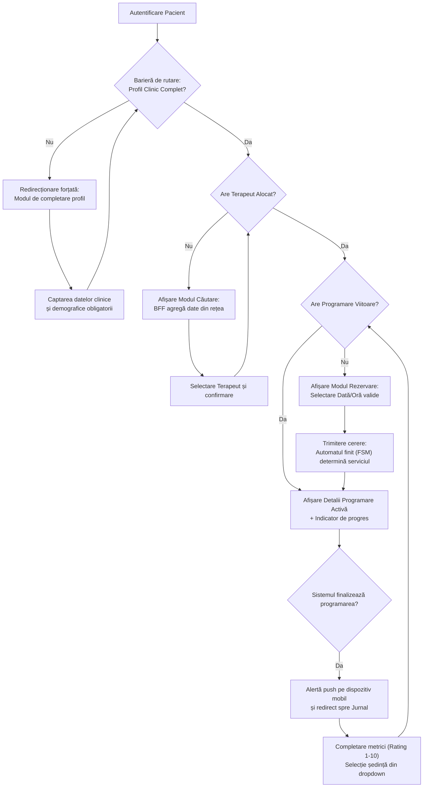
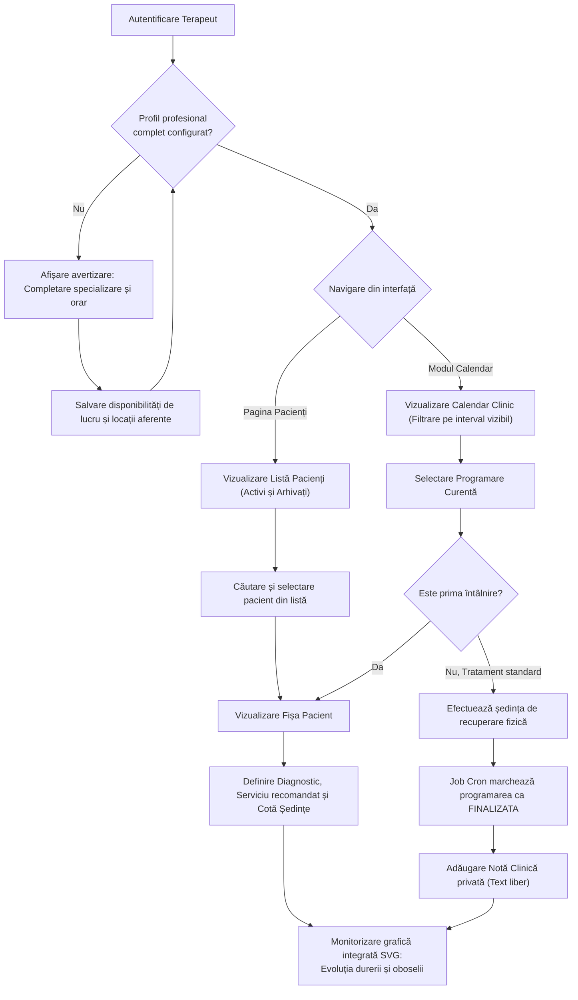
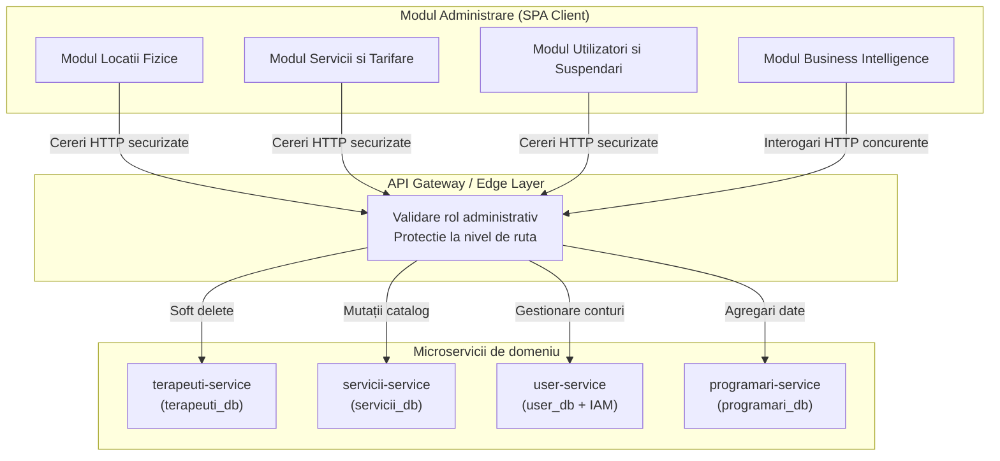

# Capitolul 7. Interfața cu Utilizatorul și Fluxurile Operaționale

Acest capitol descrie modul în care deciziile arhitecturale și implementările tehnice din nivelurile inferioare ale sistemului se reflectă direct în interfața grafică a platformei KinetoCare. Sunt analizate în detaliu cele trei fluxuri de utilizare fundamentale: experiența pacientului, acțiunile clinice ale terapeutului și panoul administrativ centralizat. Fiecare flux este investigat din perspectiva interacțiunii dintre componentele de prezentare din *frontend* și serviciile din *backend*, evidențiind managementul stării reactive, barierele de securitate active și fluxul informațional prin intermediul porții de acces (*API Gateway*).

## 7.1 Fluxul Pacientului: De la Profilare Clinică la Monitorizare

Această secțiune analizează experiența pacientului în cadrul platformei KinetoCare, de la procesul de înregistrare și profilare clinică obligatorie, până la monitorizarea continuă prin intermediul jurnalului digital și al canalului securizat de mesagerie în timp real. Sunt detaliate interacțiunile dintre starea reactivă a aplicației client și barierele de securitate impuse la granița sistemului distribuit.

### 7.1.1 Configurarea inițială și securizarea prin bariere de rutare

Experiența pacientului în cadrul platformei KinetoCare debutează cu un proces de înregistrare în două etape, proiectat pentru a echilibra simplitatea accesului inițial cu cerințele medicale obligatorii. Funcționarea cu profiluri incomplete (de exemplu, pacienți fără CNP sau fără data nașterii) reprezintă un risc critic pentru securitate, validarea datelor și conformitatea legală.

**Etapa 1: Înregistrarea de bază (autentificare și identitate).** Formularul inițial expus în interfața grafică colectează exclusiv date de identitate minimale: `email`, `parolă`, `nume`, `prenume`, `telefon` și `gen`. La trimiterea formularului, serviciul de identitate este apelat pentru înregistrarea utilizatorului, acțiune securizată prin tranzacția sincronă de scriere duală (*dual-write*) detaliată în Secțiunea 6.6.

**Etapa 2: Mecanismul de blocare și completare obligatorie.** Protejarea rutelor operaționale se realizează printr-o componentă de securitate de tip barieră (*route guard*). Pentru a nu degrada performanța interfeței printr-o avalanșă de cereri HTTP la fiecare schimbare de rută, starea de completitudine a profilului este interogată o singură dată (în faza de *bootstrap* a aplicației) și injectată în memoria globală a browserului (Context API). Bariera de rutare evaluează instantaneu această stare din memorie. Dacă este detectat un profil medical neinițializat, navigarea spre modulele operaționale este anulată la nivelul arborelui DOM, iar utilizatorul este redirecționat către modulul de profilare. Accesul este deblocat exclusiv după ce salvarea datelor clinice returnează un cod HTTP `200 OK`, declanșând actualizarea stării globale.

### 7.1.2 Selectarea terapeutului și rezoluția datelor prin BFF

Odată încheiat procesul de configurare, pacientul este ghidat să își aleagă un kinetoterapeut. Interfața de căutare necesită date agregate complexe: specializările terapeutului, locațiile fizice asociate, disponibilitatea și detaliile de identitate (nume, fotografie).

În loc ca aplicația client să lanseze apeluri HTTP disparate, interogarea este preluată de API Gateway, care implementează tiparul *Backend-For-Frontend* (BFF). Acesta lansează apeluri concurente către `terapeuti-service` și `user-service`. Pentru rezolvarea numelor, BFF utilizează procesarea în lot (*batch processing*) și returnează aplicației React un răspuns compact.

Schimbarea terapeutului reprezintă un eveniment de domeniu critic. La recepționarea acestui eveniment de către backend, relația terapeutică anterioară este arhivată și programările viitoare cu vechiul terapeut sunt anulate. Din punct de vedere clinic, planul terapeutic activ este conservat. Această decizie de domeniu este asumată explicit în acord cu practica clinică. Continuitatea tratamentului nu depinde de identitatea terapeutului, ci de evaluarea clinică.
Prin urmare, contorizarea ședințelor de către automatul finit se bazează pe ultimul formular de evaluare existent (`evaluareRepository.findFirstByPacientKeycloakIdOrderByDataDesc()`), indiferent de semnatarul acesteia. Noul terapeut preia recuperarea cu acces deplin la diagnosticul funcțional și la bugetul de ședințe rămas, fără a impune o evaluare inițială redundantă. Dacă noul terapeut consideră planul anterior inadecvat, acesta poate adăuga o evaluare nouă în fișa pacientului. Această acțiune resetează automatul finit la o nouă traiectorie clinică.

### 7.1.3 Fluxul de programare și rezoluția autonomă a serviciului

Procesul de rezervare previne erorile de selecție ale utilizatorilor. Aplicația client interoghează algoritmul de disponibilitate bazat pe o abordare iterativă cu fereastră glisantă (*sliding window*, detaliat în Secțiunea 6.2) pentru a prezenta pe ecran exclusiv intervalele orare valide.

La confirmarea rezervării, corpul cererii HTTP (`POST /api/programari`) conține doar datele de identificare și coordonatele temporale (`terapeutKeycloakId`, `locatieId`, `data`, `oraInceput`). Identificatorul serviciului medical este omis intenționat. Tipul de serviciu este determinat pe server de automatul finit (detaliat în Secțiunea 6.1). Totodată, tiparul *snapshot* este aplicat pentru conservarea datelor financiare (detaliat în Secțiunea 4.5.4). Pentru a asigura o experiență fluidă, interfața React actualizează starea fără reîncărcarea paginii. Aceasta prezintă instantaneu un indicator vizual de progres clinic.

### 7.1.4 Jurnalul post-ședință: Colectarea datelor longitudinale

Completarea jurnalului se realizează frecvent de pe dispozitive mobile. Pentru a facilita introducerea datelor, interfața utilizează cursoare tactile (*sliders*) cu o scară de la 1 la 10. Această scară măsoară intensitatea durerii, dificultatea exercițiilor și nivelul de oboseală.
Interfața nu forțează completarea strict cronologică a evaluărilor. Pacientul poate utiliza un selector de tip meniu derulant (*dropdown*) pentru a alege orice ședință neevaluată din istoric. Această abordare flexibilizează completarea datelor retroactive fără a bloca experiența utilizatorului.

### 7.1.5 Modulul de mesagerie: Generarea la cerere a conversațiilor și securitatea clinică

Canalul de comunicare în timp real este deservit prin protocolul *WebSocket* peste stiva *STOMP*. Atunci când un pacient accesează secțiunea de chat, sistemul evită preîncărcarea bazei de date cu documente vide de conversație.

Prin tiparul *Virtual Proxy*, agregatorul din API Gateway orchestrează o fuziune a datelor (*data-merge*). Lista conversațiilor fizice existente în `chat_db` este suprapusă peste lista relațiilor clinice active din `programari_db`. Dacă o relație este activă dar nu are istoric de mesaje, sistemul construiește dinamic o conversație virtuală în memorie cu un identificator temporar. Persistența în baza de date este realizată prin inițializare leneșă (*lazy initialization*) în `chat-service`, fiind amânată până la transmiterea primului mesaj.

Comunicarea este securizată prin injectarea jetonului *JWT* în antetele protocolului *STOMP*. Înainte de a accepta și ruta un mesaj intern în `chat-service`, validitatea relației terapeutice active este verificată sincron prin interogarea `programari-service`. Dacă pacientul nu se mai află sub îngrijirea terapeutului destinatar (relația fiind arhivată), transmisia este blocată cu un cod de eroare, prevenind accesul neautorizat la datele clinice după încheierea planului terapeutic.

### 7.1.6 Harta fluxului de navigare și decizie al pacientului

Diagrama de mai jos sintetizează logica de navigare, interceptare și acțiune clinică parcursă de un pacient în interfața aplicației:

## 7.2 Fluxul Operațional al Terapeutului: Calendar și Documentare

Această secțiune detaliază instrumentele de lucru software oferite terapeuților în cadrul interfeței platformei. Sunt analizate managementul disponibilităților de lucru, optimizarea randării agendei clinice pe baza ferestrelor vizibile și fluxurile de documentare medicală bazate pe note clinice, integrând grafice de evoluție construite din datele transmise de pacienți.

### 7.2.1 Configurarea profilului și managementul disponibilităților

Un modul dedicat pentru definirea parametrilor profesionali este pus la dispoziția terapeutului, fiind monitorizat activ de sistem pentru a preveni anomaliile de operare. La detectarea unui profil profesional incomplet (de exemplu, absența specializării sau a adresei cabinetului), panoul principal de bord randează o alertă proactivă persistentă, solicitând completarea datelor înainte de deblocarea modulelor active.

Configurarea programului de lucru se realizează prin declararea intervalelor orare de disponibilitate asociate unei zile calendaristice și unei locații fizice. La transmiterea formularului, serviciul `terapeuti-service` validează regulile de integritate la nivelul bazei de date. Acesta aplică constrângeri stricte de unicitate temporală pentru a preveni suprapunerea intervalelor (*overlapping slots*) în cadrul aceleiași zile pentru același terapeut. În mod complementar, agenda poate fi blocată prin declararea perioadelor de concediu, acțiune care determină componenta `programari-service` să excludă automat acele zile din algoritmii de disponibilitate prezentați pacienților, garantând sincronizarea operațională.

### 7.2.2 Calendarul clinic activ: Încărcare dinamică bazată pe vizor

Modulul de calendar reprezintă instrumentul principal de lucru al terapeutului. Deoarece descărcarea integrală a istoricului clinic ar genera timpi de transfer ineficienți și un consum excesiv de memorie la nivelul browserului (din cauza volumului masiv de date brute), componenta interfeței implementează un tipar de preluare a datelor strict limitat la vizorul curent (*viewport-based data fetching*).

La fiecare acțiune de navigare (schimbarea lunii sau vizualizarea săptămânală), coordonatele temporale de pe ecran sunt extrase, iar către *backend* sunt expediate două atribute stricte: `startDate` și `endDate` (în format standardizat ISO-8601). Microserviciul traduce acești parametri într-o interogare SQL restrictivă, extrăgând exclusiv sub-setul de programări necesar randării pe ecran, minimizând astfel amprenta de bandă a rețelei.

Logica de prezentare include reguli semantice specifice domeniului medical:
* Programările anulate standard sunt eliminate complet din grila calendarului pentru eliberarea spațiului vizual.
* Programările anulate din cauza neprezentării pacientului sunt reținute și marcate cu o textură vizuală distinctă, reprezentând un indicator clinic esențial pentru evaluarea aderenței la tratament.
* O culoare de accent este utilizată pentru a semnaliza prima întâlnire cu un pacient, indicând necesitatea executării protocolului de evaluare inițială în detrimentul unui tratament de rutină.

### 7.2.3 Documentarea clinică: Fișa integrată și diagnosticarea vizuală

La selectarea unui pacient, aplicația deschide fișa digitală completă a acestuia. Pentru a oferi o vedere clinică integrată (o perspectivă clinică holistică), interfața client lansează cereri HTTP concurente pentru a obține simultan dosarul clinic, istoricul evaluărilor și tendințele de evoluție (rezolvând eficient problema agregării datelor disparate). Informațiile sunt distribuite în secțiuni de specialitate:

**Secțiunea de Evaluări.** Prezintă istoricul diagnosticelor funcționale. Terapeutul poate introduce o nouă evaluare, stabilind serviciul medical recomandat și cota de ședințe aferentă planului terapeutic. Salvarea unei noi evaluări actualizează dinamic pragurile automatului finit (*FSM*) gestionat de server, resetând data de referință și permițând extinderea automată a tratamentului activ.

**Secțiunea de Note Clinice.** Este destinată documentării recurente. Notele de evoluție sunt organizate cronologic sub formă de text liber, permițând documentarea progresului clinic conform convențiilor instituționale. Acestea sunt vizibile exclusiv autorului, prin filtrarea la nivel de interogare după identificatorul criptografic `terapeut_keycloak_id` — spre deosebire de evaluările clinice, care sunt accesibile tuturor terapeuților implicați în îngrijirea pacientului pentru a asigura continuitatea actului medical.

**Secțiunea de Jurnale (Grafice evolutive).** Pentru a preveni analiza cognitivă dificilă a tabelelor masive de date brute, interfața integrează nativ jurnalele subiective ale pacienților sub forma unor grafice interactive (SVG). Graficele suprapun pe o axă temporală comună evoluția nivelului de durere, oboseală și dificultate raportate prin intermediul scării de rating. Acest panou vizual permite identificarea rapidă a deviațiilor de la traiectoria clinică optimă și ajustarea schemei de tratament.

### 7.2.4 Schema fluxului de lucru al terapeutului

Diagrama de mai jos sintetizează pașii operaționali și punctele de decizie tehnică parcurse de terapeut în interfața aplicației:

## 7.3 Panoul de Administrare și Agregarea Datelor Statistice

Această secțiune descrie arhitectura și logica din spatele panoului administrativ al platformei KinetoCare. Sunt analizate mecanismele de securitate bazate pe controlul accesului pe bază de roluri (*Role-Based Access Control* — *RBAC*), implementarea rezilienței la pornirea sistemului, conservarea istorică a datelor prin tiparul *snapshot* și tehnicile avansate de optimizare a randării interfeței utilizate în agregarea datelor de *Business Intelligence*.

### 7.3.1 Securitatea rolului de administrator și reziliența provizionării

Contul de administrator asigură guvernanța platformei. Rolul este izolat pentru a preveni auto-înregistrarea cu privilegii administrative. Interfața React este protejată printr-o barieră de rutare (*route guard*). Aceasta validează prezența rolului `ROLE_ADMIN` în jetonul JWT, blocând accesul utilizatorilor neautorizați.

Crearea primului cont administrativ (*bootstrap provisioning*) este realizată automat la pornirea platformei de către serviciul de identitate (`user-service`). Mecanismul de pornire securizată și rezistența la indisponibilitatea temporară a serviciului Keycloak sunt asigurate prin logica de reîncercare din backend (detaliată în Secțiunea 6.6.5).

### 7.3.2 Managementul locațiilor și principiul apărării stratificate

Modulul de gestiune a locațiilor clinice permite administratorului definirea și actualizarea punctelor de lucru. O decizie arhitecturală critică a fost utilizarea exclusivă a **ștergerii logice** (*soft-delete*) pentru eliminarea locațiilor. În loc de executarea comenzii SQL `DELETE`, este comutată o stare booleană (`isActive = false`). Această abordare previne coruperea istoricului programărilor și încălcarea constrângerilor de integritate referențială din baza de date. Locațiile inactive sunt automat excluse din interogările de disponibilitate prezentate pacienților de către `programari-service`.

Modificarea acestor resurse este protejată prin principiul apărării stratificate (*Defense in Depth*):
* **La nivel de margine:** API Gateway blochează orice cerere de modificare care nu provine dintr-o sesiune autentificată cu rolul administrativ.
* **La nivel de serviciu:** Metodele din microserviciul destinație integrează propriile adnotări de securitate (`@PreAuthorize("hasRole('ADMIN')")`) pentru a respinge cererile neautorizate.

Această redundanță garantează că o eventuală configurare eronată a regulilor de rutare în Gateway nu compromite securitatea datelor din rețeaua internă.

### 7.3.3 Catalogul de servicii clinice și aplicarea tiparului Snapshot

Administratorul poate actualiza nomenclatorul de servicii și tarifele din interfață. Modificările tarifare nu afectează rapoartele contabile istorice. La nivel de backend, sistemul utilizează tiparul snapshot (detaliat în Secțiunea 4.5.4) pentru a salva prețurile istorice sub forma unui instantaneu imutabil.

### 7.3.4 Panoul de Business Intelligence: Optimizarea performanței interfeței

Interfața de statistici reprezintă cel mai complex modul de agregare din aplicația client, necesitând randarea rapidă a multiplelor grafice evolutive (venituri, achiziție de pacienți, distribuția serviciilor). Pentru a preveni degradarea severă a performanței, aplicația implementează două tehnici majore de optimizare la nivel de interfață grafică:

1. **Concurența cererilor HTTP:** La încărcarea ecranului, interfața lansează șase cereri HTTP simultane (prin intermediul primitivei `Promise.all`) către endpoint-urile de agregare statistică din `programari-service`. Această abordare paralelă reduce timpul total de încărcare al paginii la durata celui mai lent apel individual, evitând cumularea latențelor de rețea specifice apelurilor secvențiale.
2. **Memoizarea algoritmică a structurilor de date:** Calcularea indicatorilor de performanță globali (KPIs) — precum generarea rapoartelor agregate din mii de înregistrări — consumă resurse computaționale semnificative pe firul de execuție principal (*main thread*) al browserului. Pentru a preveni fenomenul de înghețare a interfeței grafice (*UI freezing*) în timpul interacțiunilor minore, aplicația folosește tehnica memoizării native. Funcțiile de agregare matematică sunt încapsulate, iar rezultatele lor sunt păstrate în cache-ul memoriei client. Reevaluarea lor este strict interzisă de motorul de randare, exceptând cazurile în care se detectează o modificare a egalității referențiale (*reference equality*) a matricei datelor brute venite de la server.

Datele sunt ulterior transmise către biblioteca de grafice integrată în aplicația React (Recharts), care generează reprezentări vizuale vectoriale de tip SVG (*Scalable Vector Graphics*) — un format independent de rezoluție, optim pentru dispozitivele cu densitate înaltă de pixeli. Spre deosebire de fluxurile pacienților și terapeuților, care utilizează comunicare în timp real prin *WebSocket* și mesagerie asincronă prin RabbitMQ, modulul administrativ operează exclusiv prin cereri HTTP sincrone REST.

### 7.3.5 Arhitectura panoului administrativ și topologia datelor

Diagrama de mai jos ilustrează modul în care acțiunile administrative din interfața de utilizator sunt asigurate, validate de stratul de margine și procesate de microserviciile corespunzătoare:

