# Anexa 6 și Anexa 7 — Diagrame Arhitecturale, de Flux și Secvență

Acest fișier conține toate diagramele tehnice din anexele lucrării de dizertație, optimizate pentru parsare fără erori în interpretorul Mermaid.

---

## Anexa 6. Diagrame arhitecturale și de flux (Capitolul 5)

### Figura 6.1. Diagrama de tranziție a automatului finit clinic
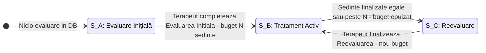

---

### Figura 6.2. Diagrama de secvență — Generarea sloturilor de disponibilitate
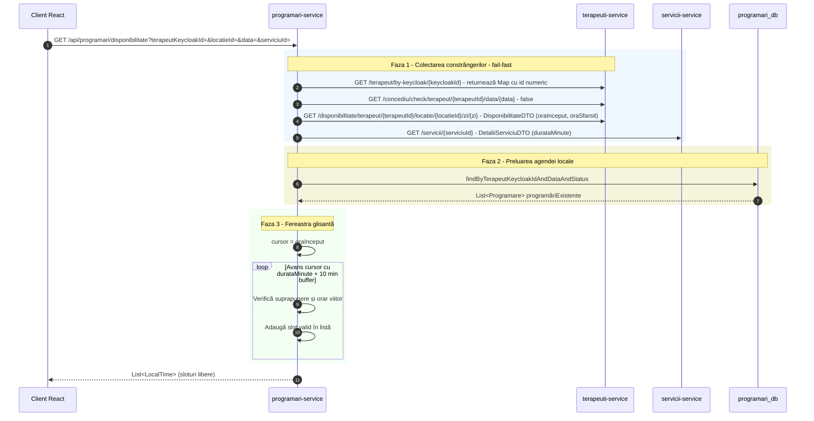

---

### Figura 6.3. Diagrama de decizie — Partiționarea temporală la granița zilei
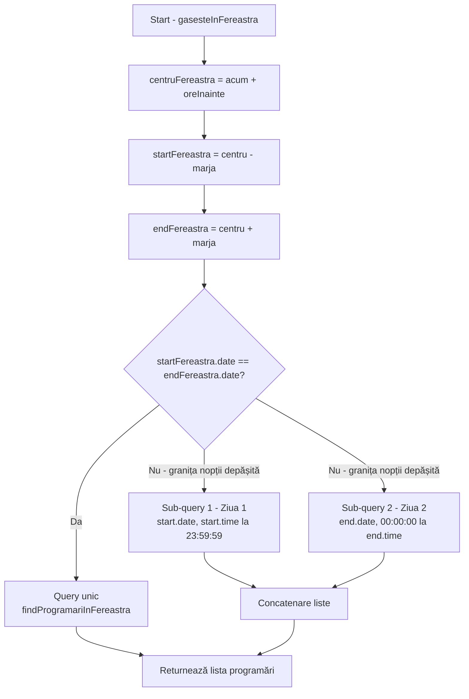

---

### Figura 6.4. Diagrama de secvență — Propagarea contextului de securitate STOMP
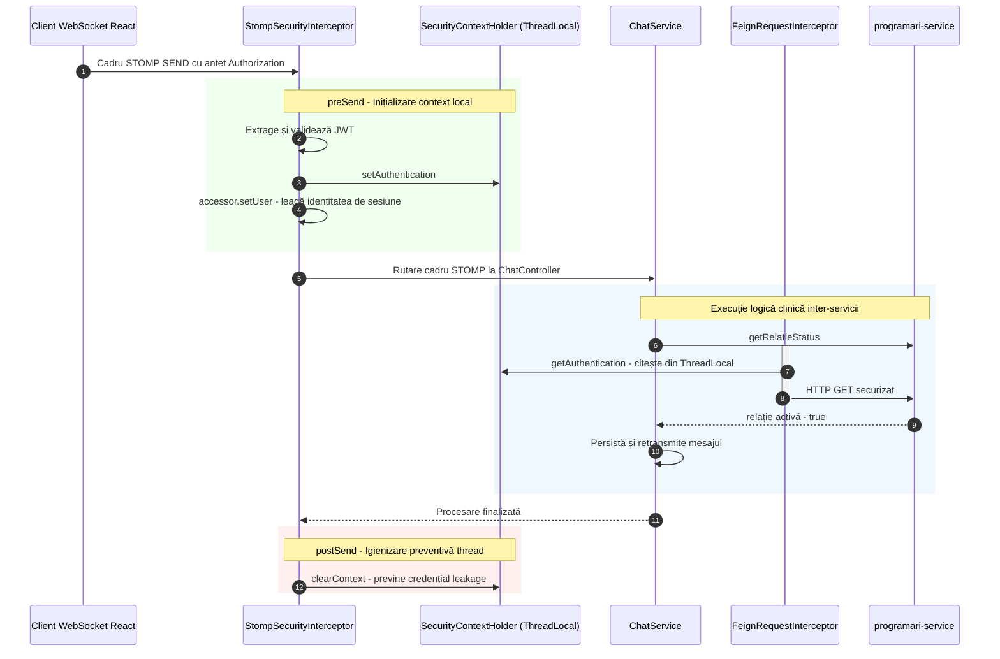

---

### Figura 6.5. Diagrama de secvență — Înregistrare utilizator cu compensare Saga
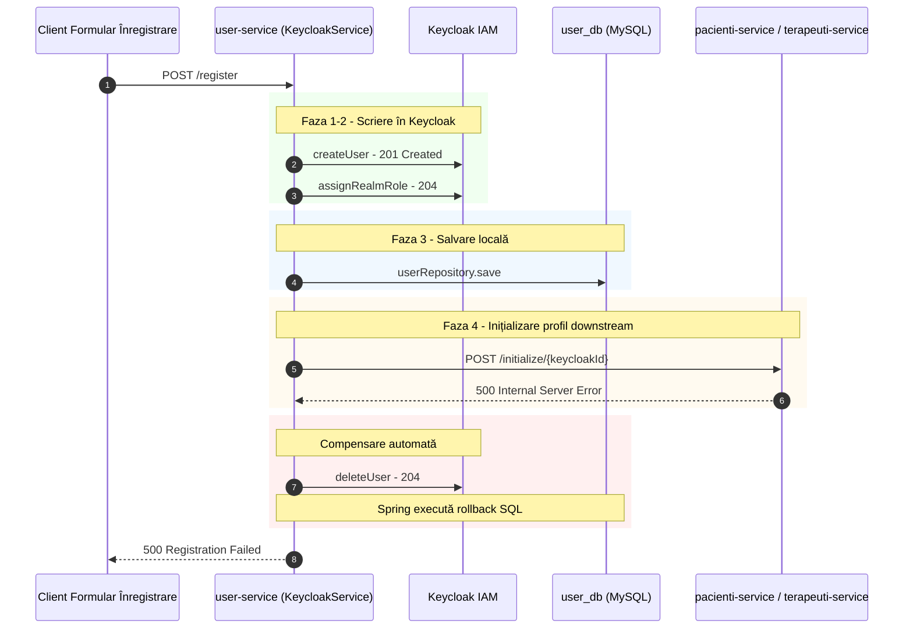

---

### Figura 6.6. Diagrama arhitecturală — Topologia RabbitMQ cu DLX
```mermaid
---
config:
  theme: base
  flowchart:
    curve: basis
    nodeSpacing: 55
    rankSpacing: 65
---
flowchart LR
    subgraph Producatori["Producători de Evenimente"]
        PS["programari-service"]
        PACS["pacienti-service"]
        CS["chat-service"]
    end

    subgraph Broker["RabbitMQ Message Broker"]
        direction TB
        EX["TopicExchange<br/>notificari.exchange"]
        MQ["Main Queue<br/>notificari.queue.v2"]
        DLX["DLX Fanout<br/>notificari.dlx"]
        DLQ["DLQ Queue<br/>notificari.queue.dead"]

        EX -->|"Rutare wildcard: notificare.#"| MQ
        MQ -. "NACK (requeue=false)" .-> DLX
        DLX --> DLQ
    end

    subgraph Consumatori["Consumatori - notificari-service"]
        NC["NotificareConsumer<br/>(Procesare & Persistență)"]
        DC["DeadLetterConsumer<br/>(Audit & Carantină)"]
    end

    PS -->|"notificare.programare.*<br/>notificare.reminder.*<br/>notificare.evaluare.*<br/>notificare.reevaluare.*"| EX
    PACS -->|"notificare.jurnal.completat"| EX
    CS -->|"notificare.mesaj.nou"| EX
    MQ -->|"ACK - procesare cu succes"| NC
    DLQ --> DC
    classDef prod fill:#f1f5f9,stroke:#64748b,stroke-width:2px,color:#334155;
    classDef exchange fill:#fef9c3,stroke:#ca8a04,stroke-width:2px,color:#713f12;
    classDef queue fill:#dbeafe,stroke:#2563eb,stroke-width:2px,color:#1e3a8a;
    classDef consumer fill:#dcfce7,stroke:#16a34a,stroke-width:2px,color:#14532d;
    classDef dead fill:#fee2e2,stroke:#dc2626,stroke-width:2px,color:#7f1d1d;

    class PS,PACS,CS prod;
    class EX,DLX exchange;
    class MQ queue;
    class DLQ dead;
    class NC consumer;
    class DC dead;
```

---

### Figura 6.7. Diagrama de secvență — Fluxul de schimbare a terapeutului
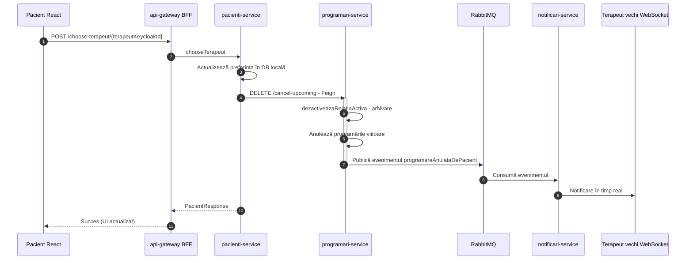

---

### Figura 6.8. Diagrama de secvență — Trimiterea mesajelor în timp real și validarea relației clinice
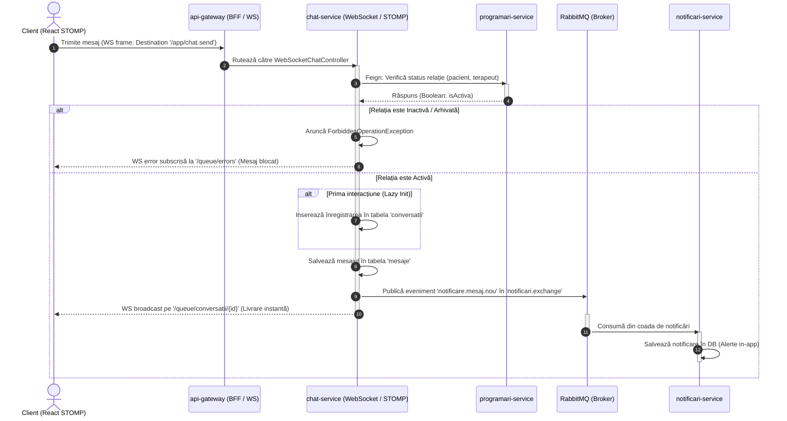

---

## Anexa 7. Diagrame de flux și navigare

### Figura 7.1. Harta de navigare și decizie a pacientului
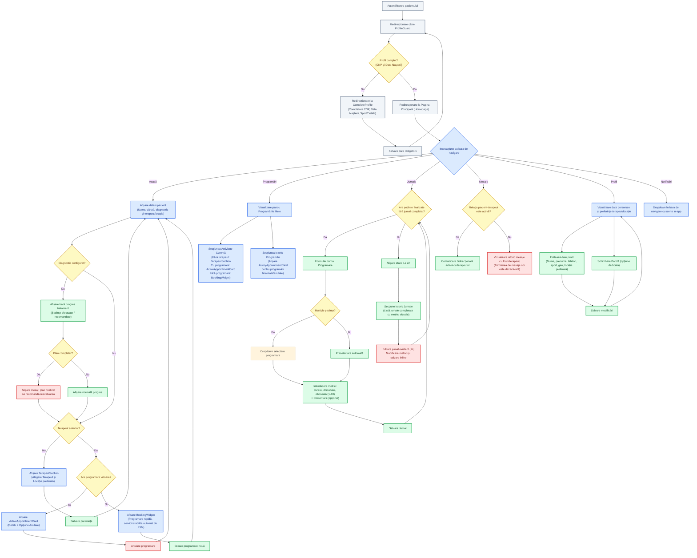

---

### Figura 7.2. Fluxul operațional al terapeutului
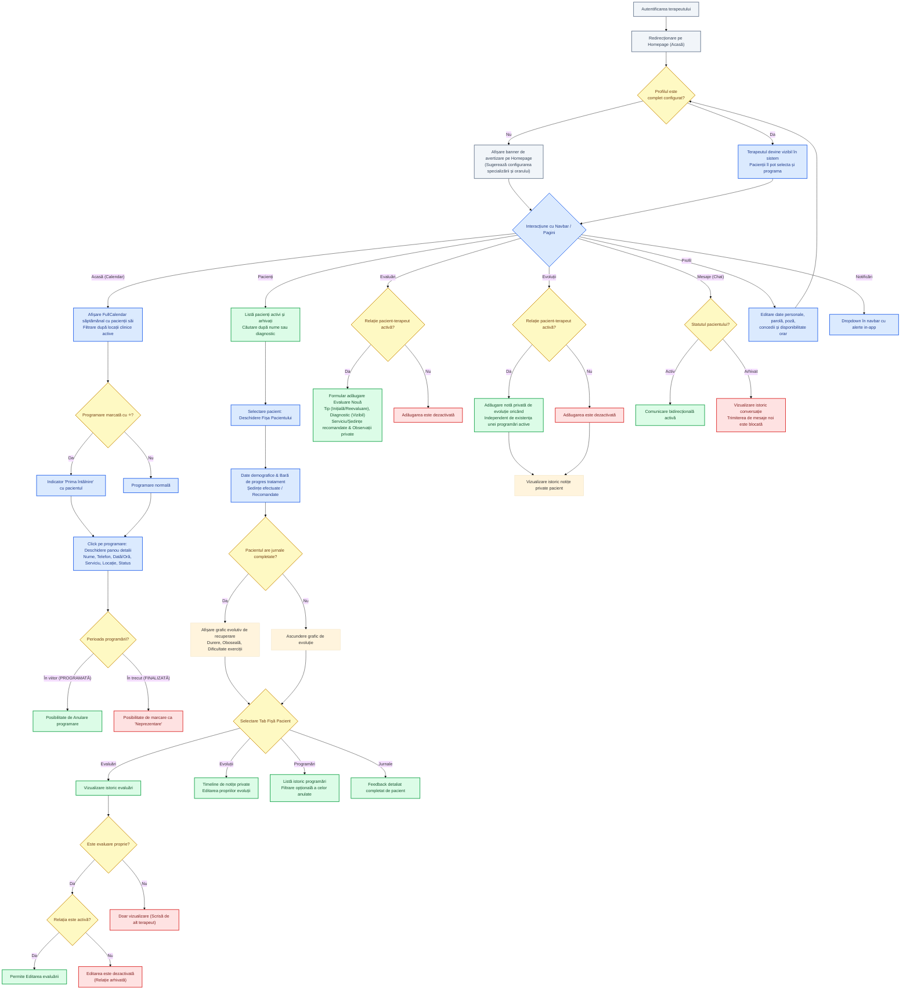

---

### Figura 7.3. Arhitectura panoului administrativ și topologia datelor
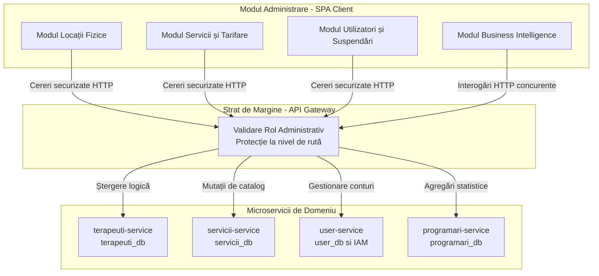

---

### Figura 7.4. Fluxul operațional al administratorului și procesarea statistică
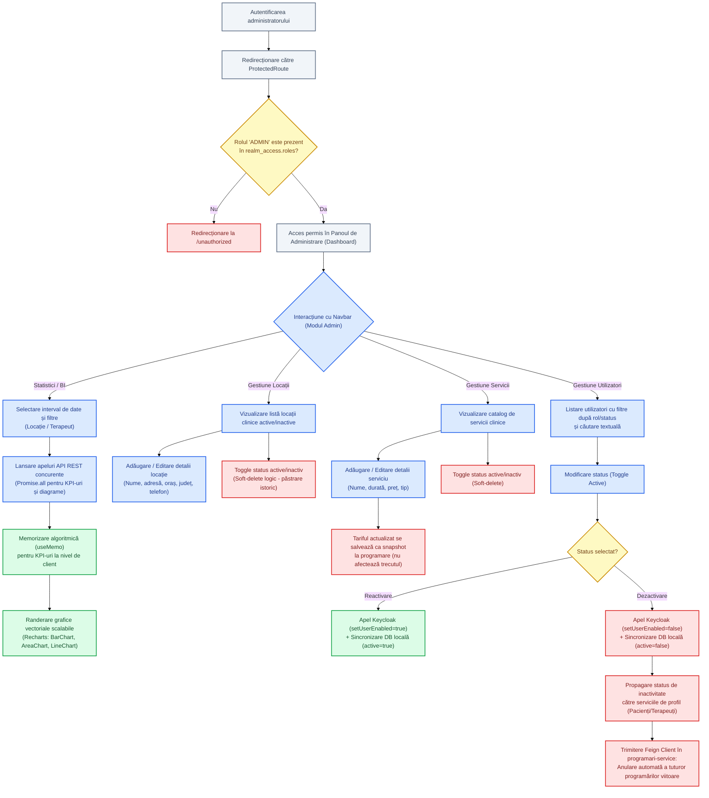

```
