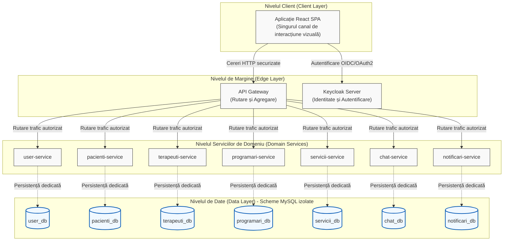
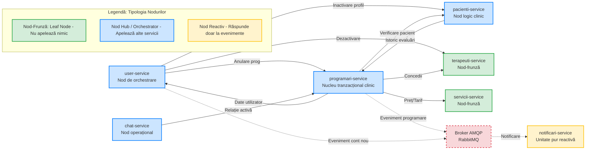

# Diagrame pentru Secțiunea 4.1

Aceste două diagrame sunt generate pe baza specificațiilor din text și a analizei codului sursă (`@FeignClient` și logica AMQP). Prima diagramă prezintă topologia pe cele 4 niveluri (Client -> Edge -> Domain -> Data), iar a doua arată proprietățile grafului apelurilor inter-servicii (sincrone via Feign și asincrone via RabbitMQ).

## Figura 4.1. Arhitectura pe patru niveluri a platformei KinetoCare

---

## Figura 4.2. Graful orientat al apelurilor inter-servicii (Sincron vs. Asincron)

