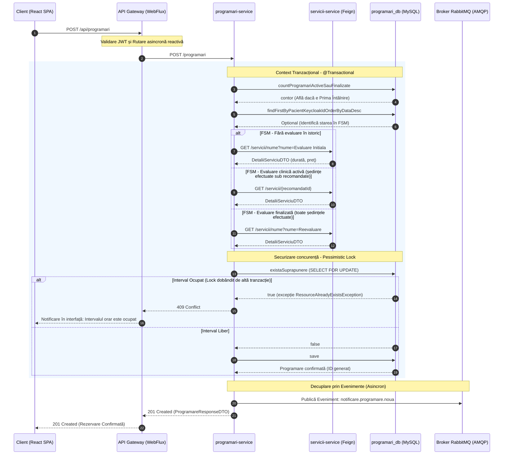
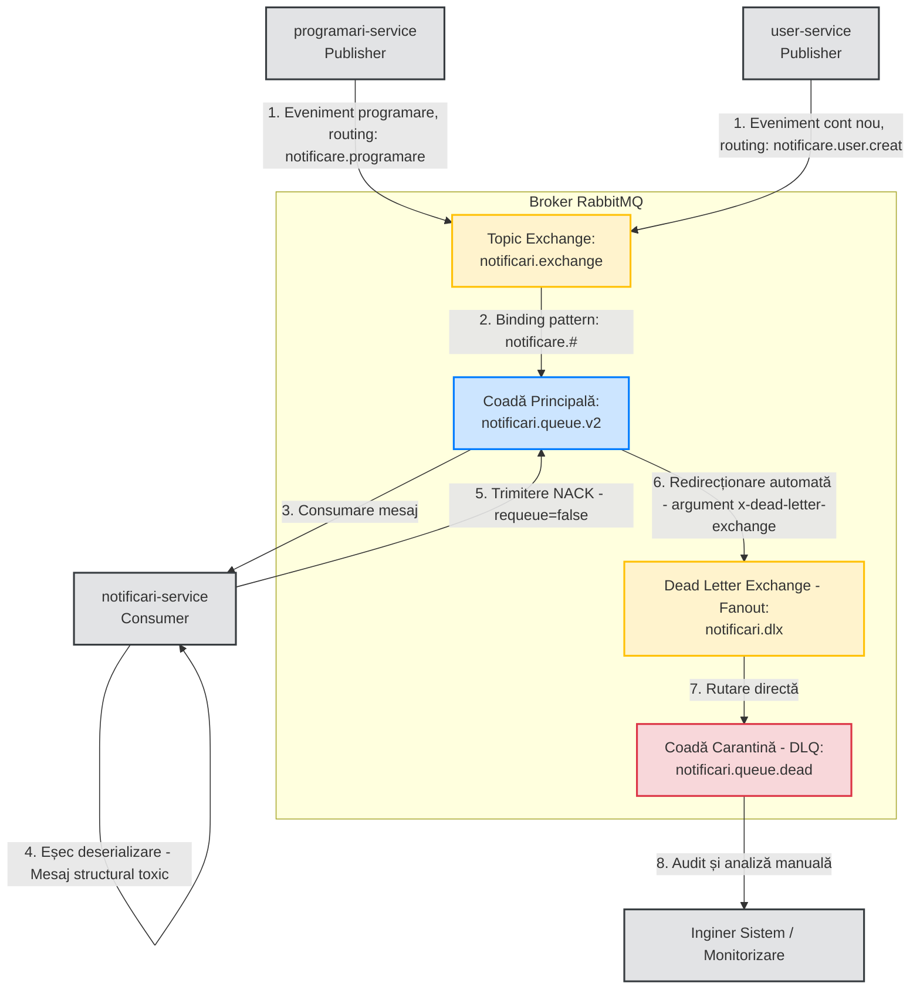
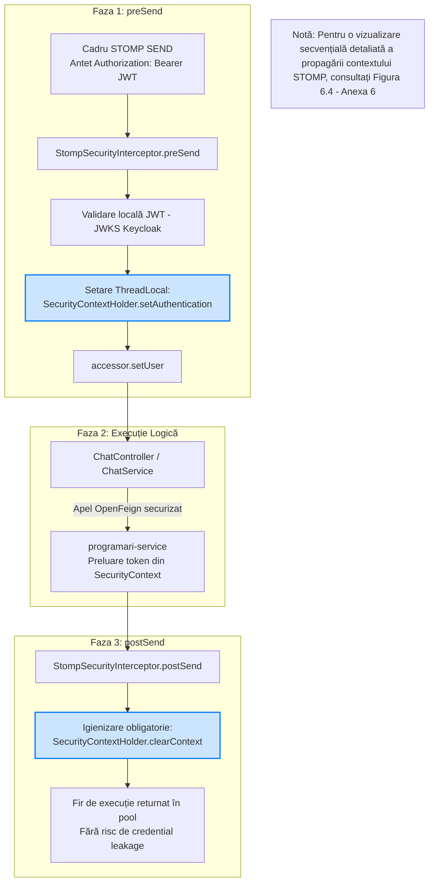
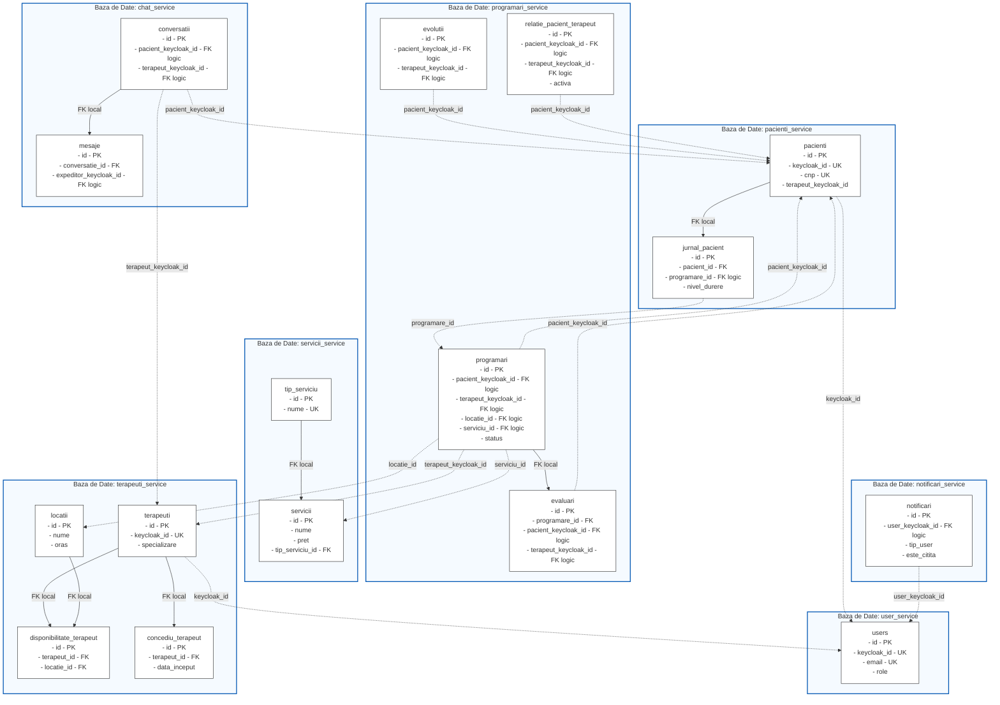

# Diagrame Suplimentare - Capitolul 4

Acest fișier conține diagramele solicitate pentru secțiunile 4.2, 4.3 și 4.4. Ele documentează fluxurile de mesagerie, concurență tranzacțională, optimizarea prin API Gateway și modelul de securitate Zero-Trust.

---

## Secțiunea 4.2 — Gestiunea comunicării inter-servicii

### Figura 4.3. Diagrama de secvență a fluxului de rezervare clinică
Această diagramă prezintă tranzacția clinică securizată la crearea unei programări, interogarea FSM pentru determinarea tipului de serviciu și aplicarea blocării pesimiste (SELECT ... FOR UPDATE) pentru evitarea rezervărilor duble.

---

### Figura 4.4. Topologia RabbitMQ și circuitul mesajelor toxice (DLQ)
Această diagramă descrie arhitectura cozilor, logica de rutare prin chei semantice Topic și devierea automată a mesajelor structural afectate (NACK fără requeue) în carantină.

---

## Secțiunea 4.3 — API Gateway și tiparul BFF (Scatter-Gather)

### Figura 4.5. Optimizarea latenței: Interogare Serială vs. BFF Reactiv (Scatter-Gather)
Diagramele Gantt de mai jos ilustrează economia de timp obținută prin execuția concurentă a cererilor downstream (prin `Mono.zip` sau `/users/batch`) comparativ cu un model serial care suferă de penalizarea de latență N+1.

```mermaid
gantt
    title Model Serial Clasic - Cereri separate consecutive
    dateFormat  X
    section Frontend la API
    R1 - Date utilizator - user-service :active, s1, 0, 80
    R2 - Profil medical - pacienti-service :crit, s2, 80, 180
    R3 - Orar viitor - programari-service :crit, s3, 180, 280
    Consolidare date si randare :s4, 280, 300
```

```mermaid
gantt
    title Model BFF Reactiv - Agregare paralelă pe server
    dateFormat  X
    section Gateway la Core
    BFF Request - Clienti WebFlux :active, p1, 0, 10
    Mono 1 - Date utilizator - user-service :active, p2, 10, 90
    Mono 2 - Profil medical - pacienti-service :crit, p3, 10, 110
    Mono 3 - Orar viitor - programari-service :active, p4, 10, 105
    Agregare si raspuns :p5, 110, 120
```

---

## Secțiunea 4.4 — Securizarea canalelor WebSocket STOMP

### Figura 4.6. Ciclul de viață al ThreadLocal în Interceptorul STOMP
Această diagramă conceptualizează fluxul de securitate pe canale persistente în cele 3 faze ale `StompSecurityInterceptor` care protejează aplicația împotriva scurgerilor de credențiale (credential leakage).

---

## Secțiunea 4.5 — Modelul de Date și Persistența Distribuită

### Figura 4.7. Diagrama logică a bazelor de date și legăturilor inter-servicii
Această diagramă ilustrează cele 7 scheme SQL complet izolate (Database-per-Service) conform definiției fizice a tabelelor. Sunt reprezentate principalele tabele din fiecare microserviciu, coloanele cheie și modul în care acestea stabilesc referințe logice descentralizate pe baza cheii universale de pivotare `keycloak_id` sau referințe de catalog.

