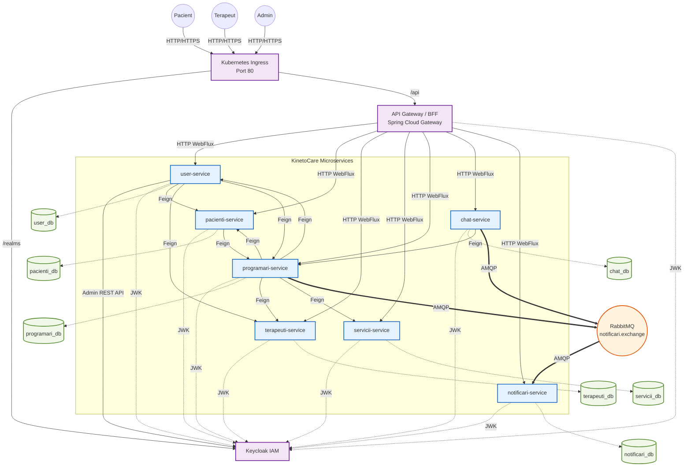
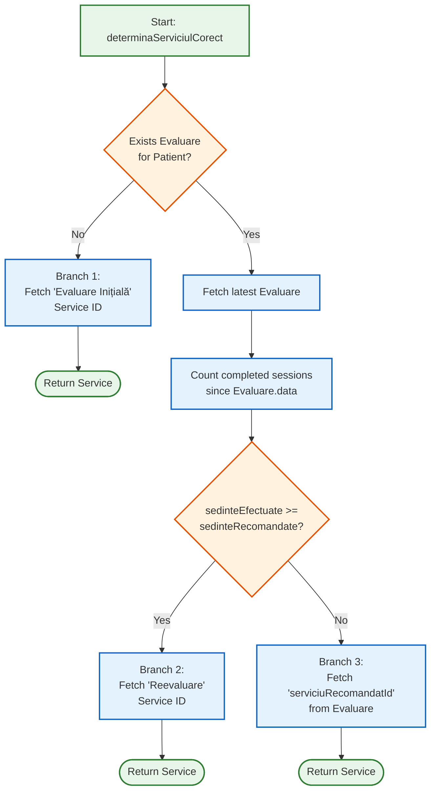

# 🎓 KinetoCare — Master’s Thesis Documentation

# 📑 Table of Contents

- [Section 1: System Architecture Overview](about:blank#section-1-system-architecture-overview)
- [Section 2: Authentication & Authorization](about:blank#section-2-authentication--authorization)
- [Section 3: Core Business Logic: Appointment Booking Flow](about:blank#section-3-core-business-logic-appointment-booking-flow)
- [Section 4: Clinical Evaluation & Treatment Plan Flow](about:blank#section-4-clinical-evaluation--treatment-plan-flow)
- [Section 5: Patient Journal Flow](about:blank#section-5-patient-journal-flow)
- [Section 6: Real-Time Chat System](about:blank#section-6-real-time-chat-system)
- [Section 7: Notification System](about:blank#section-7-notification-system)
- [Section 8: Per-Microservice Deep Dive](about:blank#section-8-per-microservice-deep-dive)
- [Section 9: Frontend Architecture (Deep Dive)](about:blank#section-9-frontend-architecture-deep-dive)
- [Section 10: Infrastructure & DevOps](about:blank#section-10-infrastructure--devops)
- [Section 11: Resilience & Error Handling](about:blank#section-11-resilience--error-handling)

---

# Section 1: System Architecture Overview

### 1.1 Microservices Map

KinetoCare is a distributed system comprising 7 domain-driven microservices (each with a dedicated MySQL schema), orchestrated behind 1 central stateless API Gateway. The services run on the ports shown below (local development defaults from `application.yml`):

| Service | Port | Responsibility | Database Schema |
| --- | --- | --- | --- |
| `api-gateway` | 8081 | Single entry point, BFF aggregation, token proxy, routing | None (stateless) |
| `user-service` | 8082 | Identity, profile basics (name, email, phone, gender, role), Keycloak admin operations | `user_db` |
| `pacienti-service` | 8083 | Patient clinical profile (CNP, birthdate, sport habits, preferred location/therapist), patient journal | `pacienti_db` |
| `terapeuti-service` | 8084 | Therapist professional profile, clinic locations, therapist availability schedules, leave periods | `terapeuti_db` |
| `programari-service` | 8085 | Appointments, evaluations, progress notes (evoluții), patient-therapist relationships, statistics | `programari_db` |
| `servicii-service` | 8086 | Medical service catalog (service types, pricing, session durations) | `servicii_db` |
| `chat-service` | 8087 | Real-time WebSocket/STOMP messaging, conversation and message persistence | `chat_db` |
| `notificari-service` | 8088 | Asynchronous notification persistence and REST read API; pure RabbitMQ consumer | `notificari_db` |

**Key architectural observation:** `programari-service` is the most complex service in the system. It hosts not only appointments but also evaluations, progress notes, and the `RelatiePacientTerapeut` aggregate — all entities that require cross-referencing appointment and clinical data within a single transactional boundary.



---

### 1.2 API Gateway / BFF Pattern

The API Gateway is built on **Spring Cloud Gateway WebFlux** — a reactive, non-blocking engine powered by Project Reactor. It serves two distinct roles simultaneously.

### 1.2.1 Transparent Reverse Proxy (Routing)

For the majority of paths, the Gateway acts as a pure reverse proxy: it receives a request, strips the `/api` prefix via the `StripPrefix=1` filter, and forwards the request to the appropriate downstream service. The complete routing table, extracted from `application.yml`, is:

| Frontend Path Pattern | Target Service | Downstream Path (after strip) |
| --- | --- | --- |
| `/api/users/**` | `user-service:8082` | `/users/**` |
| `/api/pacient/**` | `pacienti-service:8083` | `/pacient/**` |
| `/api/disponibilitate/**` | `terapeuti-service:8084` | `/disponibilitate/**` |
| `/api/locatii/**` | `terapeuti-service:8084` | `/locatii/**` |
| `/api/concediu/**` | `terapeuti-service:8084` | `/concediu/**` |
| `/api/terapeut/**` | `terapeuti-service:8084` | `/terapeut/**` |
| `/api/programari/**` | `programari-service:8085` | `/programari/**` |
| `/api/evaluari/**` | `programari-service:8085` | `/evaluari/**` |
| `/api/evolutii/**` | `programari-service:8085` | `/evolutii/**` |
| `/api/fisa-pacient/**` | `programari-service:8085` | `/fisa-pacient/**` |
| `/api/jurnal/**` | `pacienti-service:8083` | `/jurnal/**` |
| `/api/servicii/**` | `servicii-service:8086` | `/servicii/**` |
| `/api/chat/**` | `chat-service:8087` | `/chat/**` |
| `/api/notificari/**` | `notificari-service:8088` | `/notificari/**` |

Note that `terapeuti-service` is mapped under **four distinct path prefixes** (`/api/disponibilitate`, `/api/locatii`, `/api/concediu`, `/api/terapeut`). Spring Cloud Gateway evaluates routes in declaration order; the more specific routes (`terapeuti-disponibilitate`, `terapeuti-locatii`, `terapeuti-concediu`) are declared before the general `terapeuti-service` route, preventing ambiguous matching.

### 1.2.2 BFF (Backend-For-Frontend) Aggregation Endpoints

The Gateway contains **four custom WebFlux controllers** that implement the BFF pattern — aggregating multiple downstream calls into one response to eliminate N+1 round-trips from the browser:

**`HomepageController` → `HomepageService`**

Called at `GET /api/homepage`. For a **PACIENT**, `HomepageService` performs three parallel reactive calls:

1. `ProfileService.getProfile()` — itself an aggregation (see below)
2. `GET /programari/pacient/by-keycloak/{id}/next` → `programari-service` (next appointment)
3. `GET /programari/pacient/by-keycloak/{id}/situatie` → `programari-service` (diagnosis + progress)

Steps 2 and 3 are fired concurrently using `Mono.zip()`. The results are merged into a single JSON map with keys `urmatoareaProgramare` and `situatie` alongside the profile data. If either call returns empty (no upcoming appointment, no active plan), `onErrorResume` gracefully returns `Mono.empty()` and `defaultIfEmpty(Map.of())` prevents the zip from stalling.

For **TERAPEUT**, only the profile is returned (no appointment summary needed).

**`ProfileController` → `ProfileService`**

Called at `GET /api/profile` and `PATCH /api/profile`. `ProfileService.getProfile()` is the most complex aggregation in the codebase:

- For **PACIENT**: fires two parallel calls — `user-service` (base identity) and `pacienti-service` (clinical profile). If the patient has a preferred therapist, it additionally fires two more parallel calls to `terapeuti-service` (professional data) and `user-service` again (therapist’s name). Finally, if a preferred location exists, it calls `terapeuti-service` for location details. All are executed with `Mono.zip()` and merged into one flat map. Duplicate keys (`keycloakId`, `id`) are explicitly removed before merging.
- For **TERAPEUT**: fires two parallel calls — `user-service` and `terapeuti-service`. The therapist’s internal DB `id` is preserved as `terapeutId` in the response.

`ProfileService.updateProfile()` does the reverse: it receives a flat update payload, splits it into user/pacient/terapeut field groups using `extractUserFields()`, `extractPacientFields()`, and `extractTerapeutFields()`, fires all applicable PATCH calls concurrently via `Mono.when(updates)`, then calls `getProfile()` to return the refreshed state.

**`ChatGatewayController` → `ChatGatewayService`**

Called at `GET /api/chat/conversatii/agregat`. Aggregates conversation list from `chat-service` with participant name data from `user-service`, producing enriched `ConversatieAgregataDTO` objects.

**`SearchTerapeutController` → `SearchTerapeutService`**

Handles therapist search for the patient’s onboarding flow, combining therapist professional data from `terapeuti-service` with names from `user-service`.

### 1.2.3 Token Proxy: `KeycloakProxyController`

Handles `POST /api/auth/token` and `POST /api/auth/logout`. These endpoints are `permitAll()` in the Gateway’s `SecurityConfig`. The controller:

- Accepts `application/x-www-form-urlencoded` form data
- Appends `client_id=react-client` and forwards to Keycloak’s token endpoint
- For `grant_type=refresh_token`, reads the `refresh_token` from the incoming `HttpOnly` cookie and injects it into the Keycloak request body — so the browser JavaScript never sees the refresh token
- On success, extracts the `refresh_token` from Keycloak’s response, wraps it in an `HttpOnly; SameSite=Lax; Path=/` cookie (30-day max-age), nullifies the `refresh_token` field in the JSON body, and returns only the `access_token` to JavaScript
- On logout, overwrites the cookie with `maxAge=0` to force browser deletion

---

### 1.3 Inter-Service Communication Map

KinetoCare uses two communication styles:

### Synchronous: Spring Cloud OpenFeign (HTTP)

Feign clients are used when a service needs a **synchronous, in-request answer** from another service. All Feign calls propagate the Bearer JWT token through a shared `FeignClientConfig` (request interceptor pattern from the `common` module).

| Caller | Feign Client | Target Service | Purpose |
| --- | --- | --- | --- |
| `user-service` | `PacientiClient` | `pacienti-service` | Initialize empty patient profile on registration; toggle `active` on admin deactivation |
| `user-service` | `TerapeutiClient` | `terapeuti-service` | Initialize empty therapist profile on registration; toggle `active` on admin deactivation |
| `user-service` | `ProgramariClient` | `programari-service` | Cancel future appointments when user is deactivated |
| `programari-service` | `ServiciiClient` | `servicii-service` | Fetch service price and duration at appointment creation time |
| `programari-service` | `UserClient` | `user-service` | Fetch patient/therapist names for enriched responses (statistics, patient file) |
| `programari-service` | `TerapeutiClient` | `terapeuti-service` | Fetch location names, check therapist availability/leave, get therapist details |
| `programari-service` | `PacientiClient` | `pacienti-service` | Update `terapeutKeycloakId` on therapist change; signal therapist change for relationship management |
| `chat-service` | `ProgramariClient` | `programari-service` | Verify active `RelatiePacientTerapeut` before allowing a message to be sent |
| `api-gateway` | WebClient (reactive) | All services | BFF aggregation (not Feign — uses WebFlux `WebClient`) |

Note: `user-service`’s registration flow uses `RestTemplate` (not Feign) for the initial profile initialization calls to `pacienti-service` and `terapeuti-service`. This is because registration happens before a valid JWT exists for the new user, so a service-to-service call without user auth context is made directly.

### Asynchronous: RabbitMQ (AMQP)

RabbitMQ is used for **fire-and-forget** cross-service events where the producer does not need an immediate result:

| Producer | Exchange | Routing Key | Consumer | Purpose |
| --- | --- | --- | --- | --- |
| `programari-service` | `notificari.exchange` | `notificare.programare.*` | `notificari-service` | Notify patient of new appointment, cancellation, therapist change |
| `chat-service` | `notificari.exchange` | `notificare.mesaj.nou` | `notificari-service` | Notify the recipient of a new chat message |

The full topology is defined in `notificari-service/RabbitMQConfig.java`:
- **Topic Exchange:** `notificari.exchange` — routes messages by `notificare.#` pattern (matches any routing key starting with `notificare.`)
- **Main Queue:** `notificari.queue.v2` — durable, bound to the exchange with routing key `notificare.#`, configured with `x-dead-letter-exchange=notificari.dlx`
- **Dead Letter Exchange (DLX):** `notificari.dlx` — a Fanout exchange
- **Dead Letter Queue (DLQ):** `notificari.queue.dead` — durable, bound to the DLX

The queue was renamed from `notificari.queue` to `notificari.queue.v2` because RabbitMQ does not allow changing the arguments (like adding a DLX) of an already-declared durable queue — a rename was the correct migration path.

---

### 1.4 Database-Per-Service Isolation

Each microservice owns its MySQL schema exclusively. No service reads or writes to another service’s schema directly. Cross-service data needs are resolved via API calls.

**What this isolation provides:**

1. **Independent schema evolution:** `programari-service` can add a column to `programare` without coordinating a migration with any other team or service.
2. **Independent scaling:** `chat-service` can be scaled to 5 replicas without affecting `user-service` connection pools.
3. **Fault containment:** A corrupted `pacienti_db` does not affect appointment booking — the booking service uses its own schema.
4. **Technology freedom:** Each service could theoretically use a different DB engine (though all currently use MySQL 8).

**The critical trade-off — denormalization:** Because services cannot join across schemas, `programari-service` denormalizes `pret` (price), `durataMinute`, and `tipServiciu` (service name) directly into the `Programare` entity at creation time by calling `servicii-service` via Feign. This means that if the catalog price changes in `servicii-service`, historical booking records are unaffected — which is correct billing behavior. The same applies to `locatieId` stored on `Programare`: the location name must be fetched from `terapeuti-service` when a human-readable display is needed.

---

## Section 2: Authentication & Authorization

### 2.1 Keycloak Setup

Keycloak runs as a containerized service in Docker Compose. The realm is pre-configured via **import**: on container startup, Keycloak is provided the `kinetocare-realm.json` file through the `--import-realm` flag, which automatically provisions the entire realm configuration without manual UI intervention.

**Realm:** `kinetocare`

**Realm-level roles** (not client roles — this distinction matters for the JWT claim path):

| Role Name | Display Name | Used By |
| --- | --- | --- |
| `pacient` | Patient | All patient-facing endpoints |
| `terapeut` | Therapist | All therapist-facing endpoints |
| `admin` | Administrator | Admin management endpoints |

These roles appear in the JWT under `realm_access.roles` as lowercase strings (e.g., `"pacient"`, `"terapeut"`, `"admin"`).

**Client:** `react-client`
- Client type: **public** (no client secret — appropriate for SPAs)
- Access type allows `password` grant type (Resource Owner Password Credentials) for the login flow
- Redirect URIs and CORS origins are configured for the frontend application

**Admin Client:** The `user-service` uses a separate admin-level Keycloak client (`admin-cli`) authenticated with admin credentials against the `master` realm. This gives `user-service` the ability to call the Keycloak Admin REST API to create users, assign roles, reset passwords, and disable accounts. Configuration in `KeycloakConfig.java`:

```java
return KeycloakBuilder.builder()
    .serverUrl(authServerUrl)   // http://localhost:8080
    .realm(adminRealm)          // "master"
    .username(adminUsername)    // "admin"
    .password(adminPassword)    // "admin"
    .clientId(adminClientId)    // "admin-cli"
    .build();
```

**Admin auto-provisioning:** `AdminInitializer` implements `CommandLineRunner` and fires on `user-service` startup. It checks if the admin email exists in the local DB; if not, it runs a retry loop (20 attempts, 5 seconds apart) to create the admin in both Keycloak and the local `user_db`. The retry loop is necessary in Docker Compose environments where Keycloak may not be fully ready when `user-service` starts.

---

### 2.2 JWT Token Flow: Login → API Gateway → Microservice

The token lifecycle involves a deliberate split between the **browser** (which holds only the short-lived access token in memory) and the **Gateway** (which manages the long-lived refresh token in a server-managed cookie).

**Step-by-step login flow:**

1. User submits credentials in `LoginPage.jsx`.
2. `authService.login()` POSTs `grant_type=password&username=...&password=...` as URL-encoded form data to `POST /api/auth/token` with `credentials: 'include'`.
3. The API Gateway’s `KeycloakProxyController.handleTokenRequest()` receives the request. It appends `client_id=react-client` and forwards to Keycloak’s token endpoint: `http://keycloak:8080/realms/kinetocare/protocol/openid-connect/token`.
4. Keycloak authenticates the user and returns a JSON body containing `access_token`, `refresh_token`, `expires_in`, etc.
5. The Gateway extracts `refresh_token` from the Keycloak response body, sets it as `null` in the JSON it returns to the browser, and writes it as a `Set-Cookie: refresh_token=...; HttpOnly; SameSite=Lax; Path=/; Max-Age=2592000` header.
6. The browser receives only the `access_token` in the JSON response body.
7. `authService.setToken(tokenData.access_token)` stores the token in the `inMemoryToken` module-level variable — never in `localStorage` or `sessionStorage`.
8. `AuthContext` calls `authService.getUserInfo()`, which does `JSON.parse(atob(token.split('.')[1]))` to extract `email`, `realm_access.roles`, and `sub` (mapped as `keycloakId`) directly from the JWT payload without any server round-trip.
9. `AuthContext` sets `isAuthenticated=true` and `userInfo={email, roles, keycloakId}`.

**Step-by-step request flow (subsequent calls):**

1. A React component calls a service function, e.g., `programariService.getProgramari()`.
2. The Axios instance in `api.js` fires a request interceptor that reads `authService.getToken()` and injects `Authorization: Bearer <access_token>` into the request header.
3. The request reaches the API Gateway. The Gateway’s `SecurityWebFilterChain` (WebFlux) validates the JWT by contacting Keycloak’s JWK endpoint (`/realms/kinetocare/protocol/openid-connect/certs`) to verify the signature.
4. The `grantedAuthoritiesExtractor` converter reads `jwt.getClaim("realm_access").roles`, prefixes each role with `ROLE_` (e.g., `"pacient"` → `ROLE_pacient`), and creates `SimpleGrantedAuthority` objects — this is how Spring’s `hasRole("pacient")` checks work.
5. If the path-level rule in `SecurityWebFilterChain` passes, the Gateway forwards the original request (including the `Authorization` header) to the downstream microservice.
6. Each downstream microservice has its own `SecurityFilterChain` configured as an `oauth2ResourceServer`. It **independently validates** the JWT signature using the same JWK URI — it does not contact the Gateway or any shared session store.

---

### 2.3 Zero-Trust Model: Independent JWT Validation Per Service

Each microservice is configured as an independent **OAuth2 Resource Server**. This is the Zero-Trust principle applied to microservices: no service trusts the Gateway’s word that a request is authenticated — every service validates the token itself.

The configuration is identical across all microservices (shown here from `user-service/SecurityConfig.java`):

```java
.oauth2ResourceServer(oauth2 -> oauth2
    .jwt(jwt -> jwt.jwtAuthenticationConverter(jwtAuthenticationConverter())))
```

The `jwtAuthenticationConverter` reads `realm_access.roles` from the JWT claims and maps each role to a `SimpleGrantedAuthority("ROLE_" + role)`. The JWT public key is fetched from Keycloak’s JWK endpoint:

```yaml
spring:
security:
oauth2:
resourceserver:
jwt:
issuer-uri: http://localhost:8080/realms/kinetocare
jwk-set-uri: http://localhost:8080/realms/kinetocare/protocol/openid-connect/certs
```

Spring Security caches the JWK set and periodically refreshes it. This means:
- If Keycloak is momentarily unavailable, previously cached keys still work.
- Revoked tokens are not immediately rejected (JWT is stateless), but the short expiry (typically 5 minutes) limits the exposure window.
- Each service can enforce its own rules independent of every other service.

**The API Gateway uses the WebFlux variant** (`@EnableWebFluxSecurity`, `ServerHttpSecurity`) because it runs on the reactive stack. All downstream services use the blocking MVC variant (`@EnableWebSecurity`, `HttpSecurity`). The role extraction logic is functionally identical but uses different API classes: `Converter<Jwt, Mono<AbstractAuthenticationToken>>` on the Gateway vs `JwtAuthenticationConverter` in the services.

---

### 2.4 RBAC at Endpoint Level

### API Gateway Layer (`SecurityConfig.java` — WebFlux)

```java
.pathMatchers("/api/auth/token", "/api/auth/logout").permitAll()
.pathMatchers("/api/users/auth/**").permitAll()
.pathMatchers("/api/chat/ws-chat/**").permitAll()
.pathMatchers(HttpMethod.POST, "/api/locatii/**").hasRole("admin")
.pathMatchers(HttpMethod.PATCH, "/api/locatii/**").hasRole("admin")
.pathMatchers(HttpMethod.DELETE, "/api/locatii/**").hasRole("admin")
.pathMatchers("/api/locatii/all").hasRole("admin")
.pathMatchers(HttpMethod.GET, "/api/locatii/**").authenticated()
.anyExchange().authenticated()
```

The Gateway enforces coarse-grained access control. The `/api/chat/ws-chat/**` path is permitted at the HTTP level because SockJS needs to complete an HTTP handshake before upgrading to WebSocket — the actual authentication is then enforced at the STOMP frame level by `StompSecurityInterceptor`.

### `user-service` Layer (`SecurityConfig.java` — MVC)

```java
.requestMatchers("/actuator/health").permitAll()
.requestMatchers("/users/auth/**").permitAll()
.requestMatchers(HttpMethod.PATCH, "/users/*/toggle-active").hasRole("admin")
.requestMatchers(HttpMethod.GET, "/users").hasRole("admin")
.anyRequest().authenticated()
```

The `/users` list endpoint (returns all users with optional filters by role/active status) is admin-only. The `toggle-active` PATCH endpoint is admin-only. All other user endpoints require any authenticated user (typically accessing their own data, with business-logic ownership checks in the service layer).

### `chat-service` Layer (`SecurityConfig.java` — MVC)

```java
.requestMatchers("/actuator/health").permitAll()
.requestMatchers("/chat/ws-chat/**").permitAll()
.anyRequest().authenticated()
```

The WebSocket handshake path is permitted at the HTTP level. All REST endpoints (conversation list, message history, mark-as-read) require authentication. The deeper relationship-validity check is done at the business logic level via the Feign call to `programari-service`.

### `@EnableMethodSecurity` and `@PreAuthorize`

Both `user-service` and `chat-service` declare `@EnableMethodSecurity`. This enables method-level security annotations like `@PreAuthorize("hasRole('terapeut')")` on individual service or controller methods, allowing fine-grained control beyond URL patterns. The `programari-service` uses this pattern extensively to differentiate endpoints accessible to patients vs. therapists (e.g., only therapists can create evaluations, only patients can write journal entries for their own appointments).

---

### 2.5 WebSocket Authentication: `StompSecurityInterceptor`

Standard HTTP security filters do not apply to WebSocket frames after the initial HTTP upgrade. `StompSecurityInterceptor` implements `ChannelInterceptor` and is registered on the `clientInboundChannel` in `WebSocketConfig`:

```java
@Override
public void configureClientInboundChannel(ChannelRegistration registration) {
    registration.interceptors(securityInterceptor);
}
```

**`preSend()` execution (fires on every inbound STOMP frame):**

1. The interceptor reads the `StompCommand` from the frame header.
2. It acts on `CONNECT` and `SEND` commands (the two commands that must be authenticated).
3. For `CONNECT`: the browser must include `Authorization: Bearer <token>` as a STOMP header. The interceptor extracts it, calls `jwtDecoder.decode(token)` (same JWK-backed decoder as the HTTP layer), creates a `JwtAuthenticationToken`, calls `accessor.setUser(authentication)` to bind the identity to the **WebSocket session**, and populates `SecurityContextHolder` for the current thread.
4. For `SEND`: if the frame carries a new `Authorization` header, it re-authenticates. If not, it falls back to the user already bound to the session accessor (`accessor.getUser()`).
5. `SecurityContextHolder.clearContext()` is called in `postSend()` to prevent thread pool contamination (thread pool reuse would otherwise leak the previous user’s security context).

**What happens if authentication fails?** The interceptor logs a warning and calls `SecurityContextHolder.clearContext()`. The STOMP `CONNECT` frame is still passed to the broker, but without an authenticated user set on the session. Any subsequent `@MessageMapping` handler that calls `SecurityContextHolder.getContext().getAuthentication()` will receive `null`, causing business logic to reject the message.

**WebSocket broker configuration (`WebSocketConfig.java`):**
- `enableSimpleBroker("/queue")` — in-memory broker for user-specific delivery (point-to-point)
- `setApplicationDestinationPrefixes("/app")` — prefix for messages routed to `@MessageMapping` handlers
- Endpoint: `/chat/ws-chat` with SockJS fallback

---

### 2.6 Registration Flow: Dual Write

The registration process guarantees consistency between Keycloak (the identity store) and `user_db` (the application’s user record) through a transactional dual-write with a compensating rollback mechanism.

**End-to-end steps:**

1. The patient fills the registration form in `RegisterPage.jsx` and submits. `authService.register()` POSTs `{email, password, nume, prenume, telefon, gen, role: "PACIENT"}` as JSON to `POST /api/users/auth/register`.
2. The API Gateway routes this to `user-service` at `/users/auth/register` (permitted without authentication).
3. `AuthController.register()` delegates to `KeycloakService.registerUser()`, which is annotated `@Transactional`.
4. **Validation:** The method checks `request.role() == UserRole.ADMIN` and throws `ForbiddenOperationException` if true — admin accounts cannot be self-registered. It also checks `userRepository.existsByEmail()` against the local DB.
5. **Keycloak creation (`createUserInKeycloak`):** Uses the admin Keycloak client to call the Admin REST API. Builds a `UserRepresentation` with username=email, sets the password as a non-temporary `CredentialRepresentation`, calls `usersResource.create(user)`. The new user’s UUID is extracted from the `Location` response header: `locationHeader.substring(locationHeader.lastIndexOf('/') + 1)`.
6. **Role assignment (`assignRoleInKeycloak`):** Calls `realmResource.roles().get(roleName)` (where `roleName` is `"pacient"` or `"terapeut"` — lowercase) and assigns it to the new user via `roles().realmLevel().add(...)`.
7. **Local DB write:** Maps the `RegisterRequestDTO` to a `User` entity via `UserRegisterMapper`, sets `active=true`, saves via `userRepository.save()`. The `keycloakId` returned from step 5 is stored as the immutable cross-service reference.
8. **Profile shell initialization (`initializeRoleSpecificProfile`):** Makes a synchronous `RestTemplate.postForEntity()` call to either `pacienti-service/pacient/initialize/{keycloakId}` or `terapeuti-service/terapeut/initialize/{keycloakId}`. This creates an empty profile row in the appropriate service’s database, ensuring the profile exists before the user ever logs in.
9. **Compensating rollback:** The entire block is wrapped in a `try/catch`. If any step after Keycloak creation fails (DB write or profile initialization), `deleteUserInKeycloak(keycloakId)` is called to remove the orphaned Keycloak user. This is a **best-effort compensating transaction** — not a distributed 2PC. If the Keycloak deletion itself fails, a warning is logged and manual intervention is required.

**First-login profile completion (`ProfileGuard`):**

After a PACIENT logs in for the first time, `AuthContext` sets the user as authenticated. Before any clinical page is rendered, `ProfileGuard` fires:

```jsx
const profile = await profileService.getProfile();
if (profile.profileIncomplete === true) { setProfileComplete(false); }
else if (!profile.cnp || !profile.dataNasterii) { setProfileComplete(false); }
```

The `profileIncomplete: true` flag is set by `ProfileService` (in the Gateway) when `pacienti-service` returns a 404 for the patient profile — which would only happen if initialization failed. The fallback check on `cnp` and `dataNasterii` catches the normal case: profile exists but mandatory clinical fields are null. If incomplete, the patient is redirected to `/pacient/complete-profile` — no other patient route is accessible until this guard passes.

---

*— End of Sections 1 and 2 —*

*Awaiting your command to proceed with Section 3: Core Business Logic — Appointment Booking Flow.*

---

# Section 3: Core Business Logic — Appointment Booking Flow

## 3.1 End-to-End Flow Overview

The appointment booking flow spans the React frontend, the API Gateway, `programari-service`, `terapeuti-service`, and `servicii-service`. It is the most data-intensive user action in the system, requiring four cross-service calls before a single row is written to the database.

---

## 3.2 Entity: `Programare`

Class: `com.example.programari_service.entity.Programare`

Table: `programari`

| Field | Type | Constraint | Notes |
| --- | --- | --- | --- |
| `id` | `Long` | PK, auto-increment | — |
| `pacientKeycloakId` | `String` | NOT NULL, length=36 | Keycloak UUID of patient |
| `terapeutKeycloakId` | `String` | NOT NULL, length=36 | Keycloak UUID of therapist |
| `locatieId` | `Long` | NOT NULL | FK to `terapeuti_db.locatii` |
| `serviciuId` | `Long` | NOT NULL | FK to `servicii_db.servicii` |
| `tipServiciu` | `String` | NOT NULL, length=100 | **Denormalized** from `servicii-service` at creation |
| `pret` | `BigDecimal` | NOT NULL, precision=10 scale=2 | **Denormalized** at creation |
| `durataMinute` | `Integer` | NOT NULL | **Denormalized** at creation |
| `primaIntalnire` | `Boolean` | nullable | `true` if first meeting with this therapist |
| `data` | `LocalDate` | NOT NULL | Appointment date |
| `oraInceput` | `LocalTime` | NOT NULL | Start time |
| `oraSfarsit` | `LocalTime` | NOT NULL | Computed: `oraInceput + durataMinute` |
| `status` | `StatusProgramare` | NOT NULL | `PROGRAMATA` / `FINALIZATA` / `ANULATA` |
| `motivAnulare` | `MotivAnulare` | nullable | `ANULAT_DE_PACIENT` / `ANULAT_DE_TERAPEUT` / `NEPREZENTARE` / `ADMINISTRATIV` |
| `areEvaluare` | `Boolean` | NOT NULL, default=false | Set to `true` when therapist links an evaluation |
| `areJurnal` | `Boolean` | NOT NULL, default=false | Set to `true` when patient submits journal |
| `createdAt` | `OffsetDateTime` | NOT NULL | Record creation timestamp |
| `updatedAt` | `OffsetDateTime` | NOT NULL | Record update timestamp |

Four composite indexes are declared on the entity to serve the most critical queries without full-table scans:
- `idx_prog_terapeut_data_status` on `(terapeut_keycloak_id, data, status)` — calendar and overlap queries
- `idx_prog_pacient_status_data` on `(pacient_keycloak_id, status, data, ora_inceput)` — patient history and next-appointment
- `idx_prog_stats` on `(locatie_id, data)` — statistics aggregations
- `idx_prog_overlap` on `(terapeut_keycloak_id, data, ora_inceput, ora_sfarsit)` — overlap detection

---

## 3.3 Step-by-Step Booking Flow

### Phase 1: Patient Selects a Therapist and Date (Frontend)

1. The patient navigates to the `BookingWidget` component on their homepage, or to `ProgramariPacient.jsx`.
2. The patient selects a therapist, a clinic location, and a date. The frontend calls `GET /api/programari/sloturi-disponibile?terapeutKeycloakId=...&locatieId=...&data=...&serviciuId=...`.
3. The API Gateway strips `/api` and routes to `programari-service` at `GET /programari/sloturi-disponibile`.

### Phase 2: `getSloturiDisponibile` — Slot Calculation

Method: `ProgramareService.getSloturiDisponibile(terapeutKeycloakId, locatieId, data, serviciuId)`

Annotation: `@Transactional(readOnly = true)`

The algorithm proceeds as follows:

1. **Resolve internal therapist ID:** `terapeutiClient.getTerapeutByKeycloakId(terapeutKeycloakId)` returns a `Map<String, Object>` from which `terapeutId` (the `terapeuti_db` primary key) is extracted via `((Number) terapeutMap.get("id")).longValue()`. This ID translation is needed because `DisponibilitateTerapeut` and `ConcediuTerapeut` reference the internal `terapeutId`, not the Keycloak UUID.
2. **Leave (concediu) check:** `terapeutiClient.checkConcediu(terapeutId, data.toString())` calls `terapeuti-service` which executes `ConcediuRepository.isTerapeutInConcediu()`:
    
    ```sql
    SELECT COUNT(c) > 0 FROM ConcediuTerapeut c
    WHERE c.terapeutId = :terapeutId
    AND c.dataInceput <= :dataStart AND c.dataSfarsit >= :dataEnd
    ```
    
    If `true`, the method returns `List.of()` immediately — no slots exist on a leave day.
    
3. **Availability (disponibilitate) check:** The day-of-week is computed via `data.getDayOfWeek().getValue()` (returns 1=Monday … 7=Sunday, matching the `ziSaptamana` column convention). `terapeutiClient.getOrar(terapeutId, locatieId, ziSaptamana)` calls `terapeuti-service`, which executes:
    
    ```java
    // DisponibilitateRepository
    findByTerapeutIdAndLocatieIdAndZiSaptamanaAndActiveTrue(terapeutId, locatieId, ziSaptamana)
    ```
    
    If no `DisponibilitateTerapeut` record exists for that combination, the method catches the exception and returns `List.of()`.
    
4. **Fetch service duration:** `serviciiClient.getServiciuById(serviciuId)` returns a `DetaliiServiciuDTO` with `durataMinute`.
5. **Fetch existing bookings for that day:** `programareRepository.findByTerapeutKeycloakIdAndDataAndStatus(terapeutKeycloakId, data, StatusProgramare.PROGRAMATA)` — only PROGRAMATA status appointments block slots; ANULATA appointments are ignored.
6. **Slot generation loop:** Starting from `orar.oraInceput()`, a `cursor` advances by `(durataMinute + 10)` minutes per iteration (10-minute inter-patient buffer for the therapist). For each candidate slot `[cursor, cursor + durataMinute]`:
    - It must not extend past `orar.oraSfarsit()` — the while condition is `!cursor.plusMinutes(durataMinute).isAfter(limitaSfarsit)`.
    - It must not overlap any existing appointment via `esteLiber(cursor, finalSlot, programariExistente)`, which uses the standard interval overlap condition: `startNou.isBefore(p.getOraSfarsit()) && endNou.isAfter(p.getOraInceput())`.
    - If the requested date is today, only slots with `cursor.isAfter(LocalTime.now())` are included — past slots are not shown.

The 10-minute buffer is a deliberate design choice. The code comment explicitly notes the alternative: `cursor = cursor.plusMinutes(durataMinute)` — back-to-back without pause. The current implementation advances by `durataMinute + 10` to give the therapist transition time.

### Phase 3: Patient Submits Booking (Frontend → Backend)

1. The patient selects a slot and clicks confirm. The frontend POSTs to `POST /api/programari` with body `CreeazaProgramareRequest(pacientKeycloakId, terapeutKeycloakId, locatieId, data, oraInceput)`. Note: `serviciuId` is **not** in the request — the service is determined server-side.
2. The API Gateway routes to `programari-service` at `POST /programari`.
3. `ProgramareController` calls `ProgramareService.creeazaProgramare(request)`.

### Phase 4: `creeazaProgramare` — The Transactional Core

Method: `ProgramareService.creeazaProgramare(CreeazaProgramareRequest request)`

Annotation: `@Transactional`

This is the most critical method in the system. The `@Transactional` boundary ensures that all the following steps either complete together or are rolled back entirely:

**Step 1 — Determine `primaIntalnire`:**

```java
long istoric = programareRepository.countProgramariActiveSauFinalizate(
    request.pacientKeycloakId(), request.terapeutKeycloakId());
boolean isPrimaIntalnire = (istoric == 0);
```

The JPQL query:

```sql
SELECT COUNT(p) FROM Programare p
WHERE p.pacientKeycloakId = :pId
AND p.terapeutKeycloakId = :tId
AND p.status IN ('PROGRAMATA', 'FINALIZATA')
```

A count of zero means there are no prior appointments (active or completed) between this patient and this therapist — so this is the first meeting. ANULATA appointments are excluded from the count, meaning if a patient booked and then cancelled, the next booking is still considered “first meeting”.

**Step 2 — Determine the correct service (`determinaServiciulCorect`):**

This is covered in full in Section 3.4.

**Step 3 — Compute `oraSfarsit`:**

```java
LocalTime oraSfarsit = request.oraInceput().plusMinutes(serviciuDeAplicat.durataMinute());
```

**Step 4 — Overlap check:**

```java
boolean eOcupat = programareRepository.existaSuprapunere(
    request.terapeutKeycloakId(), request.data(),
    request.oraInceput(), oraSfarsit);
if (eOcupat) {
    throw new ResourceAlreadyExistsException("Intervalul orar este deja ocupat.");
}
```

The JPQL:

```sql
SELECT CASE WHEN COUNT(p) > 0 THEN true ELSE false END
FROM Programare p
WHERE p.terapeutKeycloakId = :terapeutKeycloakId
AND p.data = :data
AND p.status = 'PROGRAMATA'
AND p.oraInceput < :oraSfarsitNoua
AND p.oraSfarsit > :oraInceputNoua
```

This is the canonical interval overlap test: two intervals `[A,B)` and `[C,D)` overlap iff `A < D AND B > C`. This check is a **second guard** — the slot selection UI already filtered available slots, but a race condition where two patients click the same slot simultaneously is caught here at the DB level inside the `@Transactional` boundary.

**Step 5 — Build and persist `Programare`:**`ProgramareMapper.toEntity(request, serviciuDeAplicat, oraSfarsit, isPrimaIntalnire)` maps all fields. The denormalized fields `tipServiciu`, `pret`, and `durataMinute` are copied from the `DetaliiServiciuDTO` returned by `serviciiClient`. `status` is set to `StatusProgramare.PROGRAMATA`. `areEvaluare` and `areJurnal` default to `false` via `@Builder.Default`.

**Step 6 — Publish RabbitMQ events:**
After `programareRepository.save(programareNoua)`, `NotificarePublisher` fires:
- Always: `notificarePublisher.programareNoua(salvata)` → routing key `notificare.programare.noua` (notifies therapist of new booking)
- Conditionally: if `esteServiciu(serviciuDeAplicat.nume(), numeEvaluareInitiala)` → `notificarePublisher.evaluareInitialaNoua(salvata)` → routing key `notificare.evaluare.initiala`
- Conditionally: if `esteServiciu(serviciuDeAplicat.nume(), numeReevaluare)` → `notificarePublisher.reevaluareNecesara(salvata)` → routing key `notificare.reevaluare.necesara`

The `esteServiciu` helper uses `contains` with case-insensitive comparison, making it resilient to minor name variations in the service catalog. The service names `numeEvaluareInitiala` and `numeReevaluare` are injected from `application.yml` via `@Value("${app.service-names.initial}")` and `@Value("${app.service-names.recurring}")`.

Both `programari-service` and `chat-service` use a minimal `RabbitMQConfig` that declares only the `TopicExchange("notificari.exchange")` and a `Jackson2JsonMessageConverter`. They are **producers only** — they do not declare queues or bindings. Queue and binding ownership belongs exclusively to `notificari-service`, which is the sole consumer.

---

## 3.4 The `determinaServiciulCorect` Algorithm

Method: `ProgramareService.determinaServiciulCorect(String pacientKeycloakId)`

Note: This method is **not** individually `@Transactional` — it runs within the `@Transactional` boundary of `creeazaProgramare`.

The algorithm implements a three-branch decision tree:



### Branch 1 — No Evaluation Exists → Initial Evaluation

```java
Optional<Evaluare> evaluareOpt =
    evaluareRepository.findFirstByPacientKeycloakIdOrderByDataDesc(pacientKeycloakId);

if (evaluareOpt.isEmpty()) {
    return serviciiClient.gasesteServiciuDupaNume(numeEvaluareInitiala);
}
```

`EvaluareRepository.findFirstByPacientKeycloakIdOrderByDataDesc` is a Spring Data derived-query method that maps to:

```sql
SELECT * FROM evaluari
WHERE pacient_keycloak_id = :id
ORDER BY data DESC
LIMIT 1
```

If no `Evaluare` record exists for this patient (across any therapist — evaluations are global per patient), the service calls `serviciiClient.gasesteServiciuDupaNume(numeEvaluareInitiala)` to fetch the “Evaluare Inițială” service descriptor from `servicii-service`. This is a Feign GET call to `servicii-service` that returns a `DetaliiServiciuDTO` containing `id`, `nume`, `pret`, and `durataMinute`.

### Branch 2 — Sessions Exhausted → Re-evaluation

```java
Evaluare evaluare = evaluareOpt.get();

long sedinteEfectuateTotal = programareRepository.countSedintePacientDupaData(
    pacientKeycloakId, evaluare.getData());

if (sedinteEfectuateTotal >= evaluare.getSedinteRecomandate()) {
    return serviciiClient.gasesteServiciuDupaNume(numeReevaluare);
}
```

The JPQL for `countSedintePacientDupaData`:

```sql
SELECT COUNT(p) FROM Programare p
WHERE p.pacientKeycloakId = :pId
AND p.status = 'FINALIZATA'
AND p.areEvaluare = false
AND p.data >= :dataRef
```

Three conditions are critical here:
1. `status = 'FINALIZATA'` — only completed sessions count; scheduled or cancelled ones do not.
2. `areEvaluare = false` — sessions that were themselves evaluations (the appointment where the therapist filled in the evaluation form) are **excluded** from the count. An evaluation session does not consume one of the patient’s recommended treatment slots.
3. `data >= evaluare.getData()` — only sessions **since** the last evaluation count. If the patient had 6 sessions under Evaluation A, then a new Evaluation B, the 6 prior sessions are not counted toward Evaluation B’s quota.

The count is compared to `evaluare.getSedinteRecomandate()` (an `Integer` field on `Evaluare`). If `sedinteEfectuateTotal >= sedinteRecomandate`, the package is exhausted and a re-evaluation service is returned.

### Branch 3 — Active Plan → Recommended Service

```java
} else {
    return serviciiClient.getServiciuById(evaluare.getServiciuRecomandatId());
}
```

`evaluare.getServiciuRecomandatId()` is the `Long` ID of the specific service (`servicii_db.servicii.id`) the therapist prescribed in the evaluation form. `serviciiClient.getServiciuById()` fetches its current price and duration from `servicii-service`.

---

## 3.5 The Cron Job: `finalizeazaProgramariExpirate`

Method: `ProgramareService.finalizeazaProgramariExpirate()`

Annotations: `@Scheduled(cron = "*/30 * * * * *")` and `@Transactional`

The cron expression `*/30 * * * * *` fires every 30 seconds. This is marked in the code as temporary for testing; a production value would be `0 */5 * * * *` (every 5 minutes) or `0 0 * * * *` (hourly).

**Execution flow:**

1. Capture the current instant: `LocalDate azi = LocalDate.now()` and `LocalTime acum = LocalTime.now()`.
2. Fetch all expired appointments via `programareRepository.findExpiredAppointments(azi, acum)`:
    
    ```sql
    SELECT p FROM Programare p
    WHERE p.status = 'PROGRAMATA'
    AND (p.data < :currentDate
         OR (p.data = :currentDate AND p.oraSfarsit < :currentTime))
    ```
    
    An appointment is “expired” if its end time has passed — either the date is in the past, or it is today but `oraSfarsit < now`. Only `PROGRAMATA` status records are fetched; `FINALIZATA` and `ANULATA` are already terminal states.
    
3. If the list is non-empty, all records are updated in a single batch: `expirate.forEach(p -> p.setStatus(StatusProgramare.FINALIZATA))` followed by `programareRepository.saveAll(expirate)`. Because the method is `@Transactional`, all updates are committed atomically — a partial failure rolls back the entire batch.
4. For each finalized appointment, `trimiteNotificariDupaFinalizare(p)` is called.

**`trimiteNotificariDupaFinalizare` logic:**

This private method runs within the same `@Transactional` context as the cron job:

1. **Activate therapeutic relationship:** `relatieService.asiguraRelatieActiva(p.getPacientKeycloakId(), p.getTerapeutKeycloakId(), p.getData())` — described in full in Section 4.
2. **Journal reminder:** `notificarePublisher.reminderJurnal(p)` → routing key `notificare.reminder.jurnal`. Notifies the patient to fill in their session journal.
3. **Package exhaustion check:** The method re-runs the same evaluation + session count logic as `determinaServiciulCorect` to check if the package is now complete after this session. If `sedinteEfectuate >= evaluare.getSedinteRecomandate()`, it fires `notificarePublisher.reevaluareRecomandata(p)` → routing key `notificare.reevaluare.recomandata`. This notification goes to the patient (not the therapist), informing them their treatment plan is complete and a re-evaluation is needed.

**Edge cases handled by the cron job:**

- **Multiple appointments in a single batch:** All are finalized in one `saveAll()` call and one commit. Each triggers its own post-finalization notifications.
- **Clock skew:** Because `LocalTime.now()` is evaluated at cron start and the JPQL uses `oraSfarsit < :currentTime`, an appointment ending at exactly 14:00:00 will be caught by the next run if the cron fires at exactly 14:00:00 (due to `<` not `<=`).
- **No guard against double-finalization:** The query filters `status = 'PROGRAMATA'`, so already-finalized appointments are never re-selected, and the batch is idempotent at the status level.
- **Transactionality boundary:** The `@Transactional` on the cron method means that if the `saveAll` succeeds but a `notificarePublisher` call throws an unchecked exception inside `trimiteNotificariDupaFinalizare`, the entire transaction — including status updates — would be rolled back. The `NotificarePublisher.trimite()` method defensively catches all exceptions internally and logs errors without re-throwing, preventing this rollback scenario.

---

## 3.6 Full RabbitMQ Event Map

All events are published to exchange `notificari.exchange` (a `TopicExchange`). The routing key pattern `notificare.#` in `notificari-service` captures all of them.

| Method | Routing Key | Recipient | Trigger |
| --- | --- | --- | --- |
| `programareNoua` | `notificare.programare.noua` | Therapist | New booking created |
| `evaluareInitialaNoua` | `notificare.evaluare.initiala` | Therapist | New booking is an initial evaluation |
| `reevaluareNecesara` | `notificare.reevaluare.necesara` | Therapist | New booking is a re-evaluation |
| `programareAnulataDePacient` | `notificare.programare.anulata.pacient` | Therapist | Patient cancels |
| `programareAnulataDeTerapeut` | `notificare.programare.anulata.terapeut` | Patient | Therapist cancels |
| `reminderJurnal` | `notificare.reminder.jurnal` | Patient | Appointment auto-finalized |
| `reevaluareRecomandata` | `notificare.reevaluare.recomandata` | Patient | Package sessions exhausted |
| `reminder24h` | `notificare.reminder.24h` | Patient | 24h before appointment (unused in cron currently) |
| `reminder2h` | `notificare.reminder.2h` | Patient | 2h before appointment (unused in cron currently) |
| `jurnalCompletat` | `notificare.jurnal.completat` | Therapist | Patient submits journal |

---

## 3.7 Transactional Guarantees and Race Condition Handling

The `creeazaProgramare` method is the primary race condition target: two patients (or the same patient in two browser tabs) might attempt to book the same therapist slot at the same instant.

**Protection mechanism:** The `@Transactional` annotation uses Spring’s default isolation level (`READ_COMMITTED` for MySQL InnoDB). The `existaSuprapunere` JPQL runs inside the transaction and reads committed data. If two concurrent transactions both pass the overlap check (before either has committed), one will write first and commit, and the second will either:
- See the committed row on re-read (if using `SELECT` with a gap lock), or
- Succeed in writing but create a logical overlap.

To harden against this, adding a unique database constraint on `(terapeut_keycloak_id, data, ora_inceput)` would be the optimal solution. The current implementation relies on the `existaSuprapunere` check combined with the low probability of simultaneous exact-same-slot booking in a clinic context.

The cron job’s `@Transactional` is separate from any user-facing transaction and runs on Spring’s task scheduler thread pool. It does not interact with the booking flow’s transaction.

---

*— End of Section 3 —*

---

# Section 4: Clinical Evaluation & Treatment Plan Flow

## 4.1 Entity: `Evaluare`

Class: `com.example.programari_service.entity.Evaluare`

Table: `evaluari` (lives in `programari_db`, not a separate service)

| Field | Type | Constraint | Notes |
| --- | --- | --- | --- |
| `id` | `Long` | PK, auto-increment | — |
| `pacientKeycloakId` | `String` | NOT NULL, length=36 | Keycloak UUID |
| `terapeutKeycloakId` | `String` | NOT NULL, length=36 | Keycloak UUID |
| `programareId` | `Long` | nullable | FK to `programari.id` |
| `tip` | `TipEvaluare` | NOT NULL | Enum: `INITIALA` / `REEVALUARE` |
| `data` | `LocalDate` | NOT NULL | Copied from the linked appointment |
| `diagnostic` | `TEXT` | NOT NULL | Free-text clinical diagnosis |
| `sedinteRecomandate` | `Integer` | nullable | Number of treatment sessions prescribed |
| `serviciuRecomandatId` | `Long` | nullable | FK to `servicii_db.servicii.id` |
| `observatii` | `TEXT` | nullable | Additional therapist notes |
| `createdAt` | `OffsetDateTime` | NOT NULL | Record creation timestamp |
| `updatedAt` | `OffsetDateTime` | NOT NULL | Record update timestamp |

Four indexes are declared:
- `idx_eval_pacient_data` on `(pacient_keycloak_id, data)` — the most-hit query path (latest evaluation per patient)
- `idx_eval_terapeut` on `(terapeut_keycloak_id)` — therapist’s evaluation list
- `idx_eval_programare` on `(programare_id)` — one-to-one lookup from appointment
- `idx_eval_tip` on `(tip)` — filter by evaluation type

---

## 4.2 Entity: `RelatiePacientTerapeut`

Class: `com.example.programari_service.entity.RelatiePacientTerapeut`

Table: `relatie_pacient_terapeut`

| Field | Type | Constraint | Notes |
| --- | --- | --- | --- |
| `id` | `Long` | PK, auto-increment | — |
| `pacientKeycloakId` | `String` | NOT NULL, length=36 | — |
| `terapeutKeycloakId` | `String` | NOT NULL, length=36 | — |
| `dataInceput` | `LocalDate` | NOT NULL | Date of first finalized appointment or evaluation |
| `dataSfarsit` | `LocalDate` | nullable | Set when relationship is deactivated |
| `activa` | `Boolean` | NOT NULL, default=true | Only one row with `activa=true` per patient at any time |
| `createdAt` | `OffsetDateTime` | NOT NULL | Record creation timestamp |
| `updatedAt` | `OffsetDateTime` | NOT NULL | Record update timestamp |

Two indexes:
- `idx_rel_pacient_activa` on `(pacient_keycloak_id, activa)` — primary lookup for “who is my current therapist”
- `idx_rel_terapeut_activa` on `(terapeut_keycloak_id, activa)` — therapist’s active patient list

The uniqueness invariant — **at most one `activa=true` row per patient** — is enforced at the application level by `RelatieService`, not by a database unique constraint. This is a deliberate trade-off: a unique constraint on `(pacient_keycloak_id, activa)` would not work in MySQL because `NULL` values are not unique in this context and the `BOOLEAN` type would make partial-index workarounds complex.

---

## 4.3 How Evaluations Are Linked to Appointments

The linking is bidirectional — the `Evaluare` entity holds a `programareId`, and the `Programare` entity holds an `areEvaluare` flag.

### 4.3.1 `EvaluareService.creeazaEvaluare`

Method: `EvaluareService.creeazaEvaluare(EvaluareRequestDTO request)`

Annotation: `@Transactional`

The `EvaluareRequestDTO` contains: `pacientKeycloakId`, `terapeutKeycloakId`, `programareId` (optional), `tip`, `diagnostic`, `sedinteRecomandate`, `serviciuRecomandatId`, `observatii`.

**Execution steps:**

1. `evaluareMapper.toEntity(request)` builds an `Evaluare` object from the DTO. At this point, `programareId` and `data` are not yet set.
2. **Link to appointment — two paths:**
    
    **Path A — `programareId` is null (therapist did not select an appointment from the form):**
    
    ```java
    Programare ultima = getUltimaProgramare(request.pacientKeycloakId(), request.terapeutKeycloakId());
    ```
    
    `getUltimaProgramare` calls:
    
    ```java
    programareRepository.findLatestAppointments(pacientKeycloakId, terapeutKeycloakId, PageRequest.of(0, 1))
    ```
    
    Which executes:
    
    ```sql
    SELECT p FROM Programare p
    WHERE p.pacientKeycloakId = :pacientKeycloakId
    AND p.terapeutKeycloakId = :terapeutKeycloakId
    AND p.status = 'FINALIZATA'
    ORDER BY p.data DESC, p.oraInceput DESC
    ```
    
    The most recently finalized appointment between this patient and therapist is used. Then:
    
    ```java
    evaluare.setProgramareId(ultima.getId());
    evaluare.setData(ultima.getData());
    ultima.setAreEvaluare(true);
    programareRepository.save(ultima); // sets areEvaluare=true on the appointment
    ```
    
    If no FINALIZATA appointment exists at all (edge case: therapist creates evaluation before any session), `evaluare.setData(LocalDate.now())` is used as fallback and `programareId` remains null.
    
    **Path B — `programareId` is provided (therapist explicitly linked an appointment):**
    
    ```java
    Programare p = programareRepository.findById(request.programareId())
        .orElseThrow(() -> new ResourceNotFoundException(...));
    evaluare.setProgramareId(p.getId());
    evaluare.setData(p.getData());
    p.setAreEvaluare(true);
    programareRepository.save(p);
    ```
    
3. `evaluareRepository.save(evaluare)` persists the evaluation.
4. `relatieService.asiguraRelatieActiva(request.pacientKeycloakId(), request.terapeutKeycloakId(), evaluareSalvata.getData())` — activates the therapeutic relationship (see Section 4.5).

All four operations — finding the appointment, marking `areEvaluare=true`, saving the evaluation, and activating the relationship — run within the single `@Transactional` boundary. If any step fails, none of the changes persist.

### 4.3.2 Why `areEvaluare = true` Excludes the Session from the Count

When `areEvaluare=true`, the appointment is excluded from `countSedintePacientDupaData`:

```sql
SELECT COUNT(p) FROM Programare p
WHERE p.pacientKeycloakId = :pId
AND p.status = 'FINALIZATA'
AND p.areEvaluare = false   -- ← this exclusion
AND p.data >= :dataRef
```

The clinical rationale is: an evaluation session is a diagnostic encounter, not a treatment session. The therapist performs assessment, documentation, and planning — not treatment delivery. Counting it toward `sedinteRecomandate` would artificially shrink the patient’s treatment plan by one session for every evaluation performed.

This exclusion is applied consistently in both `determinaServiciulCorect` (booking flow) and `trimiteNotificariDupaFinalizare` (cron job post-processing), ensuring the logic is never inconsistent between the “which service should be booked next” decision and the “has the plan been completed” notification.

---

## 4.4 The `asiguraRelatieActiva` Algorithm

Method: `RelatieService.asiguraRelatieActiva(String pacientKeycloakId, String terapeutKeycloakId, LocalDate dataInceput)`

Annotation: `@Transactional`

This method is called from two separate trigger points:
- **After the cron job finalizes an appointment** (`trimiteNotificariDupaFinalizare`) — first appointment finalized = first concrete proof of a therapeutic encounter
- **After an evaluation is created** (`EvaluareService.creeazaEvaluare`) — creating an evaluation is itself evidence of an active therapeutic relationship

The algorithm handles three distinct cases by querying:

```java
Optional<RelatiePacientTerapeut> relatieOpt =
    relatieRepository.findByPacientKeycloakIdAndTerapeutKeycloakId(
        pacientKeycloakId, terapeutKeycloakId);
```

This returns any existing row (active or inactive) linking this specific patient-therapist pair.

### Case 1 — Record exists and is already active

```java
if (relatieOpt.isPresent()) {
    RelatiePacientTerapeut relatie = relatieOpt.get();
    if (Boolean.FALSE.equals(relatie.getActiva())) {
        // falls into Case 2
    }
    // if already active: do nothing
}
```

If the relationship exists and `activa = true`, the method returns without any DB write. This is the common path for every session after the first — the relationship was activated on the first finalized appointment and remains active.

### Case 2 — Record exists but is inactive (returning patient)

```java
if (Boolean.FALSE.equals(relatie.getActiva())) {
    dezactiveazaRelatiaActiva(pacientKeycloakId); // archive any currently-active relation with a DIFFERENT therapist
    relatie.setActiva(true);
    relatie.setDataSfarsit(null);   // clear the end date from previous deactivation
    relatieRepository.save(relatie);
}
```

This case covers a patient who previously worked with therapist X (whose relationship was archived with `dataSfarsit` set), changed to therapist Y, and now returns to therapist X. The existing archived row is reactivated: `activa` flips to `true` and `dataSfarsit` is cleared. Before reactivating, `dezactiveazaRelatiaActiva(pacientKeycloakId)` is called to archive the current active relationship with therapist Y.

### Case 3 — No existing record (first-ever interaction with this therapist)

```java
} else {
    dezactiveazaRelatiaActiva(pacientKeycloakId); // archive any currently-active relation
    RelatiePacientTerapeut nouaRelatie =
        relatieMapper.toEntity(pacientKeycloakId, terapeutKeycloakId, dataInceput);
    relatieRepository.save(nouaRelatie);
}
```

A brand-new `RelatiePacientTerapeut` row is created with `activa = true`, `dataInceput = dataInceput` (the appointment date), and `dataSfarsit = null`. Before creating it, `dezactiveazaRelatiaActiva` archives any previously-active relationship.

### `dezactiveazaRelatiaActiva` — the archiving sub-operation

Method: `RelatieService.dezactiveazaRelatiaActiva(String pacientKeycloakId)`

Annotation: `@Transactional`

```java
relatieRepository.findByPacientKeycloakIdAndActivaTrue(pacientKeycloakId)
    .ifPresent(relatie -> {
        relatie.setActiva(false);
        relatie.setDataSfarsit(LocalDate.now());
        relatieRepository.save(relatie);
    });
```

`RelatieRepository.findByPacientKeycloakIdAndActivaTrue` returns an `Optional<RelatiePacientTerapeut>` — at most one row because the invariant allows only one active relationship per patient. If present, it sets `activa = false` and stamps `dataSfarsit = LocalDate.now()`. This is a **soft archive** — the historical record is preserved.

Because `asiguraRelatieActiva` is itself `@Transactional`, and `dezactiveazaRelatiaActiva` is also `@Transactional`, Spring’s default transaction propagation (`REQUIRED`) means the inner call **joins the existing transaction** rather than starting a new one. Both the archive of the old relationship and the creation/reactivation of the new one are committed in a single atomic unit.

---

## 4.5 Therapist Change Flow

The therapist change is initiated by the patient from the `ProfilPacient` page, which calls `PATCH /api/pacient/{id}` with `{ "terapeutKeycloakId": "<new_therapist_uuid>" }`. The API Gateway’s `ProfileService.updateProfile()` routes the `terapeutKeycloakId` field to `pacienti-service`. Within `pacienti-service`, when the `terapeutKeycloakId` is updated on the `Pacient` entity, it calls `programariClient.anuleazaProgramariVechi(pacientKeycloakId, oldTerapeutKeycloakId)` via Feign.

This triggers `ProgramareService.anuleazaProgramariVechi` in `programari-service`:

### `anuleazaProgramariVechi`

Method: `ProgramareService.anuleazaProgramariVechi(String pacientKeycloakId, String terapeutKeycloakId)`

Annotation: `@Transactional`

```java
// Step 1: Archive the current active relationship
relatieService.dezactiveazaRelatiaActiva(pacientKeycloakId);

// Step 2: Find all future PROGRAMATA appointments with the OLD therapist
List<Programare> programari =
    programareRepository.findByPacientKeycloakIdAndTerapeutKeycloakIdAndStatusAndDataGreaterThanEqual(
        pacientKeycloakId, terapeutKeycloakId,
        StatusProgramare.PROGRAMATA, LocalDate.now(), LocalTime.now());

// Step 3: Cancel them all
if (!programari.isEmpty()) {
    programari.forEach(p -> {
        p.setStatus(StatusProgramare.ANULATA);
        p.setMotivAnulare(MotivAnulare.ANULAT_DE_PACIENT);
    });
    programareRepository.saveAll(programari);
    // Step 4: Notify therapist for each cancelled appointment
    programari.forEach(notificarePublisher::programareAnulataDePacient);
}
```

The JPQL for `findByPacientKeycloakIdAndTerapeutKeycloakIdAndStatusAndDataGreaterThanEqual`:

```sql
SELECT p FROM Programare p
WHERE p.pacientKeycloakId = :pacientKeycloakId
AND p.terapeutKeycloakId = :terapeutKeycloakId
AND p.status = :status
AND (p.data > :data OR (p.data = :data AND p.oraInceput > :ora))
```

This correctly identifies appointments that start **strictly in the future** (either future date, or same date but future time). Appointments that have already started or are in progress are not cancelled.

The `motivAnulare` is set to `ANULAT_DE_PACIENT` because the patient initiated the therapist change — the cancellation is attributed to their decision.

Each cancelled appointment triggers `notificarePublisher.programareAnulataDePacient(p)` → routing key `notificare.programare.anulata.pacient` — notifying the old therapist for each of their now-cancelled sessions.

The relationship archival (`dezactiveazaRelatiaActiva`) and the batch cancellation run within the same `@Transactional` boundary. If the `saveAll` fails (e.g., database error), the relationship is not archived either — the state remains consistent.

---

## 4.6 Why Session Count Is NOT Reset on Therapist Change

This is an intentional architectural decision encoded in the query design of `countSedintePacientDupaData`:

```sql
SELECT COUNT(p) FROM Programare p
WHERE p.pacientKeycloakId = :pId     -- ← patient-scoped, NOT therapist-scoped
AND p.status = 'FINALIZATA'
AND p.areEvaluare = false
AND p.data >= :dataRef               -- ← since last evaluation date
```

The query counts **all finalized non-evaluation sessions for the patient**, regardless of which therapist delivered them. The `terapeutKeycloakId` is not part of the WHERE clause.

When a patient changes therapists:
1. The old relationship is archived — the old therapist’s future appointments are cancelled.
2. The new therapist will naturally run `determinaServiciulCorect` when the patient books their first appointment. That algorithm fetches `findFirstByPacientKeycloakIdOrderByDataDesc` — the **latest evaluation across all therapists**.
3. If the last evaluation recommended 10 sessions and the patient completed 7 with the old therapist, `countSedintePacientDupaData` returns 7. The new therapist’s first booking will schedule session 8 of 10 — continuing the existing plan.

The clinical reasoning is documented in `CONTEXT_DIZERTATIE.md`: the patient’s diagnosis and prescribed treatment belong to the **patient**, not to a specific therapist. A physiotherapy plan is a medical decision that follows the patient. The new therapist sees the same diagnosis, the same session count, and takes over at the same stage.

When `sedinteEfectuate >= sedinteRecomandate` is finally reached (regardless of how many therapists delivered the sessions), the system automatically schedules a **Reevaluare**, giving the new therapist the opportunity to re-assess the patient and issue a fresh treatment plan.

---

## 4.7 Evaluation Update Flow

Method: `EvaluareService.actualizeazaEvaluare(Long id, EvaluareRequestDTO request)`

Annotation: `@Transactional`

Therapists can edit an existing evaluation’s `diagnostic`, `sedinteRecomandate`, `serviciuRecomandatId`, and `observatii`. The `programareId`, `data`, `pacientKeycloakId`, `terapeutKeycloakId`, and `tip` fields are **not updatable** — they are identity fields that fix the evaluation in time and context.

```java
Evaluare evaluare = evaluareRepository.findById(id)
    .orElseThrow(() -> new ResourceNotFoundException("Evaluarea cu ID-ul " + id + " nu a fost găsită."));

evaluare.setDiagnostic(request.diagnostic());
evaluare.setSedinteRecomandate(request.sedinteRecomandate());
evaluare.setServiciuRecomandatId(request.serviciuRecomandatId());
evaluare.setObservatii(request.observatii());

return evaluareRepository.save(evaluare);
```

Updating `sedinteRecomandate` retroactively changes the session quota. If the therapist increases it from 8 to 12, the next booking via `determinaServiciulCorect` will find `sedinteEfectuate < 12` and continue with the recommended service rather than scheduling a re-evaluation. This gives therapists full clinical control to extend or adjust treatment plans.

---

## 4.8 Patient Situation Endpoint (`getSituatiePacient`)

Method: `ProgramareService.getSituatiePacient(String pacientKeycloakId)`

Annotation: `@Transactional(readOnly = true)`

This powers the progress bar on the patient’s homepage (`HomepagePacient`). It is fetched by the API Gateway’s `HomepageService` as part of the BFF aggregation (`/programari/pacient/by-keycloak/{id}/situatie`).

```java
Optional<Evaluare> evaluareOpt =
    evaluareRepository.findFirstByPacientKeycloakIdOrderByDataDesc(pacientKeycloakId);

if (evaluareOpt.isEmpty()) {
    return evaluareMapper.toEmptySituatiePacientDTO();
}

Evaluare evaluare = evaluareOpt.get();
long sedinteEfectuate = programareRepository.countSedintePacientDupaData(
    pacientKeycloakId, evaluare.getData());

return evaluareMapper.toSituatiePacientDTO(evaluare, sedinteEfectuate);
```

`toSituatiePacientDTO` produces a `SituatiePacientDTO` containing:
- `diagnostic` — the therapist’s clinical diagnosis text
- `sedinteEfectuate` — sessions completed since last evaluation
- `sedinteRecomandate` — sessions prescribed
- `serviciuRecomandatId` — the recommended service type

The frontend uses `sedinteEfectuate / sedinteRecomandate` to render a progress bar. The same JPQL query (`areEvaluare = false` exclusion) ensures the progress bar is accurate — it does not count evaluation sessions.

If no evaluation exists, `toEmptySituatiePacientDTO()` returns zeroed-out fields, and the frontend renders an empty/introductory state telling the patient their first evaluation has not been completed yet.

---

*— End of Section 4 —*

*Awaiting your command to proceed with Section 5: Patient Journal Flow.*

---

# Section 5: Patient Journal Flow

## 5.1 Overview

The Patient Journal represents the subjective post-session feedback provided by the patient. After an appointment is finalized (typically via the cron job described in Section 3), the patient receives a notification prompting them to fill in the journal for that session. This data allows the therapist to track pain levels, exercise difficulty, and fatigue between sessions, dynamically adapting the treatment plan.

---

## 5.2 Entity: `JurnalPacient`

Class: `com.example.pacienti_service.entity.JurnalPacient`

Table: `jurnal_pacient` (schema: `pacienti_db`)

| Field | Type | Constraint | Notes |
| --- | --- | --- | --- |
| `id` | `Long` | PK, auto-increment | — |
| `pacientId` | `Long` | NOT NULL | Internal DB ID of the patient |
| `programareId` | `Long` | NOT NULL | Cross-schema reference to `programari_db.programari.id` |
| `data` | `LocalDate` | NOT NULL | The **actual date** of the appointment, fetched synchronously |
| `nivelDurere` | `Integer` | NOT NULL | Pain level (1-10) |
| `dificultateExercitii` | `Integer` | NOT NULL | Exercise difficulty (1-10) |
| `nivelOboseala` | `Integer` | NOT NULL | Fatigue level (1-10) |
| `comentarii` | `TEXT` | nullable | Free-text feedback |
| `createdAt` | `OffsetDateTime` | NOT NULL | Record creation timestamp |
| `updatedAt` | `OffsetDateTime` | nullable | Record update timestamp |

Indexes:
- `idx_jurnal_pacient` on `(pacient_id)`
- `idx_jurnal_programare` on `(programare_id)`
- `idx_jurnal_data` on `(data)`

---

## 5.3 Journal Creation Flow

Method: `JurnalService.adaugaJurnal(Long pacientId, String pacientKeycloakId, JurnalRequestDTO request)`

Annotation: `@Transactional`

The creation of a journal entry spans multiple services to ensure data consistency, as the patient is not trusted to provide the accurate date of the appointment.

### Step 1: Synchronous Data Retrieval (Feign)

```java
ProgramareJurnalDTO detaliiProgramare = programariClient.getDetaliiProgramare(request.programareId());
```

Before the journal is persisted, `pacienti-service` makes a synchronous Feign GET call to `programari-service` (`/programari/{id}/detalii`). This fetches the definitive `data` (appointment date) and the `terapeutKeycloakId`. The patient’s input for the date is intentionally ignored to prevent chronological inconsistencies in the clinical history.

### Step 2: Persistence

The `JurnalPacient` entity is built using the verified date (`detaliiProgramare.data()`) and saved to `jurnalRepository`.

### Step 3: Backward Status Update (Feign)

```java
try {
    programariClient.marcheazaJurnal(request.programareId());
} catch (Exception e) {
    // Log warning, do not block journal save
}
```

A synchronous Feign POST call to `programari-service` (`/programari/{id}/mark-jurnal`) updates the corresponding `Programare` entity, flipping the `areJurnal` boolean to `true`. This call is wrapped in a `try-catch` block as a fallback mechanism: if `programari-service` fails temporarily, the journal is still preserved locally in `pacienti_db`.

### Step 4: Asynchronous Notification

If the appointment has an associated therapist (`terapeutKeycloakId`), an event is published via RabbitMQ:

```java
notificarePublisher.jurnalCompletat(
    detaliiProgramare.terapeutKeycloakId(),
    pacientKeycloakId,
    request.programareId()
);
```

Routing key: `notificare.jurnal.completat`. This informs the therapist that the patient has submitted feedback, prompting them to review it before the next session.

---

## 5.4 Historical Retrieval and the N+1 Query Problem

Method: `JurnalService.getIstoric(Long pacientId)`

Annotation: `@Transactional(readOnly = true)`

To render the patient’s journal history, the frontend requires the journal details (pain, fatigue) combined with the appointment details (therapist name, location).

**The Naive Approach (N+1 Problem):**
Fetching 20 journal entries and iterating through them to call `programariClient.getDetaliiProgramare(id)` 20 individual times would result in massive network overhead and latency.

**The Optimized Implementation (Batching):**
1. Fetch all `JurnalPacient` records from the local DB.
2. Extract the distinct `programareId` values into a list.
3. Perform a **single synchronous batch request** to `programari-service`:

```java
List<ProgramareJurnalDTO> batchResults = programariClient.getProgramariBatch(programareIds);
```

1. Map the results into a `Map<Long, ProgramareJurnalDTO>` grouped by `programareId`.
2. Iterate through the local journals and enrich them using the loaded Map in memory `O(1)` lookup.

If the batch call fails, the system gracefully falls back to returning the raw journal data without the enriched appointment details, prioritizing system availability over complete UI rendering.

---

*— End of Section 5 —*

---

# Section 6: Real-Time Chat System

## 6.1 Overview

The real-time chat functionality allows active communication between patients and their assigned therapists. Implemented within `chat-service`, it leverages WebSockets over STOMP (Simple Text Oriented Messaging Protocol) for bi-directional communication, coupled with synchronous Feign checks for clinical security and asynchronous RabbitMQ event dispatching for cross-service notifications.

---

## 6.2 WebSocket & STOMP Configuration

Class: `com.example.chat_service.config.WebSocketConfig`

Annotations: `@Configuration`, `@EnableWebSocketMessageBroker`

The WebSocket message broker is configured to handle routing:
- **Broker Prefix (`/queue`)**: Enables a Simple Broker (in-memory) dedicated to routing messages to specific connected clients.
- **Application Prefix (`/app`)**: Routes inbound messages from clients to `@MessageMapping` annotated methods within Spring controllers.
- **Endpoint (`/chat/ws-chat`)**: The specific URI where clients establish the initial WebSocket handshake.
- **SockJS Fallback**: `.withSockJS()` is explicitly configured. If the client environment (e.g., restricted corporate networks or legacy browsers) blocks native WebSockets, SockJS automatically degrades the connection to long-polling HTTP or streaming HTTP while maintaining the identical STOMP interface.

---

## 6.3 Security Validation: `StompSecurityInterceptor`

Unlike standard HTTP requests intercepted by Spring Security’s filter chain, WebSocket STOMP frames operate post-handshake on a persistent TCP connection. Security must be enforced natively at the frame channel level.

Class: `com.example.chat_service.config.StompSecurityInterceptor`

Implementation: `ChannelInterceptor`

1. **Interception**: The `preSend` method intercepts raw STOMP frames before they hit the application routing logic. It specifically filters for `CONNECT` and `SEND` STOMP commands.
2. **Token Extraction**: It extracts the Bearer JWT from the native `Authorization` header within the STOMP frame.
3. **Validation & Context Establishment**:
    - `jwtDecoder.decode(token)` cryptographically validates the token.
    - The verified token is transformed into a `JwtAuthenticationToken`.
    - **Critical Mechanism**: The authentication is bound to the STOMP session (`accessor.setUser(authentication)`) and forcibly injected into the thread-local context (`SecurityContextHolder.getContext().setAuthentication(authentication)`). This is strictly required so that downstream logic (like synchronous Feign requests) executed on the worker thread inherit the security context.
4. **Context Cleanup**: The `postSend` method mandates `SecurityContextHolder.clearContext()`. Because STOMP processing threads are pooled, failing to clear the context would result in thread pollution, leaking security credentials across different user sessions.

---

## 6.4 Message Handling and Validation Flow

### 6.4.1 Controller Entry Point

Client payloads dispatched to `/app/chat.send` are routed to:

```java
@MessageMapping("/chat.send")
public void trimiteMesaj(@Payload @Valid TrimitereMesajRequest request)
```

The payload enters the transactional boundary of `ChatService.salveazaSiNotifica`.

### 6.4.2 Clinical Relationship Validation (Synchronous)

Before any chat record is saved, `chat-service` executes a strict business rule: messages can only be exchanged if the therapeutic relationship is active.

```java
Boolean isActiva = programariClient.getRelatieStatusByKeycloak(pacientKeycloakId, terapeutKeycloakId);
if (isActiva == null || !isActiva) {
    throw new ForbiddenOperationException("Nu poți trimite mesaje într-o conversație arhivată.");
}
```

This is a synchronous Feign `GET` request (`/relatii/status-keycloak`) to `programari-service`. If a patient changed therapists, their old relationship is archived, and this Feign call returns `false`, actively blocking communication attempts on archived historical threads.

### 6.4.3 Lazy Initialization of Conversations

```java
Conversatie conversatie = conversatieRepository
    .findByPacientKeycloakIdAndTerapeutKeycloakId(...)
    .orElseGet(() -> { ... return conversatieRepository.save(noua); });
```

Instead of preemptively creating `Conversatie` records upon patient registration or therapist assignment, the system uses lazy initialization. The `Conversatie` database entity is only instantiated upon the first attempted message exchange, conserving database overhead.

### 6.4.4 Persistence and Broadcast

1. The `Mesaj` entity is constructed and saved via `mesajRepository.save(mesajNou)`. The `Conversatie` timestamp (`ultimulMesajLa`) is updated.
2. **Asynchronous Notification**: `ChatService.trimiteNotificareSpreRabbitMQ` crafts a `NotificareEvent` with `tipNotificare` (“MESAJ_DE_LA_PACIENT” or “MESAJ_DE_LA_TERAPEUT”) and dispatches it to `notificari.exchange` via `RabbitTemplate`. This handles push notifications or email alerts via `notificari-service` for offline users.
3. **Real-Time Broadcast**: Back in the controller, the message is pushed to the broker:

```java
messagingTemplate.convertAndSend("/queue/conversatii/" + request.conversatieId(), mesajSalvat);
```

All active WebSocket clients subscribed to the specific conversation topic `/queue/conversatii/{id}` receive the newly persisted `MesajDTO` payload instantly.

### 6.4.5 Exception Handling over STOMP

If `ForbiddenOperationException` (archived relationship) or any other runtime exception is thrown during the `@MessageMapping` execution, standard Spring `@ExceptionHandler` methods are bypassed. Instead, a `@MessageExceptionHandler` intercepts the error and dispatches a dedicated STOMP error frame specifically to the originating user:

```java
@MessageExceptionHandler
@SendToUser("/queue/errors")
public Map<String, String> handleWebSocketException(...)
```

This ensures the client application receives definitive error feedback (e.g., rendering an error banner) without disconnecting the WebSocket or halting the application.

---

*— End of Section 6 —*

---

# Section 7: Notification System

## 7.1 Overview

The notification system is a dedicated, decoupled microservice (`notificari-service`) responsible for receiving asynchronous events from across the KinetoCare platform and persisting them as user-facing notifications. It utilizes RabbitMQ as the central message broker, ensuring high availability, fault tolerance, and eventual consistency without blocking the main transaction threads of the emitting services.

---

## 7.2 RabbitMQ Architecture & Queue Bindings

Class: `com.example.notificari_service.config.RabbitMQConfig`

The messaging topology is implemented using Spring AMQP and follows a publisher-subscriber model utilizing a `TopicExchange`.

1. **Exchange**: `notificari.exchange` (Topic Exchange). Producers (like `programari-service` and `chat-service`) fire messages exclusively to this exchange. They do not know about queues.
2. **Main Queue**: `notificari.queue.v2`. The `v2` suffix was a structural migration necessary because RabbitMQ queues are immutable once declared; adding DLQ arguments to an existing queue requires a new queue definition to avoid `PRECONDITION_FAILED` errors.
3. **Binding**: The queue is bound to the exchange using the routing key pattern `notificare.#`. The `#` wildcard instructs the broker to route *any* message starting with `notificare.` (e.g., `notificare.programare.noua`, `notificare.reminder.jurnal`) to this queue.

```mermaid
graph LR
    %% Producers
    PROG[programari-service]
    CHAT[chat-service]

    %% Exchange
    Exchange((notificari.exchange<br/>Topic))

    %% Queues
    Queue[(notificari.queue.v2)]
    DLQ[(notificari.queue.dead)]

    %% DLX
    DLX((notificari.dlx<br/>Fanout))

    %% Consumer
    Consumer[NotificareConsumer]
    DeadConsumer[DeadLetterConsumer]

    %% Flow
    PROG --"notificare.*"--> Exchange
    CHAT --"notificare.*"--> Exchange

    Exchange --"Pattern: notificare.#"--> Queue
    Queue --> Consumer

    Consumer -."Throws Exception\n(NACK)".-> DLX
    DLX --> DLQ
    DLQ --> DeadConsumer

    classDef producer fill:#e3f2fd,stroke:#1565c0,stroke-width:2px;
    classDef exchange fill:#fff3e0,stroke:#e65100,stroke-width:2px;
    classDef queue fill:#f1f8e9,stroke:#558b2f,stroke-width:2px;
    classDef dlx fill:#ffebee,stroke:#c62828,stroke-width:2px;
    classDef consumer fill:#f3e5f5,stroke:#6a1b9a,stroke-width:2px;

    class PROG,CHAT producer;
    class Exchange exchange;
    class Queue,DLQ queue;
    class DLX dlx;
    class Consumer,DeadConsumer consumer;
```



---

## 7.3 Dead Letter Exchange (DLX) & Error Handling

To achieve enterprise-grade reliability, the system implements a Dead Letter Queue (DLQ) topology.

1. **DLX Configuration**: The main queue (`notificari.queue.v2`) is constructed with the argument `x-dead-letter-exchange` pointing to `notificari.dlx` (a `FanoutExchange`).
2. **Failure Routing**: If `NotificareConsumer` throws an exception during processing (e.g., database connection failure or malformed payload), Spring AMQP automatically issues a `NACK` (negative acknowledgment) without requeuing to the main queue. The broker intercepts this `NACK` and forwards the message to the DLX.
3. **DLQ Binding**: The `notificari.dlx` exchange routes the failed message to `notificari.queue.dead`.

### 7.3.1 `DeadLetterConsumer`

Class: `com.example.notificari_service.consumer.DeadLetterConsumer`

The `DeadLetterConsumer` listens specifically to `notificari.queue.dead`. Its sole responsibility is inspection and alerting, not processing.

```java
@RabbitListener(queues = RabbitMQConfig.DLQ_NAME)
public void processeazaMesajEsuat(Message message) {
    try {
        String body = new String(message.getBody(), StandardCharsets.UTF_8);
        log.error("[DLQ] Mesaj eșuat primit... Body: {}", body);
    } catch (Exception e) {
        log.error("[DLQ] Eroare la logarea mesajului din DLQ: {}", e.getMessage());
    }
}
```

**Critical Design Choice:** The inner `try-catch` explicitly swallows any exception that might occur during logging. If the `DeadLetterConsumer` itself threw an exception, the broker would attempt to DLQ the message *again*, potentially causing an infinite DLQ-to-DLQ routing loop that would rapidly exhaust broker resources.

---

## 7.4 Observer Pattern Implementation

The architecture implements a distributed Observer pattern.

1. **Subject (Observable)**: The business services (`programari-service`, `chat-service`) act as subjects. Their state changes (appointment created, message sent) trigger events.
2. **Event Bus**: RabbitMQ acts as the decoupled notification channel.
3. **Observer**: `NotificareConsumer` acts as the concrete observer listening for state changes.

```java
@RabbitListener(queues = RabbitMQConfig.QUEUE_NAME)
public void primesteMesaj(NotificareEvent event) {
    notificareService.proceseazaEveniment(event);
}
```

Because this method is annotated with `@RabbitListener`, the Spring container automatically registers it as an observer to the queue. As soon as a message arrives, it is deserialized into a `NotificareEvent` using the `Jackson2JsonMessageConverter` and handed to the service layer for persistence.

---

## 7.5 Payload Structure: `NotificareEvent`

The `NotificareEvent` record is the data contract shared across all microservices via common DTO serialization.

| Field | Description |
| --- | --- |
| `tipNotificare` | Exact string mapping to the `TipNotificare` enum (e.g., `PROGRAMARE_NOUA`) |
| `userKeycloakId` | The universal Keycloak UUID of the recipient |
| `tipUser` | `PACIENT` or `TERAPEUT` |
| `titlu` | UI Display Title |
| `mesaj` | UI Display Body |
| `entitateLegataId` | The primary key of the associated entity (e.g., `programare.id`) |
| `tipEntitateLegata` | Context enum: `PROGRAMARE`, `EVALUARE`, `JURNAL`, `CONVERSATIE` |
| `urlActiune` | **Frontend Deep Link** |

**The `urlActiune` mechanism:**
Instead of forcing the frontend to parse the entity type and ID to build a navigation link, the backend computes the exact frontend route (e.g., `/chat/123` or `/programari`) at the moment of event creation. When the user clicks the notification bell in the React frontend, the UI simply executes `navigate(notificare.urlActiune)`, completely decoupling frontend routing logic from notification state.

---

## 7.6 Exposed REST API

While event ingestion is completely asynchronous via AMQP, querying the persisted notifications requires synchronous REST endpoints to serve the frontend UI.

Class: `com.example.notificari_service.controller.NotificareController`

| Method | Endpoint | Purpose |
| --- | --- | --- |
| `GET` | `/notificari` | Retrieves a paginated/sorted list of notifications for the given `userKeycloakId` and `tipUser`. |
| `GET` | `/notificari/necitite/count` | Returns an integer aggregate (e.g., `{ "count": 3 }`) used to render the red badge on the notification bell icon. |
| `PUT` | `/notificari/{id}/citita` | Marks a single specific notification as read, stamping `cititaLa` with the current UTC timestamp. |
| `PUT` | `/notificari/citite-toate` | A bulk optimization endpoint that executes an `UPDATE ... WHERE este_citita = false` query to mark all notifications as read instantly. |

---

*— End of Section 7 —*

---

# Section 8: Per-Microservice Deep Dive

This section provides a granular analysis of the core microservices, documenting their internal database schemas, exposed REST interfaces, business logic workflows, and inter-service dependencies.

## 8.1 Microservice: `user-service`

The `user-service` is the authoritative source for identity, authentication operations, and baseline user profiling. It acts as an abstraction layer over the Keycloak Identity and Access Management (IAM) server, maintaining a synchronized local database.

### 8.1.1 Database Entities & Enums (Schema: `user_db`)

**Entity: `User`**
| Field | Type | Constraints | Description |
|—|—|—|—|
| `id` | `Long` | PK, Auto-increment | Internal Database ID |
| `keycloakId` | `String` | Unique, length=36 | Universal UUID generated by Keycloak |
| `email` | `String` | Unique, length=100 | Login credential / Username |
| `nume` | `String` | length=100 | Last name |
| `prenume` | `String` | length=100 | First name |
| `telefon` | `String` | length=20 | Contact number |
| `gen` | `Enum (Gen)` | `MASCULIN`, `FEMININ` | Gender |
| `role` | `Enum (UserRole)` | `PACIENT`, `TERAPEUT`, `ADMIN` | System role |
| `active` | `Boolean` | Default=true | Soft-delete / account suspension flag |
| `createdAt` | `OffsetDateTime` | NOT NULL | Account creation timestamp |

Indexes: `idx_users_role`, `idx_users_keycloak_id`, `idx_users_email`.

### 8.1.2 REST Endpoints

**Controller: `AuthController` (Public / Unauthenticated)**
- `POST /users/auth/register`: Receives registration payload, provisions Keycloak user, creates DB record, and initializes empty role-specific profile.
- `POST /users/auth/forgot-password`: Triggers Keycloak’s `UPDATE_PASSWORD` email workflow.

**Controller: `UserController` (Authenticated)**
- `GET /users/auth/me`: Returns the currently authenticated user’s profile using JWT Subject.
- `GET /users/by-keycloak/{keycloakId}`: Retrieves a user profile by Keycloak UUID (used heavily by API Gateway).
- `GET /users/{id}`: Retrieves by internal DB ID.
- `POST /users/batch`: Accepts a list of `keycloakId`s and returns a list of `UserDTO`s (resolves N+1 query problems).
- `POST /users/batch/ids`: Same as above, using internal DB IDs.
- `PATCH /users/{keycloakId}`: Updates user details (syncs changes to Keycloak).
- `PUT /users/my-password`: Updates password directly in Keycloak.
- `GET /users` *(Role: ADMIN)*: Lists all users with optional filters (`role`, `active`).
- `PATCH /users/by-keycloak/{keycloakId}/toggle-active` *(Role: ADMIN)*: Suspends or reactivates an account.

### 8.1.3 Core Business Logic

**Registration Flow (`KeycloakService.registerUser`)**
1. Validates that the requested role is not `ADMIN`.
2. Creates the user in Keycloak via Keycloak Admin Client (`RealmResource.users().create()`).
3. Assigns the requested Keycloak Realm Role to the newly minted UUID.
4. Persists the user in the local MySQL `user_db`.
5. **Profile Initialization:** Makes a synchronous HTTP call (via `RestTemplate`) to either `pacienti-service` (`/pacient/initialize/{id}`) or `terapeuti-service` (`/terapeut/initialize/{id}`) to create the empty extension record.
6. **Rollback:** Implements a `catch` block that attempts to delete the newly created Keycloak user if any local DB or external profile initialization fails.

**Admin Deactivation Cascade (`UserService.toggleUserActive`)**
When an admin disables an account (`active = false`):
1. Updates `active = false` in the local DB.
2. Synchronizes the disabled state to Keycloak (`keycloakSyncService.setUserEnabled()`) terminating active sessions.
3. Propagates the state via Feign (`pacientiClient.toggleActive` / `terapeutiClient.toggleActive`).
4. **Appointment Cancellation:** Uses Feign (`programariClient.cancelByTerapeut` / `cancelByPacient`) to immediately cancel all *future* appointments associated with that user.

### 8.1.4 Inter-Service Dependencies

- **Keycloak Server:** Synchronous admin client calls for identity provisioning.
- **Feign Clients:** `PacientiClient`, `TerapeutiClient`, `ProgramariClient` for cascading updates and batch data retrieval.
- **RabbitMQ:** No direct event publishing from `user-service`.

---

## 8.2 Microservice: `pacienti-service`

The `pacienti-service` manages patient-specific clinical and demographic data that extends the baseline `User` identity. It handles profile completion, therapist preference mapping, and subjective clinical feedback (the Patient Journal).

### 8.2.1 Database Entities & Enums (Schema: `pacienti_db`)

**Entity: `Pacient`**
| Field | Type | Constraints | Description |
|—|—|—|—|
| `id` | `Long` | PK, Auto-increment | Internal DB ID |
| `keycloakId` | `String` | Unique, length=36 | Links to `user-service` identity |
| `dataNasterii` | `LocalDate` | — | Date of birth |
| `cnp` | `String` | Unique, length=13 | National ID |
| `faceSport` | `Enum(FaceSport)` | `DA`, `NU` | Lifestyle indicator |
| `detaliiSport` | `String` | length=500 | Additional athletic details |
| `orasPreferat` | `String` | length=100 | Preferred city for treatment |
| `locatiePreferataId` | `Long` | — | FK to `terapeuti_db.locatii` |
| `terapeutKeycloakId` | `String` | length=36 | Selected therapist preference |
| `active` | `Boolean` | Default=true | Soft-delete flag synced from `user-service` |
| `createdAt` | `OffsetDateTime` | NOT NULL | Profile creation timestamp |
| `updatedAt` | `OffsetDateTime` | NOT NULL | Profile update timestamp |

**Entity: `JurnalPacient`***(Refer to Section 5.2 for the complete `JurnalPacient` schema).*

### 8.2.2 REST Endpoints

**Controller: `PacientController`**
- `POST /pacient/initialize/{keycloakId}`: Called by `user-service` during registration to instantiate an empty profile row.
- `POST /pacient/{keycloakId}`: Completes the profile (used on first login).
- `PATCH /pacient/{keycloakId}`: Updates existing profile data.
- `GET /pacient/by-keycloak/{keycloakId}`: Fetches patient data for the frontend homepage and profile views.
- `GET /pacient/{id}` & `GET /pacient/{id}/keycloak-id`: Utility lookups for cross-service data aggregation.
- `POST /pacient/batch/keycloak-ids`: Bulk lookup to avoid N+1 queries during list rendering.
- `POST /pacient/{keycloakId}/choose-terapeut/{terapeutKeycloakId}`: Updates the patient’s preferred therapist.
- `DELETE /pacient/{keycloakId}/remove-terapeut`: Clears the preferred therapist.
- `PATCH /pacient/by-keycloak/{keycloakId}/toggle-active`: Internal endpoint called by `user-service` to mirror account suspensions.

**Controller: `JurnalController`**
- `POST /jurnal/{pacientId}`: Submits a new journal entry.
- `PUT /jurnal/{pacientId}/{jurnalId}`: Modifies an existing entry.
- `GET /jurnal/istoric/{pacientId}`: Retrieves the patient’s journal history.

### 8.2.3 Core Business Logic

**Profile Initialization Workflow**
When a patient registers, they only provide Name, Email, and Password. `pacienti-service` receives the `/initialize` POST and inserts a bare `Pacient` row containing only the `keycloakId`. The patient is then forced through a “Complete Profile” onboarding wizard on their first login, which issues the `POST /pacient/{keycloakId}` request containing their CNP, birthdate, and lifestyle data.

**Therapist Selection & Cancellation Cascade**
When a patient invokes `chooseTerapeut` or `removeTerapeut`, the service updates `terapeutKeycloakId`. Critically, it compares the new ID against the old ID. If the therapist has changed, it executes a Feign call to `programari-service`:

```java
programariClient.anuleazaProgramariCuTerapeut(pacientKeycloakId, oldTerapeutKeycloakId);
```

This asynchronous trigger ensures that the clinical relationship cascade (Section 4.5) executes in `programari-service`, archiving the old relationship and cancelling future appointments with the abandoned therapist.

### 8.2.4 Inter-Service Dependencies

- **Feign Clients:** `ProgramariClient` (to fetch appointment dates for the journal, update the `areJurnal` flag, execute batch data retrieval, and trigger the cancellation cascade).
- **RabbitMQ:** Dispatches `notificare.jurnal.completat` to the `notificari.exchange` via `NotificarePublisher`.

---

## 8.3 Microservice: `terapeuti-service`

The `terapeuti-service` handles the clinic’s workforce data, including therapist specializations, location metadata, and the highly complex scheduling invariants (availability windows and leave periods) that drive the appointment booking engine.

### 8.3.1 Database Entities & Enums (Schema: `terapeuti_db`)

**Entity: `Terapeut`**
| Field | Type | Constraints | Description |
|—|—|—|—|
| `id` | `Long` | PK, Auto-increment | Internal DB ID |
| `keycloakId` | `String` | Unique, length=36 | Links to `user-service` identity |
| `specializare` | `Enum` | `ADULTI`, `PEDIATRIE` | Clinical specialization |
| `pozaProfil` | `String` | `MEDIUMTEXT` (16MB) | Base64 encoded avatar image |
| `active` | `Boolean` | Default=true | Soft-delete flag synced from `user-service` |
| `createdAt` | `OffsetDateTime` | NOT NULL | Profile creation timestamp |
| `updatedAt` | `OffsetDateTime` | NOT NULL | Profile update timestamp |

**Entity: `Locatie`**
| Field | Type | Constraints | Description |
|—|—|—|—|
| `id` | `Long` | PK, Auto-increment | — |
| `nume` | `String` | length=200 | e.g., “Kineto Bebe Moșilor” |
| `adresa` | `String` | length=300 | Physical address |
| `oras` | `String` | length=100 | City |
| `judet` | `String` | length=100 | County |
| `codPostal` | `String` | length=10 | Postal code |
| `telefon` | `String` | length=20 | Contact number |
| `active` | `Boolean` | Default=true | If false, blocks new availability at this clinic |
| `createdAt` | `OffsetDateTime` | NOT NULL | Record creation timestamp |
| `updatedAt` | `OffsetDateTime` | NOT NULL | Record update timestamp |

**Entity: `DisponibilitateTerapeut`**
| Field | Type | Constraints | Description |
|—|—|—|—|
| `id` | `Long` | PK, Auto-increment | Internal DB ID |
| `terapeutId` | `Long` | FK | Internal DB reference to `Terapeut` |
| `locatieId` | `Long` | FK | Internal DB reference to `Locatie` |
| `ziSaptamana` | `Integer` | 1-7 | ISO-8601 Day of Week (1=Monday) |
| `oraInceput` | `LocalTime` | — | Shift start time |
| `oraSfarsit` | `LocalTime` | — | Shift end time |
| `active` | `Boolean` | Default=true | Indicates if shift is active |
| `createdAt` | `OffsetDateTime` | NOT NULL | Record creation timestamp |
| `updatedAt` | `OffsetDateTime` | NOT NULL | Record update timestamp |

**Entity: `ConcediuTerapeut`**
| Field | Type | Constraints | Description |
|—|—|—|—|
| `terapeutId` | `Long` | FK | Internal DB reference |
| `dataInceput` | `LocalDate` | — | Leave start date (inclusive) |
| `dataSfarsit` | `LocalDate` | — | Leave end date (inclusive) |
| `createdAt` | `OffsetDateTime` | NOT NULL | Record creation timestamp |

### 8.3.2 REST Endpoints

**Controller: `TerapeutController`**
- `POST /terapeut/initialize/{keycloakId}`: Called by `user-service` during registration.
- `GET /terapeut/by-keycloak/{keycloakId}`: Retrieves a massive aggregated `TerapeutDTO` containing the base profile, all active `DisponibilitateDTO`s mapped to their respective `LocatieDTO`s, and all future `ConcediuDTO`s.
- `PATCH /terapeut/{keycloakId}`: Updates profile data (including Base64 image parsing).
- `PATCH /terapeut/by-keycloak/{keycloakId}/toggle-active`: Internal endpoint for account suspension.

**Controller: `DisponibilitateController` & `ConcediuController`**
- Standard CRUD operations scoped by `keycloakId`, allowing therapists to manage their own schedules.

**Controller: `LocatieController`**
- CRUD operations for clinic locations, restricted to `ADMIN` roles.

### 8.3.3 Core Business Logic

**Search and Filtering Algorithm (`TerapeutService.searchTerapeuti`)**
Used by the API Gateway to power the patient-facing search engine.
1. Queries all active therapists matching the required `specializare` (`ADULTI` / `PEDIATRIE`).
2. Fetches *all* active `DisponibilitateTerapeut` records for those specific therapists in bulk to prevent N+1 DB calls.
3. Groups the availabilities by `terapeutId` in memory using the Java Streams API (`Collectors.groupingBy`).
4. Applies geographic filters (`judet`, `oras`, `locatieId`) by iterating the mapped `Locatie` entities.
5. Returns a dynamically constructed `TerapeutSearchDTO` that lists the therapist and strictly the unique locations where they match the search criteria.

**Schedule Integrity Guards**
When a therapist attempts to add a new `Disponibilitate` or `Concediu`, the service enforces strict temporal invariants:
- **Disponibilitate Overlap:** The `findOverlappingDisponibilitate` JPQL query guarantees that a therapist cannot be scheduled at two different locations on the same day at overlapping times (`oraInceput < :oraSfarsit AND oraSfarsit > :oraInceput`).
- **Concediu Overlap:** Ensures leave periods do not self-intersect (`dataInceput <= :dataSfarsit AND dataSfarsit >= :dataInceput`).

### 8.3.4 Inter-Service Dependencies

`terapeuti-service` acts as a foundational **Leaf Node** in the microservice cluster. It does not initiate any Feign calls or RabbitMQ events. Instead, it is heavily queried by:
- `user-service` (for state synchronization)
- `programari-service` (for shift and leave validation during the slot-generation algorithm, via `TerapeutiClient`)
- `API Gateway` (BFF aggregation)

---

## 8.4 Microservice: `programari-service`

The `programari-service` is the central orchestrator of the business domain. It coordinates therapists, patients, and services to create valid appointment sessions, manages the clinical relationship lifecycle, and drives the evaluation matrix.

### 8.4.1 Database Entities & Enums (Schema: `programari_db`)

**Entity: `Programare`**
- `id` (PK), `pacientKeycloakId`, `terapeutKeycloakId`, `locatieId`, `serviciuId`.
- `tipServiciu` (String), `pret` (BigDecimal), `durataMinute` (Integer), `primaIntalnire` (Boolean).
- `data` (LocalDate), `oraInceput` (LocalTime), `oraSfarsit` (LocalTime).
- `status` (`PROGRAMATA`, `FINALIZATA`, `ANULATA`).
- `motivAnulare` (`ANULAT_DE_PACIENT`, `ANULAT_DE_TERAPEUT`, `NEPREZENTARE`, `ADMINISTRATIV`).
- `areEvaluare` (Boolean), `areJurnal` (Boolean), `createdAt` (OffsetDateTime), `updatedAt` (OffsetDateTime).

**Entity: `RelatiePacientTerapeut`**
- `id` (PK), `pacientKeycloakId`, `terapeutKeycloakId`.
- `dataInceput` (LocalDate), `dataSfarsit` (LocalDate), `activa` (Boolean).
- `createdAt` (OffsetDateTime), `updatedAt` (OffsetDateTime).

**Entity: `Evaluare`**
- `id` (PK), `pacientKeycloakId`, `terapeutKeycloakId`, `programareId` (FK).
- `tip` (`INITIALA`, `REEVALUARE`).
- `data` (LocalDate), `diagnostic` (TEXT), `sedinteRecomandate` (Integer), `serviciuRecomandatId` (Long), `observatii` (TEXT).
- `createdAt` (OffsetDateTime), `updatedAt` (OffsetDateTime).

**Entity: `Evolutie`**
- `id` (PK), `pacientKeycloakId`, `terapeutKeycloakId`, `observatii` (TEXT).
- `createdAt` (OffsetDateTime), `updatedAt` (OffsetDateTime).

### 8.4.2 REST Endpoints

- `POST /programari`: Creates a new appointment (validating overlapping schedules).
- `GET /programari/pacient/{keycloakId}` & `/terapeut/{keycloakId}`: Fetches scheduled sessions.
- `GET /programari/{id}/detalii`: Internal Feign endpoint used by `pacienti-service` for Journal synchronization.
- `POST /programari/anuleaza-cu-terapeut`: Triggered by `pacienti-service` to cascade relationship archival.
- `GET /relatii/status-keycloak`: Triggered by `chat-service` to validate security context before messaging.

### 8.4.3 Inter-Service Dependencies

- **Feign Clients:** Aggregates data from `TerapeutiClient` (schedule boundaries), `PacientiClient`, `UserClient` (notifications metadata), and `ServiciiClient` (billing/duration).
- **RabbitMQ:** Dispatches events like `notificare.programare.noua`, `notificare.reevaluare.recomandata`, and `notificare.jurnal.reminder`.

*(Refer to Sections 3 and 4 for an exhaustive analysis of the `determinaServiciulCorect` booking algorithm, the overlap matrix, and the `@Transactional` cron jobs).*

---

## 8.5 Microservice: `servicii-service`

The `servicii-service` acts as the catalog and pricing engine for the clinic. It manages the metadata for clinical interventions.

### 8.5.1 Database Entities (Schema: `servicii_db`)

**Entity: `TipServiciu`**
- `id` (PK), `nume` (e.g., “Kinetoterapie”, “Evaluare”), `descriere`, `active`, `createdAt` (OffsetDateTime), `updatedAt` (OffsetDateTime).

**Entity: `Serviciu`**
- `id` (PK), `tipServiciuId` (FK), `nume` (e.g., “Kinetoterapie Adulti”).
- `pret` (BigDecimal), `durataMinute` (Integer).
- `active` (Boolean), `createdAt` (OffsetDateTime), `updatedAt` (OffsetDateTime).

### 8.5.2 REST Endpoints

- `GET /servicii`: Returns all active services (Patient-facing).
- `GET /servicii/admin`: Returns all services including inactive ones.
- `GET /servicii/cauta`: Special endpoint used internally to resolve the correct clinical service.
- `POST /servicii`, `PATCH /servicii/{id}`, `PATCH /servicii/{id}/toggle-active`: Admin CRUD.

### 8.5.3 Core Business Logic

**Service Resolution (`ServiciuService.cautaDupaNume`)**
Used by `programari-service` to auto-determine if a patient needs an “Evaluare” vs. a standard session:
1. It attempts an exact match query on `nume` (`findByNumeContainingIgnoreCase`).
2. If it fails, it executes a fallback query on the parent category: `findByTipServiciu_NumeContainingIgnoreCase`.
This prevents hardcoded IDs across microservices, ensuring the booking engine survives catalog restructures.

---

## 8.6 Microservice: `chat-service`

Handles secure real-time messaging between authorized patient-therapist pairs.

### 8.6.1 Database Entities (Schema: `chat_db`)

- **`Conversatie`**: `id`, `pacientKeycloakId`, `terapeutKeycloakId`, `ultimulMesajLa`, `createdAt` (OffsetDateTime), `updatedAt` (OffsetDateTime).
- **`Mesaj`**: `id`, `conversatieId` (FK), `expeditorKeycloakId`, `tipExpeditor` (`PACIENT`, `TERAPEUT`), `continut`, `esteCitit`, `cititLa`, `trimisLa` (OffsetDateTime, not null).

### 8.6.2 REST & WebSocket Endpoints

- **WebSocket:** `/chat/ws-chat` (SockJS endpoint).
- **STOMP Destination:** `@MessageMapping("/chat.send")`.
- **REST:** `GET /chat/conversatii` (History), `PUT /chat/mesaje/citite` (Read receipts).

### 8.6.3 Inter-Service Dependencies

- **Security:** `StompSecurityInterceptor` binds Keycloak JWT to the STOMP session.
- **Feign:** Synchronous request to `programari-service` (`getRelatieStatusByKeycloak`) validating the `ACTIVA` relationship state.
- **RabbitMQ:** Emits offline push notifications (`notificare.mesaj.nou`) to `notificari-service`.

*(Refer to Section 6 for an exhaustive architecture review of the STOMP integration and thread-local security context mapping).*

---

## 8.7 Microservice: `notificari-service`

The centralized event-driven notification sink.

### 8.7.1 Database Entities (Schema: `notificari_db`)

- **`Notificare`**: `id`, `userKeycloakId`, `tipUser` (`PACIENT`, `TERAPEUT`), `tip` (Enum), `titlu`, `mesaj`, `entitateLegataId`, `tipEntitateLegata`, `urlActiune`, `esteCitita`, `cititaLa`, `createdAt` (OffsetDateTime).

### 8.7.2 REST Endpoints

- `GET /notificari`: Retrieves the user’s notification list.
- `GET /notificari/necitite/count`: Powers the red bell badge in the UI.
- `PUT /notificari/{id}/citita`: Single read receipt.
- `PUT /notificari/citite-toate`: Bulk read execution.

### 8.7.3 Inter-Service Dependencies

- **RabbitMQ Consumers:** Listens to `notificari.exchange` via `notificari.queue.v2`. Implements DLQ routing to `notificari.dlx` and `DeadLetterConsumer` for fault tolerance.

*(Refer to Section 7 for an exhaustive analysis of the AMQP exchange bindings, the DLQ topology, and the Observer pattern implementation).*

---

*— End of Section 8 —*

---

# Section 9: Frontend Architecture (Deep Dive)

The KinetoCare frontend is designed as a highly resilient, modern Single Page Application (SPA). It acts as the primary interface for patients, therapists, and administrators, consuming the backend microservices exclusively through the API Gateway. This section details the architectural decisions, state management workflows, and UI optimizations implemented to support clinical operations.

## 9.1 SPA Architecture & Folder Structure

The application is built using **React** combined with **React Router v7** for client-side routing and data navigation. To ensure scalability and separation of concerns as the application grows, the codebase follows a strict feature-based and layer-based folder taxonomy:

1. **/pages**: Contains top-level routing components (e.g., `HomepageTerapeut.jsx`, `ChatPacient.jsx`). These act as containers that fetch data and orchestrate child components.
2. **/layouts**: Implements persistent UI shells (e.g., `TerapeutLayout.jsx` containing the Sidebar and Navbar) via React Router’s `<Outlet />` mechanism, preventing unnecessary re-renders of navigation elements.
3. **/components**: Houses reusable UI fragments. It is further subdivided by domain (`/shared`, `/chat`, `/terapeut`, `/pacient`) to maintain high cohesion.
4. **/services**: The API communication layer. Files like `programariService.js` encapsulate all Axios HTTP calls, isolating the UI components from direct REST implementations.
5. **/context**: Contains global state providers, primarily the `AuthContext` for identity management.

This structure adheres to the Single Responsibility Principle, ensuring that UI components only handle presentation, while services handle data retrieval and normalization.

## 9.2 State Management & Security (The API Layer)

Security on the frontend is managed statelessly. To mitigate Cross-Site Scripting (XSS) attacks, the frontend never stores the highly sensitive `refresh_token` in `localStorage`. Instead, the API Gateway manages it via an `HttpOnly` cookie.

### 9.2.1 Identity State (`AuthContext.jsx`)

The `AuthContext` provides global application state (`isAuthenticated` and `userInfo`).
When the SPA first loads, it enters an `isInitializing` state and executes a “silent refresh” (`authService.refreshToken()`). The browser automatically attaches the `HttpOnly` cookie to this request. If the backend validates the session, it returns a short-lived `access_token` into memory, allowing the user to remain logged in across browser refreshes without manual intervention.

### 9.2.2 Centralized Interceptors (`api.js`)

All outbound requests are funneled through a custom Axios instance equipped with powerful interceptors:
- **Request Interceptor**: Dynamically reads the in-memory JWT and injects the `Authorization: Bearer <token>` header into every outbound request.
- **Response Interceptor (401 Retry Loop)**: If an API call fails with `401 Unauthorized` (indicating the short-lived token expired), the interceptor halts the rejection. It sets an `_retry = true` flag to prevent infinite loops, invokes the silent refresh endpoint, updates the local token, and transparently re-executes the original HTTP request. To the end user, the network request simply appears to take a few milliseconds longer.
- **Error Normalization**: Spring Boot backends return RFC 9457 `ProblemDetail` structures. The interceptor parses these payloads and constructs a uniform JavaScript `AppError`. Specifically, it extracts the `detail` message and the `erori_campuri` (field-level validation map) so that forms can easily bind backend validation rules directly to input fields.

## 9.3 Role-Based Routing & Guards

The SPA enforces Role-Based Access Control (RBAC) natively within the React Router tree using Higher-Order Components (HOCs).

### 9.3.1 `ProtectedRoute.jsx`

This component wraps sensitive routes. It intercepts navigation attempts, checks the `isAuthenticated` flag from `AuthContext`, and verifies that the user’s decoded JWT roles intersect with the `allowedRoles` array. If unauthenticated, it triggers `<Navigate to="/login" />`. If authenticated but unauthorized, it redirects to `/unauthorized`.

### 9.3.2 Clinical Compliance (`ProfileGuard.jsx`)

Patients are permitted to register with only an email and password, but they cannot book appointments or use the chat without a complete medical profile (CNP, Birthdate, Lifestyle data).
`ProfileGuard.jsx` wraps the entire `/pacient/*` layout. On mount, it queries the API Gateway. If the backend flags `profileIncomplete === true` (or if `cnp` is locally detected as null), the guard blocks access to the dashboard and forces a redirect to the onboarding wizard (`/pacient/complete-profile`).

## 9.4 Clinical & Scheduling Workflows (Therapist UI)

The scheduling interface is the most complex component of the frontend, requiring real-time overlap validation and intelligent filtering.

### 9.4.1 `TerapeutCalendar.jsx` Integration

The therapist’s schedule is visualized using `@fullcalendar/react`.
1. **Dynamic ISO Fetching**: The calendar does not fetch all historical appointments. Instead, FullCalendar’s `events` function passes the current viewport boundaries (`startStr` and `endStr` in ISO-8601 format) to `programariService.getCalendarAppointments`.
2. **Intelligent Event Filtering**: The frontend applies a strict filtering heuristic. Appointments marked as `ANULATA` (Cancelled) are purged from the array *unless* `motivAnulare === 'NEPREZENTARE'` (No-Show). This ensures the therapist’s calendar isn’t cluttered with legitimately canceled sessions, while preserving the visual record of patients who failed to attend.
3. **Custom Rendering**: The `renderEventContent` hook applies dynamic CSS classes based on the payload’s `extendedProps`. For example, if `primaIntalnire` is true, it appends the `status-programata prima-intalnire` class, rendering the block in yellow. This instantly alerts the therapist that they must perform an “Evaluare Inițială” protocol.

## 9.5 Real-Time Chat & STOMP Integration

The chat module provides a split-pane layout for secure, real-time communication between authorized patient-therapist pairs.

### 9.5.1 WebSocket Lifecycle (`ChatTerapeut.jsx`)

1. **BFF Aggregation**: Upon mounting, the component makes a single optimized HTTP call (`chatService.getConversatiiAgregate`) to the API Gateway. This returns an array containing the partner’s identity, the latest message snippet, and archival status, eliminating the N+1 query problem.
2. **SockJS & STOMP**: The component initializes an `@stomp/stompjs` Client. Because standard WebSockets cannot pass custom HTTP headers natively in browser APIs, the connection is established over a `SockJS` fallback wrapper, allowing the JWT to be securely passed in the `connectHeaders`.
3. **Reactivity**: When a message frame is received on the subscribed STOMP destination, the React state is updated, instantly appending the message to the DOM and scrolling the view to the bottom. Errors (such as attempting to message a deactivated patient) are caught via the `onStompError` callback and surfaced via UI alerts.

## 9.6 Admin Business Intelligence Dashboard

The administration panel (`AdminStatistici.jsx`) acts as a heavy data-aggregation engine.

1. **Parallel Ingestion**: When the date range changes, the component triggers a `Promise.all` block, concurrently fetching 6 distinct datasets (Monthly Appointments, Location Revenues, Cancellation Rates, New Patients, Therapist Shifts).
2. **Memoized Calculations**: Top-level Key Performance Indicators (KPIs) like Total Revenue or Average Cancellation Rate are computationally expensive. They are wrapped in React’s `useMemo` hook. When an admin selects a specific location from the dropdown, the raw arrays are re-filtered, but `useMemo` ensures the KPIs recalculate instantly without triggering a full re-render of the chart nodes.
3. **Recharts Integration**: The pivoted data is fed into `recharts` components. The SPA renders stacked `BarChart`s to show appointments per location over time, and `AreaChart`s to visualize patient acquisition velocity, utilizing SVG-based gradients for a premium aesthetic.

## 9.7 UX Resilience & Performance

Given the clinical nature of the application, silent failures are unacceptable.

### 9.7.1 `ErrorBoundary.jsx`

Historically in React, an unhandled exception during the `render` phase (e.g., attempting to map over a null array returned from an API) would unmount the entire application, resulting in a “White Screen of Death”.
To prevent this, critical component trees are wrapped in an `ErrorBoundary` class component. It implements the `componentDidCatch` and `getDerivedStateFromError` lifecycles. If a child component crashes, the boundary catches the exception, logs the stack trace to the console, and renders a graceful fallback UI (“A apărut o eroare neașteptată”) containing a “Reload Page” action button, ensuring the user is never left with a blank, unresponsive screen.

### 9.7.2 Smart Resource Polling (Page Visibility API)

The `NotificationBell` component implements background HTTP polling (every 30 seconds) to fetch the unread notification count. However, naive polling can drain device battery and consume unnecessary backend resources if the user leaves the tab open in the background for hours. 

To optimize this, the component integrates with the browser's native **Page Visibility API** (`document.visibilityState`). 
- When the tab loses focus (`hidden`), a React `useEffect` hook intercepts the event and clears the polling interval. 
- When the user switches back to the KinetoCare tab (`visible`), the interval is automatically re-established, and an immediate `fetchCount()` is triggered to ensure the UI instantly reflects any events that occurred while the user was away. 

This provides a real-time user experience while strictly conserving network bandwidth and API Gateway throughput.

## 9.8 Patient Workflows & Clinical Interfaces

Beyond the therapist and admin tooling, the SPA provides a dedicated, highly reactive portal for patients to manage their recovery process, alongside the clinical interfaces used by therapists to document that recovery.

### 9.8.1 Patient Dashboard (`HomepagePacient.jsx`)

The patient dashboard is the primary landing view, rendering a comprehensive summary of the current treatment plan.
- **Treatment Progress Tracking**: The UI extracts `situatie.sedinteEfectuate` and `situatie.sedinteRecomandate` from the API payload. It dynamically calculates a percentage and renders a CSS-based progress bar. If `sedinteEfectuate >= sedinteRecomandate`, it automatically surfaces a celebratory prompt recommending re-evaluation.
- **Ternary Action Area**: The dashboard’s main action zone operates as a finite state machine based on the patient’s context:
1. *No Therapist Selected*: Renders `<TerapeutSection />`, prompting the patient to choose a primary practitioner (which triggers the backend relationship initialization).
2. *Active Appointment Exists*: Renders `<ActiveAppointmentCard />`, displaying the upcoming session details and exposing a real-time cancellation hook (`handleCancel`).
3. *Booking Mode*: If the patient has a therapist but no upcoming sessions, it renders the `<BookingWidget />`, initiating the scheduling flow.

### 9.8.2 Patient Scheduling Flow (`ProgramariPacient.jsx`)

The `ProgramariPacient` view extends the dashboard’s action area by attaching a complete historical record (`<HistoryAppointmentCard />`).
When a patient interacts with the `<BookingWidget />`, they select a date and time. The frontend handles real-time availability by querying `programariService`. If a patient needs to cancel, the `handleCancel` function prompts for browser confirmation (`window.confirm`) and executes a non-blocking API call. Upon resolution, it triggers `refreshDashboard()` via a React `useCallback`, instantly swapping the UI back to the Booking Mode without a page reload.

### 9.8.3 The Patient File (`FisaPacient.jsx`)

This complex therapist-facing component acts as the definitive source of truth for a patient’s medical history.
- **Concurrent Ingestion**: On mount, it executes a `Promise.all` block to simultaneously fetch the patient’s clinical file (`getFisaPacient`) and their subjective feedback trend (`getJurnalTrend`).
- **Data Segregation**: The UI heavily relies on conditional rendering to implement a Tabbed interface, isolating `Evaluări`, `Evoluții` (Progress Notes), `Programări` (Appointments), and `Jurnale` (Patient Journals). This prevents cognitive overload for the therapist.
- **Subjective Trend Visualization**: The `JurnalEvolutieChart` component consumes the `trendData` array and renders a `Recharts` `LineChart`. It maps `nivelDurere` (Pain), `dificultateExercitii` (Difficulty), and `nivelOboseala` (Fatigue) on a 1-10 Y-axis, allowing the therapist to instantly visualize whether the patient is improving or deteriorating over the last 10 sessions.

### 9.8.4 Clinical Forms (Evaluare & Jurnal)

The SPA relies heavily on the **Controlled Component** pattern in React to enforce data integrity before payloads reach the API Gateway.
- **Evaluations (`EvaluariTab`)**: When a therapist edits an evaluation, the state (`editData`) enforces strict bindings. Dropdowns for `serviciuRecomandatId` are dynamically populated from `evaluariService.getAllServicii()`. The `sedinteRecomandate` input enforces HTML5 `min="1"` and `max="50"` constraints, ensuring malformed payloads cannot be submitted.
- **Patient Journal (`JurnalPacient.jsx`)**: The UI queries `getSedinteNecompletate` and forces the patient to fill out feedback for missed sessions. The form replaces standard numerical inputs with `<input type="range" />` sliders bound to a 1-10 scale. This significantly reduces friction for mobile users, capturing the 3 core metrics (Pain, Difficulty, Fatigue) alongside an optional free-text `comentarii` field before submission.

## 9.9 Frontend Delivery Mechanism & Containerization

While the development environment uses Vite’s hot-module replacement (HMR), the production delivery mechanism is heavily optimized using a **multi-stage Docker build**:

1. **Build Stage**: A Node.js container installs dependencies and executes the Vite build process. This compiles the entire React application into static HTML, JavaScript, and CSS bundles.
2. **Production Stage**: The compiled static assets are copied into a lightweight **Nginx** container. The heavy Node.js runtime and development tools are discarded.

This multi-stage strategy produces a production image that is extremely small, fast, and secure. Nginx acts as an efficient static file server, while the Kubernetes Ingress handles the TLS termination and dynamic routing before traffic ever hits the Nginx container.

---

*— End of Section 9 —*

---

# Section 10: Infrastructure & DevOps

## 10.1 API Gateway and Routing Architecture

The `api-gateway` serves as the Backend API Gateway / BFF for the backend microservices. While the Kubernetes Ingress Controller acts as the Global Edge Router / Reverse Proxy for the entire platform, the API Gateway is responsible for receiving all backend-bound traffic (`/api/**`) and implementing the **Backend-for-Frontend (BFF)** pattern. Built on **Spring Cloud Gateway** and **Spring WebFlux**, it uses a non-blocking, asynchronous reactive model to handle high concurrent throughput.

### 10.1.1 Routing Definitions (`application.yml`)

Routing is configured declaratively using predicates and filters:

```yaml
-id: terapeuti-disponibilitate
uri: ${application.urls.terapeuti-service}
predicates:
- Path=/api/disponibilitate/**
filters:
- StripPrefix=1
```

- **Predicate (`Path`)**: Matches incoming requests.
- **Filter (`StripPrefix=1`)**: Removes the first path segment (e.g., `/api`) before forwarding the request to the downstream microservice.
- **Routing Priority**: The configuration strictly orders specific routes (like `/api/disponibilitate/**` and `/api/locatii/**`) *before* generic wildcard routes (like `/api/terapeut/**`) to prevent routing collisions within `terapeuti-service`.

### 10.1.2 Global Filters

To prevent Cross-Origin Resource Sharing (CORS) header duplication—a common issue when both the gateway and downstream services attempt to append headers—the gateway applies a `DedupeResponseHeader` default filter:

```yaml
default-filters:
- DedupeResponseHeader=Access-Control-Allow-Origin Access-Control-Allow-Credentials, RETAIN_UNIQUE
```

## 10.2 Edge Security & WebFlux

Security is enforced at the Gateway level, preventing unauthenticated traffic from ever reaching the downstream microservices.

Class: `com.example.api_gateway.config.SecurityConfig`
- **`authorizeExchange`**: Defines the perimeter rules. `/api/auth/**` and WebSocket handshakes (`/api/chat/ws-chat/**`) are permitted. Admin-specific routes (e.g., `POST /api/locatii/**`) require strictly mapped roles (`hasRole("admin")`).
- **Reactive JWT Extraction**: Keycloak embeds user roles inside a custom `realm_access.roles` claim. The Gateway uses a `Converter<Jwt, Mono<AbstractAuthenticationToken>>` to extract these strings, prefix them with `ROLE_`, and emit them via a non-blocking `Mono.just(new JwtAuthenticationToken(...))`.

---

## 10.3 Container Orchestration & Kubernetes

KinetoCare uses **Kubernetes (k8s)** for orchestration, auto-recovery, and configuration management. The deployment architecture relies on several declarative components:

1. **Namespaces & Isolation**: All resources are logically isolated within the `kinetocare` namespace (`namespace.yaml`).
2. **Configuration & Secrets**: Environmental constants (URLs, ports) are decoupled from the code via `configmap.yaml`, following 12-Factor App principles. Passwords and sensitive data are encoded in `secrets.yaml`.
3. **Stateful Workloads**: The MySQL database (`mysql.yaml`) is deployed with a `PersistentVolumeClaim` (PVC) to guarantee data persistence beyond the pod’s lifecycle.
4. **Global Edge Router**: The `ingress.yaml` descriptor defines an Ingress Controller that acts as the platform’s single entry point on port 80. It cleanly segments traffic: `/realms` routes to Keycloak, `/api` routes to the Spring Cloud Gateway, and `/` routes to the Nginx frontend.

**Academic Justification for Partial Cluster Deployment:**
While KinetoCare consists of 7 microservices, the provided Kubernetes manifests deliberately deploy only the “core” architecture: `api-gateway`, `user-service`, `pacienti-service`, `terapeuti-service`, `frontend`, and `keycloak`. This is a pragmatic architectural decision. Kubernetes is resource-intensive; running a full 7-service cluster with message brokers and multiple DBs locally exceeds standard workstation capabilities. By orchestrating the core infrastructure, the system successfully proves the concepts of `Deployment` scaling, Service Discovery (ClusterIP), `Readiness/Liveness` probes, and Ingress routing without causing local hardware starvation. Extending this to the remaining services is trivial and follows the exact same pattern.

**System Behavior in Partial Deployment (Graceful Degradation):**
Because the architecture is strictly decoupled, running only this subset of services allows specific domains to function perfectly, effectively demonstrating **graceful degradation**:
- **Authentication & Registration** work seamlessly (via `keycloak` and `user-service`).
- **Patient Onboarding & Profiles** (updating CNP, preferences) are fully operational (via `pacienti-service`).
- **Therapist Search Engine** is functional (via `terapeuti-service`).
- **Fault Tolerance Demonstration:** If a patient changes their preferred therapist, `pacienti-service` attempts a Feign call to `programari-service` to cancel old appointments. Because `programari-service` is not deployed, this Feign call fails. However, because the call is wrapped in a `try-catch` block inside `PacientService.chooseTerapeut`, the transaction does not roll back — the profile update succeeds, and the failure is isolated. 
The Dashboard (Homepage) and scheduling widgets will naturally fail to load (returning 502/503 errors caught by the React Error Boundaries), proving that a failure in the scheduling domain does not bring down the identity and profiling domains.

## 10.4 Containerization Strategy

Docker is used to containerize the applications and ensure environment parity across development and production.

- **Backend (Spring Boot)**: The microservices use a streamlined `Dockerfile` that packages the pre-compiled `.jar` artifact into a lightweight JRE Alpine image. This minimizes the attack surface and image size.
- **Local Orchestration**: For local development, `docker-compose.yml` spins up all 7 services, Keycloak, RabbitMQ, and MySQL within a shared `kineto-network`, enabling DNS-based service discovery (e.g., `mysql:3306`).

---

# Section 11: Resilience & Error Handling

To provide a seamless developer and user experience, KinetoCare standardizes error communication across the entire distributed system.

## 11.1 RFC 9457 Problem Details (`BaseGlobalExceptionHandler`)

Instead of returning raw stack traces or inconsistent JSON payloads, all microservices inherit a centralized `@RestControllerAdvice` that complies with **RFC 9457 (Problem Details for HTTP APIs)** via Spring 6’s `ProblemDetail` class.

Class: `com.example.common.exception.BaseGlobalExceptionHandler`

1. **Domain Exceptions**: Custom exceptions like `ResourceNotFoundException` (404) or `ForbiddenOperationException` (403) are cleanly mapped to specific HTTP status codes with human-readable titles.
2. **Validation Errors**: When a DTO fails `@Valid` constraints (`MethodArgumentNotValidException`), the handler intercepts the `BindingResult` and populates a custom `erori_campuri` map:
    
    ```json
    {
      "type": "about:blank",
      "title": "Validare Eșuată",
      "status": 400,
      "detail": "Datele introduse nu sunt valide.",
      "erori_campuri": {
        "cnp": "CNP-ul trebuie să aibă 13 caractere",
        "telefon": "Numărul de telefon este invalid"
      }
    }
    ```
    
    This exact JSON structure is what `api.js` on the frontend expects and parses.
    

## 11.2 Inter-Service Fault Tolerance (Feign)

When microservice A calls microservice B via Feign, and B throws an exception (e.g., 404 Not Found), Feign’s default behavior is to throw a generic `FeignException`. This destroys the domain context.

Class: `CustomErrorDecoder` (implements `feign.codec.ErrorDecoder`)
To preserve domain semantics, each service configures a custom decoder. It intercepts the raw `feign.Response`, reads the HTTP status, and throws a strongly-typed domain exception:
- `404` -> Throws `ResourceNotFoundException`.
- `400` -> Throws `ExternalServiceException("Eroare de validare...")`.
- `503` -> Throws `ExternalServiceException("Serviciul extern este indisponibil")`.
This prevents cascading failures and allows the calling service to handle the error gracefully or trigger a rollback.

## 11.3 Frontend Error Boundaries and Axios Interceptors

The frontend mirrors backend resilience through two main mechanisms:
1. **Axios Interceptors (`api.js`)**: As detailed in Section 9, `401` errors trigger a silent token refresh, while `403` errors trigger a centralized redirect to the `/unauthorized` route, bypassing component-level logic. Furthermore, if the server is completely down (Network Error), it synthesizes an `AppError` so the UI does not crash.
2. **React Error Boundaries**: Critical component trees are wrapped in React Error Boundaries. If a React component throws a rendering error (e.g., due to malformed data from the API), the Error Boundary catches the crash, unmounts the broken component tree, and renders a safe fallback UI, ensuring the rest of the SPA remains functional.

---

# Section 12: Database Schema & Entities

Această secțiune detaliază structura exactă a entităților din baza de date pentru fiecare microserviciu, incluzând cheile primare, tipurile de date, constrângerile și relațiile stabilite prin enumerări.

📦 USER SERVICE

├── User
│ ├── id (Long, PK, auto-increment)
│ ├── keycloakId (String, unique, 36 chars, not null)
│ ├── email (String, unique, 100 chars, not null)
│ ├── nume (String, 100 chars, not null)
│ ├── prenume (String, 100 chars, not null)
│ ├── telefon (String, 20 chars, not null)
│ ├── gen (Gen enum, not null)
│ ├── role (UserRole enum, not null)
│ ├── active (Boolean, default true, not null)
│ └── createdAt (OffsetDateTime, not null)
│
├── UserRole enum (ADMIN, TERAPEUT, PACIENT)
└── Gen enum (MASCULIN, FEMININ)

📦 TERAPEUTI SERVICE

├── Terapeut
│ ├── id (Long, PK, auto-increment)
│ ├── keycloakId (String, unique, 36 chars, not null)
│ ├── specializare (Specializare enum)
│ ├── pozaProfil (MEDIUMTEXT, Base64)
│ ├── active (Boolean, default true, not null)
│ ├── createdAt (OffsetDateTime, not null)
│ └── updatedAt (OffsetDateTime, not null)
│
├── Specializare enum (ADULTI, PEDIATRIE)
│
├── Locatie
│ ├── id (Long, PK, auto-increment)
│ ├── nume (String, 200 chars, not null)
│ ├── adresa (String, 300 chars, not null)
│ ├── oras (String, 100 chars, not null)
│ ├── judet (String, 100 chars, not null)
│ ├── codPostal (String, 10 chars)
│ ├── telefon (String, 20 chars)
│ ├── active (Boolean, default true, not null)
│ ├── createdAt (OffsetDateTime, not null)
│ └── updatedAt (OffsetDateTime, not null)
│
├── DisponibilitateTerapeut
│ ├── id (Long, PK, auto-increment)
│ ├── terapeutId (Long, not null)
│ ├── ziSaptamana (Integer, not null)
│ ├── locatieId (Long, not null)
│ ├── oraInceput (LocalTime, not null)
│ ├── oraSfarsit (LocalTime, not null)
│ ├── active (Boolean, default true, not null)
│ ├── createdAt (OffsetDateTime, not null)
│ └── updatedAt (OffsetDateTime, not null)
│
└── ConcediuTerapeut
    ├── id (Long, PK, auto-increment)
    ├── terapeutId (Long, not null)
    ├── dataInceput (LocalDate, not null)
    ├── dataSfarsit (LocalDate, not null)
    └── createdAt (OffsetDateTime, not null)

📦 PACIENTI SERVICE

├── Pacient
│ ├── id (Long, PK, auto-increment)
│ ├── keycloakId (String, unique, 36 chars, not null)
│ ├── dataNasterii (LocalDate)
│ ├── cnp (String, unique, 13 chars)
│ ├── faceSport (FaceSport enum)
│ ├── detaliiSport (String, 500 chars)
│ ├── orasPreferat (String, 100 chars)
│ ├── locatiePreferataId (Long)
│ ├── terapeutKeycloakId (String, 36 chars)
│ ├── active (Boolean, default true, not null)
│ ├── createdAt (OffsetDateTime, not null)
│ └── updatedAt (OffsetDateTime, not null)
│
├── FaceSport enum (DA, NU)
│
└── JurnalPacient
    ├── id (Long, PK, auto-increment)
    ├── pacientId (Long, not null)
    ├── programareId (Long, not null)
    ├── data (LocalDate, not null)
    ├── nivelDurere (Integer, not null)
    ├── dificultateExercitii (Integer, not null)
    ├── nivelOboseala (Integer, not null)
    ├── comentarii (TEXT)
    ├── createdAt (OffsetDateTime, not null)
    └── updatedAt (OffsetDateTime)

📦 PROGRAMARI SERVICE

├── Programare
│ ├── id (Long, PK, auto-increment)
│ ├── pacientKeycloakId (String, 36 chars, not null)
│ ├── terapeutKeycloakId (String, 36 chars, not null)
│ ├── locatieId (Long, not null)
│ ├── serviciuId (Long, not null)
│ ├── tipServiciu (String, 100 chars, not null)
│ ├── pret (BigDecimal, not null)
│ ├── durataMinute (Integer, not null)
│ ├── primaIntalnire (Boolean)
│ ├── data (LocalDate, not null)
│ ├── oraInceput (LocalTime, not null)
│ ├── oraSfarsit (LocalTime, not null)
│ ├── status (StatusProgramare enum, not null)
│ ├── motivAnulare (MotivAnulare enum)
│ ├── areEvaluare (Boolean, default false, not null)
│ ├── areJurnal (Boolean, default false, not null)
│ ├── createdAt (OffsetDateTime, not null)
│ └── updatedAt (OffsetDateTime, not null)
│
├── StatusProgramare enum (PROGRAMATA, FINALIZATA, ANULATA)
│
├── MotivAnulare enum (ANULAT_DE_PACIENT, ANULAT_DE_TERAPEUT, NEPREZENTARE, ADMINISTRATIV)
│
├── Evaluare
│ ├── id (Long, PK, auto-increment)
│ ├── pacientKeycloakId (String, 36 chars, not null)
│ ├── terapeutKeycloakId (String, 36 chars, not null)
│ ├── programareId (Long)
│ ├── tip (TipEvaluare enum, not null)
│ ├── data (LocalDate, not null)
│ ├── diagnostic (TEXT, not null)
│ ├── sedinteRecomandate (Integer)
│ ├── serviciuRecomandatId (Long)
│ ├── observatii (TEXT)
│ ├── createdAt (OffsetDateTime, not null)
│ └── updatedAt (OffsetDateTime, not null)
│
├── TipEvaluare enum (INITIALA, REEVALUARE)
│
├── RelatiePacientTerapeut
│ ├── id (Long, PK, auto-increment)
│ ├── pacientKeycloakId (String, 36 chars, not null)
│ ├── terapeutKeycloakId (String, 36 chars, not null)
│ ├── dataInceput (LocalDate, not null)
│ ├── dataSfarsit (LocalDate)
│ ├── activa (Boolean, default true, not null)
│ ├── createdAt (OffsetDateTime, not null)
│ └── updatedAt (OffsetDateTime, not null)
│
└── Evolutie
    ├── id (Long, PK, auto-increment)
    ├── pacientKeycloakId (String, 36 chars, not null)
    ├── terapeutKeycloakId (String, 36 chars, not null)
    ├── observatii (TEXT, not null)
    ├── createdAt (OffsetDateTime, not null)
    └── updatedAt (OffsetDateTime, not null)

📦 SERVICII SERVICE

├── Serviciu
│ ├── id (Long, PK, auto-increment)
│ ├── nume (String, not null)
│ ├── tipServiciuId (Long, not null)
│ ├── pret (BigDecimal, not null)
│ ├── durataMinute (Integer, not null)
│ ├── active (Boolean, default true, not null)
│ ├── createdAt (OffsetDateTime, not null)
│ └── updatedAt (OffsetDateTime, not null)
│
└── TipServiciu
    ├── id (Long, PK, auto-increment)
    ├── nume (String, unique, not null)
    ├── descriere (TEXT)
    ├── active (Boolean, default true, not null)
    ├── createdAt (OffsetDateTime, not null)
    └── updatedAt (OffsetDateTime, not null)

📦 CHAT SERVICE

├── Conversatie
│ ├── id (Long, PK, auto-increment)
│ ├── pacientKeycloakId (String, 36 chars, not null)
│ ├── terapeutKeycloakId (String, 36 chars, not null)
│ ├── ultimulMesajLa (OffsetDateTime)
│ ├── createdAt (OffsetDateTime, not null)
│ └── updatedAt (OffsetDateTime, not null)
│
├── Mesaj
│ ├── id (Long, PK, auto-increment)
│ ├── conversatieId (Long, not null)
│ ├── expeditorKeycloakId (String, 36 chars, not null)
│ ├── tipExpeditor (TipExpeditor enum, not null)
│ ├── continut (TEXT, not null)
│ ├── esteCitit (Boolean, default false, not null)
│ ├── cititLa (OffsetDateTime)
│ └── trimisLa (OffsetDateTime, not null)
│
└── TipExpeditor enum (PACIENT, TERAPEUT)

📦 NOTIFICARI SERVICE

├── Notificare
│ ├── id (Long, PK, auto-increment)
│ ├── userKeycloakId (String, 36 chars, not null)
│ ├── tipUser (TipUser enum, not null)
│ ├── tip (TipNotificare enum, not null)
│ ├── titlu (String, 500 chars, not null)
│ ├── mesaj (TEXT, not null)
│ ├── entitateLegataId (Long)
│ ├── tipEntitateLegata (String, 50 chars)
│ ├── urlActiune (String, 500 chars)
│ ├── esteCitita (Boolean, default false, not null)
│ ├── cititaLa (OffsetDateTime)
│ └── createdAt (OffsetDateTime, not null)
│
├── TipUser enum (PACIENT, TERAPEUT)
└── TipNotificare enum (PROGRAMARE_ANULATA_DE_TERAPEUT, REMINDER_24H, REMINDER_2H, MESAJ_DE_LA_TERAPEUT, REMINDER_JURNAL, REEVALUARE_RECOMANDATA, PROGRAMARE_NOUA, EVALUARE_INITIALA_NOUA, PROGRAMARE_ANULATA_DE_PACIENT, JURNAL_COMPLETAT, MESAJ_DE_LA_PACIENT, REEVALUARE_NECESARA)

---

*— End of Documentation —*

---