1. Figura A4.1 Topologia generală a arhitecturii microserviciilor pe niveluri de execuție

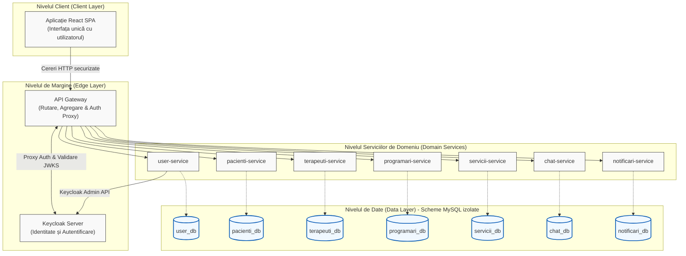

2. Figura A4.2. Graful orientat al fluxurilor de comunicare inter-servicii

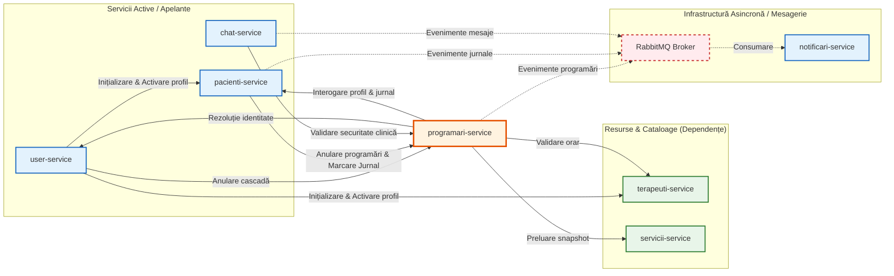

4. Figura A5.2. Structura detaliată Entitate-Relație (ERD) a bazelor de date

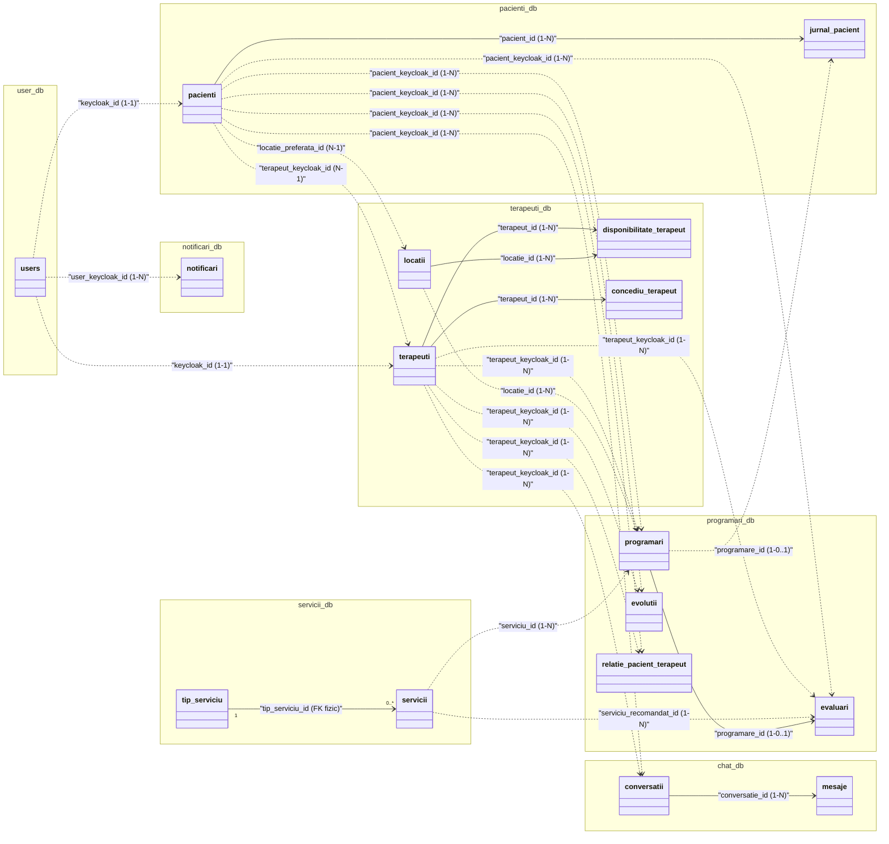

3. Figura A5.1. Diagrama conceptuală globală a conexiunilor logice între schemele bazei de date

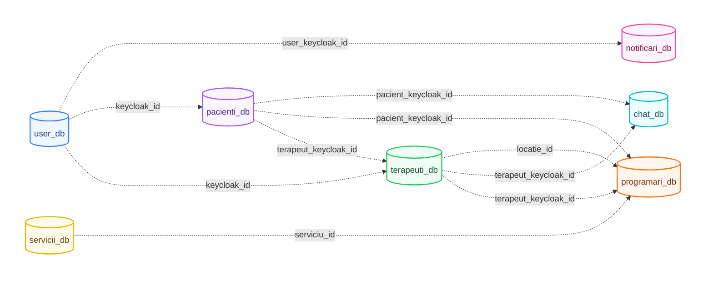

# Capitolul 6

## Fig. A6.1. Diagrama de tranziție a stărilor clinice (Automat Finit Determinist)

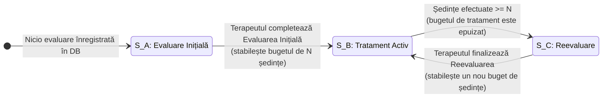

## Fig. A6.2. Fluxul secvențial de generare a ferestrelor de disponibilitate

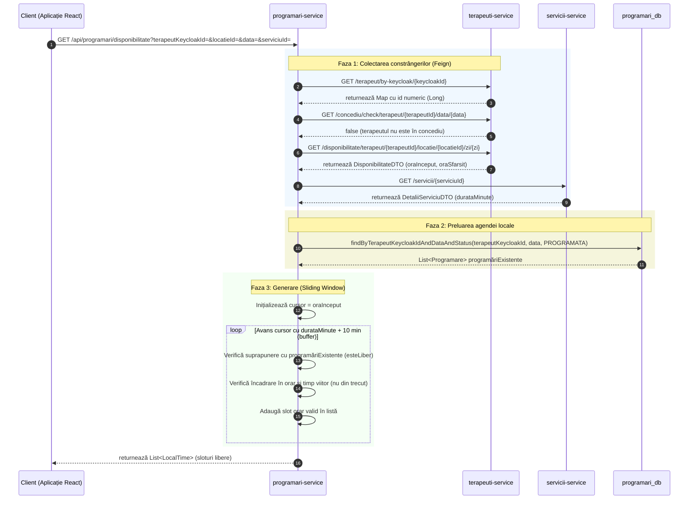

## Fig. A6.3. Arborele decizional pentru partiționarea temporală binară a interogărilor

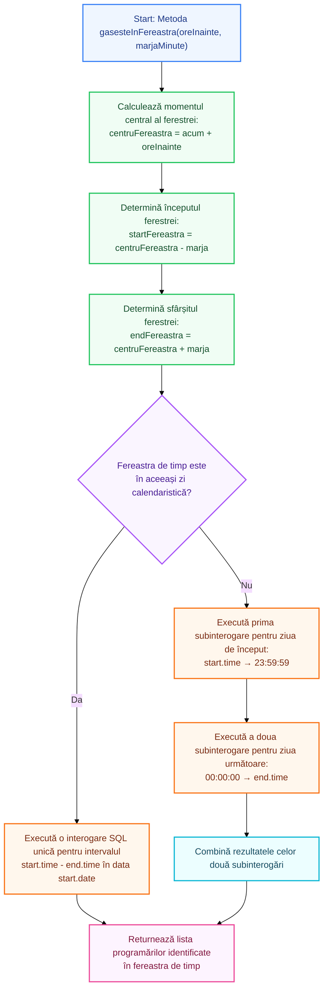

## Fig. A6.4. Ciclul de viață al interceptorului de securitate pe canalul STOMP

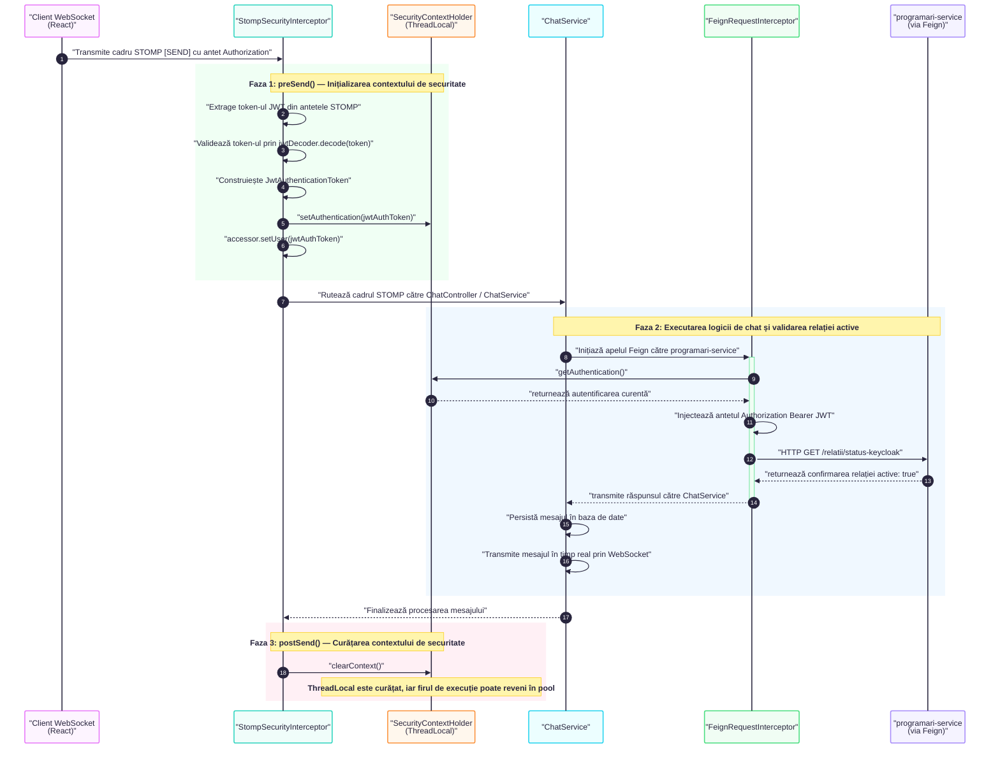

## Fig A6.6
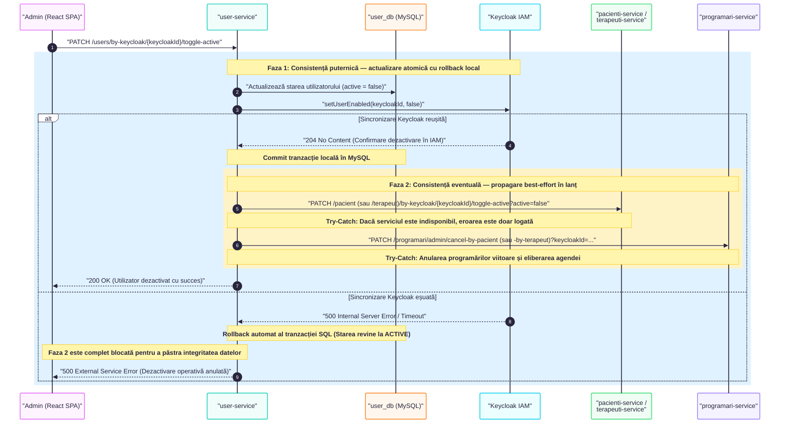

## Fig. A6.7

```mermaid
---
config:
  theme: base
  flowchart:
    curve: basis
    nodeSpacing: 55
    rankSpacing: 65
---
flowchart LR
    subgraph Producatori["Producători de Evenimente"]
        PS["programari-service"]
        PACS["pacienti-service"]
        CS["chat-service"]
    end

    subgraph Broker["RabbitMQ Message Broker"]
        direction TB
        EX["TopicExchange<br/>notificari.exchange"]
        MQ["Main Queue<br/>notificari.queue.v2"]
        DLX["DLX Fanout<br/>notificari.dlx"]
        DLQ["DLQ Queue<br/>notificari.queue.dead"]

        EX -->|"Rutare wildcard: notificare.#"| MQ
        MQ -. "NACK (requeue=false)" .-> DLX
        DLX --> DLQ
    end

    subgraph Consumatori["Consumatori - notificari-service"]
        NC["NotificareConsumer<br/>(Procesare & Persistență)"]
        DC["DeadLetterConsumer<br/>(Audit & Carantină)"]
    end

    PS -->|"notificare.programare.*<br/>notificare.reminder.*<br/>notificare.evaluare.*<br/>notificare.reevaluare.*"| EX
    PACS -->|"notificare.jurnal.completat"| EX
    CS -->|"notificare.mesaj.nou"| EX
    MQ -->|"ACK - procesare cu succes"| NC
    DLQ --> DC
    classDef prod fill:#f1f5f9,stroke:#64748b,stroke-width:2px,color:#334155;
    classDef exchange fill:#fef9c3,stroke:#ca8a04,stroke-width:2px,color:#713f12;
    classDef queue fill:#dbeafe,stroke:#2563eb,stroke-width:2px,color:#1e3a8a;
    classDef consumer fill:#dcfce7,stroke:#16a34a,stroke-width:2px,color:#14532d;
    classDef dead fill:#fee2e2,stroke:#dc2626,stroke-width:2px,color:#7f1d1d;

    class PS,PACS,CS prod;
    class EX,DLX exchange;
    class MQ queue;
    class DLQ dead;
    class NC consumer;
    class DC dead;
```

## Flux terapeut

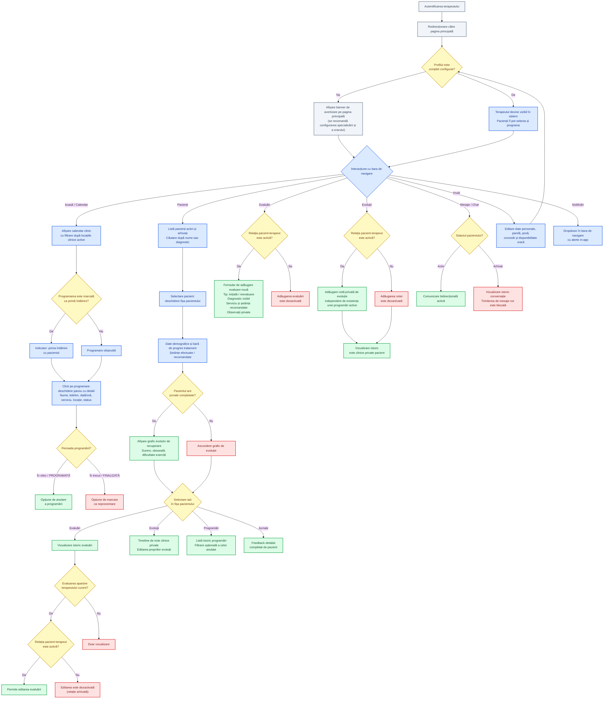

## Flux pacient

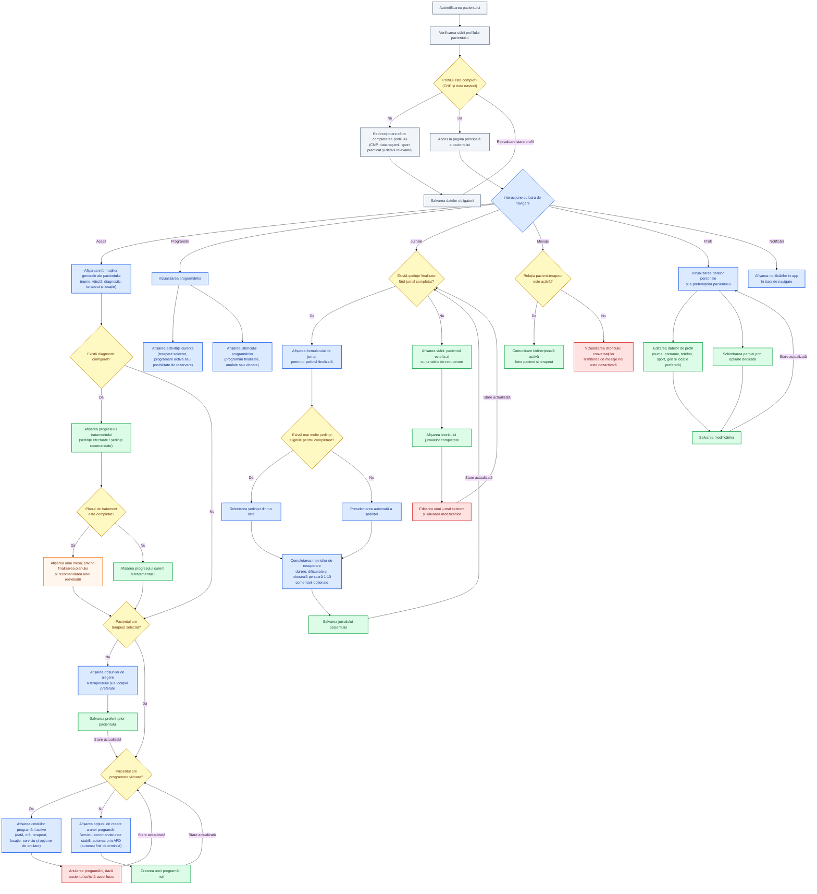

## Flux admin

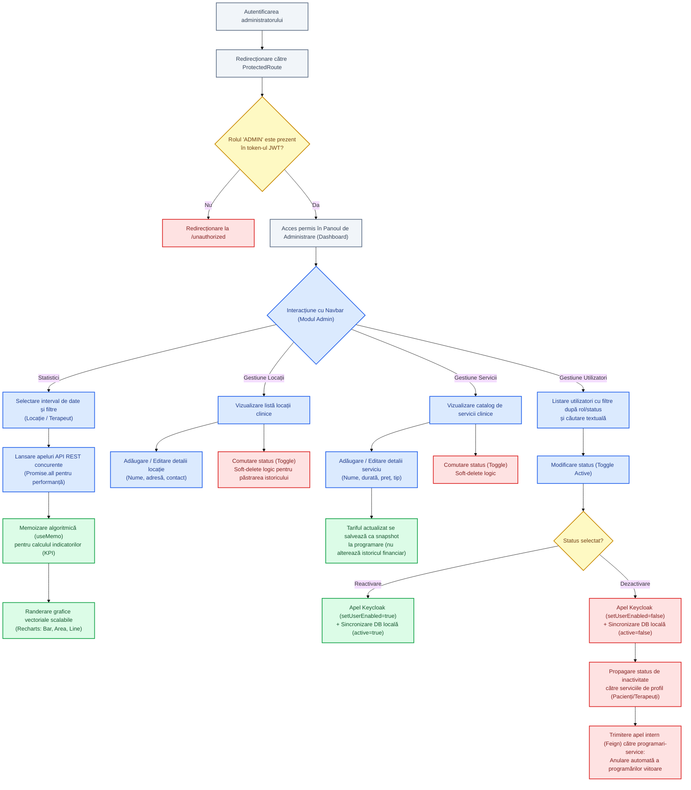

## Flux chat (WebSocket / STOMP)

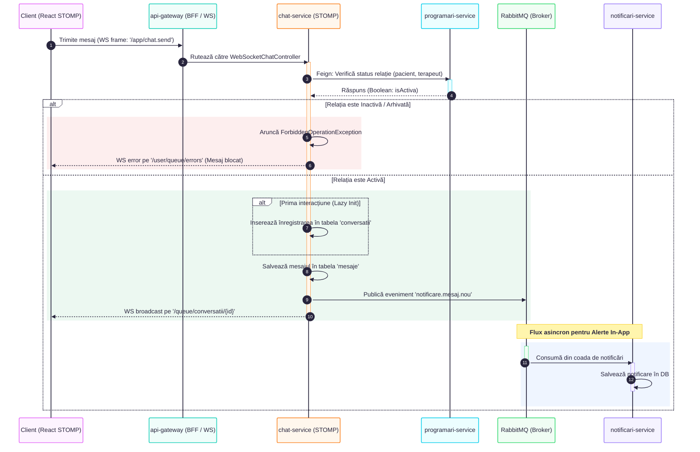

# STOMP PPT

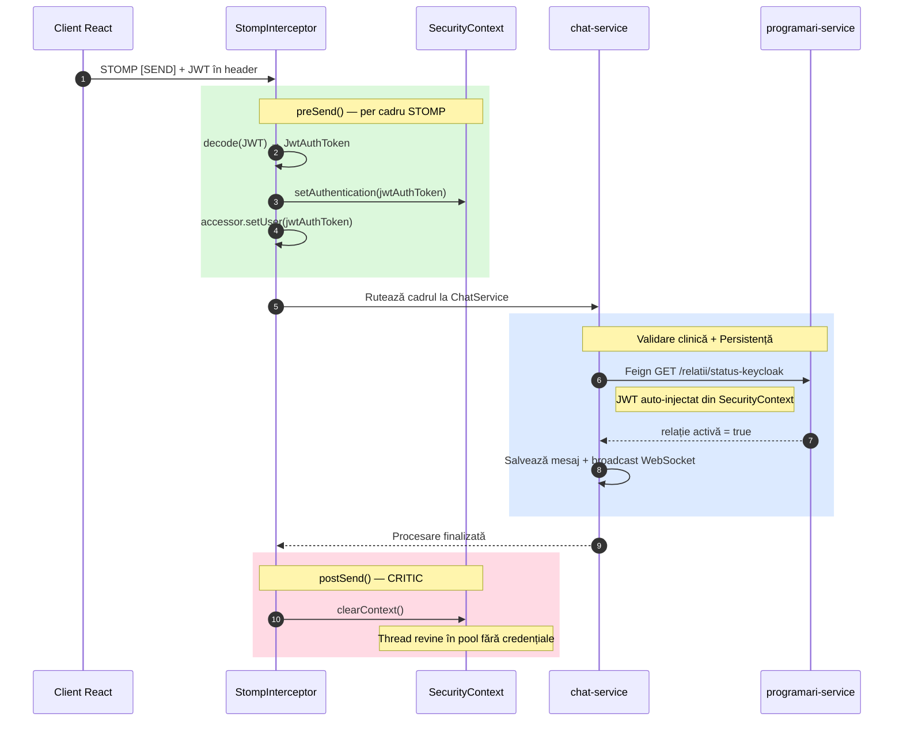

# Arhitectura sistemului PPT

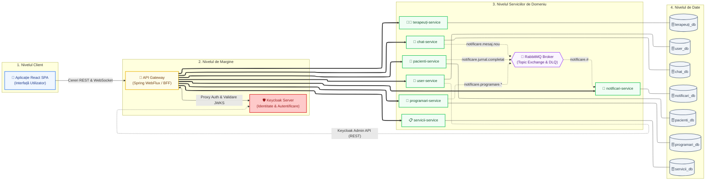

# Sliding window PPT
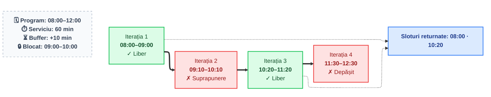

# Scrierea duala PPT
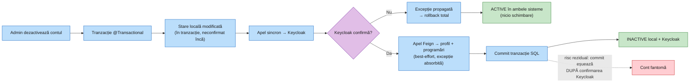