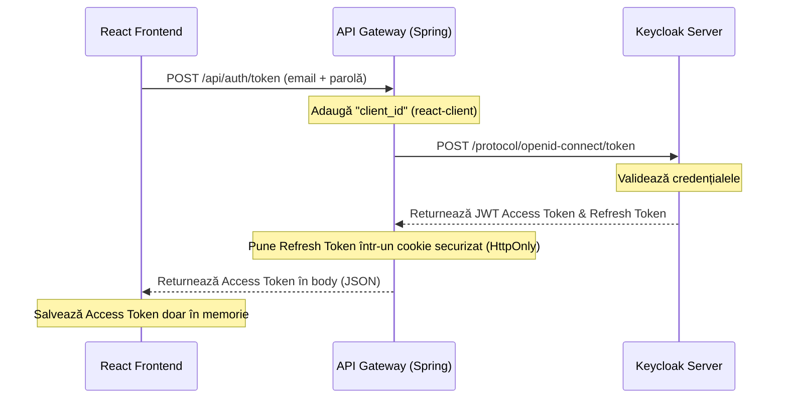

# Ghid Exhaustiv de Referință: Arhitectura și Securitatea Platformei KinetoCare

Acest document reprezintă un audit tehnic și un ghid de referință în profunzime al sistemelor de arhitectură software și securitate implementate în proiectul **KinetoCare**. El a fost redactat cu scopul de a servi ca un șablon de bune practici (*blue-print*) pentru dezvoltarea și integrarea sistemelor descentralizate bazate pe microservicii securizate cu Keycloak și Spring Security.

Redactarea este realizată într-un limbaj riguros din punct de vedere tehnic, dar structurat logic și conceptual pentru a fi ușor de înțeles de către orice persoană implicată în designul de sistem.

---

## 1. Topologia Arhitecturală a Microserviciilor

Proiectul KinetoCare folosește un stil arhitectural bazat pe **microservicii decuplate, cu baze de date izolate** (*Database-per-Service*). Această decizie previne cuplarea strânsă a modelului de date și permite fiecărui serviciu să își controleze regulile de business.

### Nivelurile Arhitecturale (Architectural Layers)

Structura este organizată pe 4 niveluri majore de execuție:

1.  **Nivelul Client (React SPA):** Interfața cu utilizatorul scrisă în React. Comunică exclusiv cu **API Gateway-ul** prin apeluri HTTP REST și conexiuni WebSocket (STOMP).
2.  **Nivelul de Margine (Edge Layer - Securitate Centralizată):**
    *   **[api-gateway](file:///c:/Users/Aneliss/Desktop/kinetocare/backend/api-gateway):** Funcționează ca un API Gateway reactiv și ca un **BFF (Backend For Frontend)**. Filtrează traficul extern, agregă datele de profil clinic și acționează ca un proxy securizat de autentificare (Auth Proxy).
    *   **Keycloak Server:** Serverul IAM (Identity and Access Management) care acționează ca server OIDC (OpenID Connect) responsabil de stocarea credențialelor și emiterea de jetoane de securitate (JWT).
3.  **Nivelul Serviciilor de Domeniu (Domain Services):** Microservicii Spring Boot standard (Servlet MVC) care rulează în rețeaua internă (în spatele Gateway-ului).
4.  **Nivelul de Date (MySQL & RabbitMQ):** Datele persistate sunt stocate în instanțe izolate MySQL, iar evenimentele de integrare clinică sunt publicate asincron prin brokerul de mesaje **RabbitMQ**.

---

## 2. Integrarea Keycloak ca Identity Provider (IdP)

Keycloak reprezintă **Sursa Unică de Adevăr** pentru toate datele de autentificare. În loc să implementăm o bază de date proprie pentru parole și conturi, Keycloak preia această responsabilitate critică de securitate.

### Decizie Tehnică: De ce Keycloak în loc de implementarea proprie a tabelelor de parole?
*   **Conformitate cu standardele industriale:** Keycloak oferă implementări de gata pentru fluxurile OAuth 2.0 și OIDC, garantând criptarea standardizată a parolelor (prin algoritmi PBKDF2 sau Argon2) și verificarea semnăturilor de token (prin chei publice asimetrice - JWKS).
*   **Reducerea riscului operațional:** Microserviciile din KinetoCare nu procesează direct și nu persistă parolele utilizatorilor, reducând riscul de scurgeri de date sensibile (*Data Breaches*) în caz de compromitere a bazelor de date MySQL locale.
*   **Single Sign-On (SSO) și Securitate Extinsă:** Keycloak permite activarea imediată a unor politicii de securitate avansate, precum politici de complexitate a parolei, autentificare multifactor (MFA), sau blocarea contului după încercări repetate de autentificare eșuate, fără a rescrie cod în aplicație.

### Organizarea Realm-ului `kinetocare`
Realm-ul reprezintă un spațiu izolat în Keycloak dedicat aplicației.
*   Aplicația folosește clientul `react-client` (configurat ca public, deoarece codul JS din browser poate fi decompilat).
*   Rolurile la nivel de Realm sunt: `admin` (management complet), `pacient` și `terapeut`.
*   Accesul programatic de administrare din backend (cum ar fi la înregistrarea unui nou cont) se face prin `keycloak-admin-client` conectat la realm-ul `master` ca super-admin (`admin-cli` client credentials flow).

---

## 3. Configurațiile Spring Security pe Microservicii (MVC vs WebFlux)

Microserviciile din KinetoCare validează jetoanele JWT primite din exterior prin citirea setului de chei publice expuse de Keycloak la endpoint-ul `/realms/kinetocare/protocol/openid-connect/certs` (JWKS - JSON Web Key Sets). Fiecare microserviciu este configurat ca un **OAuth2 Resource Server**.

### 1. API Gateway (Spring WebFlux / Reactiv)
Gateway-ul folosește un model reactiv non-blocking. Configurația din [SecurityConfig.java (api-gateway)](file:///c:/Users/Aneliss/Desktop/kinetocare/backend/api-gateway/src/main/java/com/example/api_gateway/config/SecurityConfig.java) este bazată pe `SecurityWebFilterChain` și rulează pe serverul Netty:

```java
@Configuration
@EnableWebFluxSecurity
public class SecurityConfig {
    @Bean
    public SecurityWebFilterChain securityFilterChain(ServerHttpSecurity http) {
        return http
                .csrf(csrf -> csrf.disable())
                .authorizeExchange(exchange -> exchange
                        .pathMatchers("/actuator/health").permitAll()
                        .pathMatchers("/api/auth/token", "/api/auth/logout").permitAll()
                        .pathMatchers("/api/users/auth/**").permitAll()
                        .pathMatchers("/api/chat/ws-chat/**").permitAll()
                        .pathMatchers(HttpMethod.POST, "/api/locatii/**").hasRole("admin")
                        .pathMatchers(HttpMethod.PATCH, "/api/locatii/**").hasRole("admin")
                        .pathMatchers(HttpMethod.DELETE, "/api/locatii/**").hasRole("admin")
                        .pathMatchers("/api/locatii/all").hasRole("admin")
                        .pathMatchers(HttpMethod.GET, "/api/locatii/**").authenticated()
                        .anyExchange().authenticated()
                )
                .oauth2ResourceServer(oauth2 -> oauth2
                        .jwt(jwt -> jwt.jwtAuthenticationConverter(grantedAuthoritiesExtractor()))
                )
                .build();
    }
}
```
*   **Decizie de Securitate:** Toate operațiunile sensibile asupra locațiilor fizice (`POST`, `PATCH`, `DELETE` pe `/api/locatii/**`) sunt verificate direct la nivelul Gateway-ului ca având rolul de `admin`, prevenind propagarea cererilor neautorizate în rețeaua internă.

### 2. Serviciile de Domeniu (Spring MVC / Blocante)
Serviciile interne folosesc modelul blocant clasic servlet-based. Acestea declară un `SecurityFilterChain` și adăugarea rolurilor în contextul Spring Security se face prin maparea structurii `realm_access.roles` din JWT claims.

Analizând fișierele de configurare, se observă o distincție clară între endpoint-urile expuse public prin Gateway și cele destinate exclusiv **comunicării interne între microservicii**:

#### A. Serviciul de Programări ([SecurityConfig.java (programari-service)](file:///c:/Users/Aneliss/Desktop/kinetocare/backend/programari-service/src/main/java/com/example/programari_service/config/SecurityConfig.java))
```java
.requestMatchers("/programari/admin/**").permitAll()
.requestMatchers("/programari/cancel-upcoming/**").permitAll()
.requestMatchers("/programari/batch-detalii").permitAll()
.requestMatchers("/relatii/**").permitAll()
```
*   **De ce sunt configurate cu `permitAll()`?** Aceste endpoint-uri sunt destinate exclusiv apelurilor inter-servicii (de exemplu, când `user-service` dezactivează un utilizator și forțează anularea programărilor viitoare, sau când `chat-service` verifică dacă există o relație activă între pacient și terapeut). Aceste apeluri sunt efectuate direct în rețeaua internă sigură a containerelor (Docker/Kubernetes). Deoarece API Gateway-ul nu expune aceste rute către clienții din exterior, ele sunt protejate fizic prin arhitectura de rețea, eliminând overhead-ul generării de token-uri administrative pentru microservicii.

#### B. Serviciul de Pacienți ([SecurityConfig.java (pacienti-service)](file:///c:/Users/Aneliss/Desktop/kinetocare/backend/pacienti-service/src/main/java/com/example/pacienti_service/config/SecurityConfig.java))
```java
.requestMatchers("/pacient/initialize/**", "/pacient/by-keycloak/*/toggle-active").permitAll()
```
*   Permite inițializarea automată a profilului de pacient imediat după înregistrare și sincronizarea stării active a profilului, apeluri coordonate direct de `user-service`.

#### C. Serviciul de Terapeui ([SecurityConfig.java (terapeuti-service)](file:///c:/Users/Aneliss/Desktop/kinetocare/backend/terapeuti-service/src/main/java/com/example/terapeuti_service/config/SecurityConfig.java))
```java
.requestMatchers("/terapeut/by-keycloak/**", "/terapeut/initialize/**", "/concediu/check/**", "/disponibilitate/**", "/terapeut/by-keycloak/*/toggle-active").permitAll()
```
*   Permite interogarea internă a programului de lucru și a concediilor de către `programari-service` în faza de calcul al sloturilor disponibile de tratament.

#### D. Serviciul de Cataloage ([SecurityConfig.java (servicii-service)](file:///c:/Users/Aneliss/Desktop/kinetocare/backend/servicii-service/src/main/java/com/example/servicii_service/config/SecurityConfig.java))
```java
// Public Endpoints (GET only)
.requestMatchers(HttpMethod.GET, "/servicii").permitAll()
.requestMatchers(HttpMethod.GET, "/servicii/{id}").permitAll()
.requestMatchers(HttpMethod.GET, "/servicii/search").permitAll()
.requestMatchers(HttpMethod.GET, "/servicii/tipuri").permitAll()

// Admin Only Actions
.requestMatchers(HttpMethod.POST, "/servicii/**").hasRole("ADMIN")
.requestMatchers(HttpMethod.PUT, "/servicii/**").hasRole("ADMIN")
.requestMatchers(HttpMethod.PATCH, "/servicii/**").hasRole("ADMIN")
.requestMatchers(HttpMethod.DELETE, "/servicii/**").hasRole("ADMIN")
```
*   **Decizie de Securitate:** Serviciile clinice oferite de clinică sunt publice pentru vizualizare de către oricine (chiar și neautentificat), însă modificarea catalogului (prețuri, durate) este strict legată de rolul `ADMIN`.

---

## 4. Gestiunea JWT și Modelul Hybrid BFF (httpOnly Cookie)

Stocarea token-urilor în aplicațiile web de tip React SPA reprezintă o arie vulnerabilă la atacuri cibernetice. Pentru a elimina atacurile de tip XSS și a reduce riscul CSRF, platforma folosește o **strategie hibridă bazată pe arhitectura BFF (Backend For Frontend)**.

### Decizie Tehnică: De ce nu stocăm toate token-urile în LocalStorage?
Dacă Access Token-ul și Refresh Token-ul ar fi stocate în `localStorage`, un simplu atac de tip **XSS (Cross-Site Scripting)** ar putea compromite total contul utilizatorului. Orice script injectat (prin biblioteci terțe neauditate) poate citi conținutul `localStorage` și trimite datele către un server malițios.

### Soluția KinetoCare
*   **Access Token-ul (durata scurtă - 5 minute):** Este stocat exclusiv în memoria volatilă a aplicației React (în variabila `inMemoryToken` din [authService.js](file:///c:/Users/Aneliss/Desktop/kinetocare/frontend/src/services/authService.js)). Codul JavaScript extern îl poate utiliza pentru a autoriza cererile HTTP curente, dar token-ul dispare complet la închiderea sau reîncărcarea tab-ului din browser.
*   **Refresh Token-ul (durata lungă - 30 de zile):** Este interceptat la nivelul API Gateway-ului și încapsulat într-un cookie setat de server.

### Configurarea Cookie-ului de Refresh
Proprietățile setate la nivelul clasei [KeycloakProxyController.java](file:///c:/Users/Aneliss/Desktop/kinetocare/backend/api-gateway/src/main/java/com/example/api_gateway/controller/KeycloakProxyController.java) garantează imposibilitatea furtului de sesiune:
*   **`httpOnly(true)`:** specifică browserului că acest cookie **nu poate fi citit sub nicio formă prin cod JavaScript** (deci este protejat 100% de XSS).
*   **`sameSite("Lax")`:** previne atacurile de tip **CSRF (Cross-Site Request Forgery)**, deoarece browserul va refuza să trimită acest cookie automat în cazul cererilor pornite de pe site-uri externe.
*   **`secure(false)` (în dezvoltare):** setat la `false` pe localhost pentru a permite testarea fără certificate SSL comerciale. În mediul de producție, acesta este forțat la `true` pentru a garanta transmiterea cookie-ului exclusiv prin conexiuni HTTPS.

---

## 5. Comunicarea Frontend-Backend și Silent Refresh

Pentru a asigura o experiență lină a utilizatorului (*User Experience*) menținând totodată o securitate ridicată, frontend-ul React implementează un flux automat de reîmprospătare a identității.

### 1. Interceptoarele Axios (`api.js`)
Toate cererile HTTP folosesc o instanță pre-configurată de Axios cu opțiunea `withCredentials: true`, care forțează browserul să atașeze automat cookie-urile httpOnly în antetul cererilor către gateway.

#### Interceptorul de Răspuns (Response Interceptor):
Dacă un Access Token expiră, backend-ul returnează statusul `401 Unauthorized`. Interceptorul din [api.js](file:///c:/Users/Aneliss/Desktop/kinetocare/frontend/src/services/api.js) blochează temporar fluxul aplicației, inițiază un apel la `/api/auth/token` (care trimite automat cookie-ul httpOnly de refresh), actualizează Access Token-ul în memorie și reîncearcă automat cererea originală eșuată:

```javascript
if (error.response?.status === 401 && !originalRequest._retry) {
    originalRequest._retry = true; // previne bucla infinită de reîncercări
    try {
        await authService.refreshToken(); // Silent refresh asincron
        const newToken = authService.getToken();
        originalRequest.headers.Authorization = `Bearer ${newToken}`;
        return api(originalRequest); // Retrimitere request
    } catch (refreshError) {
        authService.logout();
        window.location.href = '/login';
        return Promise.reject(refreshError);
    }
}
```

### 2. Silent Refresh la Reîncărcarea Paginii
Deoarece Access Token-ul este ținut doar în memorie, la apăsarea tastei F5 sau la reîncărcarea ferestrei acesta se pierde. Contextul de autentificare React ([AuthContext.jsx](file:///c:/Users/Aneliss/Desktop/kinetocare/frontend/src/context/AuthContext.jsx)) rulează un efect la pornire care încearcă un silent refresh pe baza cookie-ului httpOnly. Dacă utilizatorul are un cookie valid de refresh, el este logat automat în mod transparent, fără a fi nevoit să își reintroducă email-ul și parola:

```javascript
React.useEffect(() => {
  const initAuth = async () => {
    try {
      await authService.refreshToken();
      setIsAuthenticated(true);
      setUserInfo(authService.getUserInfo());
    } catch (error) {
      setIsAuthenticated(false);
      setUserInfo(null);
    } finally {
      setIsInitializing(false);
    }
  };
  initAuth();
}, []);
```

---

## 6. Securitatea WebSocket și a Canalului STOMP (Chat-Service)

 WebSocket-urile sunt o tehnologie persistentă bidirecțională care rulează peste conexiuni TCP deschise. Deoarece acestea nu folosesc cereri HTTP repetate, filtrele Spring Security standard nu se aplică pentru fiecare mesaj trimis în chat.

### 1. Interceptorul de Securitate STOMP ([StompSecurityInterceptor.java](file:///c:/Users/Aneliss/Desktop/kinetocare/backend/chat-service/src/main/java/com/example/chat_service/config/StompSecurityInterceptor.java))
La pornirea conexiunii (`CONNECT`) sau la trimiterea unui mesaj (`SEND`), clientul React injectează Access Token-ul în antetul specific STOMP. Interceptorul din chat-service validează manual acest token:

```java
@Override
public Message<?> preSend(Message<?> message, MessageChannel channel) {
    StompHeaderAccessor accessor = MessageHeaderAccessor.getAccessor(message, StompHeaderAccessor.class);
    
    if (accessor != null && accessor.getCommand() != null) {
        if (StompCommand.CONNECT.equals(accessor.getCommand()) || StompCommand.SEND.equals(accessor.getCommand())) {
            String authHeader = accessor.getFirstNativeHeader("Authorization");
            
            if (authHeader != null && authHeader.startsWith("Bearer ")) {
                String token = authHeader.substring(7);
                try {
                    Jwt jwt = jwtDecoder.decode(token); // Validare semnătură și expirare JWT
                    JwtAuthenticationToken authentication = new JwtAuthenticationToken(
                            jwt, 
                            jwtAuthenticationConverter.convert(jwt).getAuthorities()
                    );
                    
                    accessor.setUser(authentication); // Salvare pe conexiune
                    SecurityContextHolder.getContext().setAuthentication(authentication); // Setare pe ThreadLocal
                } catch (Exception e) {
                    SecurityContextHolder.clearContext();
                    accessor.setUser(null);
                }
            }
        }
    }
    return message;
}
```

### 2. Prevenirea Scurgerilor de Context prin ThreadLocal
**Riscul major de securitate:** Serverele Tomcat folosesc un Thread Pool pentru procesarea mesajelor. Deoarece `SecurityContextHolder` își păstrează datele într-un context de tip `ThreadLocal` (legat de firul de execuție curent), dacă nu curățăm acest context, următorul mesaj procesat de același thread va moșteni în mod fals datele de autentificare ale utilizatorului anterior.
Pentru a bloca acest atac de confuzie a identității, contextul este curățat obligatoriu pe metoda `postSend`:

```java
@Override
public void postSend(Message<?> message, MessageChannel channel, boolean sent) {
    SecurityContextHolder.clearContext(); // Firul de execuție revine curat în pool
}
```

### 3. Propagarea Identității către Microservicii (Feign Interceptor)
Atunci când un serviciu MVC apelează un alt microserviciu (de exemplu, `user-service` interoghează `pacienti-service`), contextul de securitate este extras și propagat în antetul HTTP utilizând [FeignClientConfig.java](file:///c:/Users/Aneliss/Desktop/kinetocare/backend/user-service/src/main/java/com/example/user_service/client/FeignClientConfig.java):

```java
@Configuration
public class FeignClientConfig {
    @Bean
    public RequestInterceptor requestInterceptor() {
        return requestTemplate -> {
            Authentication authentication = SecurityContextHolder.getContext().getAuthentication();
            if (authentication != null && authentication.getPrincipal() instanceof Jwt jwt) {
                requestTemplate.header("Authorization", "Bearer " + jwt.getTokenValue());
            }
        };
    }
}
```

---

## 7. Tranzacții Compensatorii și Saga pentru Scrierea Duală Consistentă

Într-o arhitectură cu baze de date distribuite, modificarea datelor în două sisteme diferite (MySQL local și serverul de Keycloak) reprezintă o operațiune cu risc crescut de inconsistență (Dual-Write problem). Deoarece nu putem folosi tranzacții globale distribuite (2PC - Two Phase Commit) din cauza limitărilor de performanță și suport la nivelul Keycloak REST API, se folosește un șablon de **tranzacții compensatorii locale (Saga)**.

### Scenariul A: Crearea contului la Înregistrare
Modul în care este gestionată consistența în [KeycloakService.java](file:///c:/Users/Aneliss/Desktop/kinetocare/backend/user-service/src/main/java/com/example/user_service/service/KeycloakService.java):

```java
@Transactional
public RegisterResponseDTO registerUser(RegisterRequestDTO request) {
    // 1. Validări locale în baza de date locală (email deja înregistrat)
    if (userRepository.existsByEmail(request.email())) {
        throw new ResourceAlreadyExistsException("Email-ul este deja înregistrat");
    }
    
    String keycloakId = null;
    try {
        // Pasul 1 (Extern): Creează utilizatorul în Keycloak
        keycloakId = createUserInKeycloak(request);
        assignRoleInKeycloak(keycloakId, request.role());

        // Pasul 2 (Local): Salvează în baza de date MySQL locală
        User user = userRegisterMapper.toEntity(request, keycloakId);
        user.setActive(true);
        userRepository.save(user);

        // Pasul 3 (Extern / Profil specific): Creează profilul gol
        initializeRoleSpecificProfile(keycloakId, request.role());

        return userRegisterMapper.toRegisterResponse(user, "Cont creat cu succes!");
    } catch (Exception e) {
        // TRANZACȚIE COMPENSATORIE (Compensating Transaction / Rollback)
        log.error("Eroare înregistrare utilizator, se revine la starea inițială in Keycloak", e);
        if (keycloakId != null) {
            deleteUserInKeycloak(keycloakId); // Ștergerea fizică din Keycloak pentru consistență
        }
        throw new ExternalServiceException("Eroare la înregistrare: " + e.getMessage(), e);
    }
}
```
*   **Cum se obține consistența?** Dacă Pasul 2 (Salvarea SQL locală) sau Pasul 3 (Apelul de inițializare a profilului pacientului în `pacienti-service`) eșuează din orice motiv (ex. server picat, validare CNP eșuată), Spring Framework va anula automat tranzacția SQL locală. În același timp, blocul `catch` rulează operațiunea compensatorie de ștergere a utilizatorului din Keycloak (`deleteUserInKeycloak`), aducând întregul sistem în starea inițială consistentă.

### Scenariul B: Dezactivarea Contului de către Administrator
Când un cont este marcat ca inactiv de către admin, starea trebuie să se propage atomar în Keycloak (dezactivare cont / interzicere login) și în serviciile clinice în mod rezistent la erori:

```java
@Transactional
public AdminUserDTO toggleUserActive(String keycloakId) {
    User user = userRepository.findByKeycloakId(keycloakId).orElseThrow(...);
    
    boolean newActive = !user.getActive();
    user.setActive(newActive);
    User saved = userRepository.save(user); // Tranzacția MySQL este deschisă

    // Pasul 1 (Sincron): Dezactivare în Keycloak
    try {
        keycloakSyncService.setUserEnabled(user.getKeycloakId(), newActive);
    } catch (Exception e) {
        // Dacă Keycloak este indisponibil, se aruncă excepție și se face ROLLBACK local SQL.
        // Utilizatorul rămâne ACTIVE în DB locală.
        throw new ExternalServiceException("Eroare de sincronizare cu Keycloak: " + e.getMessage(), e);
    }

    // Pasul 2 (Asincron / Best-Effort): Propagare în serviciile de profil
    propagateActiveToProfile(user.getKeycloakId(), user.getRole(), newActive);

    // Pasul 3 (Asincron / Best-Effort): Anulare programări viitoare în cascadă
    if (!newActive) {
        cancelFutureAppointments(user.getKeycloakId(), user.getRole());
    }

    return userMapper.toAdminDTO(saved);
}
```
*   **Consistență Eventuală controlată:** Dacă Pasul 1 (Keycloak) eșuează, starea locală din SQL revine la cea anterioară datorită rollback-ului automat al tranzacției DB. Pasul 2 și Pasul 3 sunt capturate în blocuri `try-catch` individuale, deoarece eventualele erori la anularea unei programări nu ar trebui să anuleze blocarea accesului la cont (operațiunea primară de securitate). Această segregare reprezintă un mecanism clasic de **consistență eventuală** (*eventual consistency*), optimizând disponibilitatea sistemului.

---

## 8. Maparea Stărilor Conturilor și Fluxurile de Administrare

Sistemul utilizează o mapare binară a stărilor utilizatorului între Keycloak și bazele de date locale pentru a asigura blocarea completă a accesului din prima secundă.

### Matricea de Mapare a Stărilor Contului

| Stare locală DB (`active`) | Stare Keycloak (`enabled`) | Efect Clinic | Efect Autentificare |
| :--- | :--- | :--- | :--- |
| `true` | `true` | Profil vizibil, poate fi programat | Autentificare permisă în sistem |
| `false` | `false` | Profil ascuns, programări viitoare anulate | Autentificare blocată în Keycloak |
| `true` | `false` | *Inconsistență temporară în curs de remediere* | Autentificare blocată imediat |
| `false` | `true` | *Inconsistență temporară în curs de remediere* | Autentificare permisă, dar interzis accesul la profile |

### Filtrarea Profilelor Incomplete (Securitate Clinică)
Pentru a asigura validitatea datelor clinice și legale (de exemplu, pentru decontări sau fișe medicale), un pacient nu poate utiliza platforma dacă nu are configurate **CNP-ul** și **data nașterii**. 

Aceasta este gestionată în frontend de [ProfileGuard.jsx](file:///c:/Users/Aneliss/Desktop/kinetocare/frontend/src/components/shared/ProfileGuard.jsx):
```javascript
const checkProfile = async () => {
  try {
    const profile = await profileService.getProfile();
    if (profile.profileIncomplete === true) {
      setProfileComplete(false);
    } else if (profile.profileIncomplete == null && (!profile.cnp || !profile.dataNasterii)) {
      setProfileComplete(false);
    } else {
      setProfileComplete(true);
    }
  } catch (error) {
    setError("Serviciul de profile este indisponibil.");
  }
};
```
*   Dacă profilul este marcat ca incomplet, utilizatorul este redirecționat forțat la `/pacient/complete-profile` și orice altă pagină din secțiunea pacientului devine inaccesibilă.

---

## 9. Concluzii și Șabloane Reutilizabile pentru Viitoare Proiecte

Pentru a replica această arhitectură robustă în proiecte viitoare, se recomandă preluarea următoarelor elemente structurale direct din KinetoCare:

1.  **Șablonul BFF de Autentificare:** Folosirea unui controler proxy pe API Gateway ([KeycloakProxyController.java](file:///c:/Users/Aneliss/Desktop/kinetocare/backend/api-gateway/src/main/java/com/example/api_gateway/controller/KeycloakProxyController.java)) pentru setarea cookie-urilor httpOnly, eliminând stocarea token-urilor în `localStorage`.
2.  **Gărzile de Securitate React:** Combinația dintre `ProtectedRoute` (pentru roluri) și `ProfileGuard` (pentru starea datelor clinice) ca filtre de re-direcționare declarativă.
3.  **Compensarea în Dual-Write:** Structura de înregistrare tranzacțională din `KeycloakService` cu rollback pe baza de date locală corelat cu ștergere compensatorie explicită pe Keycloak în caz de eroare.
4.  **Interceptorul WebSocket Thread-Safe:** Păstrarea identității pe conexiunea STOMP via `StompHeaderAccessor` și curățarea obligatorie a contextelor `ThreadLocal` în `postSend()` pentru a evita scurgerile de date între thread-urile din pool.


